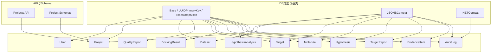
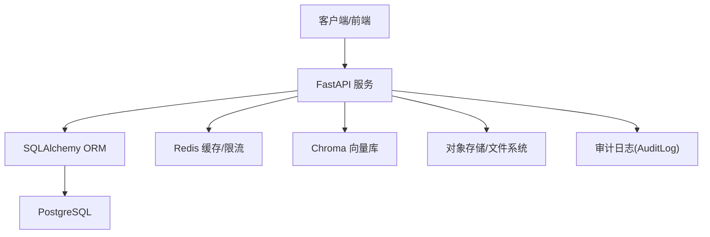
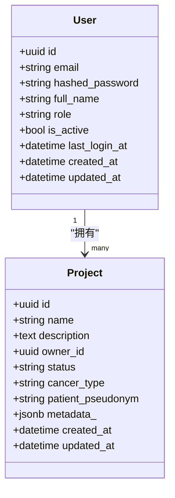
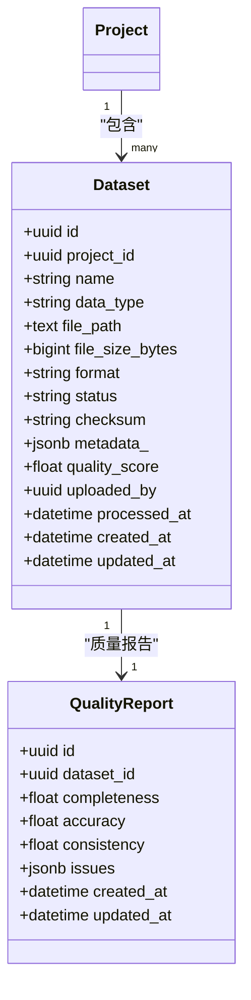
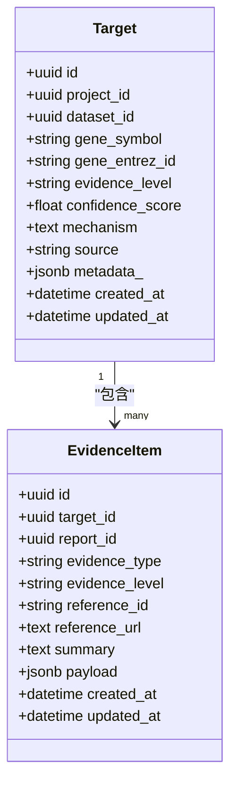
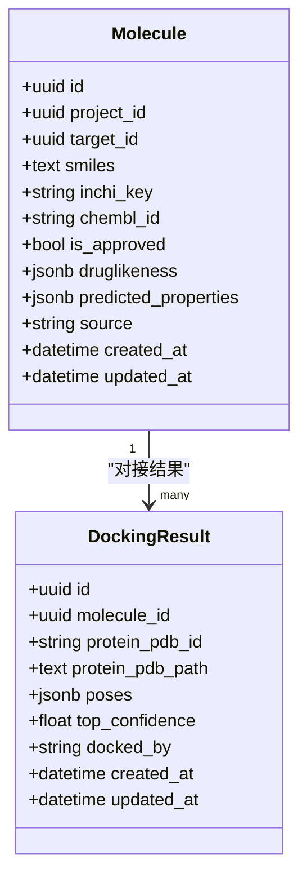
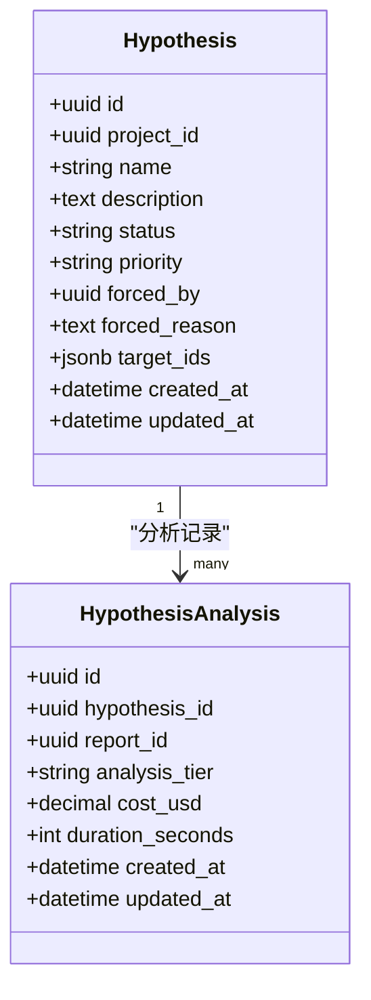
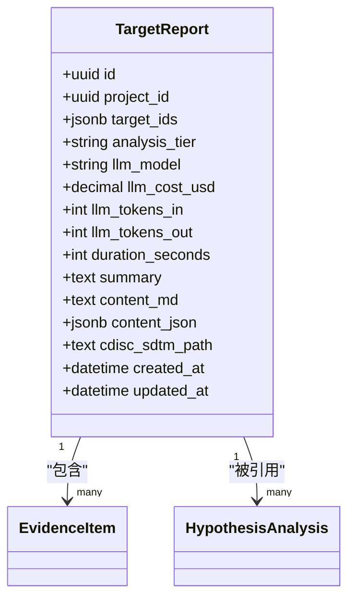
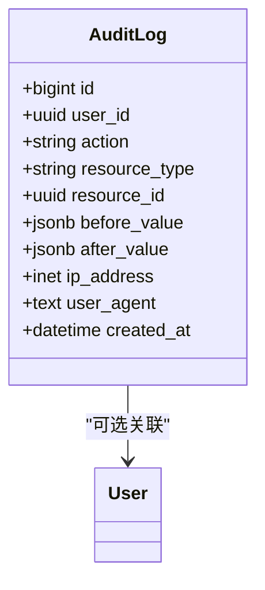
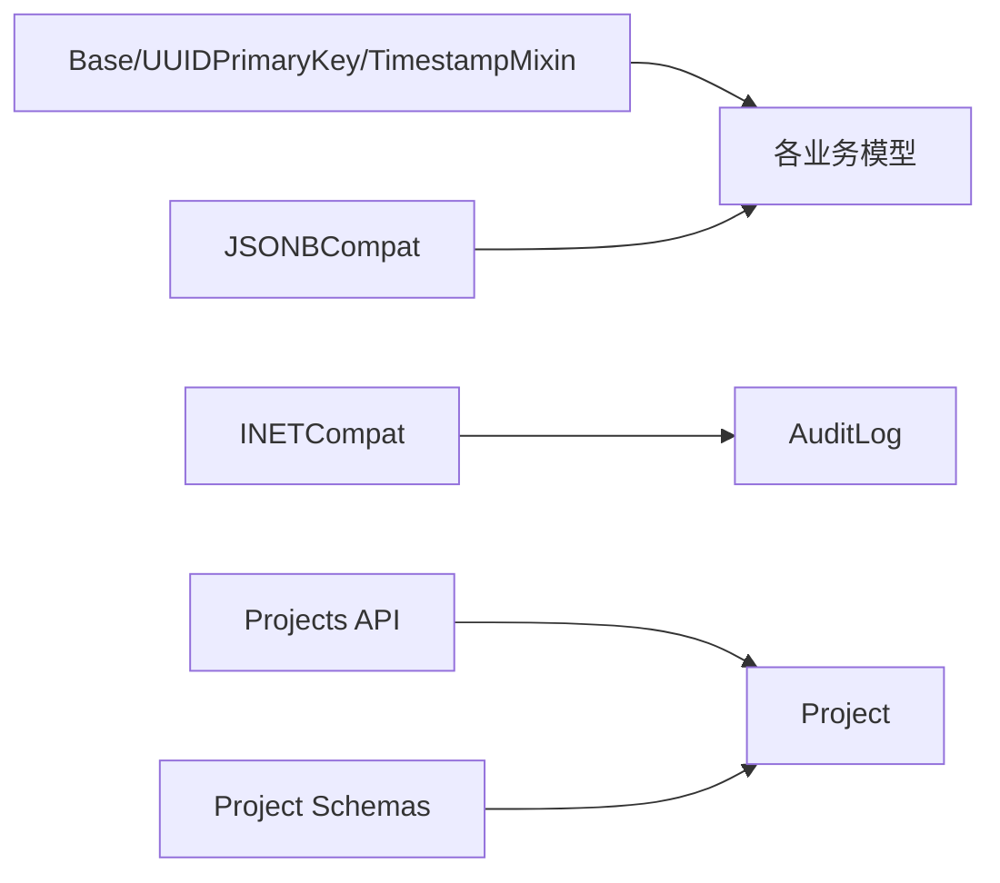

# 数据库设计

<cite>
**本文引用的文件**   
- [base.py](file://precision-drug-design/backend/app/db/base.py)
- [types.py](file://precision-drug-design/backend/app/db/types.py)
- [user.py](file://precision-drug-design/backend/app/models/user.py)
- [project.py](file://precision-drug-design/backend/app/models/project.py)
- [dataset.py](file://precision-drug-design/backend/app/models/dataset.py)
- [target.py](file://precision-drug-design/backend/app/models/target.py)
- [molecule.py](file://precision-drug-design/backend/app/models/molecule.py)
- [hypothesis.py](file://precision-drug-design/backend/app/models/hypothesis.py)
- [report.py](file://precision-drug-design/backend/app/models/report.py)
- [audit_log.py](file://precision-drug-design/backend/app/models/audit_log.py)
- [init_db.py](file://precision-drug-design/backend/app/db/init_db.py)
- [03-database.md](file://precision-drug-design/docs/design/03-database.md)
- [projects.py](file://precision-drug-design/backend/app/api/v1/projects.py)
- [project.py](file://precision-drug-design/backend/app/schemas/project.py)
</cite>

## 目录
1. [引言](#引言)
2. [项目结构](#项目结构)
3. [核心组件](#核心组件)
4. [架构总览](#架构总览)
5. [详细组件分析](#详细组件分析)
6. [依赖关系分析](#依赖关系分析)
7. [性能与索引优化](#性能与索引优化)
8. [数据完整性与一致性](#数据完整性与一致性)
9. [故障排查指南](#故障排查指南)
10. [结论](#结论)
11. [附录：ER图与数据字典](#附录er图与数据字典)

## 引言
本文件为AI药物设计系统的PostgreSQL数据库设计文档，面向研发、运维与合规人员。内容覆盖实体关系模型（用户、项目、数据集、靶点、分子等）、UUID主键策略、时间戳混入机制、外键约束与级联策略、索引与查询优化建议、数据完整性保障机制，并提供ER图与数据字典，帮助读者快速理解系统的数据结构与业务语义。

## 项目结构
后端采用SQLAlchemy ORM映射到PostgreSQL，核心数据库定义位于models与db包中；初始化脚本负责建表与初始数据准备；设计文档集中描述了存储分层、ER概览与字段规范。



图表来源
- [base.py:13-47](file://precision-drug-design/backend/app/db/base.py#L13-L47)
- [types.py:13-41](file://precision-drug-design/backend/app/db/types.py#L13-L41)
- [user.py:14-36](file://precision-drug-design/backend/app/models/user.py#L14-L36)
- [project.py:14-42](file://precision-drug-design/backend/app/models/project.py#L14-L42)
- [dataset.py:15-70](file://precision-drug-design/backend/app/models/dataset.py#L15-L70)
- [target.py:14-52](file://precision-drug-design/backend/app/models/target.py#L14-L52)
- [molecule.py:14-61](file://precision-drug-design/backend/app/models/molecule.py#L14-L61)
- [hypothesis.py:15-66](file://precision-drug-design/backend/app/models/hypothesis.py#L15-L66)
- [report.py:15-73](file://precision-drug-design/backend/app/models/report.py#L15-L73)
- [audit_log.py:15-45](file://precision-drug-design/backend/app/models/audit_log.py#L15-L45)
- [projects.py:1-169](file://precision-drug-design/backend/app/api/v1/projects.py#L1-L169)
- [project.py:1-55](file://precision-drug-design/backend/app/schemas/project.py#L1-L55)

章节来源
- [init_db.py:35-88](file://precision-drug-design/backend/app/db/init_db.py#L35-L88)
- [03-database.md:1-325](file://precision-drug-design/docs/design/03-database.md#L1-L325)

## 核心组件
- 基类与混入
  - Base：SQLAlchemy声明式基类，统一所有模型继承。
  - UUIDPrimaryKey：以UUID4作为主键，支持分布式生成与迁移友好。
  - TimestampMixin：自动维护created_at与updated_at，使用带时区的时间戳。
- 跨方言类型
  - JSONBCompat：在PostgreSQL上使用JSONB，其他方言降级为通用JSON，便于本地开发。
  - INETCompat：在PostgreSQL上使用原生INET，其他方言降级为String(45)。
- 核心实体
  - User：系统用户，角色驱动权限控制。
  - Project：研发项目，关联多组学数据集、假设、报告等。
  - Dataset/QualityReport：上传的多组学数据集及其质量评估。
  - Target：发现的药物靶点，关联证据项与分子。
  - Molecule/DockingResult：候选分子及对接结果。
  - Hypothesis/HypothesisAnalysis：假设沙盒与分析记录。
  - TargetReport/EvidenceItem：靶点发现报告与证据项。
  - AuditLog：不可篡改的审计日志。

章节来源
- [base.py:13-47](file://precision-drug-design/backend/app/db/base.py#L13-L47)
- [types.py:13-41](file://precision-drug-design/backend/app/db/types.py#L13-L41)
- [user.py:14-36](file://precision-drug-design/backend/app/models/user.py#L14-L36)
- [project.py:14-42](file://precision-drug-design/backend/app/models/project.py#L14-L42)
- [dataset.py:15-70](file://precision-drug-design/backend/app/models/dataset.py#L15-L70)
- [target.py:14-52](file://precision-drug-design/backend/app/models/target.py#L14-L52)
- [molecule.py:14-61](file://precision-drug-design/backend/app/models/molecule.py#L14-L61)
- [hypothesis.py:15-66](file://precision-drug-design/backend/app/models/hypothesis.py#L15-L66)
- [report.py:15-73](file://precision-drug-design/backend/app/models/report.py#L15-L73)
- [audit_log.py:15-45](file://precision-drug-design/backend/app/models/audit_log.py#L15-L45)

## 架构总览
系统采用“结构化数据+灵活元数据”的分层设计：
- PostgreSQL承载核心关系型数据与JSONB扩展能力。
- Redis用于会话、速率限制与缓存。
- Chroma用于向量检索（文献、标签、内部报告）。
- 对象存储承载大文件（FASTQ/BAM、处理产物）。
- 审计日志通过append-only表保证可追溯性。



图表来源
- [03-database.md:9-18](file://precision-drug-design/docs/design/03-database.md#L9-L18)
- [init_db.py:35-88](file://precision-drug-design/backend/app/db/init_db.py#L35-L88)

## 详细组件分析

### 用户与项目
- 用户(User)
  - 主键：UUID
  - 关键字段：邮箱唯一、密码哈希、全名、角色、活跃状态、最后登录时间
  - 索引：邮箱唯一索引
- 项目(Project)
  - 主键：UUID
  - 关键字段：名称、描述、所有者、状态、癌种、患者化名、JSONB元数据
  - 外键：owner_id→users.id（RESTRICT）
  - 关系：一对多至数据集、假设
  - 索引：所有者索引、状态索引（设计文档建议）



图表来源
- [user.py:14-36](file://precision-drug-design/backend/app/models/user.py#L14-L36)
- [project.py:14-42](file://precision-drug-design/backend/app/models/project.py#L14-L42)

章节来源
- [user.py:14-36](file://precision-drug-design/backend/app/models/user.py#L14-L36)
- [project.py:14-42](file://precision-drug-design/backend/app/models/project.py#L14-L42)
- [03-database.md:44-73](file://precision-drug-design/docs/design/03-database.md#L44-L73)

### 数据集与质量报告
- 数据集(Dataset)
  - 主键：UUID
  - 关键字段：所属项目、名称、数据类型、文件路径、大小、格式、状态、校验和、JSONB元数据、质量评分、上传者、处理完成时间
  - 外键：project_id→projects.id（CASCADE），uploaded_by→users.id（RESTRICT）
  - 关系：一对一至质量报告
- 质量报告(QualityReport)
  - 主键：UUID
  - 关键字段：完整性、准确性、一致性、问题列表(JSONB)
  - 外键：dataset_id→datasets.id（CASCADE，唯一）



图表来源
- [dataset.py:15-70](file://precision-drug-design/backend/app/models/dataset.py#L15-L70)
- [project.py:14-42](file://precision-drug-design/backend/app/models/project.py#L14-L42)

章节来源
- [dataset.py:15-70](file://precision-drug-design/backend/app/models/dataset.py#L15-L70)
- [03-database.md:75-94](file://precision-drug-design/docs/design/03-database.md#L75-L94)

### 靶点与证据项
- 靶点(Target)
  - 主键：UUID
  - 关键字段：所属项目、来源数据集、基因符号、Entrez ID、证据等级、置信度、机制、来源、JSONB元数据
  - 外键：project_id→projects.id（CASCADE），dataset_id→datasets.id（SET NULL）
  - 关系：一对多至证据项、一对多至分子
- 证据项(EvidenceItem)
  - 主键：UUID
  - 关键字段：目标ID、报告ID、证据类型、证据等级、参考ID/URL、摘要、JSONB载荷
  - 外键：target_id→targets.id（SET NULL），report_id→target_reports.id（SET NULL）



图表来源
- [target.py:14-52](file://precision-drug-design/backend/app/models/target.py#L14-L52)
- [report.py:47-73](file://precision-drug-design/backend/app/models/report.py#L47-L73)

章节来源
- [target.py:14-52](file://precision-drug-design/backend/app/models/target.py#L14-L52)
- [report.py:47-73](file://precision-drug-design/backend/app/models/report.py#L47-L73)
- [03-database.md:96-112](file://precision-drug-design/docs/design/03-database.md#L96-L112)

### 分子与对接结果
- 分子(Molecule)
  - 主键：UUID
  - 关键字段：所属项目、关联靶点、SMILES、InChIKey、ChEMBL ID、是否获批、JSONB类药性与预测性质、来源
  - 外键：project_id→projects.id（CASCADE），target_id→targets.id（SET NULL）
  - 关系：一对多至对接结果
- 对接结果(DockingResult)
  - 主键：UUID
  - 关键字段：分子ID、蛋白PDB ID/路径、构象列表(JSONB)、最高置信度、对接工具标识
  - 外键：molecule_id→molecules.id（CASCADE）



图表来源
- [molecule.py:14-61](file://precision-drug-design/backend/app/models/molecule.py#L14-L61)

章节来源
- [molecule.py:14-61](file://precision-drug-design/backend/app/models/molecule.py#L14-L61)
- [03-database.md:114-131](file://precision-drug-design/docs/design/03-database.md#L114-L131)

### 假设与分析记录
- 假设(Hypothesis)
  - 主键：UUID
  - 关键字段：所属项目、名称、描述、状态、优先级、强制分析人、理由、JSONB目标ID列表
  - 外键：project_id→projects.id（CASCADE），forced_by→users.id（SET NULL）
  - 关系：一对多至分析记录
- 假设分析(HypothesisAnalysis)
  - 主键：UUID
  - 关键字段：假设ID、报告ID、分析层级、成本、耗时
  - 外键：hypothesis_id→hypotheses.id（CASCADE），report_id→target_reports.id（CASCADE）



图表来源
- [hypothesis.py:15-66](file://precision-drug-design/backend/app/models/hypothesis.py#L15-L66)

章节来源
- [hypothesis.py:15-66](file://precision-drug-design/backend/app/models/hypothesis.py#L15-L66)
- [03-database.md:170-198](file://precision-drug-design/docs/design/03-database.md#L170-L198)

### 靶点报告
- 靶点报告(TargetReport)
  - 主键：UUID
  - 关键字段：所属项目、JSONB目标ID列表、分析层级、LLM模型、成本、Token数、耗时、摘要、Markdown内容、JSON内容、CDISC导出路径
  - 外键：project_id→projects.id（CASCADE）
  - 关系：一对多至证据项、一对多至假设分析记录



图表来源
- [report.py:15-45](file://precision-drug-design/backend/app/models/report.py#L15-L45)

章节来源
- [report.py:15-45](file://precision-drug-design/backend/app/models/report.py#L15-L45)
- [03-database.md:132-151](file://precision-drug-design/docs/design/03-database.md#L132-L151)

### 审计日志
- 审计日志(AuditLog)
  - 主键：BIGSERIAL（自增整数，便于范围扫描）
  - 关键字段：用户ID、动作、资源类型/ID、修改前后值(JSONB)、IP地址(INET)、用户代理、创建时间
  - 外键：user_id→users.id（SET NULL）
  - 索引：复合索引(action, created_at)
  - 约束：应用层不提供UPDATE/DELETE；数据库层通过权限回收保护



图表来源
- [audit_log.py:15-45](file://precision-drug-design/backend/app/models/audit_log.py#L15-L45)

章节来源
- [audit_log.py:15-45](file://precision-drug-design/backend/app/models/audit_log.py#L15-L45)
- [03-database.md:213-229](file://precision-drug-design/docs/design/03-database.md#L213-L229)

## 依赖关系分析
- 直接依赖
  - 所有业务模型均继承Base与UUIDPrimaryKey/TimestampMixin，确保统一的PK与时戳策略。
  - 大量字段使用JSONBCompat，提升复杂结构的查询与索引能力。
  - 外键关系明确，部分使用CASCADE以实现级联删除，部分使用RESTRICT/SET NULL以保护关键数据或允许空关联。
- 间接依赖
  - API层对Project进行CRUD，结合权限校验与软删除（status=archived）。
  - 初始化脚本导入全部模型，确保Base.metadata包含所有表，并创建初始创始人用户。



图表来源
- [base.py:13-47](file://precision-drug-design/backend/app/db/base.py#L13-L47)
- [types.py:13-41](file://precision-drug-design/backend/app/db/types.py#L13-L41)
- [projects.py:1-169](file://precision-drug-design/backend/app/api/v1/projects.py#L1-L169)
- [project.py:1-55](file://precision-drug-design/backend/app/schemas/project.py#L1-L55)

章节来源
- [init_db.py:21-31](file://precision-drug-design/backend/app/db/init_db.py#L21-L31)
- [projects.py:32-44](file://precision-drug-design/backend/app/api/v1/projects.py#L32-L44)

## 性能与索引优化
- 索引策略（基于模型与设计文档）
  - users.email：唯一索引，加速登录与去重。
  - projects.owner_id、projects.status：常用过滤条件。
  - datasets.project_id、datasets.data_type/status复合索引、metadata GIN索引：加速按项目筛选与JSONB查询。
  - targets.project_id、targets.gene_symbol、targets.evidence_level：加速靶点检索与证据聚合。
  - molecules.project_id、molecules.target_id、molecules.inchi_key（唯一）：加速分子查找与去重。
  - target_reports.project_id、target_reports.created_at：加速报告分页与排序。
  - evidence_items.target_id、evidence_items.evidence_type：加速证据聚合。
  - audit_logs.action+created_at复合索引：审计日志高效范围扫描。
- 查询调优建议
  - 优先使用JSONB操作符与GIN索引进行复杂元数据查询。
  - 避免SELECT *，按需投影字段，减少网络传输与序列化开销。
  - 分页查询使用offset/limit并结合created_at降序，提高稳定性。
  - 对高频统计查询建立物化视图或汇总表（如按项目的指标汇总）。
  - 合理使用事务边界，批量写入时使用bulk insert。

章节来源
- [03-database.md:57-229](file://precision-drug-design/docs/design/03-database.md#L57-L229)

## 数据完整性与一致性
- 主键与唯一性
  - 所有业务表使用UUID主键，具备分布式友好特性。
  - users.email唯一；molecules.inchi_key唯一（设计文档建议）。
- 外键与级联
  - 项目删除时级联删除其数据集与假设（CASCADE）。
  - 数据集删除时级联删除质量报告（CASCADE）。
  - 用户删除时对拥有者字段使用RESTRICT，防止误删导致数据悬空。
  - 部分关联允许NULL（SET NULL），如靶点来源数据集、假设强制分析人等。
- 时间戳混入
  - created_at默认now()，updated_at在更新时刷新，保证审计与排序能力。
- 审计追踪
  - 审计日志表为append-only，禁止UPDATE/DELETE，配合权限回收确保不可篡改。

章节来源
- [project.py:24-38](file://precision-drug-design/backend/app/models/project.py#L24-L38)
- [dataset.py:27-47](file://precision-drug-design/backend/app/models/dataset.py#L27-L47)
- [target.py:29-48](file://precision-drug-design/backend/app/models/target.py#L29-L48)
- [molecule.py:23-40](file://precision-drug-design/backend/app/models/molecule.py#L23-L40)
- [hypothesis.py:27-43](file://precision-drug-design/backend/app/models/hypothesis.py#L27-L43)
- [audit_log.py:15-45](file://precision-drug-design/backend/app/models/audit_log.py#L15-L45)
- [03-database.md:213-229](file://precision-drug-design/docs/design/03-database.md#L213-L229)

## 故障排查指南
- 常见问题定位
  - 外键冲突：检查ondelete策略与业务逻辑是否一致，确认是否存在RESTRICT导致的删除失败。
  - JSONB查询慢：确认是否已创建GIN索引，查询表达式是否符合索引匹配。
  - 审计日志缺失：确认应用层是否正确写入，数据库权限是否阻止了写操作。
- 调试步骤
  - 查看错误堆栈与SQL语句，确认参数绑定与类型转换。
  - 使用EXPLAIN ANALYZE分析慢查询，验证索引命中情况。
  - 核对权限配置与REVOKE规则，确保审计日志不可篡改。

章节来源
- [audit_log.py:39-41](file://precision-drug-design/backend/app/models/audit_log.py#L39-L41)
- [03-database.md:213-229](file://precision-drug-design/docs/design/03-database.md#L213-L229)

## 结论
本数据库设计以PostgreSQL为核心，结合JSONB与INET等扩展类型，兼顾结构化与灵活性；通过UUID主键与时间戳混入实现一致的标识与审计能力；外键与级联策略保障数据一致性；索引与查询优化建议提升性能；审计日志提供不可篡改的合规支撑。整体架构清晰、可扩展性强，适合精准药物研发的复杂业务场景。

## 附录ER图与数据字典

### ER图（代码映射）
```mermaid
erDiagram
USERS {
uuid id PK
string email UK
string hashed_password
string full_name
string role
boolean is_active
datetime last_login_at
timestamptz created_at
timestamptz updated_at
}
PROJECTS {
uuid id PK
string name
text description
uuid owner_id FK
string status
string cancer_type
string patient_pseudonym
jsonb metadata
timestamptz created_at
timestamptz updated_at
}
DATASETS {
uuid id PK
uuid project_id FK
string name
string data_type
text file_path
bigint file_size_bytes
string format
string status
string checksum
jsonb metadata
float quality_score
uuid uploaded_by FK
timestamptz processed_at
timestamptz created_at
timestamptz updated_at
}
QUALITY_REPORTS {
uuid id PK
uuid dataset_id FK UK
float completeness
float accuracy
float consistency
jsonb issues
timestamptz created_at
timestamptz updated_at
}
TARGETS {
uuid id PK
uuid project_id FK
uuid dataset_id FK
string gene_symbol
string gene_entrez_id
string evidence_level
float confidence_score
text mechanism
string source
jsonb metadata
timestamptz created_at
timestamptz updated_at
}
MOLECULES {
uuid id PK
uuid project_id FK
uuid target_id FK
text smiles
string inchi_key
string chembl_id
boolean is_approved
jsonb druglikeness
jsonb predicted_properties
string source
timestamptz created_at
timestamptz updated_at
}
DOCKING_RESULTS {
uuid id PK
uuid molecule_id FK
string protein_pdb_id
text protein_pdb_path
jsonb poses
float top_confidence
string docked_by
timestamptz created_at
timestamptz updated_at
}
HYPOTHESES {
uuid id PK
uuid project_id FK
string name
text description
string status
string priority
uuid forced_by FK
text forced_reason
jsonb target_ids
timestamptz created_at
timestamptz updated_at
}
HYPOTHESIS_ANALYSES {
uuid id PK
uuid hypothesis_id FK
uuid report_id FK
string analysis_tier
decimal cost_usd
int duration_seconds
timestamptz created_at
timestamptz updated_at
}
TARGET_REPORTS {
uuid id PK
uuid project_id FK
jsonb target_ids
string analysis_tier
string llm_model
decimal llm_cost_usd
int llm_tokens_in
int llm_tokens_out
int duration_seconds
text summary
text content_md
jsonb content_json
text cdisc_sdtm_path
timestamptz created_at
timestamptz updated_at
}
EVIDENCE_ITEMS {
uuid id PK
uuid target_id FK
uuid report_id FK
string evidence_type
string evidence_level
string reference_id
text reference_url
text summary
jsonb payload
timestamptz created_at
timestamptz updated_at
}
AUDIT_LOGS {
bigint id PK
uuid user_id FK
string action
string resource_type
uuid resource_id
jsonb before_value
jsonb after_value
inet ip_address
text user_agent
timestamptz created_at
}
USERS ||--o{ PROJECTS : "拥有"
PROJECTS ||--o{ DATASETS : "包含"
DATASETS ||--|| QUALITY_REPORTS : "质量报告"
PROJECTS ||--o{ TARGETS : "包含"
DATASETS ||--o{ TARGETS : "来源"
TARGETS ||--o{ EVIDENCE_ITEMS : "包含"
TARGETS ||--o{ MOLECULES : "关联"
MOLECULES ||--o{ DOCKING_RESULTS : "对接结果"
PROJECTS ||--o{ HYPOTHESES : "包含"
HYPOTHESES ||--o{ HYPOTHESIS_ANALYSES : "分析记录"
TARGET_REPORTS ||--o{ EVIDENCE_ITEMS : "包含"
TARGET_REPORTS ||--o{ HYPOTHESIS_ANALYSES : "被引用"
USERS ||--o{ AUDIT_LOGS : "操作者"
```

图表来源
- [user.py:14-36](file://precision-drug-design/backend/app/models/user.py#L14-L36)
- [project.py:14-42](file://precision-drug-design/backend/app/models/project.py#L14-L42)
- [dataset.py:15-70](file://precision-drug-design/backend/app/models/dataset.py#L15-L70)
- [target.py:14-52](file://precision-drug-design/backend/app/models/target.py#L14-L52)
- [molecule.py:14-61](file://precision-drug-design/backend/app/models/molecule.py#L14-L61)
- [hypothesis.py:15-66](file://precision-drug-design/backend/app/models/hypothesis.py#L15-L66)
- [report.py:15-73](file://precision-drug-design/backend/app/models/report.py#L15-L73)
- [audit_log.py:15-45](file://precision-drug-design/backend/app/models/audit_log.py#L15-L45)

### 数据字典（节选）
- users
  - id: UUID主键
  - email: VARCHAR(255)唯一非空
  - hashed_password: VARCHAR(255)非空
  - full_name: VARCHAR(100)非空
  - role: VARCHAR(20)非空，默认researcher
  - is_active: BOOLEAN默认true
  - last_login_at: TIMESTAMPTZ可空
  - created_at/updated_at: TIMESTAMPTZ默认now()/onupdate
- projects
  - id: UUID主键
  - name: VARCHAR(200)非空
  - description: TEXT可空
  - owner_id: UUID外键→users.id RESTRICT
  - status: VARCHAR(20)默认active
  - cancer_type/patient_pseudonym: VARCHAR(100)可空
  - metadata: JSONB默认{}
  - created_at/updated_at: TIMESTAMPTZ
- datasets
  - id: UUID主键
  - project_id: UUID外键→projects.id CASCADE
  - name/data_type/file_path/status/checksum/format/quality_score/uploaded_by/processed_at: 见模型定义
  - metadata: JSONB默认{}
  - created_at/updated_at: TIMESTAMPTZ
- quality_reports
  - id: UUID主键
  - dataset_id: UUID外键→datasets.id CASCADE唯一
  - completeness/accuracy/consistency/issues: 见模型定义
  - created_at/updated_at: TIMESTAMPTZ
- targets
  - id: UUID主键
  - project_id/dataset_id/gene_symbol/evidence_level/confidence_score/mechanism/source/metadata: 见模型定义
  - created_at/updated_at: TIMESTAMPTZ
- molecules
  - id: UUID主键
  - project_id/target_id/smiles/inchi_key/chembl_id/is_approved/druglikeness/predicted_properties/source: 见模型定义
  - created_at/updated_at: TIMESTAMPTZ
- docking_results
  - id: UUID主键
  - molecule_id/protein_pdb_id/protein_pdb_path/poses/top_confidence/docked_by: 见模型定义
  - created_at/updated_at: TIMESTAMPTZ
- hypotheses
  - id: UUID主键
  - project_id/name/description/status/priority/forced_by/forced_reason/target_ids: 见模型定义
  - created_at/updated_at: TIMESTAMPTZ
- hypothesis_analyses
  - id: UUID主键
  - hypothesis_id/report_id/analysis_tier/cost_usd/duration_seconds: 见模型定义
  - created_at/updated_at: TIMESTAMPTZ
- target_reports
  - id: UUID主键
  - project_id/target_ids/analysis_tier/llm_model/llm_cost_usd/llm_tokens_in/llm_tokens_out/duration_seconds/summary/content_md/content_json/cdisc_sdtm_path: 见模型定义
  - created_at/updated_at: TIMESTAMPTZ
- evidence_items
  - id: UUID主键
  - target_id/report_id/evidence_type/evidence_level/reference_id/reference_url/summary/payload: 见模型定义
  - created_at/updated_at: TIMESTAMPTZ
- audit_logs
  - id: BIGSERIAL主键
  - user_id/action/resource_type/resource_id/before_value/after_value/ip_address/user_agent/created_at: 见模型定义

章节来源
- [user.py:14-36](file://precision-drug-design/backend/app/models/user.py#L14-L36)
- [project.py:14-42](file://precision-drug-design/backend/app/models/project.py#L14-L42)
- [dataset.py:15-70](file://precision-drug-design/backend/app/models/dataset.py#L15-L70)
- [target.py:14-52](file://precision-drug-design/backend/app/models/target.py#L14-L52)
- [molecule.py:14-61](file://precision-drug-design/backend/app/models/molecule.py#L14-L61)
- [hypothesis.py:15-66](file://precision-drug-design/backend/app/models/hypothesis.py#L15-L66)
- [report.py:15-73](file://precision-drug-design/backend/app/models/report.py#L15-L73)
- [audit_log.py:15-45](file://precision-drug-design/backend/app/models/audit_log.py#L15-L45)
- [03-database.md:44-242](file://precision-drug-design/docs/design/03-database.md#L44-L242)