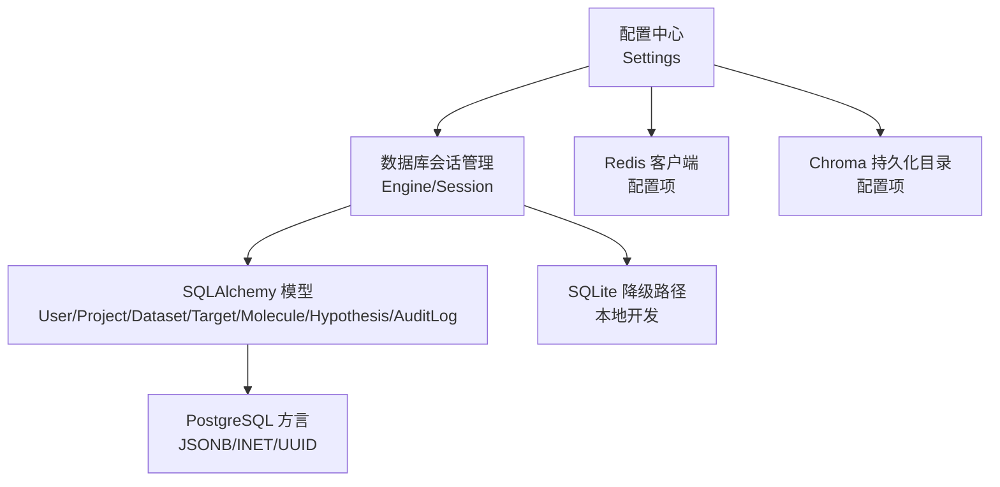
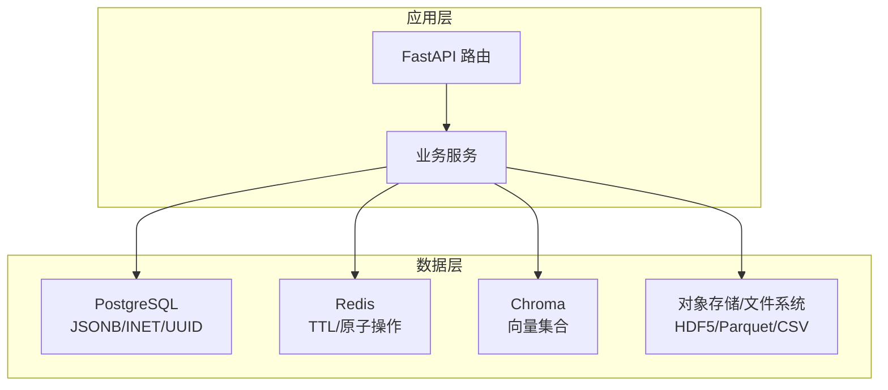
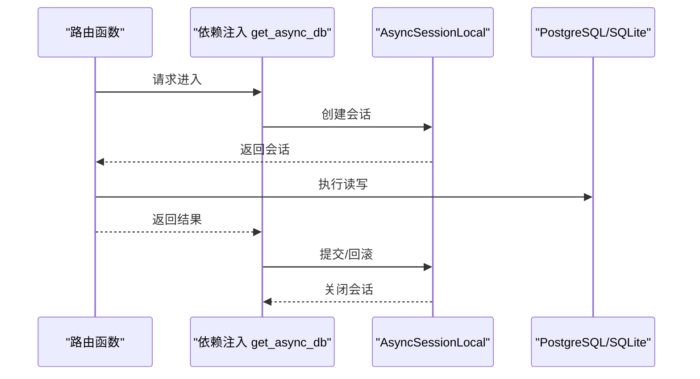
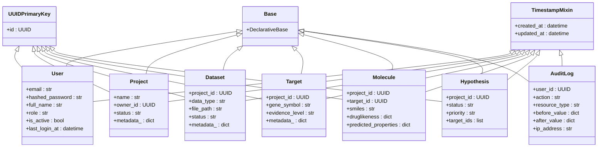
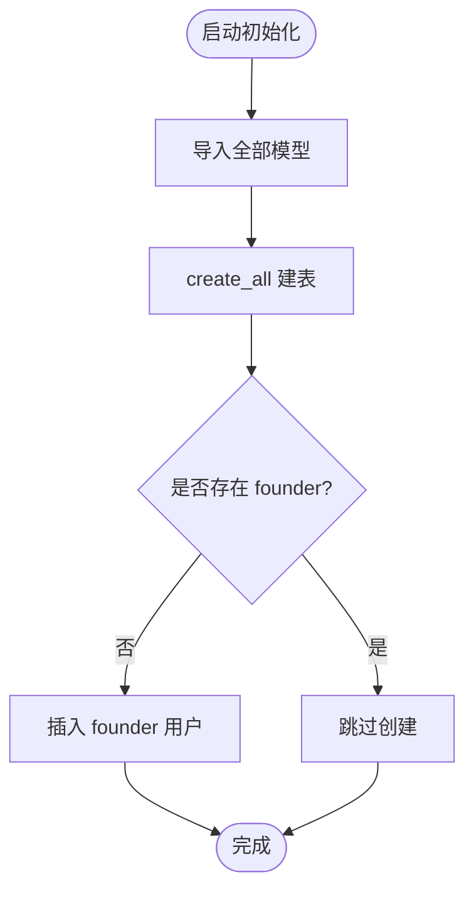
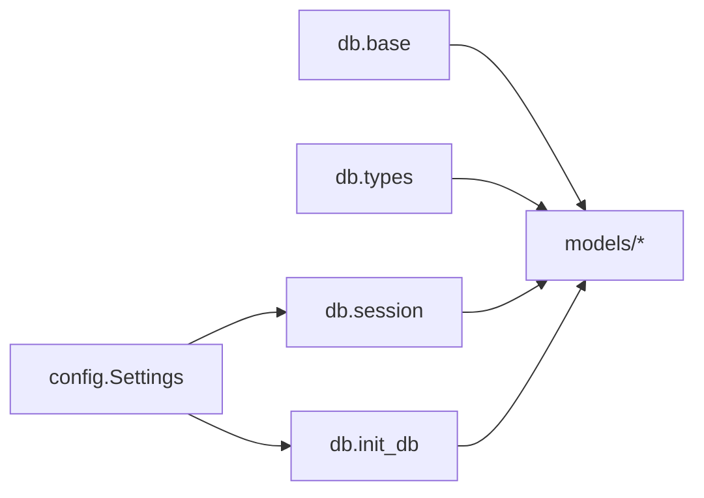

# 数据架构设计

<cite>
**本文引用的文件**   
- [backend/app/db/base.py](file://backend/app/db/base.py)
- [backend/app/db/session.py](file://backend/app/db/session.py)
- [backend/app/db/init_db.py](file://backend/app/db/init_db.py)
- [backend/app/core/config.py](file://backend/app/core/config.py)
- [backend/app/models/user.py](file://backend/app/models/user.py)
- [backend/app/models/project.py](file://backend/app/models/project.py)
- [backend/app/models/dataset.py](file://backend/app/models/dataset.py)
- [backend/app/models/target.py](file://backend/app/models/target.py)
- [backend/app/models/molecule.py](file://backend/app/models/molecule.py)
- [backend/app/models/hypothesis.py](file://backend/app/models/hypothesis.py)
- [backend/app/models/audit_log.py](file://backend/app/models/audit_log.py)
- [backend/app/db/types.py](file://backend/app/db/types.py)
- [docs/design/03-database.md](file://docs/design/03-database.md)
</cite>

## 目录
1. [引言](#引言)
2. [项目结构](#项目结构)
3. [核心组件](#核心组件)
4. [架构总览](#架构总览)
5. [详细组件分析](#详细组件分析)
6. [依赖关系分析](#依赖关系分析)
7. [性能与索引优化](#性能与索引优化)
8. [事务与一致性](#事务与一致性)
9. [缓存策略（Redis）](#缓存策略redis)
10. [向量检索（Chroma）](#向量检索chroma)
11. [数据安全、备份与生命周期](#数据安全备份与生命周期)
12. [迁移管理](#迁移管理)
13. [最佳实践与故障排查](#最佳实践与故障排查)
14. [结论](#结论)

## 引言
本文件面向AI药物设计系统的数据层，系统性阐述数据库设计策略、ORM模型架构、连接池与事务机制、多数据库集成（PostgreSQL、Redis、Chroma）、数据一致性与缓存策略、迁移与索引优化、查询调优、安全与备份恢复以及数据生命周期管理。文档同时提供可视化架构图与流程图，帮助读者快速理解并落地实施。

## 项目结构
后端采用分层组织：配置集中管理、数据库会话与初始化脚本独立、ORM模型按领域划分、类型兼容层屏蔽方言差异。关键路径如下：
- 配置加载：Settings 从环境变量或 .env 读取数据库、Redis、对象存储、向量库等参数
- 引擎与会话：根据是否 SQLite 差异化创建同步/异步引擎与连接池参数
- 初始化：导入所有模型以注册元数据，创建表并插入初始用户
- ORM 模型：基于声明式基类与混入字段，统一主键与时间戳策略
- 类型兼容：JSONB/INET 在 PostgreSQL 使用原生类型，其他方言降级为通用类型

图示来源
- [backend/app/core/config.py:21-144](file://backend/app/core/config.py#L21-L144)
- [backend/app/db/session.py:25-91](file://backend/app/db/session.py#L25-L91)
- [backend/app/db/base.py:13-48](file://backend/app/db/base.py#L13-L48)
- [backend/app/db/types.py:13-42](file://backend/app/db/types.py#L13-L42)

章节来源
- [backend/app/core/config.py:21-144](file://backend/app/core/config.py#L21-L144)
- [backend/app/db/session.py:25-91](file://backend/app/db/session.py#L25-L91)
- [backend/app/db/base.py:13-48](file://backend/app/db/base.py#L13-L48)
- [backend/app/db/types.py:13-42](file://backend/app/db/types.py#L13-L42)

## 核心组件
- 配置中心：集中管理数据库 URL、回显开关、Redis URL、Chroma 持久化目录等；提供单例访问与环境判断
- 数据库会话：提供同步/异步引擎与 sessionmaker，FastAPI 依赖注入 get_async_db，自动提交/回滚
- 初始化脚本：导入全部模型，创建表，插入 founder 用户
- ORM 基类与混入：DeclarativeBase、UUIDPrimaryKey、TimestampMixin 统一主键与时间戳
- 类型兼容层：JSONBCompat、INETCompat 屏蔽方言差异，保证跨环境可用

章节来源
- [backend/app/core/config.py:21-144](file://backend/app/core/config.py#L21-L144)
- [backend/app/db/session.py:25-128](file://backend/app/db/session.py#L25-L128)
- [backend/app/db/init_db.py:35-88](file://backend/app/db/init_db.py#L35-L88)
- [backend/app/db/base.py:13-48](file://backend/app/db/base.py#L13-L48)
- [backend/app/db/types.py:13-42](file://backend/app/db/types.py#L13-L42)

## 架构总览
系统采用“结构化数据 + 非结构化/半结构化数据 + 向量检索”的混合存储策略：
- PostgreSQL：承载用户、项目、数据集、靶点、分子、假设、报告、审计日志等强一致数据
- Redis：会话、速率限制、外部知识缓存、任务状态等低延迟热点数据
- Chroma：文献摘要、药物标签、内部报告等语义检索
- 文件系统/S3：原始组学数据、处理后矩阵、CDISC 导出等

图示来源
- [docs/design/03-database.md:9-18](file://docs/design/03-database.md#L9-L18)
- [backend/app/core/config.py:37-53](file://backend/app/core/config.py#L37-L53)

## 详细组件分析

### 数据库会话与连接池
- 引擎选择：根据 database_url 是否为 SQLite 分支处理；PostgreSQL 启用 pool_pre_ping、pool_size、max_overflow
- 会话工厂：异步 AsyncSessionLocal 与同步 SyncSessionLocal，expire_on_commit=False 避免额外刷新
- FastAPI 依赖：get_async_db 在请求结束时 commit 或 rollback，异常时自动回滚
- 别名：get_db 指向异步获取器，便于路由注入

图示来源
- [backend/app/db/session.py:64-128](file://backend/app/db/session.py#L64-L128)

章节来源
- [backend/app/db/session.py:25-128](file://backend/app/db/session.py#L25-L128)

### ORM 模型架构
- 基类与混入：Base 继承 DeclarativeBase；UUIDPrimaryKey 提供 UUID 主键；TimestampMixin 提供 created_at/updated_at
- 领域模型：User、Project、Dataset、Target、Molecule、Hypothesis、AuditLog 等，均遵循统一主键与时间戳策略
- JSONB 字段：metadata_ 映射到 metadata 列，使用 JSONBCompat 实现跨方言兼容
- 外键与级联：ondelete 策略明确（CASCADE/RESTRICT/SET NULL），保障数据完整性

图示来源
- [backend/app/db/base.py:13-48](file://backend/app/db/base.py#L13-L48)
- [backend/app/models/user.py:14-36](file://backend/app/models/user.py#L14-L36)
- [backend/app/models/project.py:14-42](file://backend/app/models/project.py#L14-L42)
- [backend/app/models/dataset.py:15-70](file://backend/app/models/dataset.py#L15-L70)
- [backend/app/models/target.py:14-52](file://backend/app/models/target.py#L14-L52)
- [backend/app/models/molecule.py:14-61](file://backend/app/models/molecule.py#L14-L61)
- [backend/app/models/hypothesis.py:15-66](file://backend/app/models/hypothesis.py#L15-L66)
- [backend/app/models/audit_log.py:15-45](file://backend/app/models/audit_log.py#L15-L45)

章节来源
- [backend/app/db/base.py:13-48](file://backend/app/db/base.py#L13-L48)
- [backend/app/models/user.py:14-36](file://backend/app/models/user.py#L14-L36)
- [backend/app/models/project.py:14-42](file://backend/app/models/project.py#L14-L42)
- [backend/app/models/dataset.py:15-70](file://backend/app/models/dataset.py#L15-L70)
- [backend/app/models/target.py:14-52](file://backend/app/models/target.py#L14-L52)
- [backend/app/models/molecule.py:14-61](file://backend/app/models/molecule.py#L14-L61)
- [backend/app/models/hypothesis.py:15-66](file://backend/app/models/hypothesis.py#L15-L66)
- [backend/app/models/audit_log.py:15-45](file://backend/app/models/audit_log.py#L15-L45)

### 初始化流程
- 导入所有模型以注册 Base.metadata
- 使用 async_engine.begin() 调用 create_all 建表
- 通过 SyncSessionLocal 插入 founder 用户（幂等检查）

图示来源
- [backend/app/db/init_db.py:35-88](file://backend/app/db/init_db.py#L35-L88)

章节来源
- [backend/app/db/init_db.py:35-88](file://backend/app/db/init_db.py#L35-L88)

## 依赖关系分析
- 配置依赖：session 与 init_db 均依赖 Settings 提供的 database_url、database_echo、redis_url、chroma_persist_dir
- 模型依赖：各模型依赖 base 与 types 提供的主键、时间戳与类型兼容
- 运行时依赖：FastAPI 路由通过 get_async_db 注入会话；脚本/CLI 使用 get_sync_db

图示来源
- [backend/app/core/config.py:21-144](file://backend/app/core/config.py#L21-L144)
- [backend/app/db/session.py:25-91](file://backend/app/db/session.py#L25-L91)
- [backend/app/db/init_db.py:35-88](file://backend/app/db/init_db.py#L35-L88)
- [backend/app/db/base.py:13-48](file://backend/app/db/base.py#L13-L48)
- [backend/app/db/types.py:13-42](file://backend/app/db/types.py#L13-L42)

章节来源
- [backend/app/core/config.py:21-144](file://backend/app/core/config.py#L21-L144)
- [backend/app/db/session.py:25-91](file://backend/app/db/session.py#L25-L91)
- [backend/app/db/init_db.py:35-88](file://backend/app/db/init_db.py#L35-L88)
- [backend/app/db/base.py:13-48](file://backend/app/db/base.py#L13-L48)
- [backend/app/db/types.py:13-42](file://backend/app/db/types.py#L13-L42)

## 性能与索引优化
- 主键策略：全表使用 UUID 主键，利于分布式生成与合并
- 常用索引：
  - users.email（唯一）
  - projects.owner_id、projects.status
  - datasets.project_id、datasets.data_type+status（复合）、datasets.metadata（GIN）
  - targets.project_id、targets.gene_symbol、targets.evidence_level
  - molecules.project_id、molecules.target_id、molecules.inchi_key（唯一）
  - audit_logs.action+created_at（复合）
- JSONB 索引：对高频查询字段建立 GIN 索引以提升条件过滤性能
- 连接池：生产环境设置 pool_pre_ping、pool_size、max_overflow，提升并发稳定性

章节来源
- [docs/design/03-database.md:42-242](file://docs/design/03-database.md#L42-L242)
- [backend/app/db/session.py:64-80](file://backend/app/db/session.py#L64-L80)

## 事务与一致性
- 会话边界：FastAPI 依赖 get_async_db 在请求结束前提交，异常时回滚
- 外键约束：ondelete 策略确保删除级联或保护性删除（如用户被引用时 RESTRICT）
- 审计追踪：append-only 审计表记录关键变更，结合权限回收防止篡改
- 幂等初始化：创建 founder 前进行存在性检查，避免重复写入

章节来源
- [backend/app/db/session.py:94-128](file://backend/app/db/session.py#L94-L128)
- [backend/app/models/project.py:24-26](file://backend/app/models/project.py#L24-L26)
- [backend/app/models/dataset.py:39-41](file://backend/app/models/dataset.py#L39-L41)
- [backend/app/models/audit_log.py:15-45](file://backend/app/models/audit_log.py#L15-L45)
- [backend/app/db/init_db.py:42-62](file://backend/app/db/init_db.py#L42-L62)

## 缓存策略（Redis）
- 键空间设计：
  - session:{user_id}：用户会话，TTL=1h
  - rate:llm:{user_id}：LLM 调用限流，TTL=1min
  - rate:api:{user_id}:{endpoint}：通用 API 限流，TTL=1min
  - cache:mygene:{symbol}：MyGene 响应缓存，TTL=7d
  - cache:myvariant:{variant}：MyVariant 响应缓存，TTL=7d
  - cache:chembl:{chembl_id}：ChEMBL 响应缓存，TTL=30d
  - task:{task_id}：异步任务状态，TTL=24h
- 一致性策略：缓存失效优先于写回；热点数据 TTL 分级；失败降级直接读源库

章节来源
- [docs/design/03-database.md:245-256](file://docs/design/03-database.md#L245-L256)
- [backend/app/core/config.py:41-43](file://backend/app/core/config.py#L41-L43)

## 向量检索（Chroma）
- 集合规划：
  - pubmed_abstracts：pmid、year、journal
  - drug_labels：chembl_id、name
  - internal_reports：project_id、created_at
  - cdisc_domains：domain、version
- 嵌入模型：text-embedding-3-small（默认）或 all-MiniLM-L6-v2（本地）
- 持久化：chroma_persist_dir 指定本地持久化目录

章节来源
- [docs/design/03-database.md:259-269](file://docs/design/03-database.md#L259-L269)
- [backend/app/core/config.py:51-53](file://backend/app/core/config.py#L51-L53)

## 数据安全、备份与生命周期
- 静态加密：PostgreSQL TDE 或磁盘 LUKS；S3 SSE-KMS
- 传输加密：TLS 1.3 全链路
- 字段脱敏：patient_pseudonym 替代真实姓名；metadata 中 PHI 字段加密
- 审计追踪：所有 UPDATE/DELETE 操作记录到 audit_logs
- 数据保留：原始数据保留至项目归档；支持用户主动删除（GDPR right to erasure）
- 备份：PostgreSQL 每日全量 + WAL 持续归档；S3 跨区域复制

章节来源
- [docs/design/03-database.md:298-306](file://docs/design/03-database.md#L298-L306)

## 迁移管理
- 工具：Alembic
- 常用命令：
  - 生成迁移：alembic revision --autogenerate -m "描述"
  - 应用迁移：alembic upgrade head
  - 回滚：alembic downgrade -1
- 迁移文件位置：backend/migrations/versions/，初始迁移创建全部表与索引

章节来源
- [docs/design/03-database.md:309-325](file://docs/design/03-database.md#L309-L325)

## 最佳实践与故障排查
- 数据访问模式
  - 使用 get_async_db 注入会话，避免手动管理生命周期
  - 批量写入时使用 bulk_insert_mappings 减少往返
  - 复杂查询尽量利用 JSONB 索引与复合索引
- 常见问题
  - 连接池耗尽：检查 pool_size/max_overflow 与慢查询；开启 pool_pre_ping
  - 死锁：缩短事务范围，固定加锁顺序，避免长事务
  - 大 JSONB 字段：拆分热点字段为独立列，必要时分表
  - 向量检索延迟：合理切分集合，控制单集合规模，定期重建索引
- 监控建议
  - 暴露数据库连接数、活跃会话、慢查询统计
  - 记录 Redis 命中率与过期分布
  - 跟踪 Chroma 集合大小与查询耗时

[本节为通用指导，不直接分析具体文件]

## 结论
本数据架构以 PostgreSQL 为核心，辅以 Redis 与 Chroma 构建高性能、可扩展的数据平面。通过统一的 ORM 基类与类型兼容层，系统在开发与生产环境保持一致行为；通过连接池、索引与事务策略保障吞吐与一致性；通过审计与备份策略满足合规与可恢复性要求。建议在上线前完善 Alembic 迁移流水线与监控告警，持续优化热点查询与缓存策略。