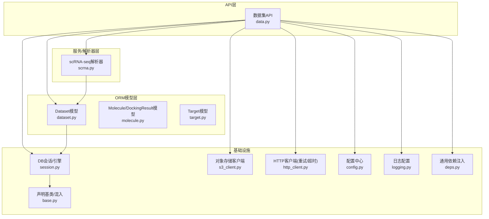
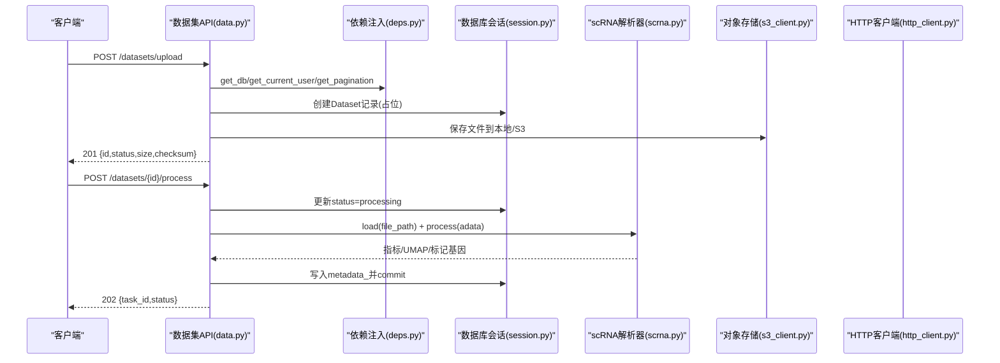
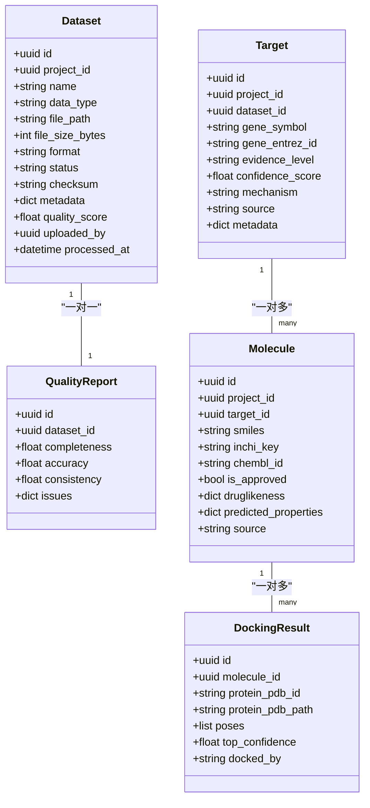
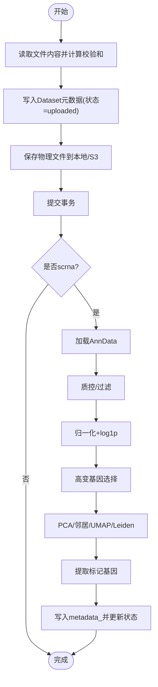
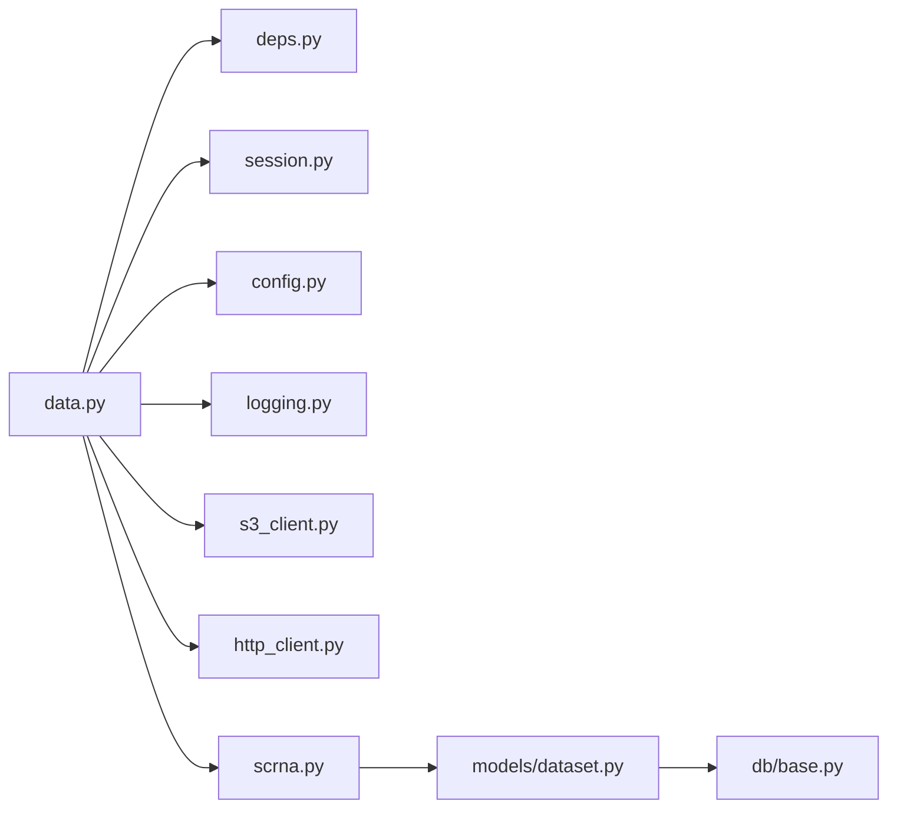

# 数据访问模式

<cite>
**本文引用的文件**   
- [backend/app/db/base.py](file://backend/app/db/base.py)
- [backend/app/db/session.py](file://backend/app/db/session.py)
- [backend/app/models/dataset.py](file://backend/app/models/dataset.py)
- [backend/app/models/molecule.py](file://backend/app/models/molecule.py)
- [backend/app/models/target.py](file://backend/app/models/target.py)
- [backend/app/schemas/common.py](file://backend/app/schemas/common.py)
- [backend/app/schemas/dataset.py](file://backend/app/schemas/dataset.py)
- [backend/app/schemas/molecule.py](file://backend/app/schemas/molecule.py)
- [backend/app/api/v1/data.py](file://backend/app/api/v1/data.py)
- [backend/app/utils/s3_client.py](file://backend/app/utils/s3_client.py)
- [backend/app/utils/http_client.py](file://backend/app/utils/http_client.py)
- [backend/app/services/parser/scrna.py](file://backend/app/services/parser/scrna.py)
- [backend/app/core/deps.py](file://backend/app/core/deps.py)
- [backend/app/core/logging.py](file://backend/app/core/logging.py)
- [backend/app/core/config.py](file://backend/app/core/config.py)
</cite>

## 目录
1. [引言](#引言)
2. [项目结构](#项目结构)
3. [核心组件](#核心组件)
4. [架构总览](#架构总览)
5. [详细组件分析](#详细组件分析)
6. [依赖关系分析](#依赖关系分析)
7. [性能考虑](#性能考虑)
8. [故障排查指南](#故障排查指南)
9. [结论](#结论)
10. [附录](#附录)

## 引言
本文件面向AI药物设计系统的数据访问层，系统化阐述Repository与DAO模式在生物医学数据处理中的应用，覆盖批量导入、流式处理、分页查询、对象存储（S3/MinIO）访问、外部API封装、数据转换管道、缓存策略、查询优化、错误重试机制与监控日志记录。文档同时给出最佳实践与性能调优建议，帮助读者快速理解并扩展系统的数据访问能力。

## 项目结构
后端采用分层架构：API路由层 → 服务/解析器层 → ORM模型层 → 数据库会话与配置；工具层提供统一的外部HTTP客户端与对象存储抽象。关键路径包括数据集上传、处理、结果读取，以及分子与靶点数据的CRUD与查询。

图表来源
- [backend/app/api/v1/data.py:1-369](file://backend/app/api/v1/data.py#L1-L369)
- [backend/app/services/parser/scrna.py:1-160](file://backend/app/services/parser/scrna.py#L1-L160)
- [backend/app/models/dataset.py:1-70](file://backend/app/models/dataset.py#L1-L70)
- [backend/app/models/molecule.py:1-61](file://backend/app/models/molecule.py#L1-L61)
- [backend/app/models/target.py:1-52](file://backend/app/models/target.py#L1-L52)
- [backend/app/db/session.py:1-128](file://backend/app/db/session.py#L1-L128)
- [backend/app/db/base.py:1-48](file://backend/app/db/base.py#L1-L48)
- [backend/app/utils/s3_client.py:1-79](file://backend/app/utils/s3_client.py#L1-L79)
- [backend/app/utils/http_client.py:1-113](file://backend/app/utils/http_client.py#L1-L113)
- [backend/app/core/config.py:1-144](file://backend/app/core/config.py#L1-L144)
- [backend/app/core/logging.py:1-93](file://backend/app/core/logging.py#L1-L93)
- [backend/app/core/deps.py:1-129](file://backend/app/core/deps.py#L1-L129)

章节来源
- [backend/app/api/v1/data.py:1-369](file://backend/app/api/v1/data.py#L1-L369)
- [backend/app/db/session.py:1-128](file://backend/app/db/session.py#L1-L128)
- [backend/app/db/base.py:1-48](file://backend/app/db/base.py#L1-L48)
- [backend/app/models/dataset.py:1-70](file://backend/app/models/dataset.py#L1-L70)
- [backend/app/models/molecule.py:1-61](file://backend/app/models/molecule.py#L1-L61)
- [backend/app/models/target.py:1-52](file://backend/app/models/target.py#L1-L52)
- [backend/app/utils/s3_client.py:1-79](file://backend/app/utils/s3_client.py#L1-L79)
- [backend/app/utils/http_client.py:1-113](file://backend/app/utils/http_client.py#L1-L113)
- [backend/app/services/parser/scrna.py:1-160](file://backend/app/services/parser/scrna.py#L1-L160)
- [backend/app/core/deps.py:1-129](file://backend/app/core/deps.py#L1-L129)
- [backend/app/core/logging.py:1-93](file://backend/app/core/logging.py#L1-L93)
- [backend/app/core/config.py:1-144](file://backend/app/core/config.py#L1-L144)

## 核心组件
- 数据库会话与连接池：提供同步/异步引擎与会话工厂，支持SQLite与PostgreSQL差异化配置，自动提交/回滚。
- ORM模型与混入：统一的UUID主键、时间戳混入，JSONB兼容字段，领域模型包含数据集、分子、靶点等。
- 请求/响应Schema：Pydantic v2定义，统一信封、分页元数据、枚举校验。
- 对象存储客户端：本地文件系统与S3/MinIO的统一抽象，预留生产实现。
- HTTP客户端封装：统一超时、指数退避重试、状态码分类与异常包装。
- scRNA-seq解析器：基于Scanpy的加载、质控、归一化、高变基因选择、降维聚类与标记基因提取。
- 通用依赖注入：用户缓存、分页参数、请求ID注入。
- 日志配置：结构化输出、按大小/时间轮转、错误独立归档。

章节来源
- [backend/app/db/session.py:1-128](file://backend/app/db/session.py#L1-L128)
- [backend/app/db/base.py:1-48](file://backend/app/db/base.py#L1-L48)
- [backend/app/models/dataset.py:1-70](file://backend/app/models/dataset.py#L1-L70)
- [backend/app/models/molecule.py:1-61](file://backend/app/models/molecule.py#L1-L61)
- [backend/app/models/target.py:1-52](file://backend/app/models/target.py#L1-L52)
- [backend/app/schemas/common.py:1-158](file://backend/app/schemas/common.py#L1-L158)
- [backend/app/schemas/dataset.py:1-147](file://backend/app/schemas/dataset.py#L1-L147)
- [backend/app/schemas/molecule.py:1-178](file://backend/app/schemas/molecule.py#L1-L178)
- [backend/app/utils/s3_client.py:1-79](file://backend/app/utils/s3_client.py#L1-L79)
- [backend/app/utils/http_client.py:1-113](file://backend/app/utils/http_client.py#L1-L113)
- [backend/app/services/parser/scrna.py:1-160](file://backend/app/services/parser/scrna.py#L1-L160)
- [backend/app/core/deps.py:1-129](file://backend/app/core/deps.py#L1-L129)
- [backend/app/core/logging.py:1-93](file://backend/app/core/logging.py#L1-L93)

## 架构总览
数据访问整体流程：API接收请求 → 依赖注入获取会话/用户/分页 → 调用服务或解析器 → ORM读写数据库 → 可选对象存储/外部API → 返回统一信封响应。

图表来源
- [backend/app/api/v1/data.py:54-121](file://backend/app/api/v1/data.py#L54-L121)
- [backend/app/api/v1/data.py:191-254](file://backend/app/api/v1/data.py#L191-L254)
- [backend/app/core/deps.py:101-124](file://backend/app/core/deps.py#L101-L124)
- [backend/app/db/session.py:94-128](file://backend/app/db/session.py#L94-L128)
- [backend/app/services/parser/scrna.py:38-134](file://backend/app/services/parser/scrna.py#L38-L134)
- [backend/app/utils/s3_client.py:28-49](file://backend/app/utils/s3_client.py#L28-L49)
- [backend/app/utils/http_client.py:60-112](file://backend/app/utils/http_client.py#L60-L112)

## 详细组件分析

### 数据模型与ORM映射
- 数据集模型：包含多组学类型、状态机、校验和、质量报告关联与JSONB元数据。
- 分子与对接结果：SMILES、InChIKey、属性JSON、对接构象列表与置信度。
- 靶点模型：证据等级、置信度、机制说明、来源与元数据。

图表来源
- [backend/app/models/dataset.py:15-70](file://backend/app/models/dataset.py#L15-L70)
- [backend/app/models/molecule.py:14-61](file://backend/app/models/molecule.py#L14-L61)
- [backend/app/models/target.py:14-52](file://backend/app/models/target.py#L14-L52)

章节来源
- [backend/app/models/dataset.py:1-70](file://backend/app/models/dataset.py#L1-L70)
- [backend/app/models/molecule.py:1-61](file://backend/app/models/molecule.py#L1-L61)
- [backend/app/models/target.py:1-52](file://backend/app/models/target.py#L1-L52)

### Repository与DAO模式应用
- DAO模式：通过SQLAlchemy直接执行select语句进行数据访问，API层负责构建查询条件、分页与序列化。
- Repository模式：可在服务层封装复杂查询与事务边界，当前代码以API直连DAO为主，便于快速迭代；后续可将常用查询封装为Repository方法以提升内聚性。

章节来源
- [backend/app/api/v1/data.py:124-171](file://backend/app/api/v1/data.py#L124-L171)
- [backend/app/api/v1/data.py:174-188](file://backend/app/api/v1/data.py#L174-L188)

### 批量数据导入与流式处理
- 批量导入：上传接口一次性读取文件内容并计算SHA256校验和，随后持久化元数据与物理文件。
- 流式处理：scRNA-seq解析器惰性加载Scanpy，分阶段执行QC、归一化、高变基因选择、PCA/UMAP与Leiden聚类，逐步产出中间结果并缓存至metadata_。

图表来源
- [backend/app/api/v1/data.py:54-121](file://backend/app/api/v1/data.py#L54-L121)
- [backend/app/services/parser/scrna.py:75-134](file://backend/app/services/parser/scrna.py#L75-L134)

章节来源
- [backend/app/api/v1/data.py:54-121](file://backend/app/api/v1/data.py#L54-L121)
- [backend/app/services/parser/scrna.py:1-160](file://backend/app/services/parser/scrna.py#L1-L160)

### 分页查询实现策略
- 统一分页依赖：get_pagination提供page/page_size与offset/limit计算。
- 列表接口：先count再limit+offset，返回PagedResponse与PagedMeta。
- 约束：page_size上限100，避免过大页导致性能问题。

章节来源
- [backend/app/core/deps.py:83-88](file://backend/app/core/deps.py#L83-L88)
- [backend/app/api/v1/data.py:124-171](file://backend/app/api/v1/data.py#L124-L171)
- [backend/app/schemas/common.py:35-52](file://backend/app/schemas/common.py#L35-L52)

### 文件存储访问（S3/MinIO）
- StorageClient抽象：本地模式直接写盘，生产模式预留S3/MinIO实现。
- 预签名URL：本地模式返回文件路径，生产模式可返回临时下载链接。
- 校验和：提供SHA256计算方法，用于完整性校验。

章节来源
- [backend/app/utils/s3_client.py:16-79](file://backend/app/utils/s3_client.py#L16-L79)

### 外部API调用封装
- HttpClient：统一超时、指数退避重试、4xx不重试、5xx重试并记录警告日志，最终抛出UpstreamError。
- 适用场景：MyGene/MyVariant/ChEMBL/PubMed/LLM等知识库与模型服务。

章节来源
- [backend/app/utils/http_client.py:18-113](file://backend/app/utils/http_client.py#L18-L113)

### 数据转换管道设计
- 解析器职责单一：ScRnaSeqParser仅负责加载与处理，返回标准化字典，便于缓存与下游消费。
- 管道阶段清晰：加载→QC→归一化→HVG→降维→聚类→标记基因，每步可独立扩展与替换。

章节来源
- [backend/app/services/parser/scrna.py:13-160](file://backend/app/services/parser/scrna.py#L13-L160)

### 缓存策略
- 用户对象短TTL内存缓存：减少频繁的用户查询，过期后自动失效。
- 处理结果缓存：将UMAP坐标、聚类标签、标记基因等写入Dataset.metadata_，避免重复计算。

章节来源
- [backend/app/core/deps.py:26-65](file://backend/app/core/deps.py#L26-L65)
- [backend/app/api/v1/data.py:216-254](file://backend/app/api/v1/data.py#L216-L254)

### 查询优化
- 索引使用：project_id、target_id、gene_symbol等字段建立索引，提升过滤与JOIN效率。
- JSONB字段：metadata_使用JSONB，适合半结构化元数据存储与灵活查询。
- 分页限制：限制page_size上限，防止全表扫描与大偏移带来的性能退化。

章节来源
- [backend/app/models/dataset.py:27-42](file://backend/app/models/dataset.py#L27-L42)
- [backend/app/models/molecule.py:23-35](file://backend/app/models/molecule.py#L23-L35)
- [backend/app/models/target.py:29-41](file://backend/app/models/target.py#L29-L41)
- [backend/app/api/v1/data.py:124-171](file://backend/app/api/v1/data.py#L124-L171)

### 错误重试机制
- 指数退避：对5xx与网络异常进行重试，间隔按2^(attempt-1)增长。
- 失败聚合：最后一次失败抛出UpstreamError，附带URL与最后错误信息，便于追踪。

章节来源
- [backend/app/utils/http_client.py:60-112](file://backend/app/utils/http_client.py#L60-L112)

### 监控日志记录
- 结构化日志：生产环境输出JSON，开发环境彩色控制台，便于调试与采集。
- 文件轮转：按大小/时间轮转，保留期与压缩策略明确，错误日志单独归档。
- 上下文绑定：可通过模块名绑定logger，结合request_id进行链路追踪。

章节来源
- [backend/app/core/logging.py:20-93](file://backend/app/core/logging.py#L20-L93)
- [backend/app/core/deps.py:91-99](file://backend/app/core/deps.py#L91-L99)

## 依赖关系分析
- API层依赖：依赖注入（用户、分页、请求ID）、数据库会话、配置、日志、对象存储与HTTP客户端。
- 服务层依赖：解析器依赖第三方库（如Scanpy），通过惰性加载降低启动成本。
- ORM层依赖：Base声明与混入提供公共字段，JSONB兼容类型用于元数据。

图表来源
- [backend/app/api/v1/data.py:1-369](file://backend/app/api/v1/data.py#L1-L369)
- [backend/app/core/deps.py:1-129](file://backend/app/core/deps.py#L1-L129)
- [backend/app/db/session.py:1-128](file://backend/app/db/session.py#L1-L128)
- [backend/app/core/config.py:1-144](file://backend/app/core/config.py#L1-L144)
- [backend/app/core/logging.py:1-93](file://backend/app/core/logging.py#L1-L93)
- [backend/app/utils/s3_client.py:1-79](file://backend/app/utils/s3_client.py#L1-L79)
- [backend/app/utils/http_client.py:1-113](file://backend/app/utils/http_client.py#L1-L113)
- [backend/app/services/parser/scrna.py:1-160](file://backend/app/services/parser/scrna.py#L1-L160)
- [backend/app/models/dataset.py:1-70](file://backend/app/models/dataset.py#L1-L70)
- [backend/app/db/base.py:1-48](file://backend/app/db/base.py#L1-L48)

章节来源
- [backend/app/api/v1/data.py:1-369](file://backend/app/api/v1/data.py#L1-L369)
- [backend/app/core/deps.py:1-129](file://backend/app/core/deps.py#L1-L129)
- [backend/app/db/session.py:1-128](file://backend/app/db/session.py#L1-L128)
- [backend/app/core/config.py:1-144](file://backend/app/core/config.py#L1-L144)
- [backend/app/core/logging.py:1-93](file://backend/app/core/logging.py#L1-L93)
- [backend/app/utils/s3_client.py:1-79](file://backend/app/utils/s3_client.py#L1-L79)
- [backend/app/utils/http_client.py:1-113](file://backend/app/utils/http_client.py#L1-L113)
- [backend/app/services/parser/scrna.py:1-160](file://backend/app/services/parser/scrna.py#L1-L160)
- [backend/app/models/dataset.py:1-70](file://backend/app/models/dataset.py#L1-L70)
- [backend/app/db/base.py:1-48](file://backend/app/db/base.py#L1-L48)

## 性能考虑
- 连接池与异步：非SQLite使用连接池与ping检测，FastAPI路由使用异步会话，提高并发吞吐。
- 惰性加载：解析器按需导入重型库，缩短冷启动时间。
- 分页与索引：合理设置page_size，利用索引字段过滤，避免大偏移。
- 结果缓存：将计算密集型结果写入metadata_，减少重复计算。
- 外部API重试：指数退避降低瞬时失败影响，避免雪崩。

[本节为通用指导，无需特定文件引用]

## 故障排查指南
- 上传失败：检查data_type与扩展名白名单、文件大小与校验和、目标目录权限。
- 处理失败：确认Scanpy安装与输入格式，查看降级逻辑与日志警告。
- 外部API错误：关注UpstreamError详情中的URL与状态码，调整重试次数与超时。
- 日志定位：使用request_id串联请求链路，查看logs目录下的轮转文件。

章节来源
- [backend/app/api/v1/data.py:72-121](file://backend/app/api/v1/data.py#L72-L121)
- [backend/app/api/v1/data.py:216-254](file://backend/app/api/v1/data.py#L216-L254)
- [backend/app/utils/http_client.py:81-112](file://backend/app/utils/http_client.py#L81-L112)
- [backend/app/core/logging.py:54-74](file://backend/app/core/logging.py#L54-L74)

## 结论
本系统通过清晰的层次划分与统一的基础设施抽象，实现了稳健的数据访问模式。DAO与Repository的结合、完善的分页与缓存、健壮的重试与日志体系，为生物医学大数据处理提供了可扩展、高性能且易维护的支撑。建议在后续演进中进一步引入Repository封装复杂查询与事务边界，并结合Redis/消息队列增强异步任务与分布式处理能力。

[本节为总结，无需特定文件引用]

## 附录
- 常见数据操作最佳实践
  - 上传前校验：数据类型、扩展名、大小限制与校验和。
  - 处理幂等：同一数据集多次触发处理应保证结果一致。
  - 分页安全：严格限制page_size，避免恶意请求。
  - 外部API容错：区分4xx与5xx，合理重试与熔断。
  - 日志规范：结构化输出，携带request_id与必要上下文。
- 性能调优指南
  - 数据库：为高频过滤字段建索引，合理使用JSONB查询。
  - 连接池：根据并发量调整pool_size与max_overflow。
  - 解析器：控制n_jobs与中间结果裁剪（如UMAP预览数量）。
  - 缓存：短期热点数据优先内存缓存，长期结果落库。

[本节为通用指导，无需特定文件引用]