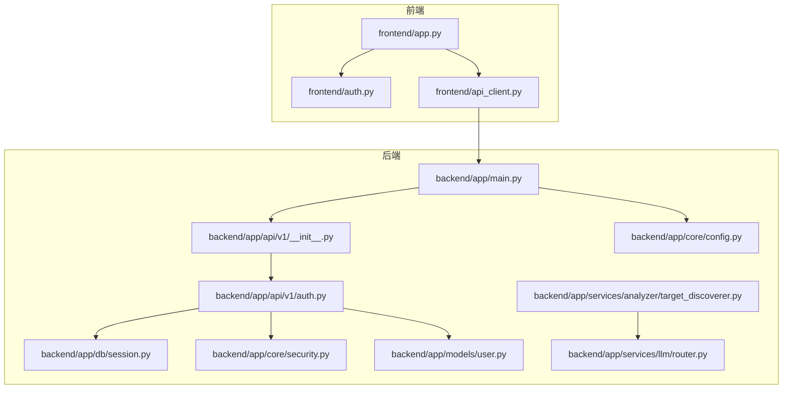
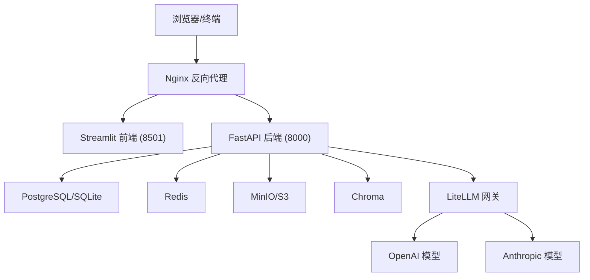
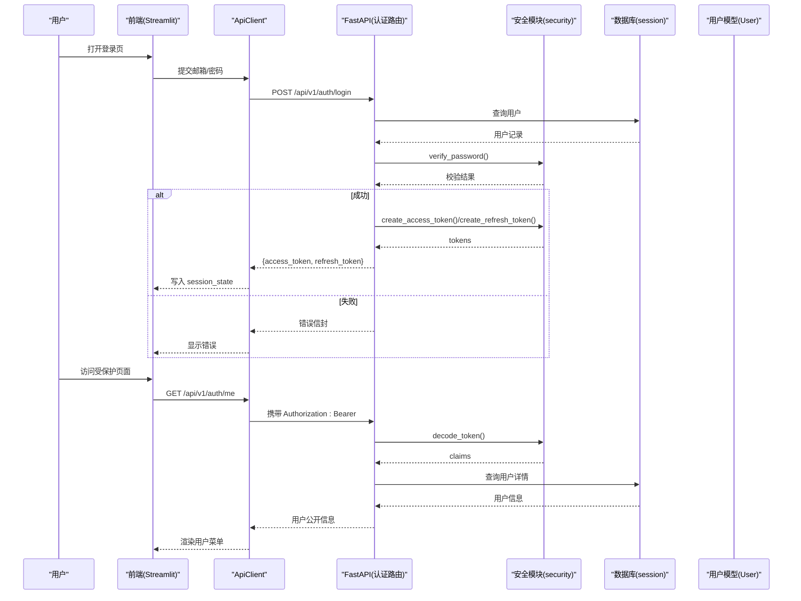
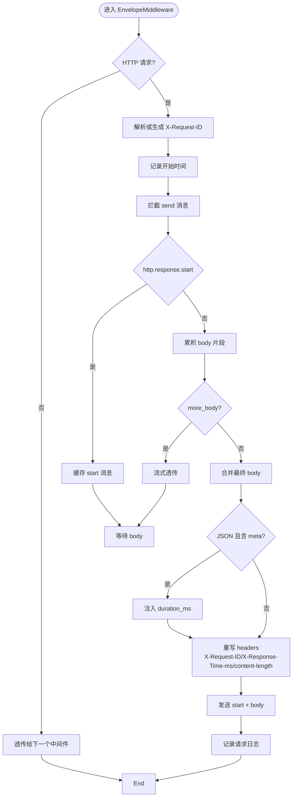
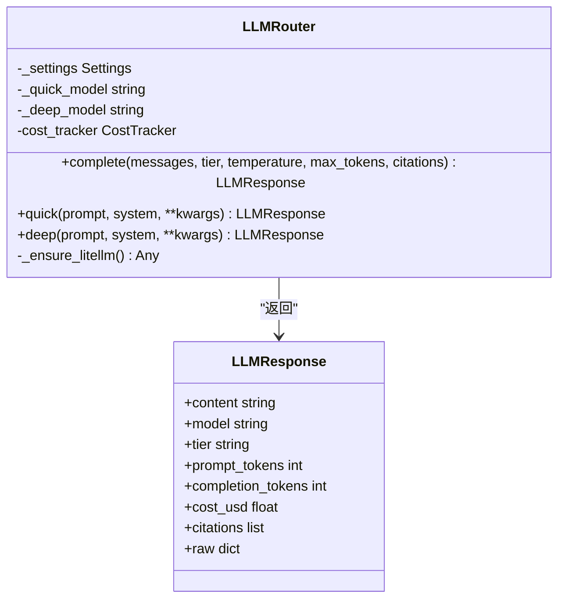
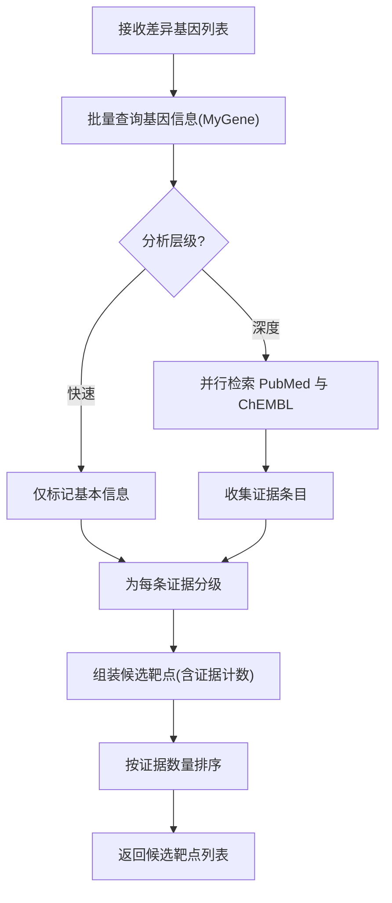
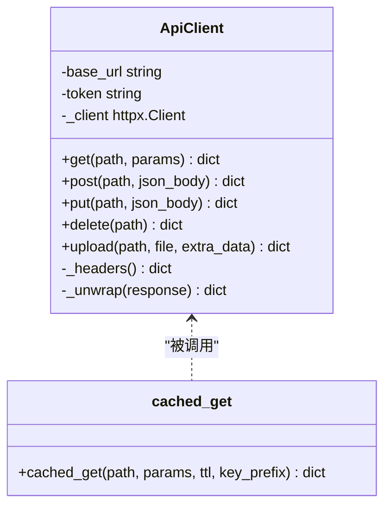
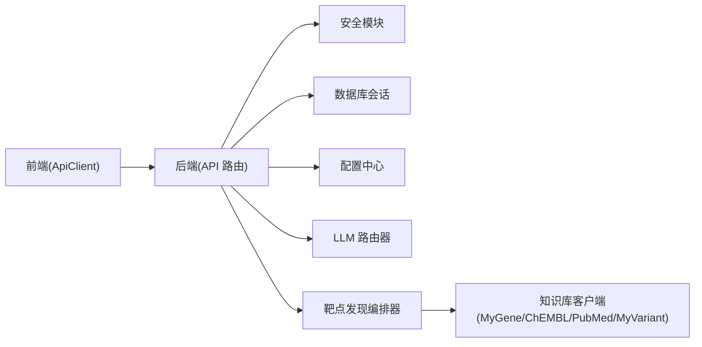

# 整体架构设计

<cite>
**本文引用的文件**   
- [README.md](file://precision-drug-design/README.md)
- [backend/app/main.py](file://precision-drug-design/backend/app/main.py)
- [backend/app/api/v1/__init__.py](file://precision-drug-design/backend/app/api/v1/__init__.py)
- [backend/app/core/config.py](file://precision-drug-design/backend/app/core/config.py)
- [backend/app/db/session.py](file://precision-drug-design/backend/app/db/session.py)
- [backend/app/core/security.py](file://precision-drug-design/backend/app/core/security.py)
- [backend/app/models/user.py](file://precision-drug-design/backend/app/models/user.py)
- [backend/app/api/v1/auth.py](file://precision-drug-design/backend/app/api/v1/auth.py)
- [backend/app/core/exceptions.py](file://precision-drug-design/backend/app/core/exceptions.py)
- [backend/app/services/llm/router.py](file://precision-drug-design/backend/app/services/llm/router.py)
- [backend/app/services/analyzer/target_discoverer.py](file://precision-drug-design/backend/app/services/analyzer/target_discoverer.py)
- [frontend/app.py](file://precision-drug-design/frontend/app.py)
- [frontend/api_client.py](file://precision-drug-design/frontend/api_client.py)
- [frontend/auth.py](file://precision-drug-design/frontend/auth.py)
- [docs/DEPLOYMENT.md](file://precision-drug-design/docs/DEPLOYMENT.md)
</cite>

## 目录
1. [引言](#引言)
2. [项目结构](#项目结构)
3. [核心组件](#核心组件)
4. [架构总览](#架构总览)
5. [详细组件分析](#详细组件分析)
6. [依赖关系分析](#依赖关系分析)
7. [性能与可扩展性](#性能与可扩展性)
8. [监控与告警](#监控与告警)
9. [故障排查指南](#故障排查指南)
10. [结论](#结论)

## 引言
本文件面向架构师与核心开发者，系统化阐述 AI 药物设计系统的整体架构。系统采用前后端分离与微服务模块化设计原则：后端基于 FastAPI 提供 REST API，前端基于 Streamlit 构建交互式界面；通过统一响应信封、JWT 认证、配置中心、数据库会话管理、LLM 路由与知识库编排等关键能力，支撑多组学数据整合、靶点发现、分子评估、报告生成与协作审计等核心业务。文档同时给出架构图、部署拓扑图与组件依赖图，并讨论可扩展性、性能优化与监控告警策略。

## 项目结构
仓库采用“前后端同仓”的单体工程组织方式，但内部按领域与职责清晰分层：
- 后端（FastAPI）：入口应用、中间件、异常处理、配置、数据库会话、模型与 Schema、API 路由、业务服务（分析器、知识库、LLM、隐私、工作流等）、工具模块。
- 前端（Streamlit）：主入口、页面导航、认证组件、API 客户端封装。
- 文档与脚本：部署说明、开发指南、测试与示例脚本。

图表来源
- [backend/app/main.py:187-248](file://precision-drug-design/backend/app/main.py#L187-L248)
- [backend/app/api/v1/__init__.py:24-38](file://precision-drug-design/backend/app/api/v1/__init__.py#L24-L38)
- [backend/app/api/v1/auth.py:38-147](file://precision-drug-design/backend/app/api/v1/auth.py#L38-L147)
- [backend/app/core/config.py:21-144](file://precision-drug-design/backend/app/core/config.py#L21-L144)
- [backend/app/db/session.py:48-128](file://precision-drug-design/backend/app/db/session.py#L48-L128)
- [backend/app/core/security.py:155-211](file://precision-drug-design/backend/app/core/security.py#L155-L211)
- [backend/app/models/user.py:14-36](file://precision-drug-design/backend/app/models/user.py#L14-L36)
- [backend/app/services/llm/router.py:55-198](file://precision-drug-design/backend/app/services/llm/router.py#L55-L198)
- [backend/app/services/analyzer/target_discoverer.py:26-176](file://precision-drug-design/backend/app/services/analyzer/target_discoverer.py#L26-L176)
- [frontend/app.py:149-157](file://precision-drug-design/frontend/app.py#L149-L157)
- [frontend/api_client.py:42-163](file://precision-drug-design/frontend/api_client.py#L42-L163)
- [frontend/auth.py:10-137](file://precision-drug-design/frontend/auth.py#L10-L137)

章节来源
- [README.md:190-235](file://precision-drug-design/README.md#L190-L235)

## 核心组件
- 应用入口与中间件：创建 FastAPI 实例，注册统一信封中间件、CORS、全局异常处理器，挂载 v1 路由，暴露健康检查与指标端点。
- 配置中心：基于 pydantic-settings 的环境变量加载，集中管理数据库、Redis、对象存储、向量库、LLM、外部知识库、联邦学习等配置项。
- 数据库会话：提供同步/异步引擎与会话工厂，支持 SQLite 与 PostgreSQL 切换，提供 FastAPI 依赖注入 get_db。
- 安全与认证：bcrypt 密码哈希、JWT access/refresh token 签发与校验、角色守卫 require_roles、当前用户提取依赖。
- API 路由聚合：v1 路由聚合器将各业务模块（auth、projects、datasets、targets、molecules、reports、hypotheses、chat、federated、privacy、feedback、efficacy、admin）挂载到 /api/v1。
- LLM 路由器：LiteLLM 多模型统一调用，快速层与深度层分级调度，预算控制与成本追踪。
- 靶点发现编排器：整合 MyGene、ChEMBL、PubMed、MyVariant 等知识库，并行检索证据并输出候选靶点列表。
- 前端 Streamlit：主入口渲染侧边栏与首页，登录/注册 UI，通过 ApiClient 调用后端 REST API，内置连接池与请求缓存。

章节来源
- [backend/app/main.py:187-248](file://precision-drug-design/backend/app/main.py#L187-L248)
- [backend/app/core/config.py:21-144](file://precision-drug-design/backend/app/core/config.py#L21-L144)
- [backend/app/db/session.py:48-128](file://precision-drug-design/backend/app/db/session.py#L48-L128)
- [backend/app/core/security.py:155-211](file://precision-drug-design/backend/app/core/security.py#L155-L211)
- [backend/app/api/v1/__init__.py:24-38](file://precision-drug-design/backend/app/api/v1/__init__.py#L24-L38)
- [backend/app/services/llm/router.py:55-198](file://precision-drug-design/backend/app/services/llm/router.py#L55-L198)
- [backend/app/services/analyzer/target_discoverer.py:26-176](file://precision-drug-design/backend/app/services/analyzer/target_discoverer.py#L26-L176)
- [frontend/app.py:149-157](file://precision-drug-design/frontend/app.py#L149-L157)
- [frontend/api_client.py:42-163](file://precision-drug-design/frontend/api_client.py#L42-L163)

## 架构总览
系统采用前后端分离架构：
- 前端 Streamlit 作为 Web 交互层，负责用户界面、表单输入、结果可视化与页面导航。
- 后端 FastAPI 作为 API 网关与服务编排层，承载认证鉴权、数据持久化、AI 分析与外部知识库集成。
- 基础设施包括数据库（PostgreSQL/SQLite）、缓存（Redis）、对象存储（MinIO/S3）、向量库（Chroma）、LLM 网关（LiteLLM）。

图表来源
- [docs/DEPLOYMENT.md:208-228](file://precision-drug-design/docs/DEPLOYMENT.md#L208-L228)
- [backend/app/main.py:187-248](file://precision-drug-design/backend/app/main.py#L187-L248)
- [backend/app/core/config.py:21-144](file://precision-drug-design/backend/app/core/config.py#L21-L144)

## 详细组件分析

### 认证与授权流程（登录/刷新/获取用户信息）
该流程展示前端登录、后端校验与 JWT 签发、以及后续访问受保护资源的依赖注入机制。

图表来源
- [frontend/auth.py:10-137](file://precision-drug-design/frontend/auth.py#L10-L137)
- [frontend/api_client.py:42-163](file://precision-drug-design/frontend/api_client.py#L42-L163)
- [backend/app/api/v1/auth.py:70-147](file://precision-drug-design/backend/app/api/v1/auth.py#L70-L147)
- [backend/app/core/security.py:155-211](file://precision-drug-design/backend/app/core/security.py#L155-L211)
- [backend/app/models/user.py:14-36](file://precision-drug-design/backend/app/models/user.py#L14-L36)
- [backend/app/db/session.py:94-128](file://precision-drug-design/backend/app/db/session.py#L94-L128)

章节来源
- [backend/app/api/v1/auth.py:70-147](file://precision-drug-design/backend/app/api/v1/auth.py#L70-L147)
- [backend/app/core/security.py:155-211](file://precision-drug-design/backend/app/core/security.py#L155-L211)
- [frontend/auth.py:10-137](file://precision-drug-design/frontend/auth.py#L10-L137)
- [frontend/api_client.py:42-163](file://precision-drug-design/frontend/api_client.py#L42-L163)

### 统一响应信封与中间件
后端通过自定义中间件对响应进行统一包装与增强：
- 解析或生成 X-Request-ID，回写 scope headers，供下游依赖读取。
- 计算请求耗时，写入响应头 X-Response-Time-ms。
- 对 200 状态且 application/json 响应且含 meta 字段时，注入 duration_ms 到响应体。
- 同步更新 content-length，避免客户端解析截断。
- 记录请求日志。

图表来源
- [backend/app/main.py:29-185](file://precision-drug-design/backend/app/main.py#L29-L185)

章节来源
- [backend/app/main.py:29-185](file://precision-drug-design/backend/app/main.py#L29-L185)

### LLM 路由与成本管控
LLM 路由器根据任务层级选择模型，执行预算检查与成本估算，返回结构化响应。

图表来源
- [backend/app/services/llm/router.py:55-198](file://precision-drug-design/backend/app/services/llm/router.py#L55-L198)

章节来源
- [backend/app/services/llm/router.py:55-198](file://precision-drug-design/backend/app/services/llm/router.py#L55-L198)

### 靶点发现编排器
靶点发现编排器协调多个知识库客户端，从差异基因出发并行检索文献、活性数据与变异注释，综合证据并输出候选靶点列表。

图表来源
- [backend/app/services/analyzer/target_discoverer.py:52-139](file://precision-drug-design/backend/app/services/analyzer/target_discoverer.py#L52-L139)

章节来源
- [backend/app/services/analyzer/target_discoverer.py:52-139](file://precision-drug-design/backend/app/services/analyzer/target_discoverer.py#L52-L139)

### 前端 API 客户端与缓存
前端 ApiClient 封装 httpx 客户端，提供连接池复用、统一错误处理、JWT 自动注入、响应信封解包与文件上传；并提供带 TTL 的缓存辅助函数。

图表来源
- [frontend/api_client.py:42-163](file://precision-drug-design/frontend/api_client.py#L42-L163)
- [frontend/api_client.py:186-237](file://precision-drug-design/frontend/api_client.py#L186-L237)

章节来源
- [frontend/api_client.py:42-163](file://precision-drug-design/frontend/api_client.py#L42-L163)
- [frontend/api_client.py:186-237](file://precision-drug-design/frontend/api_client.py#L186-L237)

## 依赖关系分析
- 组件耦合与内聚：
  - 认证路由强依赖安全模块与数据库会话，内聚于用户生命周期管理。
  - LLM 路由器依赖配置与成本追踪器，保持对外部模型的抽象。
  - 靶点发现编排器组合多个知识库客户端，体现高内聚低耦合的服务编排模式。
- 直接/间接依赖：
  - 前端通过 ApiClient 间接依赖后端所有受保护资源。
  - 后端中间件与异常处理器贯穿所有请求路径。
- 外部依赖与集成点：
  - 数据库（PostgreSQL/SQLite）、缓存（Redis）、对象存储（MinIO/S3）、向量库（Chroma）、LLM 网关（LiteLLM）。
- 接口契约：
  - 统一响应信封 {success, data, meta}，错误码与 HTTP 状态映射明确。
  - JWT 令牌类型区分 access/refresh，角色声明 role 用于 RBAC。

图表来源
- [backend/app/api/v1/__init__.py:24-38](file://precision-drug-design/backend/app/api/v1/__init__.py#L24-L38)
- [backend/app/core/security.py:155-211](file://precision-drug-design/backend/app/core/security.py#L155-L211)
- [backend/app/db/session.py:94-128](file://precision-drug-design/backend/app/db/session.py#L94-L128)
- [backend/app/core/config.py:21-144](file://precision-drug-design/backend/app/core/config.py#L21-L144)
- [backend/app/services/llm/router.py:55-198](file://precision-drug-design/backend/app/services/llm/router.py#L55-L198)
- [backend/app/services/analyzer/target_discoverer.py:26-176](file://precision-drug-design/backend/app/services/analyzer/target_discoverer.py#L26-L176)
- [frontend/api_client.py:42-163](file://precision-drug-design/frontend/api_client.py#L42-L163)

章节来源
- [backend/app/api/v1/__init__.py:24-38](file://precision-drug-design/backend/app/api/v1/__init__.py#L24-L38)
- [backend/app/core/security.py:155-211](file://precision-drug-design/backend/app/core/security.py#L155-L211)
- [backend/app/db/session.py:94-128](file://precision-drug-design/backend/app/db/session.py#L94-L128)
- [backend/app/core/config.py:21-144](file://precision-drug-design/backend/app/core/config.py#L21-L144)
- [backend/app/services/llm/router.py:55-198](file://precision-drug-design/backend/app/services/llm/router.py#L55-L198)
- [backend/app/services/analyzer/target_discoverer.py:26-176](file://precision-drug-design/backend/app/services/analyzer/target_discoverer.py#L26-L176)
- [frontend/api_client.py:42-163](file://precision-drug-design/frontend/api_client.py#L42-L163)

## 性能与可扩展性
- 连接池与超时：
  - 前端 ApiClient 使用 httpx.Limits 设置最大连接数与 keepalive 过期时间，减少握手开销。
  - 数据库会话针对非 SQLite 场景启用 pool_pre_ping、pool_size 与 max_overflow，提升并发稳定性。
- 缓存策略：
  - 前端使用 st.cache_resource 共享 httpx.Client，st.cache_data 实现请求级缓存与 TTL 失效。
  - 后端中间件在响应头中注入耗时，便于前端与监控系统观测。
- 异步与并发：
  - 后端使用 SQLAlchemy async engine 与 AsyncSession，配合 FastAPI 异步路由提高吞吐。
  - 靶点发现编排器使用 asyncio.gather 并行调用外部知识库，降低端到端延迟。
- 扩展性设计：
  - 路由聚合器按领域拆分模块，新增功能只需添加新路由模块并注册。
  - LLM 路由器支持多提供商与模型切换，便于引入新模型与降级策略。
  - 配置中心集中管理环境变量，支持不同环境差异化部署。

章节来源
- [frontend/api_client.py:24-39](file://precision-drug-design/frontend/api_client.py#L24-L39)
- [frontend/api_client.py:186-237](file://precision-drug-design/frontend/api_client.py#L186-L237)
- [backend/app/db/session.py:64-80](file://precision-drug-design/backend/app/db/session.py#L64-L80)
- [backend/app/services/analyzer/target_discoverer.py:82-91](file://precision-drug-design/backend/app/services/analyzer/target_discoverer.py#L82-L91)
- [backend/app/api/v1/__init__.py:24-38](file://precision-drug-design/backend/app/api/v1/__init__.py#L24-L38)
- [backend/app/services/llm/router.py:55-198](file://precision-drug-design/backend/app/services/llm/router.py#L55-L198)
- [backend/app/core/config.py:21-144](file://precision-drug-design/backend/app/core/config.py#L21-L144)

## 监控与告警
- 指标端点：
  - 管理路由提供 Prometheus 格式指标端点，包含 HTTP 请求总数、耗时直方图、LLM 累计成本与错误总数等。
- 日志与追踪：
  - 中间件注入 X-Request-ID 与 X-Response-Time-ms，统一日志记录方法名、路径、状态码与耗时。
  - 全局异常处理器将业务异常与未捕获异常分别以 warning 与 exception 级别记录，便于定位问题。
- 建议告警规则：
  - 错误率阈值（如 5xx 比例超过 1%）。
  - P95/P99 延迟超过 SLA。
  - LLM 成本超预算（结合 cost_tracker 统计）。
  - 上游知识库调用失败率升高。

章节来源
- [backend/app/api/v1/admin.py:28-50](file://precision-drug-design/backend/app/api/v1/admin.py#L28-L50)
- [backend/app/main.py:172-185](file://precision-drug-design/backend/app/main.py#L172-L185)
- [backend/app/core/exceptions.py:131-179](file://precision-drug-design/backend/app/core/exceptions.py#L131-L179)

## 故障排查指南
- 认证失败：
  - 检查 Authorization header 是否携带有效 access token，确认 token 类型与签名。
  - 若 refresh token 过期或被禁用，需重新登录。
- 参数校验失败：
  - 查看 VALIDATION_ERROR 的错误详情，修正请求体字段类型与必填项。
- 上游错误：
  - 当调用外部知识库或 LLM 失败时，返回 UPSTREAM_ERROR，检查网络连通性与 API Key。
- 性能问题：
  - 观察 X-Response-Time-ms 与前端缓存命中率，必要时调整 TTL 或增加连接池大小。
- 日志定位：
  - 使用 X-Request-ID 关联请求链路，结合全局异常处理器日志快速定位根因。

章节来源
- [backend/app/core/exceptions.py:131-179](file://precision-drug-design/backend/app/core/exceptions.py#L131-L179)
- [backend/app/main.py:172-185](file://precision-drug-design/backend/app/main.py#L172-L185)
- [frontend/api_client.py:68-94](file://precision-drug-design/frontend/api_client.py#L68-L94)

## 结论
本系统以 FastAPI 与 Streamlit 为核心，构建了前后端分离、模块化清晰的 AI 药物设计平台。通过统一响应信封、JWT 认证、配置中心、数据库会话管理与 LLM 路由等关键能力，实现了高内聚、低耦合的服务编排与良好的可观测性。在生产环境中，推荐采用 Nginx 反向代理、PostgreSQL/Redis/MinIO/Chroma 等基础设施，并结合 Prometheus 指标与结构化日志建立完善的监控告警体系。未来可在联邦学习与隐私计算方面进一步扩展，以满足多中心协同与合规要求。