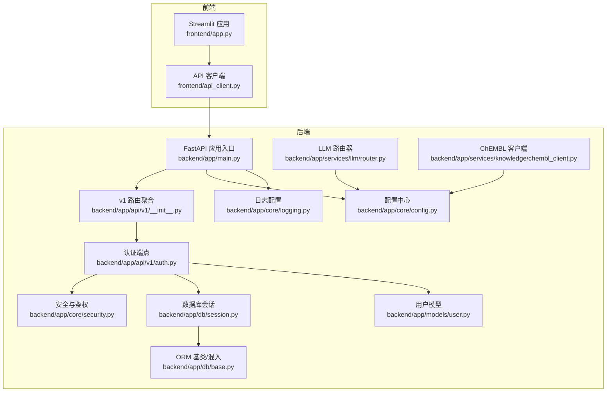
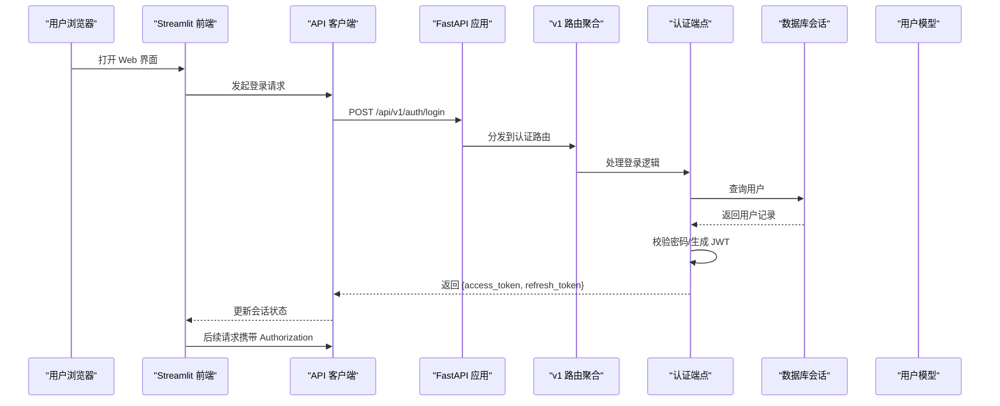
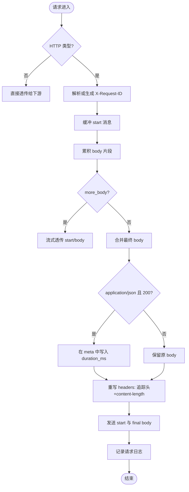
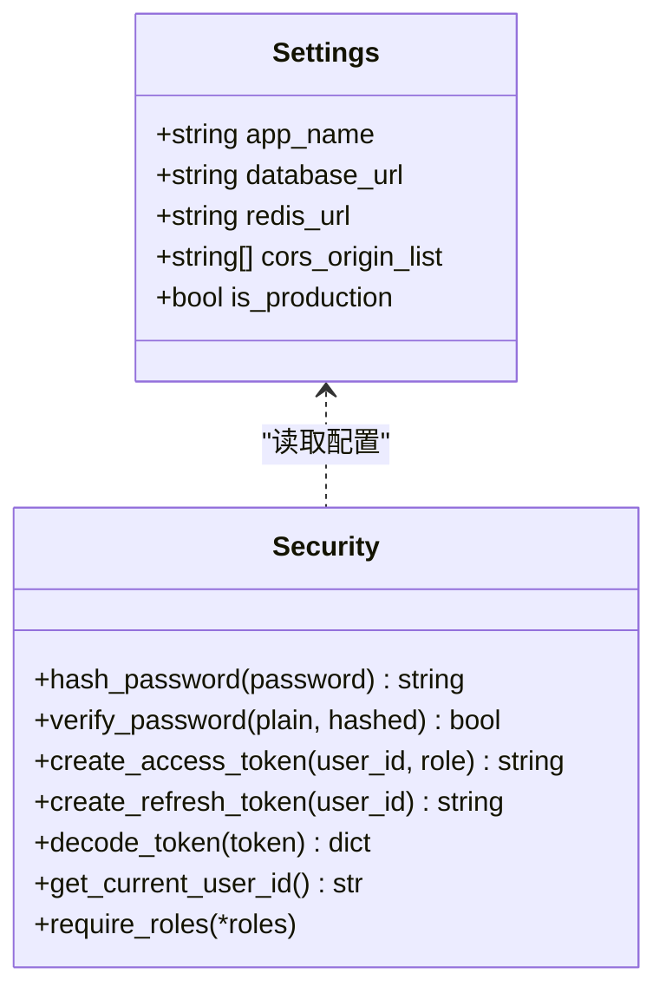
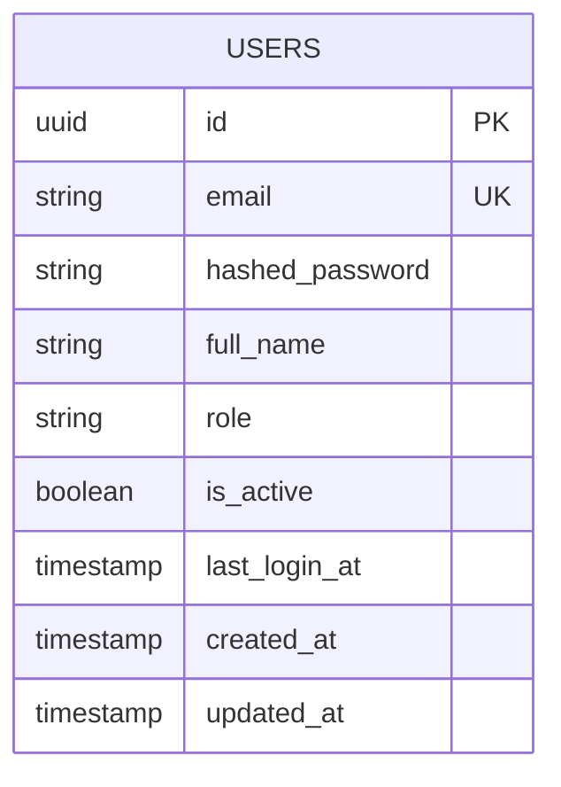
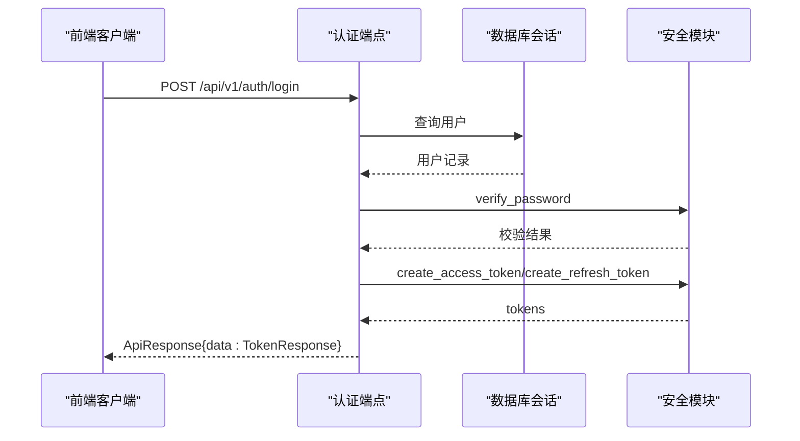
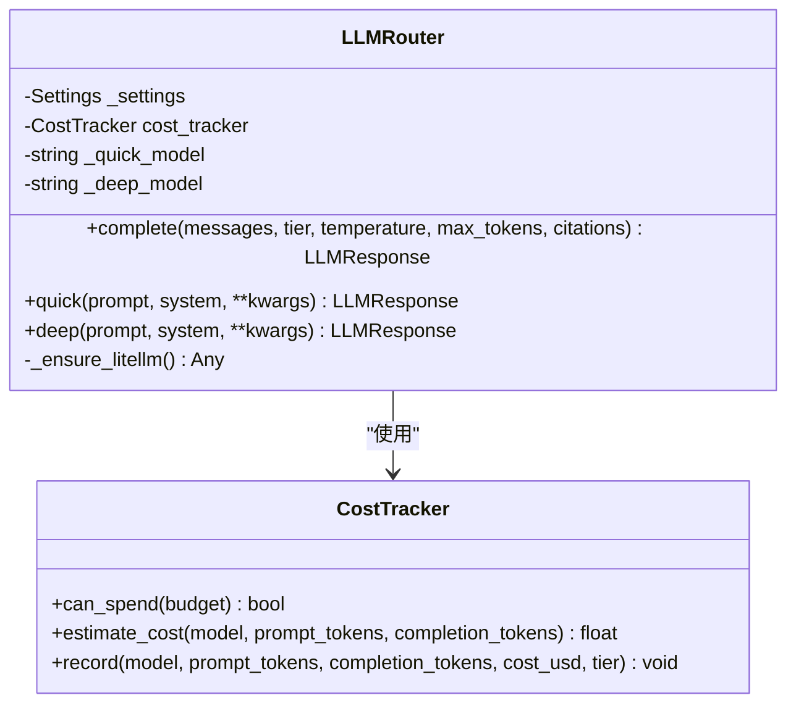
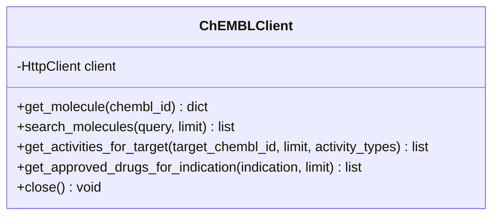
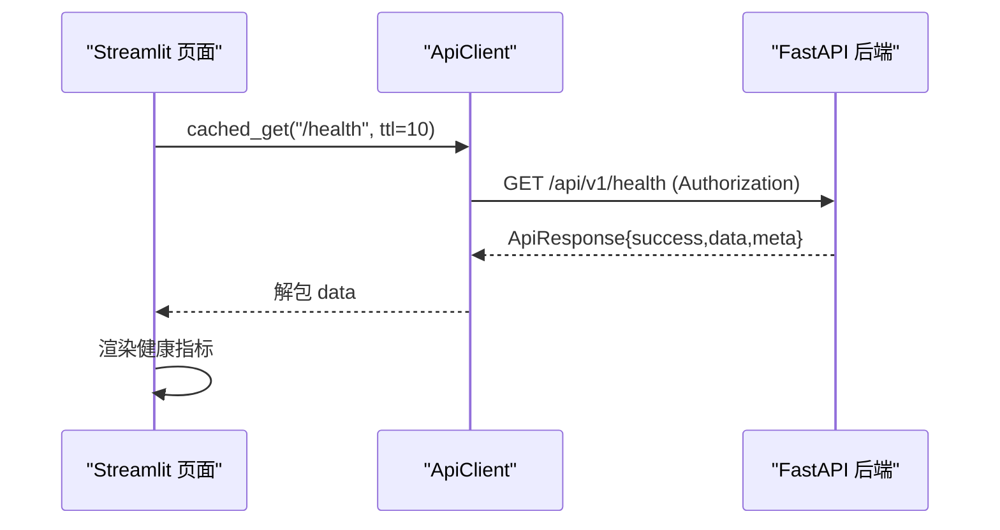
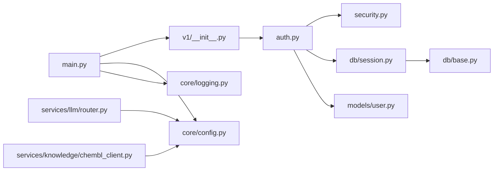

# 系统架构

<cite>
**本文引用的文件**
- [README.md](file://precision-drug-design/README.md)
- [main.py](file://precision-drug-design/backend/app/main.py)
- [__init__.py](file://precision-drug-design/backend/app/api/v1/__init__.py)
- [auth.py](file://precision-drug-design/backend/app/api/v1/auth.py)
- [config.py](file://precision-drug-design/backend/app/core/config.py)
- [security.py](file://precision-drug-design/backend/app/core/security.py)
- [logging.py](file://precision-drug-design/backend/app/core/logging.py)
- [base.py](file://precision-drug-design/backend/app/db/base.py)
- [session.py](file://precision-drug-design/backend/app/db/session.py)
- [init_db.py](file://precision-drug-design/backend/app/db/init_db.py)
- [user.py](file://precision-drug-design/backend/app/models/user.py)
- [router.py](file://precision-drug-design/backend/app/services/llm/router.py)
- [chembl_client.py](file://precision-drug-design/backend/app/services/knowledge/chembl_client.py)
- [app.py](file://precision-drug-design/frontend/app.py)
- [api_client.py](file://precision-drug-design/frontend/api_client.py)
</cite>

## 目录
1. [简介](#简介)
2. [项目结构](#项目结构)
3. [核心组件](#核心组件)
4. [架构总览](#架构总览)
5. [详细组件分析](#详细组件分析)
6. [依赖关系分析](#依赖关系分析)
7. [性能与可扩展性](#性能与可扩展性)
8. [监控与可观测性](#监控与可观测性)
9. [故障排查指南](#故障排查指南)
10. [结论](#结论)

## 简介
本系统为“AI 模式精准药物设计平台”，采用前后端分离与模块化服务设计，后端基于 FastAPI + SQLAlchemy 异步 ORM，前端基于 Streamlit。系统整合多组学数据、AI 靶点发现、分子评估、治疗方案优化与协作审计等能力，并通过统一信封响应格式、JWT 认证与 RBAC 权限控制保障安全与一致性。

## 项目结构
- 后端（backend/app）：按领域分层组织，包含 API 路由、核心配置与安全、数据库会话与模型、业务服务（分析器、知识库、LLM、优化器、解析器、隐私、报告、工作流）、工具模块与应用入口。
- 前端（frontend）：Streamlit 应用，提供登录、项目管理、数据集、靶点发现、分子评估、报告查看、假设管理、AI 问答、联邦学习、隐私计算与系统监控等页面。
- 文档与脚本：设计文档、部署说明、测试与初始化脚本。

图表来源
- [main.py:187-248](file://precision-drug-design/backend/app/main.py#L187-L248)
- [__init__.py:1-41](file://precision-drug-design/backend/app/api/v1/__init__.py#L1-L41)
- [auth.py:1-147](file://precision-drug-design/backend/app/api/v1/auth.py#L1-L147)
- [config.py:1-144](file://precision-drug-design/backend/app/core/config.py#L1-L144)
- [security.py:1-211](file://precision-drug-design/backend/app/core/security.py#L1-L211)
- [logging.py:1-93](file://precision-drug-design/backend/app/core/logging.py#L1-L93)
- [session.py:1-128](file://precision-drug-design/backend/app/db/session.py#L1-L128)
- [base.py:1-48](file://precision-drug-design/backend/app/db/base.py#L1-L48)
- [user.py:1-36](file://precision-drug-design/backend/app/models/user.py#L1-L36)
- [router.py:1-198](file://precision-drug-design/backend/app/services/llm/router.py#L1-L198)
- [chembl_client.py:1-127](file://precision-drug-design/backend/app/services/knowledge/chembl_client.py#L1-L127)
- [app.py:1-157](file://precision-drug-design/frontend/app.py#L1-L157)
- [api_client.py:1-251](file://precision-drug-design/frontend/api_client.py#L1-L251)

章节来源
- [README.md:190-235](file://precision-drug-design/README.md#L190-L235)

## 核心组件
- 应用入口与中间件：创建 FastAPI 实例，注册统一信封中间件、CORS、异常处理器与 v1 路由；暴露健康检查与根路径。
- 配置中心：基于 pydantic-settings 的环境变量加载，集中管理数据库、Redis、对象存储、向量库、LLM、外部知识库、联邦学习与数据处理等配置。
- 安全与鉴权：bcrypt 密码哈希、JWT access/refresh token 生成与校验、OAuth2 Bearer 提取、角色守卫工厂。
- 数据库层：SQLAlchemy 2.0 异步引擎与会话工厂，支持 SQLite/PostgreSQL，提供同步/异步双通道；声明式基类与 UUID 主键、时间戳混入。
- 认证端点：注册、登录、刷新令牌、获取当前用户信息，返回统一信封响应。
- LLM 路由器：LiteLLM 多模型统一调用，快速/深度两层策略，预算与成本追踪。
- 知识库客户端：ChEMBL REST 客户端，封装分子查询、活性数据与适应症药物检索。
- 前端 Streamlit：侧边栏导航、首页登录与健康状态展示、API 客户端封装（连接池、缓存、错误解包）。

章节来源
- [main.py:187-248](file://precision-drug-design/backend/app/main.py#L187-L248)
- [config.py:1-144](file://precision-drug-design/backend/app/core/config.py#L1-L144)
- [security.py:1-211](file://precision-drug-design/backend/app/core/security.py#L1-L211)
- [session.py:1-128](file://precision-drug-design/backend/app/db/session.py#L1-L128)
- [base.py:1-48](file://precision-drug-design/backend/app/db/base.py#L1-L48)
- [auth.py:1-147](file://precision-drug-design/backend/app/api/v1/auth.py#L1-L147)
- [router.py:1-198](file://precision-drug-design/backend/app/services/llm/router.py#L1-L198)
- [chembl_client.py:1-127](file://precision-drug-design/backend/app/services/knowledge/chembl_client.py#L1-L127)
- [app.py:1-157](file://precision-drug-design/frontend/app.py#L1-L157)
- [api_client.py:1-251](file://precision-drug-design/frontend/api_client.py#L1-L251)

## 架构总览
整体采用前后端分离的单体微服务化设计：
- 前端 Streamlit 通过 httpx 客户端访问后端 REST API，使用 JWT 进行认证，并内置请求级缓存与连接池复用。
- 后端 FastAPI 作为统一网关，承载认证、项目管理、数据、靶点、分子、报告、假设、聊天、联邦学习、隐私与效能等子域路由。
- 数据持久化使用 PostgreSQL（生产）或 SQLite（开发），会话由 SQLAlchemy 异步引擎管理；对象存储与向量库通过配置接入。
- LLM 与外部知识库通过 HTTP 客户端访问，具备超时与重试策略。

图表来源
- [app.py:1-157](file://precision-drug-design/frontend/app.py#L1-L157)
- [api_client.py:1-251](file://precision-drug-design/frontend/api_client.py#L1-L251)
- [main.py:187-248](file://precision-drug-design/backend/app/main.py#L187-L248)
- [__init__.py:1-41](file://precision-drug-design/backend/app/api/v1/__init__.py#L1-L41)
- [auth.py:1-147](file://precision-drug-design/backend/app/api/v1/auth.py#L1-L147)
- [session.py:1-128](file://precision-drug-design/backend/app/db/session.py#L1-L128)
- [user.py:1-36](file://precision-drug-design/backend/app/models/user.py#L1-L36)

## 详细组件分析

### 后端应用与中间件
- 应用工厂 create_app 负责初始化日志、创建 FastAPI 实例、注册中间件与路由、暴露健康检查与文档。
- EnvelopeMiddleware 实现统一信封响应增强：注入 X-Request-ID、X-Response-Time-ms、content-length 重写，并在 JSON 响应 meta 中追加 duration_ms；对非 JSON 或流式响应保持透传。
- CORS 中间件允许跨域并暴露追踪头。

图表来源
- [main.py:29-185](file://precision-drug-design/backend/app/main.py#L29-L185)

章节来源
- [main.py:187-248](file://precision-drug-design/backend/app/main.py#L187-L248)

### 配置与安全
- Settings 集中管理所有环境变量，提供 cors_origin_list、is_production 等便捷属性；优先级：真实环境变量 > .env > 默认值。
- 安全模块提供 bcrypt 哈希/校验、JWT 生成/解码、OAuth2 Bearer 提取、角色守卫 require_roles。

图表来源
- [config.py:1-144](file://precision-drug-design/backend/app/core/config.py#L1-L144)
- [security.py:1-211](file://precision-drug-design/backend/app/core/security.py#L1-L211)

章节来源
- [config.py:1-144](file://precision-drug-design/backend/app/core/config.py#L1-L144)
- [security.py:1-211](file://precision-drug-design/backend/app/core/security.py#L1-L211)

### 数据库与模型
- Base 与混入：UUIDPrimaryKey 提供分布式友好的 UUID 主键；TimestampMixin 提供 created_at/updated_at 自动维护。
- Session 管理：根据 URL 选择 asyncpg/sqlite+aiosqlite 驱动，提供异步/同步引擎与会话工厂；FastAPI 依赖 get_async_db 自动提交/回滚。
- 初始化脚本：创建所有表并插入初始 founder 用户。

图表来源
- [base.py:1-48](file://precision-drug-design/backend/app/db/base.py#L1-L48)
- [session.py:1-128](file://precision-drug-design/backend/app/db/session.py#L1-L128)
- [user.py:1-36](file://precision-drug-design/backend/app/models/user.py#L1-L36)
- [init_db.py:1-88](file://precision-drug-design/backend/app/db/init_db.py#L1-L88)

章节来源
- [base.py:1-48](file://precision-drug-design/backend/app/db/base.py#L1-L48)
- [session.py:1-128](file://precision-drug-design/backend/app/db/session.py#L1-L128)
- [user.py:1-36](file://precision-drug-design/backend/app/models/user.py#L1-L36)
- [init_db.py:1-88](file://precision-drug-design/backend/app/db/init_db.py#L1-L88)

### 认证流程
- 登录端点校验邮箱与密码，成功后生成 access/refresh token，返回统一信封响应。
- 刷新端点验证 refresh token 类型与用户状态，签发新的 access/refresh token。
- 当前用户端点通过依赖注入获取已认证用户。

图表来源
- [auth.py:1-147](file://precision-drug-design/backend/app/api/v1/auth.py#L1-L147)
- [security.py:1-211](file://precision-drug-design/backend/app/core/security.py#L1-L211)
- [session.py:1-128](file://precision-drug-design/backend/app/db/session.py#L1-L128)

章节来源
- [auth.py:1-147](file://precision-drug-design/backend/app/api/v1/auth.py#L1-L147)

### LLM 路由器与成本管控
- 路由器根据 tier 选择 quick/deep 模型，延迟导入 litellm，避免未安装时启动失败。
- 每次调用估算费用并记录，支持预算上限检查与错误包装。

图表来源
- [router.py:1-198](file://precision-drug-design/backend/app/services/llm/router.py#L1-L198)

章节来源
- [router.py:1-198](file://precision-drug-design/backend/app/services/llm/router.py#L1-L198)

### 知识库客户端（ChEMBL）
- 封装 ChEMBL REST API，提供分子详情、搜索、靶点活性与适应症药物查询。
- 基于 HttpClient 设置超时与重试，适配外部知识库调用。

图表来源
- [chembl_client.py:1-127](file://precision-drug-design/backend/app/services/knowledge/chembl_client.py#L1-L127)

章节来源
- [chembl_client.py:1-127](file://precision-drug-design/backend/app/services/knowledge/chembl_client.py#L1-L127)

### 前端 Streamlit 与 API 客户端
- 主入口渲染侧边栏与首页，未登录显示登录表单与系统介绍，登录后展示健康状态与快速入口。
- API 客户端封装 httpx 连接池、统一错误处理、JWT 注入、响应信封解包、上传接口与请求级缓存。

图表来源
- [app.py:1-157](file://precision-drug-design/frontend/app.py#L1-L157)
- [api_client.py:1-251](file://precision-drug-design/frontend/api_client.py#L1-L251)

章节来源
- [app.py:1-157](file://precision-drug-design/frontend/app.py#L1-L157)
- [api_client.py:1-251](file://precision-drug-design/frontend/api_client.py#L1-L251)

## 依赖关系分析
- 路由聚合将各子域路由挂载至 /api/v1，形成清晰的边界与标签分组。
- 认证端点依赖安全模块与数据库会话；安全模块依赖配置中心；日志模块在应用启动时初始化。
- LLM 路由器与知识库客户端均依赖配置中心以获取外部服务地址与密钥。

图表来源
- [main.py:187-248](file://precision-drug-design/backend/app/main.py#L187-L248)
- [__init__.py:1-41](file://precision-drug-design/backend/app/api/v1/__init__.py#L1-L41)
- [auth.py:1-147](file://precision-drug-design/backend/app/api/v1/auth.py#L1-L147)
- [security.py:1-211](file://precision-drug-design/backend/app/core/security.py#L1-L211)
- [session.py:1-128](file://precision-drug-design/backend/app/db/session.py#L1-L128)
- [base.py:1-48](file://precision-drug-design/backend/app/db/base.py#L1-L48)
- [user.py:1-36](file://precision-drug-design/backend/app/models/user.py#L1-L36)
- [config.py:1-144](file://precision-drug-design/backend/app/core/config.py#L1-L144)
- [logging.py:1-93](file://precision-drug-design/backend/app/core/logging.py#L1-L93)
- [router.py:1-198](file://precision-drug-design/backend/app/services/llm/router.py#L1-L198)
- [chembl_client.py:1-127](file://precision-drug-design/backend/app/services/knowledge/chembl_client.py#L1-L127)

章节来源
- [__init__.py:1-41](file://precision-drug-design/backend/app/api/v1/__init__.py#L1-L41)

## 性能与可扩展性
- 连接池与缓存
  - 前端 ApiClient 使用 httpx 连接池复用，减少握手开销；cached_get 基于 st.cache_data 实现请求级缓存，TTL 桶机制控制失效。
  - 后端数据库会话工厂针对 PostgreSQL 启用 pool_pre_ping、pool_size、max_overflow，SQLite 场景单独处理。
- 异步与并发
  - FastAPI 路由与数据库操作均为异步，提升吞吐；中间件对非 JSON 与流式响应保持透传，避免阻塞。
- 外部服务容错
  - ChEMBL 客户端设置超时与重试；LLM 路由器延迟导入与预算检查，防止资源耗尽。
- 可扩展性建议
  - 引入 Redis 缓存热点数据（如健康状态、字典表）；
  - 使用消息队列（如 Celery/RQ）异步执行长耗时任务（数据处理、报告生成）；
  - 水平扩展后端进程数（Uvicorn/Gunicorn workers），配合负载均衡；
  - 将 LLM 与知识库调用抽象为可插拔适配器，便于替换供应商与降级策略。

[本节为通用指导，不直接分析具体文件]

## 监控与可观测性
- 统一信封与中间件
  - 响应体 meta.duration_ms 与响应头 X-Response-Time-ms、X-Request-ID 提供端到端追踪。
- 日志体系
  - loguru 结构化输出（生产 JSON，开发彩色控制台），按大小/时间轮转，错误独立归档。
- 健康检查
  - 暴露 /api/v1/health 端点，前端定期拉取并展示系统状态。

章节来源
- [main.py:29-185](file://precision-drug-design/backend/app/main.py#L29-L185)
- [logging.py:1-93](file://precision-drug-design/backend/app/core/logging.py#L1-L93)
- [README.md:254-281](file://precision-drug-design/README.md#L254-L281)

## 故障排查指南
- 认证问题
  - 检查 Authorization header 是否携带有效 access token；确认 token 类型为 access 而非 refresh。
  - 若刷新失败，检查 refresh token 类型与用户状态。
- 数据库连接
  - 确认 DATABASE_URL 驱动正确（psycopg2/asyncpg/sqlite+aiosqlite）；生产环境启用 pool_pre_ping。
- 外部服务
  - ChEMBL/LLM 调用失败时，检查超时与重试配置；LLM 未安装 litellm 会抛出运行时错误。
- 日志定位
  - 使用 X-Request-ID 关联请求链路；查看 logs/app_YYYY-MM-DD.log 与 logs/error_YYYY-MM-DD.log。

章节来源
- [security.py:1-211](file://precision-drug-design/backend/app/core/security.py#L1-L211)
- [session.py:1-128](file://precision-drug-design/backend/app/db/session.py#L1-L128)
- [chembl_client.py:1-127](file://precision-drug-design/backend/app/services/knowledge/chembl_client.py#L1-L127)
- [router.py:1-198](file://precision-drug-design/backend/app/services/llm/router.py#L1-L198)
- [logging.py:1-93](file://precision-drug-design/backend/app/core/logging.py#L1-L93)

## 结论
本系统以 FastAPI 为核心构建前后端分离架构，结合统一信封响应、JWT 认证与 RBAC 权限控制，形成清晰的服务边界与安全基线。通过异步数据库会话、连接池与前端缓存提升性能，借助日志与中间件增强可观测性。未来可通过引入 Redis 缓存、消息队列与容器编排进一步提升可扩展性与弹性，满足大规模研发协作与高并发需求。