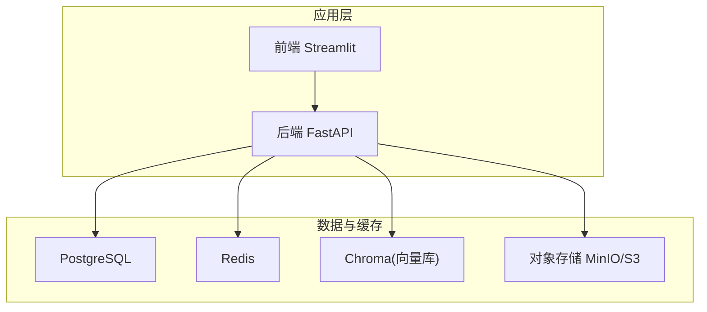
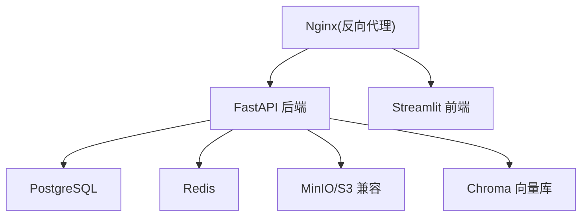
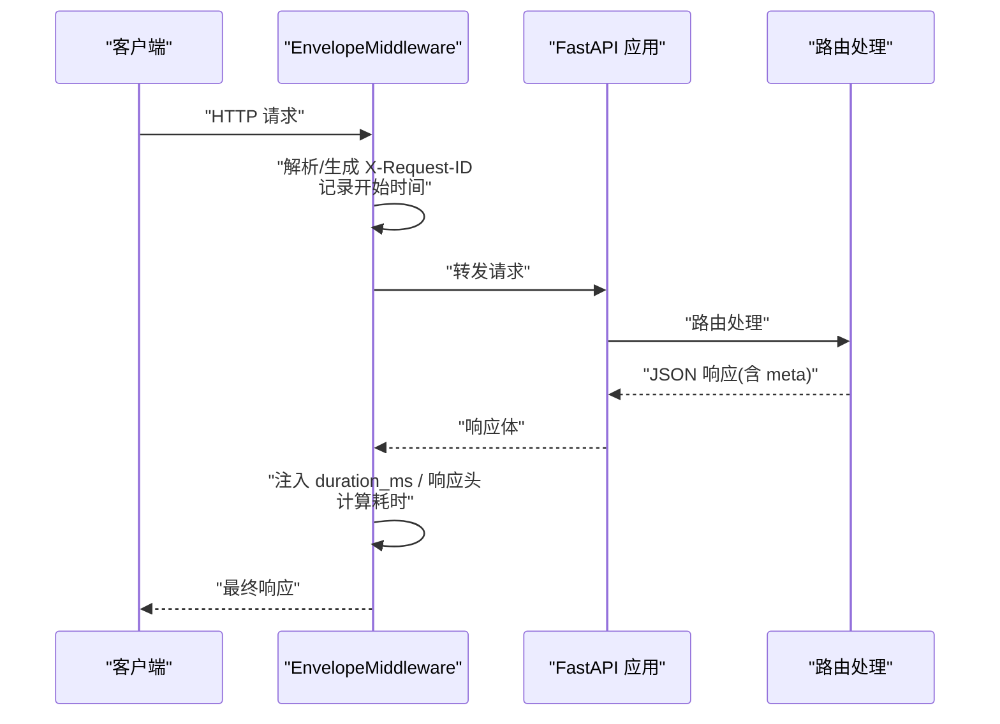
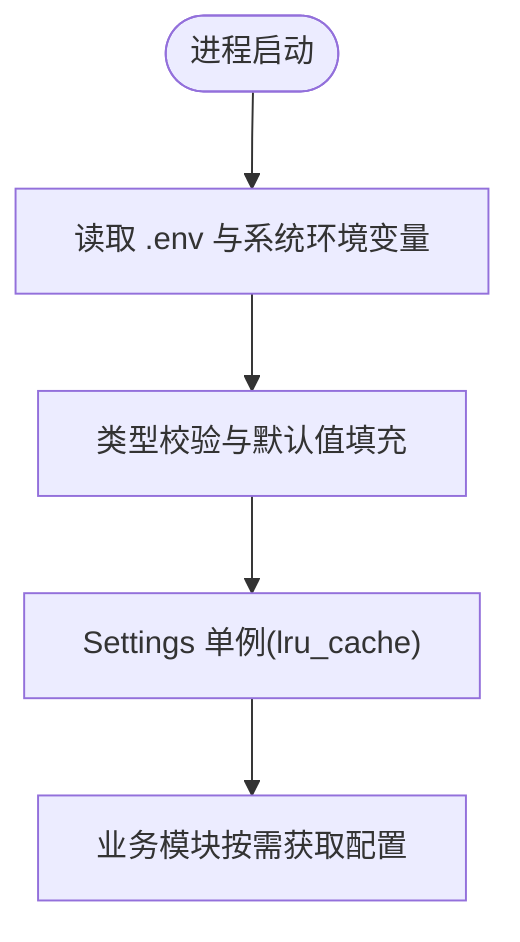
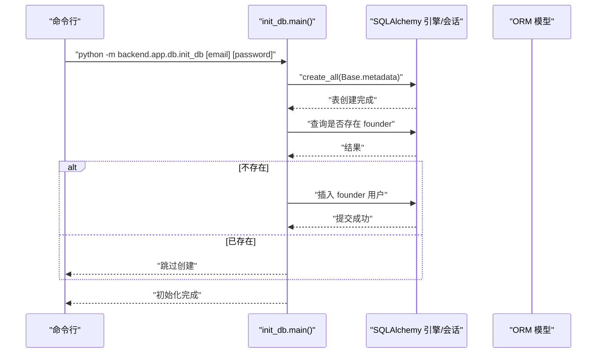
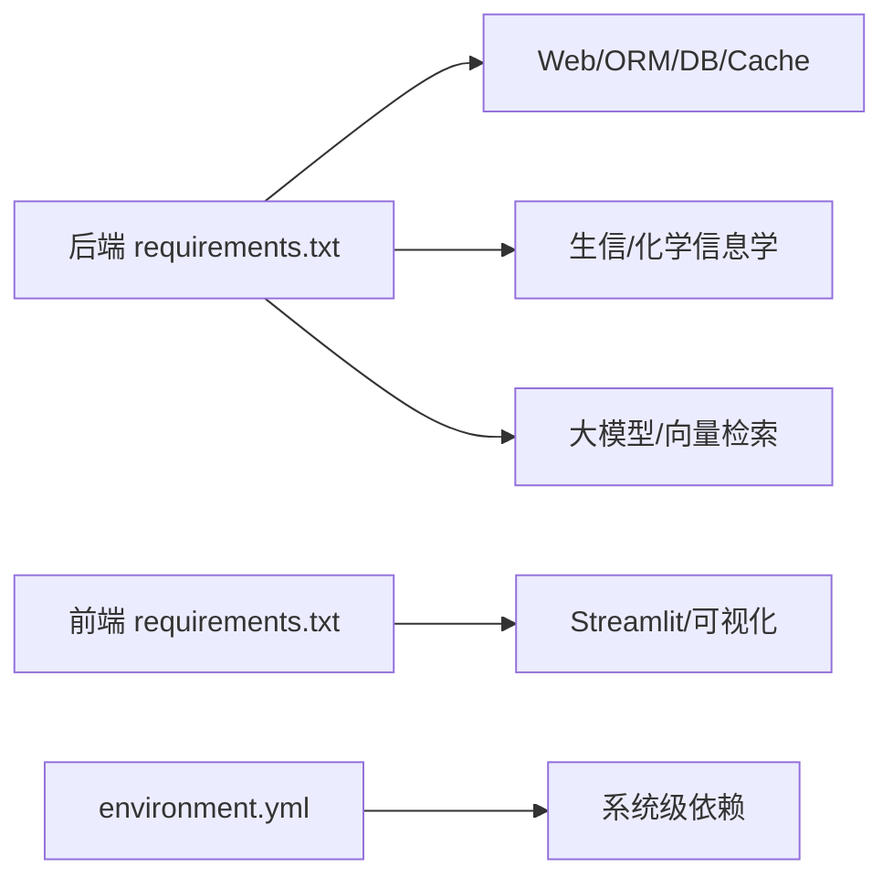

# 容器化部署

<cite>
**本文引用的文件**   
- [README.md](file://precision-drug-design/README.md)
- [DEPLOYMENT.md](file://precision-drug-design/docs/DEPLOYMENT.md)
- [pyproject.toml](file://precision-drug-design/pyproject.toml)
- [environment.yml](file://precision-drug-design/environment.yml)
- [backend/requirements.txt](file://precision-drug-design/backend/requirements.txt)
- [frontend/requirements.txt](file://precision-drug-design/frontend/requirements.txt)
- [backend/app/core/config.py](file://precision-drug-design/backend/app/core/config.py)
- [backend/app/main.py](file://precision-drug-design/backend/app/main.py)
- [backend/app/db/init_db.py](file://precision-drug-design/backend/app/db/init_db.py)
- [frontend/app.py](file://precision-drug-design/frontend/app.py)
</cite>

## 目录
1. [简介](#简介)
2. [项目结构](#项目结构)
3. [核心组件](#核心组件)
4. [架构总览](#架构总览)
5. [详细组件分析](#详细组件分析)
6. [依赖关系分析](#依赖关系分析)
7. [性能与镜像优化](#性能与镜像优化)
8. [编排与服务发现](#编排与服务发现)
9. [网络、数据卷与环境变量](#网络数据卷与环境变量)
10. [镜像推送与集群部署](#镜像推送与集群部署)
11. [滚动更新与回滚](#滚动更新与回滚)
12. [故障排查](#故障排查)
13. [结论](#结论)

## 简介
本指南面向 DevOps 团队，提供 AI 药物设计系统的标准化容器化部署方案。内容覆盖：
- Docker 镜像构建规范（含多阶段构建与体积优化）
- docker-compose 统一编排后端 API、前端界面、数据库、Redis、MinIO 等
- 容器间网络通信、数据卷挂载、环境变量传递机制
- 私有仓库推送、集群部署与滚动更新实践

## 项目结构
系统采用前后端分离与多服务架构：
- 后端：FastAPI + Uvicorn，依赖 PostgreSQL、Redis、对象存储（S3/MinIO）、向量库（Chroma）
- 前端：Streamlit Web 界面，通过 HTTP 调用后端 API
- 基础设施：PostgreSQL、Redis、MinIO、可选 LLM 网关与外部知识库

[本节为概念性说明，不直接分析具体文件]

## 核心组件
- 后端入口与中间件：创建 FastAPI 实例、注册中间件与路由、暴露健康检查与指标
- 配置中心：基于 pydantic-settings 的环境变量加载与校验
- 数据库初始化：建表与初始用户创建脚本
- 前端入口：Streamlit 主页面与导航

关键实现位置：
- 后端入口与中间件：[backend/app/main.py](file://precision-drug-design/backend/app/main.py)
- 配置加载：[backend/app/core/config.py](file://precision-drug-design/backend/app/core/config.py)
- 数据库初始化：[backend/app/db/init_db.py](file://precision-drug-design/backend/app/db/init_db.py)
- 前端入口：[frontend/app.py](file://precision-drug-design/frontend/app.py)

**章节来源**
- [backend/app/main.py:187-248](file://precision-drug-design/backend/app/main.py#L187-L248)
- [backend/app/core/config.py:21-144](file://precision-drug-design/backend/app/core/config.py#L21-L144)
- [backend/app/db/init_db.py:35-88](file://precision-drug-design/backend/app/db/init_db.py#L35-L88)
- [frontend/app.py:1-157](file://precision-drug-design/frontend/app.py#L1-L157)

## 架构总览
生产推荐架构包含反向代理、后端 API、前端 UI、数据库、缓存与对象存储。

[本节为概念性说明，不直接分析具体文件]

## 详细组件分析

### 后端应用与中间件
- 应用工厂：创建 FastAPI 实例、设置文档路径、注册中间件与异常处理器、挂载 v1 路由
- 信封中间件：注入请求 ID、响应耗时、统一 JSON 信封 meta.duration_ms
- CORS：按配置允许跨域并暴露追踪头

**图表来源**
- [backend/app/main.py:29-185](file://precision-drug-design/backend/app/main.py#L29-L185)
- [backend/app/main.py:187-248](file://precision-drug-design/backend/app/main.py#L187-L248)

**章节来源**
- [backend/app/main.py:187-248](file://precision-drug-design/backend/app/main.py#L187-L248)

### 配置与环境变量
- 使用 pydantic-settings 从 .env 或真实环境变量加载配置，支持类型校验与默认值
- 关键配置项包括数据库、Redis、对象存储、LLM、JWT、CORS、联邦学习等

**图表来源**
- [backend/app/core/config.py:112-144](file://precision-drug-design/backend/app/core/config.py#L112-L144)

**章节来源**
- [backend/app/core/config.py:21-144](file://precision-drug-design/backend/app/core/config.py#L21-L144)

### 数据库初始化流程
- 异步引擎创建所有表
- 同步会话创建初始 founder 用户
- 支持命令行参数或环境变量传入账号密码

**图表来源**
- [backend/app/db/init_db.py:35-88](file://precision-drug-design/backend/app/db/init_db.py#L35-L88)

**章节来源**
- [backend/app/db/init_db.py:35-88](file://precision-drug-design/backend/app/db/init_db.py#L35-L88)

### 前端入口与导航
- Streamlit 主入口负责侧边栏导航、登录状态与快速入口
- 通过 HTTP 客户端访问后端健康检查与业务接口

**章节来源**
- [frontend/app.py:1-157](file://precision-drug-design/frontend/app.py#L1-L157)

## 依赖关系分析
- 后端依赖：FastAPI、Uvicorn、SQLAlchemy、psycopg2、redis、chromadb、litellm、openai、anthropic、streamlit、rdkit、scanpy、deepchem 等
- 前端依赖：streamlit、httpx
- 系统级依赖：OpenJDK 17（Nextflow）、Node.js 20、Graphviz、Pandoc

**图表来源**
- [backend/requirements.txt:1-100](file://precision-drug-design/backend/requirements.txt#L1-L100)
- [frontend/requirements.txt:1-3](file://precision-drug-design/frontend/requirements.txt#L1-L3)
- [environment.yml:1-103](file://precision-drug-design/environment.yml#L1-L103)

**章节来源**
- [backend/requirements.txt:1-100](file://precision-drug-design/backend/requirements.txt#L1-L100)
- [frontend/requirements.txt:1-3](file://precision-drug-design/frontend/requirements.txt#L1-L3)
- [environment.yml:1-103](file://precision-drug-design/environment.yml#L1-L103)

## 性能与镜像优化
- 多阶段构建建议
  - 构建阶段：安装编译工具链与完整依赖，生成 wheel 缓存
  - 运行阶段：仅拷贝运行时所需二进制与依赖，剔除源码与构建缓存
- 基础镜像选择
  - 优先使用 slim 或 distroless 变体；对需要 C 扩展的库（如 rdkit、cyvcf2、pysam）建议使用 conda-forge/bioconda 预编译轮子或专用镜像
- 依赖分层与缓存
  - 将依赖安装与代码 COPY 分步进行，利用 Docker 层缓存加速重复构建
- 体积优化策略
  - 清理 pip/apt 缓存；合并 RUN 指令减少层数；移除测试与开发工具；使用 .dockerignore 排除无关文件
- 运行时优化
  - 使用 gunicorn + uvicorn workers 提升并发；合理设置 worker 数量与超时；启用连接池与缓存

参考命令与示例可参见部署文档中的 Docker 部分。

**章节来源**
- [DEPLOYMENT.md:171-202](file://precision-drug-design/docs/DEPLOYMENT.md#L171-L202)

## 编排与服务发现
- 推荐使用 docker-compose 统一管理以下服务：
  - 后端 API（FastAPI/Uvicorn）
  - 前端界面（Streamlit）
  - 数据库（PostgreSQL）
  - 缓存（Redis）
  - 对象存储（MinIO）
  - 向量库（Chroma，可选）
- 服务间通过 compose 自定义网络互通，使用服务名作为主机名
- 数据持久化通过命名卷或绑定挂载到宿主机目录
- 环境变量集中管理，支持 .env 文件与 secrets

注意：当前仓库未提供现成的 docker-compose.yml，可按上述原则自行编写并在本地验证。

[本节为通用编排指导，不直接分析具体文件]

## 网络、数据卷与环境变量
- 网络通信
  - 容器内通过 compose 网络以“服务名:端口”访问其他服务（例如后端访问 Redis 使用 redis:6379）
  - 对外暴露端口由宿主映射决定（如 8000:8000、8501:8501、9000:9000）
- 数据卷挂载
  - 数据库数据目录、对象存储数据目录、Chroma 持久化目录应挂载至宿主机或云盘，避免容器重建丢失
- 环境变量传递
  - 通过 --env-file 或 compose environment 注入
  - 后端通过 pydantic-settings 自动加载，优先级：真实环境变量 > .env > 默认值

**章节来源**
- [backend/app/core/config.py:128-133](file://precision-drug-design/backend/app/core/config.py#L128-L133)
- [DEPLOYMENT.md:252-277](file://precision-drug-design/docs/DEPLOYMENT.md#L252-L277)

## 镜像推送与集群部署
- 私有仓库推送
  - 构建镜像后打标签并推送到私有仓库（如 Harbor、ECR、ACR），在 CI/CD 中自动化执行
- 集群部署
  - Kubernetes：定义 Deployment、Service、Ingress、ConfigMap/Secret、PersistentVolumeClaim
  - 资源限制：为 CPU/内存设置 requests/limits，确保稳定运行
  - 健康检查：使用 liveness/readiness 探针对接后端健康端点
- 版本管理
  - 使用语义化版本号与 Git tag 关联镜像标签，便于回滚与审计

[本节为通用实践指导，不直接分析具体文件]

## 滚动更新与回滚
- 滚动更新
  - 逐步替换旧 Pod，保持服务可用；配合 readiness 探针确保新实例就绪后再切流
- 灰度发布
  - 通过 Ingress 权重或 Service 拆分流量，小比例放量观察指标
- 回滚策略
  - 保留历史版本镜像与配置快照；一键回滚到上一个稳定版本
- 蓝绿部署
  - 并行两套环境，切换 DNS/Ingress 实现零停机发布

[本节为通用实践指导，不直接分析具体文件]

## 故障排查
- 数据库锁定
  - 现象：SQLite 提示 locked
  - 解决：确认无多进程占用，生产改用 PostgreSQL
- 端口冲突
  - 现象：Address already in use
  - 解决：查找并终止占用进程，或更换端口
- 模块导入失败
  - 现象：ModuleNotFoundError
  - 解决：确保 PYTHONPATH 正确或在镜像中安装依赖
- 健康检查失败
  - 现象：readiness/liveness 探针失败
  - 解决：检查后端日志、依赖服务连通性与配置

**章节来源**
- [DEPLOYMENT.md:280-322](file://precision-drug-design/docs/DEPLOYMENT.md#L280-L322)

## 结论
本指南提供了从镜像构建、编排到集群部署与滚动更新的端到端方案。结合项目的配置与依赖现状，建议：
- 采用多阶段构建与 slim 基础镜像，严格控制镜像体积
- 使用 docker-compose 完成本地一体化编排，再迁移至 K8s
- 通过环境变量与 ConfigMap/Secret 管理敏感配置
- 建立完善的健康检查、监控与日志采集体系，保障稳定性与可观测性

[本节为总结性内容，不直接分析具体文件]