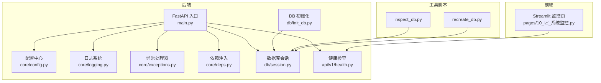
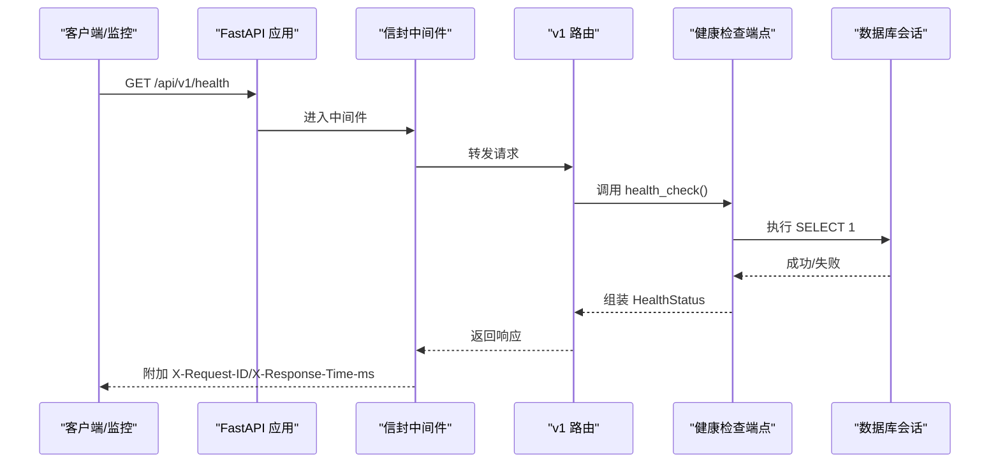
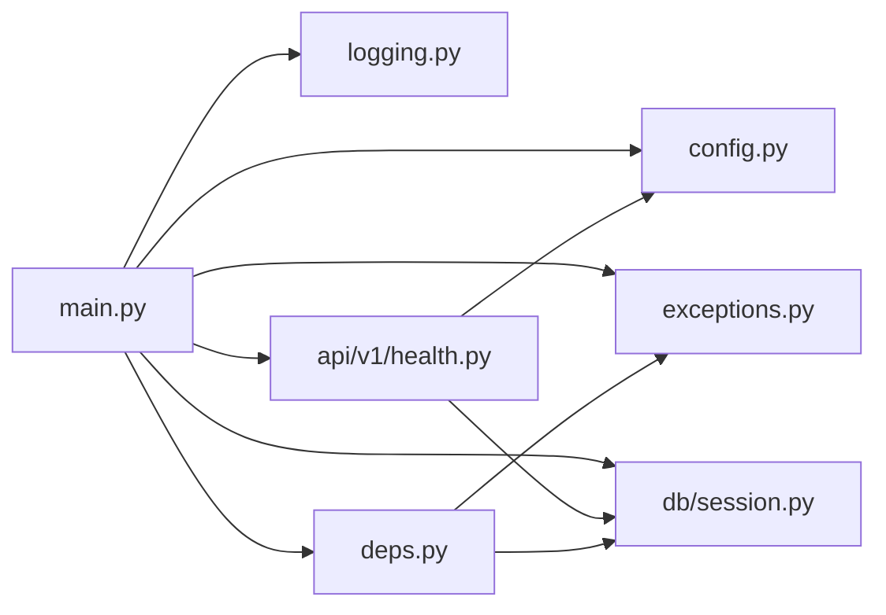

# 故障排查指南

<cite>
**本文引用的文件**   
- [backend/app/main.py](file://backend/app/main.py)
- [backend/app/core/config.py](file://backend/app/core/config.py)
- [backend/app/core/logging.py](file://backend/app/core/logging.py)
- [backend/app/api/v1/health.py](file://backend/app/api/v1/health.py)
- [backend/app/db/init_db.py](file://backend/app/db/init_db.py)
- [backend/app/db/session.py](file://backend/app/db/session.py)
- [backend/app/core/exceptions.py](file://backend/app/core/exceptions.py)
- [backend/app/core/deps.py](file://backend/app/core/deps.py)
- [frontend/pages/10_📈_系统监控.py](file://frontend/pages/10_📈_系统监控.py)
- [scripts/inspect_db.py](file://scripts/inspect_db.py)
- [scripts/recreate_db.py](file://scripts/recreate_db.py)
- [README.md](file://README.md)
</cite>

## 目录
1. [简介](#简介)
2. [项目结构](#项目结构)
3. [核心组件](#核心组件)
4. [架构总览](#架构总览)
5. [详细组件分析](#详细组件分析)
6. [依赖关系分析](#依赖关系分析)
7. [性能与容量规划](#性能与容量规划)
8. [常见问题与解决方案](#常见问题与解决方案)
9. [日志收集与分析](#日志收集与分析)
10. [健康检查与监控指标](#健康检查与监控指标)
11. [高级诊断方法](#高级诊断方法)
12. [告警处理流程](#告警处理流程)
13. [结论](#结论)
14. [附录：常用命令与路径](#附录常用命令与路径)

## 简介
本指南面向运维与研发人员，聚焦AI药物设计系统的部署与运行期问题定位。内容覆盖数据库连接失败、端口冲突、权限错误、内存不足等典型问题；提供应用、数据库、系统日志的采集与分析方法；包含健康检查接口使用、监控指标解读、告警处理流程；并给出性能瓶颈定位、内存泄漏检测、CPU占用分析等高级排查手段。

## 项目结构
后端采用 FastAPI + SQLAlchemy（异步）+ Loguru 日志体系；前端为 Streamlit 管理界面；配置通过 pydantic-settings 从环境变量或 .env 加载；健康检查端点暴露服务与依赖状态；数据库初始化脚本支持 SQLite 与 PostgreSQL。

图表来源
- [backend/app/main.py:187-248](file://backend/app/main.py#L187-L248)
- [backend/app/core/config.py:21-144](file://backend/app/core/config.py#L21-L144)
- [backend/app/core/logging.py:20-75](file://backend/app/core/logging.py#L20-L75)
- [backend/app/core/exceptions.py:131-179](file://backend/app/core/exceptions.py#L131-L179)
- [backend/app/core/deps.py:91-129](file://backend/app/core/deps.py#L91-L129)
- [backend/app/db/session.py:48-128](file://backend/app/db/session.py#L48-L128)
- [backend/app/api/v1/health.py:53-102](file://backend/app/api/v1/health.py#L53-L102)
- [backend/app/db/init_db.py:35-88](file://backend/app/db/init_db.py#L35-L88)
- [frontend/pages/10_📈_系统监控.py:29-47](file://frontend/pages/10_📈_系统监控.py#L29-L47)
- [scripts/inspect_db.py:1-79](file://scripts/inspect_db.py#L1-L79)
- [scripts/recreate_db.py:1-68](file://scripts/recreate_db.py#L1-L68)

章节来源
- [README.md:190-235](file://README.md#L190-L235)

## 核心组件
- 应用工厂与中间件：创建 FastAPI 实例、注册统一信封响应中间件、CORS、全局异常处理器、挂载 v1 路由与健康端点。
- 配置中心：集中读取环境变量与 .env，提供生产/开发环境判断、CORS 源列表解析等。
- 日志系统：按环境输出彩色控制台或结构化 JSON，自动轮转与归档，错误单独归档。
- 异常体系：业务异常基类与具体异常类型，全局处理器将异常转换为统一信封响应。
- 依赖注入：请求 ID、分页参数、当前用户对象（含短 TTL 缓存）、数据库会话。
- 数据库会话：同步/异步引擎与 Session 工厂，SQLite 与非 SQLite 差异化池化参数。
- 健康检查：返回服务版本与各依赖组件状态，带短时内存缓存避免频繁探测。
- 数据库初始化：建表与创建初始创始人账号。

章节来源
- [backend/app/main.py:187-248](file://backend/app/main.py#L187-L248)
- [backend/app/core/config.py:21-144](file://backend/app/core/config.py#L21-L144)
- [backend/app/core/logging.py:20-75](file://backend/app/core/logging.py#L20-L75)
- [backend/app/core/exceptions.py:19-179](file://backend/app/core/exceptions.py#L19-L179)
- [backend/app/core/deps.py:91-129](file://backend/app/core/deps.py#L91-L129)
- [backend/app/db/session.py:48-128](file://backend/app/db/session.py#L48-L128)
- [backend/app/api/v1/health.py:53-102](file://backend/app/api/v1/health.py#L53-L102)
- [backend/app/db/init_db.py:35-88](file://backend/app/db/init_db.py#L35-L88)

## 架构总览
下图展示一次健康检查请求的关键调用链与数据流，体现中间件、依赖注入、数据库会话与健康检查逻辑的协作。

图表来源
- [backend/app/main.py:215-233](file://backend/app/main.py#L215-L233)
- [backend/app/api/v1/health.py:53-102](file://backend/app/api/v1/health.py#L53-L102)
- [backend/app/db/session.py:94-128](file://backend/app/db/session.py#L94-L128)

## 详细组件分析

### 健康检查与健康态判定
- 功能要点
  - 返回服务版本与各依赖状态（Postgres、Redis、Chroma）。
  - 任一依赖 unhealthy 时整体状态为 degraded。
  - 内置 5 秒内存缓存，降低对数据库的探测压力。
- 关键实现位置
  - 健康端点定义与缓存逻辑：[backend/app/api/v1/health.py:53-102](file://backend/app/api/v1/health.py#L53-L102)
  - 数据库连通性探测：[backend/app/api/v1/health.py:27-33](file://backend/app/api/v1/health.py#L27-L33)
  - Redis/Chroma 存在性探测：[backend/app/api/v1/health.py:35-51](file://backend/app/api/v1/health.py#L35-L51)
- 排障建议
  - 若整体状态 degraded，优先查看 dependencies 中 unhealthy 的组件。
  - 关注健康检查频率，避免高频探测导致数据库抖动。

章节来源
- [backend/app/api/v1/health.py:27-102](file://backend/app/api/v1/health.py#L27-L102)

### 配置与环境变量
- 功能要点
  - 所有配置项来自环境变量或 .env，支持默认值与类型校验。
  - 提供 is_production 判断、cors_origin_list 解析等便捷属性。
- 关键实现位置
  - Settings 模型与字段：[backend/app/core/config.py:21-133](file://backend/app/core/config.py#L21-L133)
  - get_settings 单例：[backend/app/core/config.py:136-144](file://backend/app/core/config.py#L136-L144)
- 排障建议
  - 确认 .env 编码为 UTF-8，键名大小写不敏感但需与代码一致。
  - 生产环境 app_env=production 会切换日志格式与行为。

章节来源
- [backend/app/core/config.py:21-144](file://backend/app/core/config.py#L21-L144)

### 日志系统
- 功能要点
  - 开发环境彩色控制台，生产环境结构化 JSON。
  - 日志文件按大小/时间轮转，错误日志独立归档。
- 关键实现位置
  - setup_logging 初始化：[backend/app/core/logging.py:20-75](file://backend/app/core/logging.py#L20-L75)
  - 模块级 logger 别名：[backend/app/core/logging.py:91-93](file://backend/app/core/logging.py#L91-L93)
- 排障建议
  - 检查 logs 目录是否存在且可写。
  - 生产环境建议使用 stdout JSON 配合日志采集器。

章节来源
- [backend/app/core/logging.py:20-75](file://backend/app/core/logging.py#L20-L75)

### 异常体系与统一响应
- 功能要点
  - 业务异常继承 AppException，携带 code、message、details。
  - 全局处理器将异常转为统一信封响应，附带 request_id。
- 关键实现位置
  - 异常基类与具体异常：[backend/app/core/exceptions.py:19-95](file://backend/app/core/exceptions.py#L19-L95)
  - 全局处理器注册：[backend/app/core/exceptions.py:131-179](file://backend/app/core/exceptions.py#L131-L179)
- 排障建议
  - 根据 error.code 快速分类问题（如 VALIDATION_ERROR、UPSTREAM_ERROR）。
  - 结合 meta.request_id 在日志中追踪请求链路。

章节来源
- [backend/app/core/exceptions.py:19-179](file://backend/app/core/exceptions.py#L19-L179)

### 依赖注入与请求追踪
- 功能要点
  - 请求 ID：优先使用客户端传入的 X-Request-ID，否则生成 UUID。
  - 当前用户对象：短 TTL 内存缓存，减少数据库查询。
  - 分页参数：page/page_size 校验与转换。
- 关键实现位置
  - get_request_id：[backend/app/core/deps.py:91-99](file://backend/app/core/deps.py#L91-L99)
  - get_current_user 与缓存：[backend/app/core/deps.py:101-124](file://backend/app/core/deps.py#L101-L124)
- 排障建议
  - 若出现认证相关错误，检查 token 是否有效、用户是否被禁用。
  - 使用 X-Request-ID 跨层关联日志。

章节来源
- [backend/app/core/deps.py:91-129](file://backend/app/core/deps.py#L91-L129)

### 数据库会话与连接池
- 功能要点
  - 区分 SQLite 与非 SQLite 的引擎与池化参数。
  - 提供异步/同步会话工厂与 FastAPI 依赖注入。
- 关键实现位置
  - 引擎与池化参数：[backend/app/db/session.py:48-81](file://backend/app/db/session.py#L48-L81)
  - 会话工厂与依赖：[backend/app/db/session.py:82-128](file://backend/app/db/session.py#L82-L128)
- 排障建议
  - 非 SQLite 场景下，合理设置 pool_size/max_overflow 以应对并发。
  - 使用 pool_pre_ping 提升连接健壮性。

章节来源
- [backend/app/db/session.py:48-128](file://backend/app/db/session.py#L48-L128)

### 数据库初始化与重建
- 功能要点
  - 创建所有表与初始 founder 用户。
  - 提供同步/异步两种初始化方式。
- 关键实现位置
  - 主流程与建表：[backend/app/db/init_db.py:35-88](file://backend/app/db/init_db.py#L35-L88)
  - 临时重建脚本：[scripts/recreate_db.py:1-68](file://scripts/recreate_db.py#L1-L68)
  - 检查与重建辅助：[scripts/inspect_db.py:1-79](file://scripts/inspect_db.py#L1-L79)
- 排障建议
  - 首次部署务必执行初始化，确保 users 表与 founder 账号存在。
  - 本地开发可使用 SQLite，生产建议使用 PostgreSQL。

章节来源
- [backend/app/db/init_db.py:35-88](file://backend/app/db/init_db.py#L35-L88)
- [scripts/recreate_db.py:1-68](file://scripts/recreate_db.py#L1-L68)
- [scripts/inspect_db.py:1-79](file://scripts/inspect_db.py#L1-L79)

### 前端监控页面
- 功能要点
  - 拉取健康检查与 LLM 成本统计，展示 API 概览。
  - 支持自动刷新。
- 关键实现位置
  - 健康检查渲染：[frontend/pages/10_📈_系统监控.py:29-47](file://frontend/pages/10_📈_系统监控.py#L29-L47)
- 排障建议
  - 若健康检查失败，检查后端服务是否启动、网络可达性与鉴权策略。

章节来源
- [frontend/pages/10_📈_系统监控.py:29-47](file://frontend/pages/10_📈_系统监控.py#L29-L47)

## 依赖关系分析
- 组件耦合
  - main.py 依赖 config、logging、exceptions、deps、session、health。
  - health.py 依赖 session 与 config。
  - deps.py 依赖 exceptions、security、session。
- 外部依赖
  - 数据库（PostgreSQL/SQLite）、Redis、Chroma、LLM 网关、对象存储等。
- 潜在风险
  - 健康检查缓存过短可能导致数据库抖动；过长则可能掩盖真实状态。
  - 用户缓存 TTL 较短，高并发下可能增加数据库压力。

图表来源
- [backend/app/main.py:187-248](file://backend/app/main.py#L187-L248)
- [backend/app/api/v1/health.py:53-102](file://backend/app/api/v1/health.py#L53-L102)
- [backend/app/core/deps.py:91-129](file://backend/app/core/deps.py#L91-L129)
- [backend/app/db/session.py:48-128](file://backend/app/db/session.py#L48-L128)

## 性能与容量规划
- 数据库连接池
  - 非 SQLite 场景下，依据并发量调整 pool_size 与 max_overflow。
  - 开启 pool_pre_ping 提升连接可用性。
- 健康检查缓存
  - 合理设置 TTL，避免频繁探测造成数据库压力。
- 用户缓存
  - 短 TTL 可减少重复查询，但过高并发仍需评估数据库负载。
- 日志写入
  - 生产环境建议 stdout JSON 模式，由日志采集器落盘与轮转。

[本节为通用指导，无需源码引用]

## 常见问题与解决方案

- 数据库连接失败
  - 现象：健康检查 postgres 状态 unhealthy；启动时报连接错误。
  - 排查步骤
    - 检查 DATABASE_URL 是否正确，驱动后缀与主机/端口/凭据无误。
    - 确认数据库服务已启动并可访问。
    - 验证连接池参数是否合理（pool_size/max_overflow）。
  - 参考实现
    - 健康检查探测：[backend/app/api/v1/health.py:27-33](file://backend/app/api/v1/health.py#L27-L33)
    - 会话与池化参数：[backend/app/db/session.py:48-81](file://backend/app/db/session.py#L48-L81)
  - 解决建议
    - 修正 .env 中的 database_url；必要时重启服务使配置生效。
    - 调整池化参数后观察连接复用情况。

- 端口冲突
  - 现象：启动失败，提示端口已被占用。
  - 排查步骤
    - 检查 app_port 配置是否与期望一致。
    - 使用系统命令查找占用端口的进程。
  - 参考实现
    - 端口配置项：[backend/app/core/config.py:34](file://backend/app/core/config.py#L34)
  - 解决建议
    - 修改 app_port 或释放占用端口后重启。

- 权限错误
  - 现象：登录失败、资源访问 401/403。
  - 排查步骤
    - 确认已执行数据库初始化并创建 founder 账号。
    - 检查 JWT 密钥与算法配置。
    - 查看异常码 UNAUTHORIZED/FORBIDDEN。
  - 参考实现
    - 初始化脚本：[backend/app/db/init_db.py:42-62](file://backend/app/db/init_db.py#L42-L62)
    - 异常定义：[backend/app/core/exceptions.py:57-65](file://backend/app/core/exceptions.py#L57-L65)
  - 解决建议
    - 重新执行初始化；核对 .env 中 jwt_secret_key/jwt_algorithm。

- 内存不足
  - 现象：进程 OOM、任务中断。
  - 排查步骤
    - 观察健康检查与日志中的耗时与错误。
    - 检查大对象处理（分子计算、生信分析）是否触发峰值。
  - 参考实现
    - 日志输出：[backend/app/core/logging.py:54-75](file://backend/app/core/logging.py#L54-L75)
  - 解决建议
    - 限制并发与批处理大小；升级容器/主机内存；启用外部向量库或对象存储。

- 外部 API 超时/不可用
  - 现象：UPSTREAM_ERROR 或上游调用超时。
  - 排查步骤
    - 检查 mygene/chembl/pubmed 等基础 URL 与网络连通性。
    - 查看各客户端超时配置。
  - 参考实现
    - 上游异常定义：[backend/app/core/exceptions.py:89-94](file://backend/app/core/exceptions.py#L89-L94)
  - 解决建议
    - 调整超时与重试策略；配置代理或内网镜像。

章节来源
- [backend/app/api/v1/health.py:27-33](file://backend/app/api/v1/health.py#L27-L33)
- [backend/app/db/session.py:48-81](file://backend/app/db/session.py#L48-L81)
- [backend/app/core/config.py:34](file://backend/app/core/config.py#L34)
- [backend/app/db/init_db.py:42-62](file://backend/app/db/init_db.py#L42-L62)
- [backend/app/core/exceptions.py:57-65](file://backend/app/core/exceptions.py#L57-L65)
- [backend/app/core/logging.py:54-75](file://backend/app/core/logging.py#L54-L75)
- [backend/app/core/exceptions.py:89-94](file://backend/app/core/exceptions.py#L89-L94)

## 日志收集与分析
- 日志位置与格式
  - 应用日志：logs/app_{日期}.log（按大小/时间轮转，保留 30 天）。
  - 错误日志：logs/error_{日期}.log（仅 ERROR，保留 90 天）。
  - 生产环境 stdout JSON 便于采集器抓取。
- 关键字段
  - request_id：用于跨层关联。
  - duration_ms：响应耗时，便于识别慢请求。
- 分析方法
  - 基于 request_id 过滤同一请求的全链路日志。
  - 关注 ERROR 级别与 UPSTREAM_ERROR/INTERNAL_ERROR 等错误码。
- 参考实现
  - 日志初始化与轮转：[backend/app/core/logging.py:54-75](file://backend/app/core/logging.py#L54-L75)
  - 中间件记录耗时与请求头：[backend/app/main.py:172-184](file://backend/app/main.py#L172-L184)

章节来源
- [backend/app/core/logging.py:54-75](file://backend/app/core/logging.py#L54-L75)
- [backend/app/main.py:172-184](file://backend/app/main.py#L172-L184)

## 健康检查与监控指标
- 健康检查接口
  - 路径：GET /api/v1/health
  - 返回字段：status、version、dependencies（postgres/redis/chroma）
  - 前端展示：系统监控页面直接调用该接口。
- 指标与观测
  - 响应头 X-Response-Time-ms：单次请求耗时。
  - 响应体 meta.duration_ms：统一信封注入的耗时。
- 参考实现
  - 健康端点：[backend/app/api/v1/health.py:53-102](file://backend/app/api/v1/health.py#L53-L102)
  - 中间件注入耗时与请求头：[backend/app/main.py:130-170](file://backend/app/main.py#L130-L170)
  - 前端监控页：[frontend/pages/10_📈_系统监控.py:29-47](file://frontend/pages/10_📈_系统监控.py#L29-L47)

章节来源
- [backend/app/api/v1/health.py:53-102](file://backend/app/api/v1/health.py#L53-L102)
- [backend/app/main.py:130-170](file://backend/app/main.py#L130-L170)
- [frontend/pages/10_📈_系统监控.py:29-47](file://frontend/pages/10_📈_系统监控.py#L29-L47)

## 高级诊断方法
- 性能瓶颈定位
  - 使用 X-Response-Time-ms 与 meta.duration_ms 识别慢端点。
  - 结合数据库慢查询日志与连接池命中率分析。
- 内存泄漏检测
  - 观察进程 RSS 增长趋势；定位长时间驻留的大对象（如 RAG 记忆文档、批量结果）。
  - 使用 Python 内存分析工具（如 tracemalloc、memory_profiler）进行采样。
- CPU 占用分析
  - 使用 perf/py-spy/cProfile 定位热点函数。
  - 针对分子计算/生信分析任务进行并行度与批大小调优。
- 外部依赖稳定性
  - 对上游 API 增加重试与熔断策略，避免雪崩。
  - 健康检查缓存 TTL 不宜过短，避免放大下游压力。

[本节为通用指导，无需源码引用]

## 告警处理流程
- 触发条件
  - 健康检查 status=degraded 或某依赖 unhealthy。
  - 错误日志中出现 INTERNAL_ERROR/UPSTREAM_ERROR 等。
- 处理步骤
  - 收集 request_id 与对应时间段的应用日志。
  - 检查数据库连接池与外部 API 状态。
  - 回滚最近变更，必要时扩容或降级。
- 闭环
  - 记录根因分析与修复措施，更新监控阈值与预案。

[本节为通用指导，无需源码引用]

## 结论
通过统一的配置、日志、异常与健康检查机制，系统具备较好的可观测性与可维护性。运维人员应重点关注健康检查状态、错误日志与请求耗时，结合连接池与外部依赖稳定性进行持续优化。

[本节为总结，无需源码引用]

## 附录：常用命令与路径
- 启动后端
  - uvicorn backend.app.main:app --host 0.0.0.0 --port 8000
- 初始化数据库
  - python -m backend.app.db.init_db founder@pdd.dev password123
- 重建数据库与用户
  - python scripts/recreate_db.py
- 检查 SQLite 内容与重建
  - python scripts/inspect_db.py
- 访问 API 文档
  - http://localhost:8000/docs
- 访问健康检查
  - GET http://localhost:8000/api/v1/health

章节来源
- [README.md:167-181](file://README.md#L167-L181)
- [backend/app/db/init_db.py:64-88](file://backend/app/db/init_db.py#L64-L88)
- [scripts/recreate_db.py:1-68](file://scripts/recreate_db.py#L1-L68)
- [scripts/inspect_db.py:1-79](file://scripts/inspect_db.py#L1-L79)