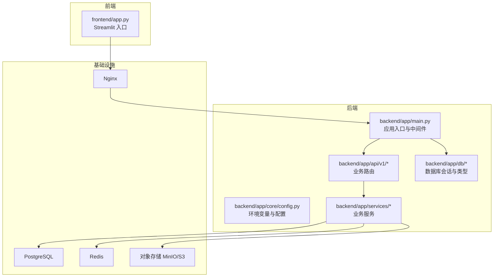
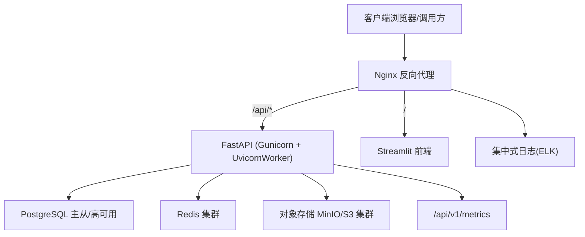
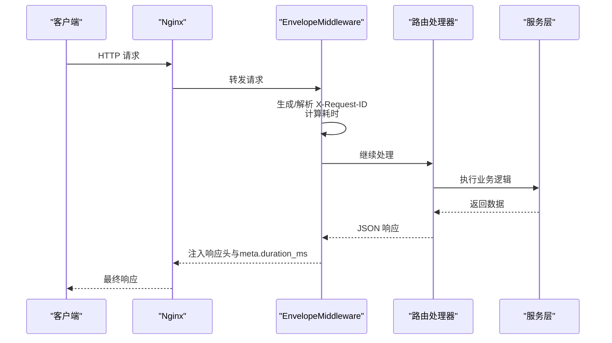
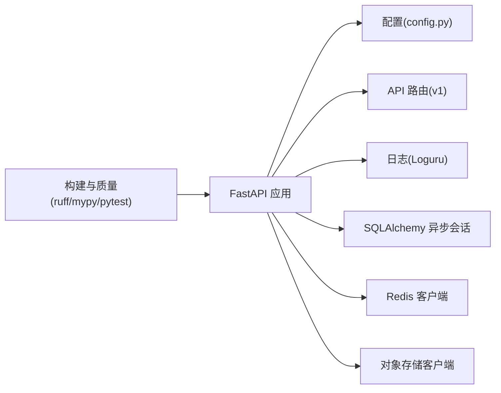

# 生产环境部署

<cite>
**本文引用的文件**   
- [README.md](file://precision-drug-design/README.md)
- [DEPLOYMENT.md](file://precision-drug-design/docs/DEPLOYMENT.md)
- [main.py](file://precision-drug-design/backend/app/main.py)
- [config.py](file://precision-drug-design/backend/app/core/config.py)
- [pyproject.toml](file://precision-drug-design/pyproject.toml)
</cite>

## 目录
1. [简介](#简介)
2. [项目结构](#项目结构)
3. [核心组件](#核心组件)
4. [架构总览](#架构总览)
5. [详细组件分析](#详细组件分析)
6. [依赖关系分析](#依赖关系分析)
7. [性能与容量规划](#性能与容量规划)
8. [安全加固与证书配置](#安全加固与证书配置)
9. [监控与告警（Prometheus + Grafana）](#监控与告警prometheus--grafana)
10. [日志收集与分析（ELK Stack）](#日志收集与分析elk-stack)
11. [数据库高可用（PostgreSQL）](#数据库高可用postgresql)
12. [缓存集群（Redis）](#缓存集群redis)
13. [对象存储集群（MinIO/S3 兼容）](#对象存储集群minios3-兼容)
14. [反向代理与负载均衡（Nginx）](#反向代理与负载均衡nginx)
15. [进程管理与启动脚本（Gunicorn/Uvicorn）](#进程管理与启动脚本gunicornuvicorn)
16. [故障排查指南](#故障排查指南)
17. [结论](#结论)

## 简介
本指南面向运维工程师，提供 AI 药物设计系统在生产环境的完整部署与运维方案。内容涵盖推荐的生产架构、Nginx 反向代理与负载均衡、Gunicorn 进程管理、PostgreSQL 高可用、Redis 集群、对象存储集群、HTTPS 证书与安全加固、防火墙策略、监控告警（Prometheus + Grafana）、日志收集分析（ELK），以及关键性能调优参数。

## 项目结构
仓库采用前后端分离与模块化后端组织：
- 后端 FastAPI 应用位于 backend/app，包含 API、核心配置、数据库会话、模型、服务、工具等模块
- 前端 Streamlit 应用位于 frontend
- 文档与部署说明位于 docs
- 测试与脚本位于 tests 与 scripts

图表来源
- [main.py:187-247](file://precision-drug-design/backend/app/main.py#L187-L247)
- [config.py:21-143](file://precision-drug-design/backend/app/core/config.py#L21-L143)

章节来源
- [README.md:190-235](file://precision-drug-design/README.md#L190-L235)
- [DEPLOYMENT.md:206-248](file://precision-drug-design/docs/DEPLOYMENT.md#L206-L248)

## 核心组件
- 应用入口与中间件：统一信封响应、CORS、异常处理器、请求追踪头注入
- 配置中心：基于 pydantic-settings 的环境变量加载，支持多环境切换
- 数据库连接：异步 SQLAlchemy 会话，自动方言适配与连接池参数
- 指标暴露：内置 /api/v1/metrics 文本格式指标，便于 Prometheus 抓取
- 日志：Loguru 输出，生产环境 JSON 序列化到 stdout，便于 ELK 采集

章节来源
- [main.py:29-185](file://precision-drug-design/backend/app/main.py#L29-L185)
- [main.py:187-247](file://precision-drug-design/backend/app/main.py#L187-L247)
- [config.py:21-143](file://precision-drug-design/backend/app/core/config.py#L21-L143)
- [DEPLOYMENT.md:252-277](file://precision-drug-design/docs/DEPLOYMENT.md#L252-L277)

## 架构总览
推荐生产架构由 Nginx 作为统一入口，转发至后端 FastAPI 与前端 Streamlit；后端通过 Gunicorn + Uvicorn Worker 运行，连接 PostgreSQL、Redis 与对象存储。

图表来源
- [DEPLOYMENT.md:206-248](file://precision-drug-design/docs/DEPLOYMENT.md#L206-L248)
- [main.py:215-233](file://precision-drug-design/backend/app/main.py#L215-L233)

## 详细组件分析

### 应用入口与中间件
- 统一信封中间件：为所有 JSON 响应注入 X-Request-ID、X-Response-Time-ms，并在 meta.duration_ms 中记录耗时
- CORS：按配置允许跨域并暴露追踪头
- 异常处理：注册全局异常处理器，保证错误响应一致
- 路由挂载：将 v1 路由前缀挂载到 /api/v1

图表来源
- [main.py:29-185](file://precision-drug-design/backend/app/main.py#L29-L185)
- [main.py:215-233](file://precision-drug-design/backend/app/main.py#L215-L233)

章节来源
- [main.py:29-185](file://precision-drug-design/backend/app/main.py#L29-L185)
- [main.py:187-247](file://precision-drug-design/backend/app/main.py#L187-L247)

### 配置与环境变量
- 使用 pydantic-settings 加载 .env 与真实环境变量，优先级：真实环境变量 > .env > 默认值
- 关键字段包括数据库、Redis、对象存储、LLM、JWT、CORS、联邦学习、CDISC、数据处理等
- is_production 属性用于区分生产环境行为（如日志 JSON 序列化）

章节来源
- [config.py:21-143](file://precision-drug-design/backend/app/core/config.py#L21-L143)
- [DEPLOYMENT.md:252-277](file://precision-drug-design/docs/DEPLOYMENT.md#L252-L277)

### 数据库连接与会话
- 支持 PostgreSQL 与 SQLite 方言兼容，JSONB/INET 在 PG 下原生使用，SQLite 降级为通用类型
- 异步驱动自动选择（psycopg2 → asyncpg）
- 连接池参数：pool_pre_ping=True，pool_size=10，max_overflow=20（可按负载调整）

章节来源
- [DEPLOYMENT.md:91-98](file://precision-drug-design/docs/DEPLOYMENT.md#L91-L98)
- [DEPLOYMENT.md:72-89](file://precision-drug-design/docs/DEPLOYMENT.md#L72-L89)

### 指标与可观测性
- 内置 /api/v1/metrics 文本格式指标，包含 HTTP 请求总数、耗时直方图、LLM 成本累计、错误计数等
- 建议接入 prometheus_client 或 OpenTelemetry exporter 以增强指标丰富度

章节来源
- [DEPLOYMENT.md:278-281](file://precision-drug-design/docs/DEPLOYMENT.md#L278-L281)

## 依赖关系分析
- 后端依赖：FastAPI、Uvicorn、SQLAlchemy(async)、Loguru、Pydantic Settings
- 外部依赖：PostgreSQL、Redis、对象存储（MinIO/S3）、可选 LLM 网关
- 构建与质量：ruff、mypy、pytest、coverage

图表来源
- [pyproject.toml:1-106](file://precision-drug-design/pyproject.toml#L1-L106)
- [config.py:21-143](file://precision-drug-design/backend/app/core/config.py#L21-L143)

章节来源
- [pyproject.toml:1-106](file://precision-drug-design/pyproject.toml#L1-L106)

## 性能与容量规划
- 进程模型：Gunicorn + UvicornWorker，worker 数建议为 CPU 核数的 2-4 倍，结合 IO 密集型任务适当增加
- 超时与缓冲：根据业务接口设置合理的 worker timeout 与 Nginx proxy_read_timeout
- 数据库连接池：根据并发量调整 pool_size 与 max_overflow，开启 pool_pre_ping 提升健壮性
- Redis：启用持久化与内存淘汰策略，合理设置最大内存与过期键清理
- 对象存储：分桶按业务划分，启用版本控制与生命周期策略，配合 CDN 加速静态资源
- 日志：生产环境 JSON 输出到 stdout，避免本地磁盘写入影响性能

[本节为通用指导，不直接分析具体文件]

## 安全加固与证书配置
- HTTPS 证书：在 Nginx 配置 TLS 证书与密钥，强制 HTTPS，启用 HSTS、TLSv1.2+、禁用不安全套件
- 访问控制：仅开放必要端口（443/80），限制管理面 IP 白名单
- 认证与授权：JWT 签名密钥使用强随机字符串，设置合适的令牌有效期；最小权限原则分配 RBAC 角色
- CORS：严格限定允许的源与方法，生产环境关闭调试模式
- 敏感信息：使用环境变量或密钥管理服务注入，禁止硬编码
- 审计与合规：审计日志不可篡改，保留周期符合合规要求

[本节为通用指导，不直接分析具体文件]

## 监控与告警（Prometheus + Grafana）
- 指标抓取：Prometheus 定期抓取 /api/v1/metrics
- 告警规则：针对错误率、P95/P99 延迟、LLM 成本超阈值、健康检查失败等设置告警
- 可视化：Grafana 仪表盘展示系统健康、API 吞吐、延迟分布、错误分类、资源使用
- 扩展：引入 prometheus_client 或 OpenTelemetry 导出更丰富的业务指标

章节来源
- [DEPLOYMENT.md:278-281](file://precision-drug-design/docs/DEPLOYMENT.md#L278-L281)

## 日志收集与分析（ELK Stack）
- 采集：Filebeat/Fluent Bit 采集容器 stdout 与应用日志文件
- 传输：发送至 Kafka 或直接推送至 Elasticsearch
- 存储与索引：Elasticsearch 按天索引，设置保留策略与冷热分层
- 可视化：Kibana 提供查询、过滤、告警与报表能力
- 结构化：生产环境 JSON 日志便于字段提取与聚合分析

[本节为通用指导，不直接分析具体文件]

## 数据库高可用（PostgreSQL）
- 架构：主从复制 + 自动故障转移（Patroni/Repmgr），读写分离
- 连接：应用侧使用连接池与重试机制，开启 pool_pre_ping
- 备份：全量与增量备份策略，异地容灾与恢复演练
- 安全：网络隔离、最小权限账号、SSL 加密连接
- 容量：按 QPS 与数据增长规划实例规格与分区策略

[本节为通用指导，不直接分析具体文件]

## 缓存集群（Redis）
- 架构：哨兵或 Cluster 模式，多副本与持久化
- 配置：设置 maxmemory 与淘汰策略，合理 TTL，热点键保护
- 安全：绑定内网地址，启用密码与 ACL，限制命令集
- 监控：命中率、内存使用、慢查询、主从延迟

[本节为通用指导，不直接分析具体文件]

## 对象存储集群（MinIO/S3 兼容）
- 架构：纠删码多节点集群，跨机房部署
- 安全：IAM 用户与策略，最小权限，服务端加密
- 性能：分桶按业务划分，启用并行上传与分片
- 监控：容量、IOPS、错误率、请求延迟

[本节为通用指导，不直接分析具体文件]

## 反向代理与负载均衡（Nginx）
- 入口：统一监听 443，终止 TLS，HTTP 重定向到 HTTPS
- 路由：/api/* 转发至后端上游，/ 转发至前端
- 负载均衡：上游多实例轮询或加权，健康检查与故障剔除
- 安全：限流、IP 白名单、WAF 集成、请求体大小限制
- 性能：开启 gzip、keepalive、缓冲区优化

[本节为通用指导，不直接分析具体文件]

## 进程管理与启动脚本（Gunicorn/Uvicorn）
- 启动方式：Gunicorn 管理多个 UvicornWorker，绑定 0.0.0.0:8000，设置超时
- 守护：systemd 或容器编排（Kubernetes）管理进程生命周期与重启策略
- 水平扩展：多实例部署，Nginx 做负载均衡
- 优雅停机：SIGTERM 处理，确保正在处理的请求完成后再退出

章节来源
- [DEPLOYMENT.md:240-248](file://precision-drug-design/docs/DEPLOYMENT.md#L240-L248)

## 故障排查指南
- 数据库锁定：确认未有多进程占用 SQLite；生产使用 PostgreSQL
- 端口冲突：查找并终止占用进程，更换端口
- 模块导入失败：确保在项目根目录执行或设置 PYTHONPATH
- 健康检查：/api/v1/health 返回 healthy/degraded，定位 unhealthy 依赖
- 指标与日志：结合 /api/v1/metrics 与集中式日志快速定位问题

章节来源
- [DEPLOYMENT.md:280-322](file://precision-drug-design/docs/DEPLOYMENT.md#L280-L322)

## 结论
通过 Nginx 反向代理与负载均衡、Gunicorn + Uvicorn 进程管理、PostgreSQL 高可用、Redis 集群与对象存储集群的协同，配合 HTTPS 安全加固、监控告警与日志分析体系，AI 药物设计系统可在生产环境实现高可用、可扩展与可观测的运行目标。建议持续完善指标与告警规则，定期进行容量评估与应急演练，保障业务稳定与数据安全。