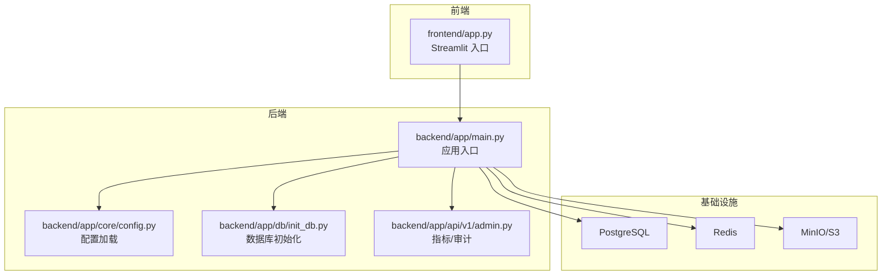
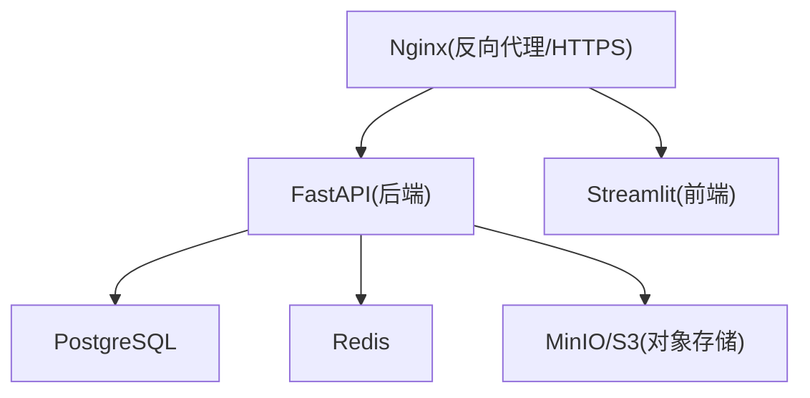
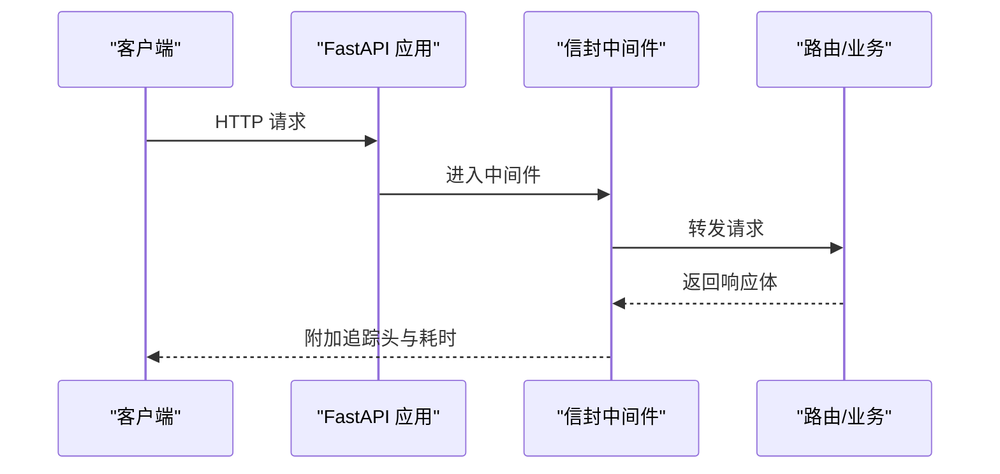
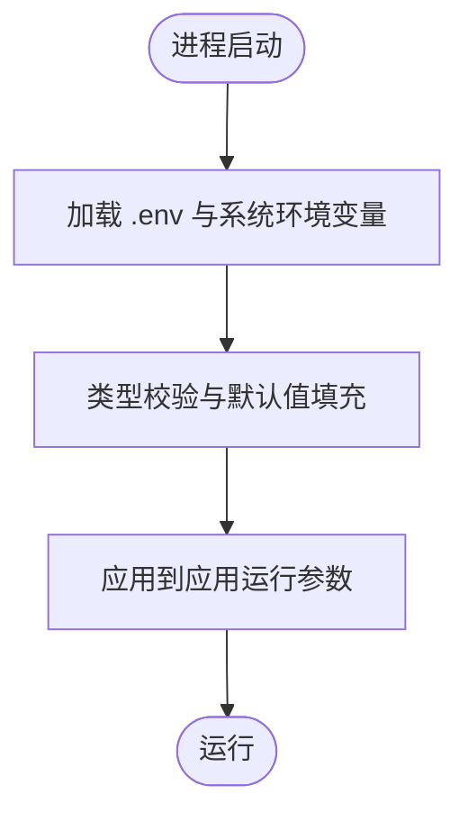
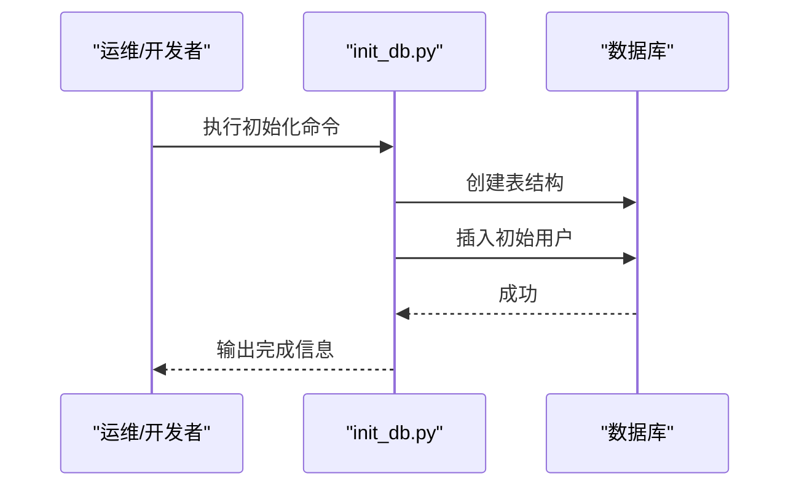
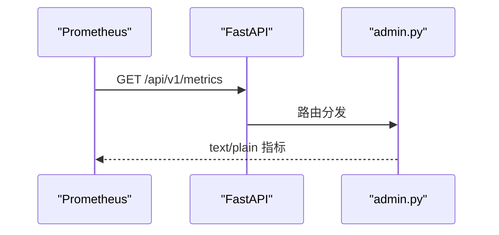
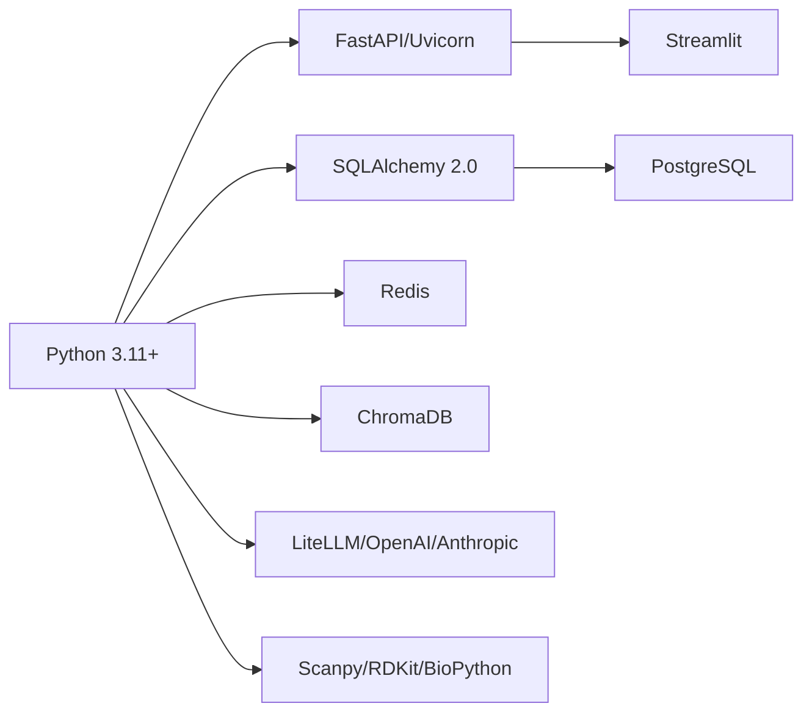

# 部署指南

<cite>
**本文引用的文件**   
- [README.md](file://precision-drug-design/README.md)
- [DEPLOYMENT.md](file://precision-drug-design/docs/DEPLOYMENT.md)
- [config.py](file://precision-drug-design/backend/app/core/config.py)
- [main.py](file://precision-drug-design/backend/app/main.py)
- [init_db.py](file://precision-drug-design/backend/app/db/init_db.py)
- [recreate_db.py](file://precision-drug-design/scripts/recreate_db.py)
- [requirements.txt](file://precision-drug-design/backend/requirements.txt)
- [environment.yml](file://precision-drug-design/environment.yml)
- [pyproject.toml](file://precision-drug-design/pyproject.toml)
- [admin.py](file://precision-drug-design/backend/app/api/v1/admin.py)
</cite>

## 目录
1. [简介](#简介)
2. [项目结构](#项目结构)
3. [核心组件](#核心组件)
4. [架构总览](#架构总览)
5. [详细组件分析](#详细组件分析)
6. [依赖关系分析](#依赖关系分析)
7. [性能与容量规划](#性能与容量规划)
8. [监控与告警](#监控与告警)
9. [日志收集与可观测性](#日志收集与可观测性)
10. [安全加固](#安全加固)
11. [故障排查](#故障排查)
12. [结论](#结论)
13. [附录：环境变量清单](#附录环境变量清单)

## 简介
本指南面向运维工程师与 DevOps 团队，提供 AI 药物设计系统的完整部署与运维指导。内容覆盖本地开发、生产环境、容器化（Docker）部署，以及 PostgreSQL、Redis、MinIO 等基础设施的配置；同时包含监控告警、日志收集、性能调优与安全加固的最佳实践。系统后端基于 FastAPI + Uvicorn/Gunicorn，前端为 Streamlit，数据层支持 SQLite（开发）与 PostgreSQL（生产），缓存使用 Redis，对象存储兼容 S3（推荐 MinIO）。

## 项目结构
仓库采用前后端分离与模块化分层组织：
- backend/app：FastAPI 应用、路由、服务、模型、配置、数据库会话与初始化脚本
- frontend：Streamlit 前端页面与客户端
- docs：部署与设计文档
- scripts：运维与测试脚本
- environment.yml / requirements.txt：依赖与环境定义
- pyproject.toml：工具链与测试配置

图表来源
- [main.py:187-248](file://precision-drug-design/backend/app/main.py#L187-L248)
- [config.py:21-144](file://precision-drug-design/backend/app/core/config.py#L21-L144)
- [init_db.py:35-88](file://precision-drug-design/backend/app/db/init_db.py#L35-L88)
- [admin.py:28-50](file://precision-drug-design/backend/app/api/v1/admin.py#L28-L50)

章节来源
- [README.md:190-235](file://precision-drug-design/README.md#L190-L235)
- [DEPLOYMENT.md:1-60](file://precision-drug-design/docs/DEPLOYMENT.md#L1-L60)

## 核心组件
- 应用入口与中间件：统一信封响应、CORS、请求追踪、异常处理、路由挂载
- 配置中心：基于 pydantic-settings 的环境变量加载与校验
- 数据库初始化：创建表结构与初始创始人账号
- 监控指标：Prometheus 格式指标端点
- 依赖管理：conda/pip 双通道依赖定义

章节来源
- [main.py:187-248](file://precision-drug-design/backend/app/main.py#L187-L248)
- [config.py:21-144](file://precision-drug-design/backend/app/core/config.py#L21-L144)
- [init_db.py:35-88](file://precision-drug-design/backend/app/db/init_db.py#L35-L88)
- [admin.py:28-50](file://precision-drug-design/backend/app/api/v1/admin.py#L28-L50)

## 架构总览
推荐的生产架构由反向代理、后端 API、前端 UI、数据库、缓存与对象存储组成。

图表来源
- [DEPLOYMENT.md:206-248](file://precision-drug-design/docs/DEPLOYMENT.md#L206-L248)

## 详细组件分析

### 应用启动与中间件
- 应用工厂 create_app 负责初始化日志、注册中间件（信封、CORS）、异常处理器与路由
- 信封中间件注入 X-Request-ID、X-Response-Time-ms，并在 JSON 响应中追加 duration_ms
- CORS 允许来源从配置读取，暴露追踪头便于链路追踪

图表来源
- [main.py:29-185](file://precision-drug-design/backend/app/main.py#L29-L185)
- [main.py:187-248](file://precision-drug-design/backend/app/main.py#L187-L248)

章节来源
- [main.py:187-248](file://precision-drug-design/backend/app/main.py#L187-L248)

### 配置与环境变量
- Settings 类集中声明所有配置项，默认值来自代码，优先级：真实环境变量 > .env 文件 > 默认值
- 关键配置包括数据库 URL、Redis、S3、LLM、JWT、CORS、联邦学习、CDISC、数据处理等
- 提供 is_production 属性与 cors_origin_list 便捷访问

图表来源
- [config.py:21-144](file://precision-drug-design/backend/app/core/config.py#L21-L144)

章节来源
- [config.py:21-144](file://precision-drug-design/backend/app/core/config.py#L21-L144)

### 数据库初始化流程
- 通过 init_db 脚本异步创建所有表，并插入初始 founder 用户
- 支持命令行传入邮箱与密码，或回退到默认值
- 同步脚本 recreate_db.py 用于快速重建 SQLite 示例库

图表来源
- [init_db.py:35-88](file://precision-drug-design/backend/app/db/init_db.py#L35-L88)
- [recreate_db.py:33-68](file://precision-drug-design/scripts/recreate_db.py#L33-L68)

章节来源
- [init_db.py:35-88](file://precision-drug-design/backend/app/db/init_db.py#L35-L88)
- [recreate_db.py:33-68](file://precision-drug-design/scripts/recreate_db.py#L33-L68)

### 监控指标端点
- GET /api/v1/metrics 返回 Prometheus 文本格式指标，包含 HTTP 请求总数、耗时直方图、LLM 成本与错误计数等
- 生产建议接入 prometheus_client 或 OpenTelemetry exporter 以采集更丰富指标

图表来源
- [admin.py:28-50](file://precision-drug-design/backend/app/api/v1/admin.py#L28-L50)

章节来源
- [admin.py:28-50](file://precision-drug-design/backend/app/api/v1/admin.py#L28-L50)

### 本地开发与生产环境差异
- 本地开发：SQLite + 可选 Redis + 本地 MinIO；快速启动，适合联调
- 生产环境：PostgreSQL + Redis + MinIO/S3；Gunicorn + Uvicorn Worker；Nginx 反代与 HTTPS

章节来源
- [DEPLOYMENT.md:62-140](file://precision-drug-design/docs/DEPLOYMENT.md#L62-L140)
- [DEPLOYMENT.md:206-248](file://precision-drug-design/docs/DEPLOYMENT.md#L206-L248)

## 依赖关系分析
- Python 版本要求 3.11+，生态库对 3.11 支持完善
- Web 框架：FastAPI + Uvicorn；生产可用 Gunicorn 多 worker
- 数据库驱动：psycopg2-binary、asyncpg；ORM：SQLAlchemy 2.0
- 缓存：redis-py
- 向量检索：chromadb
- LLM：LiteLLM、OpenAI、Anthropic、tiktoken
- 生信与化学：Scanpy、RDKit、BioPython、DeepChem、PyTorch
- 前端：Streamlit + Plotly/Altair

图表来源
- [environment.yml:1-103](file://precision-drug-design/environment.yml#L1-L103)
- [requirements.txt:1-100](file://precision-drug-design/backend/requirements.txt#L1-L100)

章节来源
- [environment.yml:1-103](file://precision-drug-design/environment.yml#L1-L103)
- [requirements.txt:1-100](file://precision-drug-design/backend/requirements.txt#L1-L100)

## 性能与容量规划
- 进程模型：生产建议使用 Gunicorn + UvicornWorker，worker 数按 CPU 核数与 I/O 特性调整
- 数据库连接池：根据并发量与查询复杂度设置 pool_size、max_overflow、pool_recycle
- 缓存策略：热点数据入 Redis，合理设置 TTL 与淘汰策略
- 对象存储：大文件上传/下载走 MinIO/S3，避免占用后端内存
- 计算密集型任务：结合 Nextflow 工作流与分布式资源调度，必要时引入 GPU 节点
- 日志级别：生产使用 INFO/WARNING，降低 IO 开销

章节来源
- [DEPLOYMENT.md:206-248](file://precision-drug-design/docs/DEPLOYMENT.md#L206-L248)

## 监控与告警
- 指标采集：GET /api/v1/metrics 提供基础指标，建议扩展为 prometheus_client 或 OpenTelemetry
- 可视化：Grafana 拉取 Prometheus 数据，构建仪表盘（QPS、延迟、错误率、LLM 成本）
- 告警规则：针对错误率、延迟 P95/P99、LLM 预算超支、外部依赖健康状态设置阈值告警
- 健康检查：/api/v1/health 可用于探针与负载均衡器健康判定

章节来源
- [admin.py:28-50](file://precision-drug-design/backend/app/api/v1/admin.py#L28-L50)
- [README.md:254-282](file://precision-drug-design/README.md#L254-L282)

## 日志收集与可观测性
- 应用日志：Loguru 输出结构化日志，建议输出到 stdout/stderr 并由容器编排平台收集
- 请求追踪：信封中间件注入 X-Request-ID，贯穿上游网关与下游服务
- 指标与日志关联：在日志中附带 request_id，便于问题定位
- 集中式日志：ELK/EFK 或 Loki + Promtail 方案，按服务与模块索引

章节来源
- [main.py:29-185](file://precision-drug-design/backend/app/main.py#L29-L185)

## 安全加固
- 认证与授权：JWT 令牌签发与刷新，RBAC 权限控制
- 密钥管理：JWT_SECRET_KEY、S3 密钥、LLM API Key 等通过环境变量或密钥管理服务注入
- 传输安全：Nginx 终止 TLS，启用强加密套件与 HSTS
- 最小权限：数据库账户仅授予必要权限，对象存储桶策略最小化
- 输入校验：Pydantic 严格校验，防止注入与越权
- 速率限制：对外部接口与敏感操作实施限流

章节来源
- [config.py:78-86](file://precision-drug-design/backend/app/core/config.py#L78-L86)
- [DEPLOYMENT.md:206-248](file://precision-drug-design/docs/DEPLOYMENT.md#L206-L248)

## 故障排查
- 数据库锁定（SQLite）：确保无其他进程占用数据文件，生产切换至 PostgreSQL
- 端口冲突：查找并释放占用端口，或修改监听端口
- 模块导入失败：确认在项目根目录执行，或设置 PYTHONPATH
- 外部依赖不可用：检查 Redis、MinIO、LLM 提供商连通性与鉴权

章节来源
- [DEPLOYMENT.md:280-322](file://precision-drug-design/docs/DEPLOYMENT.md#L280-L322)

## 结论
通过合理的容器化编排、环境变量管理与基础设施选型，AI 药物设计系统可在本地与生产环境稳定运行。配合完善的监控、日志与安全防护，可有效支撑研发协作与大规模数据分析需求。

## 附录：环境变量清单
以下为常用环境变量及其说明（部分字段来源于配置类与部署文档）：
- APP_NAME：应用名称
- APP_ENV：环境标识（development/staging/production）
- APP_DEBUG：调试模式开关
- APP_HOST：监听地址
- APP_PORT：监听端口
- APP_LOG_LEVEL：日志级别
- DATABASE_URL：数据库连接字符串（SQLite/PostgreSQL）
- DATABASE_ECHO：是否打印 SQL 语句
- REDIS_URL：Redis 连接地址
- S3_ENDPOINT：对象存储端点
- S3_ACCESS_KEY：访问密钥
- S3_SECRET_KEY：密钥
- S3_BUCKET：桶名
- CHROMA_PERSIST_DIR：向量库持久化目录
- OPENAI_API_KEY：OpenAI 密钥
- ANTHROPIC_API_KEY：Anthropic 密钥
- LLM_DEFAULT_MODEL：默认模型
- LLM_DEEP_MODEL：深度分析模型
- JWT_SECRET_KEY：JWT 签名密钥
- JWT_ALGORITHM：算法（HS256）
- CORS_ORIGINS：允许的跨域来源

章节来源
- [config.py:21-144](file://precision-drug-design/backend/app/core/config.py#L21-L144)
- [DEPLOYMENT.md:252-277](file://precision-drug-design/docs/DEPLOYMENT.md#L252-L277)