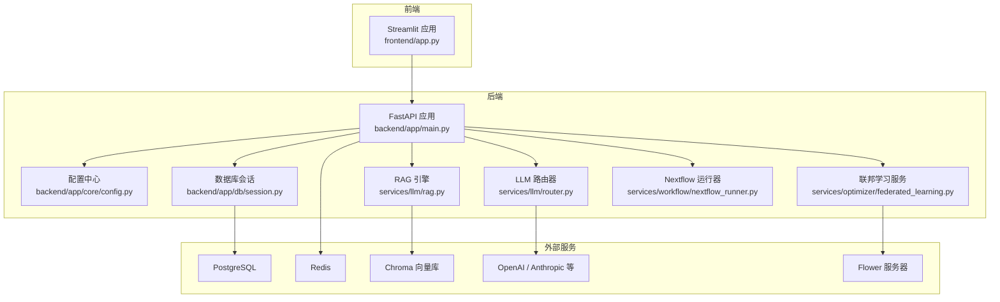
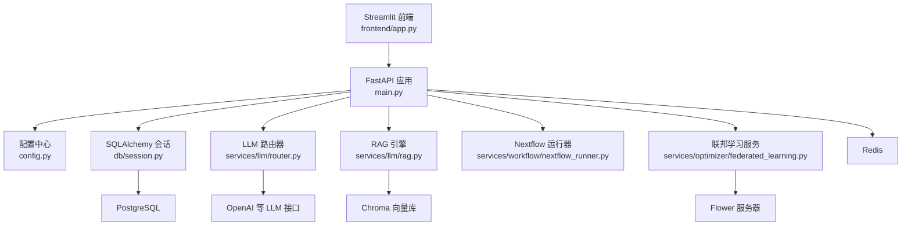
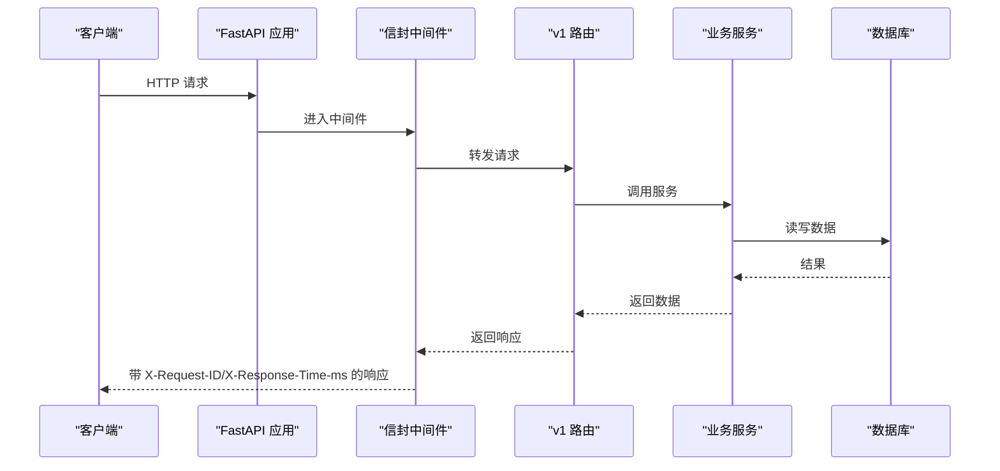
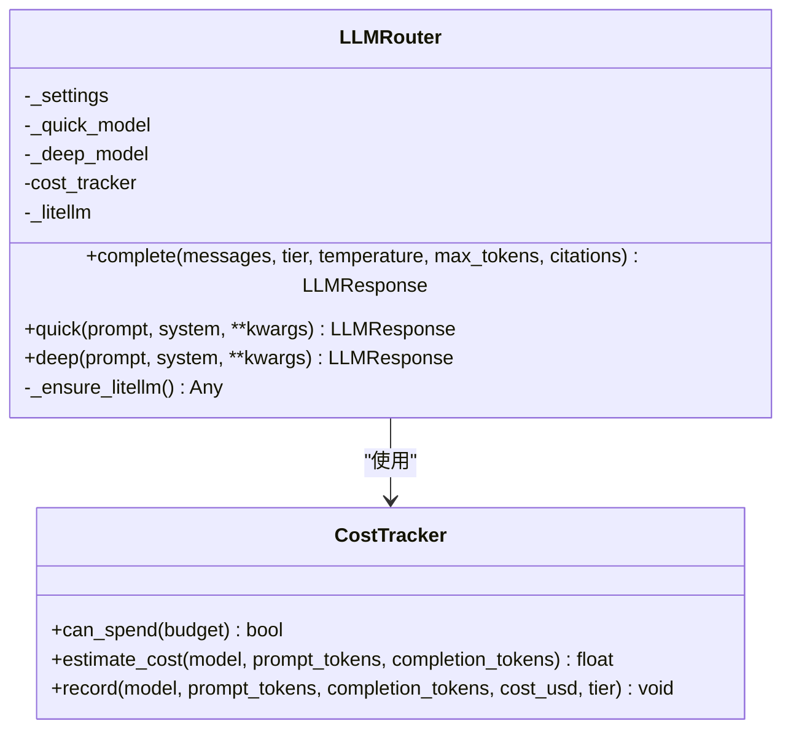
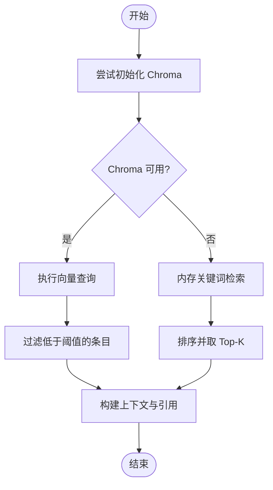
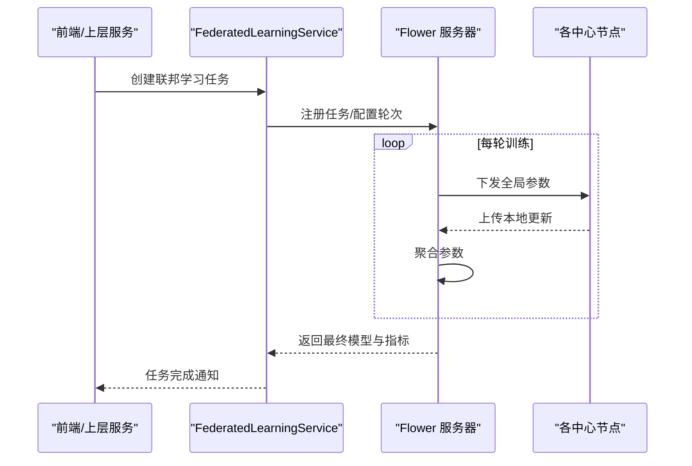
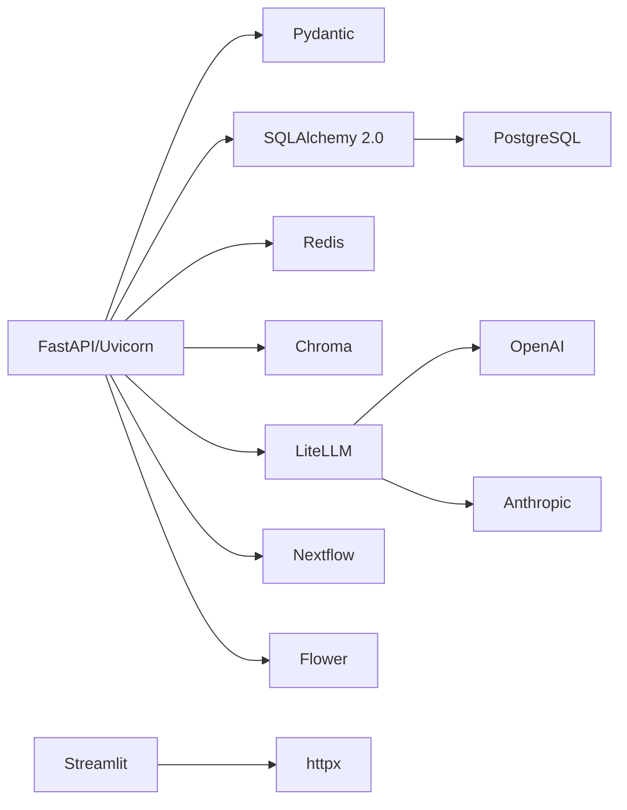

# 技术栈概览

<cite>
**本文引用的文件**
- [README.md](file://precision-drug-design/README.md)
- [backend/requirements.txt](file://precision-drug-design/backend/requirements.txt)
- [frontend/requirements.txt](file://precision-drug-design/frontend/requirements.txt)
- [pyproject.toml](file://precision-drug-design/pyproject.toml)
- [backend/app/main.py](file://precision-drug-design/backend/app/main.py)
- [backend/app/core/config.py](file://precision-drug-design/backend/app/core/config.py)
- [backend/app/db/session.py](file://precision-drug-design/backend/app/db/session.py)
- [backend/app/services/llm/router.py](file://precision-drug-design/backend/app/services/llm/router.py)
- [backend/app/services/llm/rag.py](file://precision-drug-design/backend/app/services/llm/rag.py)
- [backend/app/services/optimizer/federated_learning.py](file://precision-drug-design/backend/app/services/optimizer/federated_learning.py)
- [backend/app/services/workflow/nextflow_runner.py](file://precision-drug-design/backend/app/services/workflow/nextflow_runner.py)
- [frontend/app.py](file://precision-drug-design/frontend/app.py)
</cite>

## 目录
1. [简介](#简介)
2. [项目结构](#项目结构)
3. [核心组件](#核心组件)
4. [架构总览](#架构总览)
5. [详细组件分析](#详细组件分析)
6. [依赖关系分析](#依赖关系分析)
7. [性能与可扩展性](#性能与可扩展性)
8. [故障排查指南](#故障排查指南)
9. [结论](#结论)
10. [附录：版本兼容性与选型权衡](#附录版本兼容性与选型权衡)

## 简介
本技术栈概览面向“AI药物设计系统”的开发者与架构师，系统性梳理后端、前端、基础设施与质量保障四大维度的技术选型、职责边界、数据流与关键实现要点。文档同时提供架构图与依赖图，帮助读者快速建立全局认知并指导后续扩展与维护。

## 项目结构
仓库采用前后端分离与模块化服务组织方式：
- 后端（FastAPI）：按领域分层（api、core、db、models、schemas、services、utils），通过统一中间件封装响应信封、CORS、异常处理与日志。
- 前端（Streamlit）：以页面为粒度组织功能入口，调用后端 API 完成交互。
- 配置与环境：基于 pydantic-settings 集中管理环境变量；测试与代码质量工具在 pyproject.toml 中统一配置。
- 依赖清单：后端与前端分别维护 requirements.txt，便于分环境安装与锁定。

图表来源
- [backend/app/main.py:187-248](file://precision-drug-design/backend/app/main.py#L187-L248)
- [backend/app/core/config.py:21-144](file://precision-drug-design/backend/app/core/config.py#L21-L144)
- [backend/app/db/session.py:48-128](file://precision-drug-design/backend/app/db/session.py#L48-L128)
- [backend/app/services/llm/router.py:55-198](file://precision-drug-design/backend/app/services/llm/router.py#L55-L198)
- [backend/app/services/llm/rag.py:35-238](file://precision-drug-design/backend/app/services/llm/rag.py#L35-L238)
- [backend/app/services/optimizer/federated_learning.py:53-139](file://precision-drug-design/backend/app/services/optimizer/federated_learning.py#L53-L139)
- [backend/app/services/workflow/nextflow_runner.py:55-159](file://precision-drug-design/backend/app/services/workflow/nextflow_runner.py#L55-L159)
- [frontend/app.py:1-157](file://precision-drug-design/frontend/app.py#L1-L157)

章节来源
- [README.md:81-110](file://precision-drug-design/README.md#L81-L110)
- [backend/requirements.txt:35-100](file://precision-drug-design/backend/requirements.txt#L35-L100)
- [frontend/requirements.txt:1-3](file://precision-drug-design/frontend/requirements.txt#L1-L3)
- [pyproject.toml:14-106](file://precision-drug-design/pyproject.toml#L14-L106)

## 核心组件
- Web 框架与网关
  - FastAPI + Uvicorn：高性能异步 Web 框架，自动生成 OpenAPI/Swagger 文档。
  - 自定义信封中间件：统一响应格式、注入请求 ID 与耗时头、记录访问日志。
- 配置与运行时
  - pydantic-settings：集中加载 .env 与系统环境变量，类型校验与默认值填充。
- 数据持久化
  - SQLAlchemy 2.0：同步/异步双引擎，自动适配 SQLite/PostgreSQL，连接池与事务管理。
  - Redis：缓存与会话/限流等能力（由配置驱动）。
  - Chroma：本地持久化向量库，用于 RAG 检索增强生成。
- AI/LLM 能力
  - LiteLLM：多模型统一路由（OpenAI/Anthropic 等），支持快速层与深度层、预算控制与成本追踪。
  - RAG：基于 Chroma 的文档入库与相似度检索，不可用时降级为内存关键词检索。
- 工作流与联邦学习
  - Nextflow：生信与分析流水线编排（未安装时回退到模拟模式）。
  - Flower：联邦学习客户端与服务端集成，支持多中心协同训练与参数聚合。
- 前端界面
  - Streamlit：交互式数据分析与可视化界面，调用后端 API 展示健康状态与功能入口。

章节来源
- [backend/app/main.py:29-185](file://precision-drug-design/backend/app/main.py#L29-L185)
- [backend/app/core/config.py:21-144](file://precision-drug-design/backend/app/core/config.py#L21-L144)
- [backend/app/db/session.py:25-128](file://precision-drug-design/backend/app/db/session.py#L25-L128)
- [backend/app/services/llm/router.py:55-198](file://precision-drug-design/backend/app/services/llm/router.py#L55-L198)
- [backend/app/services/llm/rag.py:35-238](file://precision-drug-design/backend/app/services/llm/rag.py#L35-L238)
- [backend/app/services/workflow/nextflow_runner.py:55-159](file://precision-drug-design/backend/app/services/workflow/nextflow_runner.py#L55-L159)
- [backend/app/services/optimizer/federated_learning.py:53-139](file://precision-drug-design/backend/app/services/optimizer/federated_learning.py#L53-L139)
- [frontend/app.py:1-157](file://precision-drug-design/frontend/app.py#L1-L157)

## 架构总览
整体采用“前端 Streamlit → 后端 FastAPI → 多服务与外部依赖”的分层架构。后端通过中间件统一横切关注点（CORS、日志、响应信封），业务服务按需组合数据库、缓存、向量库与大模型网关。

图表来源
- [backend/app/main.py:187-248](file://precision-drug-design/backend/app/main.py#L187-L248)
- [backend/app/core/config.py:21-144](file://precision-drug-design/backend/app/core/config.py#L21-L144)
- [backend/app/db/session.py:48-128](file://precision-drug-design/backend/app/db/session.py#L48-L128)
- [backend/app/services/llm/router.py:55-198](file://precision-drug-design/backend/app/services/llm/router.py#L55-L198)
- [backend/app/services/llm/rag.py:35-238](file://precision-drug-design/backend/app/services/llm/rag.py#L35-L238)
- [backend/app/services/workflow/nextflow_runner.py:55-159](file://precision-drug-design/backend/app/services/workflow/nextflow_runner.py#L55-L159)
- [backend/app/services/optimizer/federated_learning.py:53-139](file://precision-drug-design/backend/app/services/optimizer/federated_learning.py#L53-L139)
- [frontend/app.py:1-157](file://precision-drug-design/frontend/app.py#L1-L157)

## 详细组件分析

### 后端入口与中间件（FastAPI）
- 应用工厂创建 FastAPI 实例，注册统一信封中间件、CORS、异常处理器与 v1 路由前缀。
- 信封中间件负责：
  - 解析或生成 X-Request-ID，写入 scope headers 供下游读取。
  - 计算请求耗时，注入响应头 X-Response-Time-ms。
  - 对 JSON 成功响应体中的 meta 字段追加 duration_ms。
  - 正确处理流式响应，避免截断 content-length。

图表来源
- [backend/app/main.py:29-185](file://precision-drug-design/backend/app/main.py#L29-L185)
- [backend/app/main.py:187-248](file://precision-drug-design/backend/app/main.py#L187-L248)

章节来源
- [backend/app/main.py:29-185](file://precision-drug-design/backend/app/main.py#L29-L185)
- [backend/app/main.py:187-248](file://precision-drug-design/backend/app/main.py#L187-L248)

### 配置中心（pydantic-settings）
- 集中定义所有环境变量键名与默认值，支持 .env 与真实环境变量覆盖。
- 提供 CORS 源列表规范化、生产环境判断等便捷属性。
- 通过 lru_cache 暴露单例 get_settings()，避免重复 IO。

章节来源
- [backend/app/core/config.py:21-144](file://precision-drug-design/backend/app/core/config.py#L21-L144)

### 数据库会话（SQLAlchemy 2.0）
- 根据配置自动选择 SQLite 或 PostgreSQL，并转换为对应异步驱动 URL。
- 提供异步/同步双引擎与会话工厂，FastAPI 使用异步依赖注入 get_db。
- 自动提交/回滚与资源释放，确保异常安全。

章节来源
- [backend/app/db/session.py:25-128](file://precision-drug-design/backend/app/db/session.py#L25-L128)

### LLM 路由器（LiteLLM）
- 统一封装 quick/deep 两层模型调用，支持温度、最大 token 数与引用上下文注入。
- 内置预算检查与成本估算，记录每次调用的 token 用量与费用。
- 惰性导入 litellm，避免缺失依赖导致启动失败。

图表来源
- [backend/app/services/llm/router.py:55-198](file://precision-drug-design/backend/app/services/llm/router.py#L55-L198)

章节来源
- [backend/app/services/llm/router.py:55-198](file://precision-drug-design/backend/app/services/llm/router.py#L55-L198)

### RAG 引擎（Chroma）
- 优先使用 Chroma 进行向量检索（cosine 相似度），失败或未安装时降级为内存关键词检索（Jaccard）。
- 提供 add_documents/retrieve/build_context 方法，将检索结果作为 LLM 上下文与引用来源。

图表来源
- [backend/app/services/llm/rag.py:35-238](file://precision-drug-design/backend/app/services/llm/rag.py#L35-L238)

章节来源
- [backend/app/services/llm/rag.py:35-238](file://precision-drug-design/backend/app/services/llm/rag.py#L35-L238)

### 联邦学习（Flower）
- 提供 FederatedLearningService 与 FederatedJob 数据结构，管理任务生命周期、轮次与指标。
- 与 Flower 服务端协作，支持多中心节点注册与参数聚合（FedAvg）。

图表来源
- [backend/app/services/optimizer/federated_learning.py:53-139](file://precision-drug-design/backend/app/services/optimizer/federated_learning.py#L53-L139)

章节来源
- [backend/app/services/optimizer/federated_learning.py:53-139](file://precision-drug-design/backend/app/services/optimizer/federated_learning.py#L53-L139)

### 工作流（Nextflow）
- NextflowRunner 检测 nextflow 是否可用，不可用时以模拟模式运行，保证服务可用性。
- 提供 submit 等方法用于提交与跟踪工作流任务。

章节来源
- [backend/app/services/workflow/nextflow_runner.py:55-159](file://precision-drug-design/backend/app/services/workflow/nextflow_runner.py#L55-L159)

### 前端（Streamlit）
- 主入口设置页面布局与侧边栏导航，登录态下展示系统概览与健康状态。
- 通过 httpx 调用后端 API，结合 Plotly/Altair 进行可视化（依赖见 requirements）。

章节来源
- [frontend/app.py:1-157](file://precision-drug-design/frontend/app.py#L1-L157)
- [frontend/requirements.txt:1-3](file://precision-drug-design/frontend/requirements.txt#L1-L3)

## 依赖关系分析
- 后端依赖
  - Web 层：fastapi、uvicorn、pydantic、python-multipart
  - 数据层：sqlalchemy、psycopg2-binary、asyncpg、alembic、redis
  - 向量检索：chromadb
  - LLM：litellm、openai、anthropic、tiktoken
  - 工作流：nextflow
  - 联邦学习：flwr、syft、opacus
- 前端依赖
  - streamlit、httpx
- 质量保障
  - pytest、pytest-cov、pytest-asyncio、ruff、mypy、pre-commit

图表来源
- [backend/requirements.txt:35-100](file://precision-drug-design/backend/requirements.txt#L35-L100)
- [frontend/requirements.txt:1-3](file://precision-drug-design/frontend/requirements.txt#L1-L3)

章节来源
- [backend/requirements.txt:35-100](file://precision-drug-design/backend/requirements.txt#L35-L100)
- [frontend/requirements.txt:1-3](file://precision-drug-design/frontend/requirements.txt#L1-L3)
- [pyproject.toml:63-106](file://precision-drug-design/pyproject.toml#L63-L106)

## 性能与可扩展性
- 异步 I/O：FastAPI + asyncpg 提升并发处理能力；SQLAlchemy 异步会话减少阻塞。
- 连接池：PostgreSQL 场景启用 pool_pre_ping、pool_size/max_overflow，SQLite 场景跳过池参数以避免不支持。
- 缓存与降级：
  - Redis 可用于热点缓存与限流（由配置驱动）。
  - RAG 在 Chroma 不可用时自动降级为内存检索，保障可用性。
  - Nextflow 未安装时以模拟模式运行，避免阻塞服务启动。
- 可观测性：统一信封中间件注入 X-Request-ID 与 X-Response-Time-ms，便于链路追踪与性能分析。

[本节为通用建议，不直接分析具体文件]

## 故障排查指南
- 启动失败
  - 若 litellm 未安装，LLM 路由器会抛出运行时错误提示安装。请确认后端依赖已安装。
  - Chroma 初始化失败会降级为内存检索，不影响基础功能但会影响检索质量。
- 数据库连接
  - 检查 DATABASE_URL 是否正确，SQLite 与 PostgreSQL 的驱动差异已在 session.py 中处理。
- 跨域问题
  - 确认 CORS 允许源列表包含前端地址，配置项 cors_origins 会被规范化为逗号分隔列表。
- 大模型调用
  - 检查 OPENAI_API_KEY/ANTHROPIC_API_KEY 等密钥配置；注意预算上限限制。
- 工作流
  - 若 nextflow 未安装，NextflowRunner 将以模拟模式运行，相关功能可能受限。

章节来源
- [backend/app/services/llm/router.py:80-90](file://precision-drug-design/backend/app/services/llm/router.py#L80-L90)
- [backend/app/services/llm/rag.py:62-88](file://precision-drug-design/backend/app/services/llm/rag.py#L62-L88)
- [backend/app/db/session.py:25-41](file://precision-drug-design/backend/app/db/session.py#L25-L41)
- [backend/app/core/config.py:112-122](file://precision-drug-design/backend/app/core/config.py#L112-L122)
- [backend/app/services/workflow/nextflow_runner.py:73-76](file://precision-drug-design/backend/app/services/workflow/nextflow_runner.py#L73-L76)

## 结论
本系统以 FastAPI 为核心，结合 SQLAlchemy 2.0、PostgreSQL、Redis、Chroma 与 LiteLLM，构建了高可用、可扩展且具备 AI 能力的药物设计平台。前端 Streamlit 提供直观交互，配合 Nextflow 与 Flower 形成从数据处理到联邦学习的完整闭环。通过统一的中间件与配置中心，系统在可观测性、可维护性与容错性方面具备良好的工程实践。

[本节为总结性内容，不直接分析具体文件]

## 附录：版本兼容性与选型权衡
- 后端
  - FastAPI 0.110+（推荐 0.139+）：与 Pydantic 2.x 生态良好兼容，异步性能优异。
  - SQLAlchemy 2.0：全面支持异步 ORM，迁移成本低，适合长期演进。
  - PostgreSQL + asyncpg：生产级稳定性与高并发；开发期可使用 SQLite 降低门槛。
  - Redis：轻量缓存与分布式锁的基础设施。
  - Chroma：本地持久化向量库，部署简单，适合中小规模知识库；大规模可替换为专用向量数据库。
  - LiteLLM：统一多模型接入，便于切换供应商与成本控制。
- 前端
  - Streamlit 1.30+：快速原型与数据可视化友好；复杂交互场景可考虑引入更重的前端框架。
- 基础设施
  - Nextflow：生物信息学工作流标准，适合复杂管线；未安装时可回退模拟模式。
  - Flower：联邦学习主流方案，易于集成与扩展。
- 质量保障
  - pytest + pytest-asyncio：异步测试友好；覆盖率目标 ≥80%。
  - ruff：替代 flake8/isort/black，统一 lint/format。
  - mypy：逐步收紧类型检查，提升代码健壮性。

章节来源
- [README.md:81-110](file://precision-drug-design/README.md#L81-L110)
- [backend/requirements.txt:35-100](file://precision-drug-design/backend/requirements.txt#L35-L100)
- [frontend/requirements.txt:1-3](file://precision-drug-design/frontend/requirements.txt#L1-L3)
- [pyproject.toml:14-106](file://precision-drug-design/pyproject.toml#L14-L106)