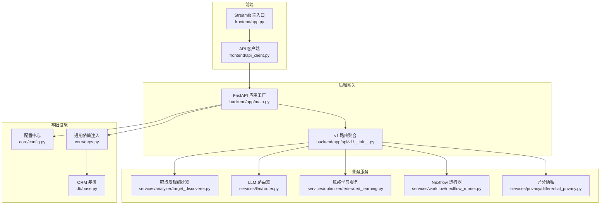
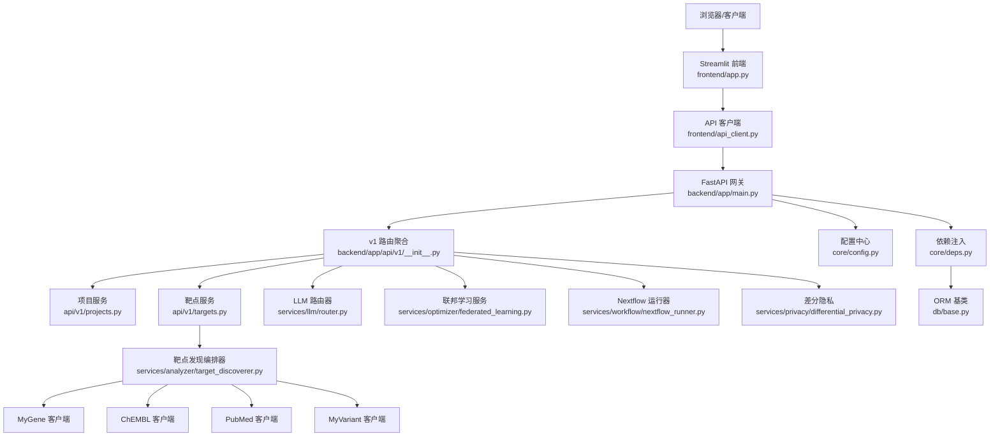
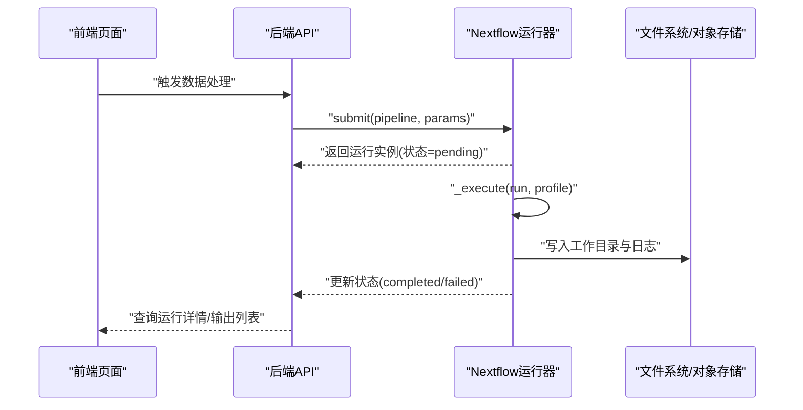
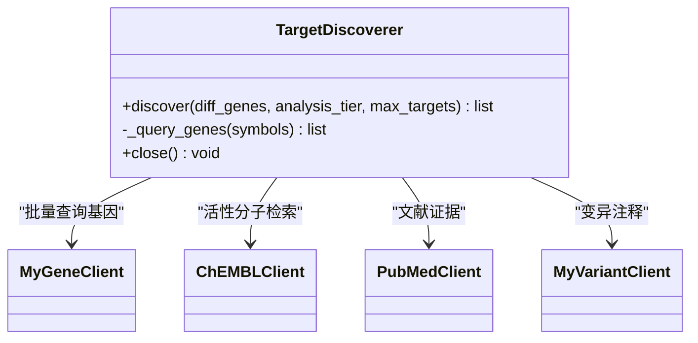
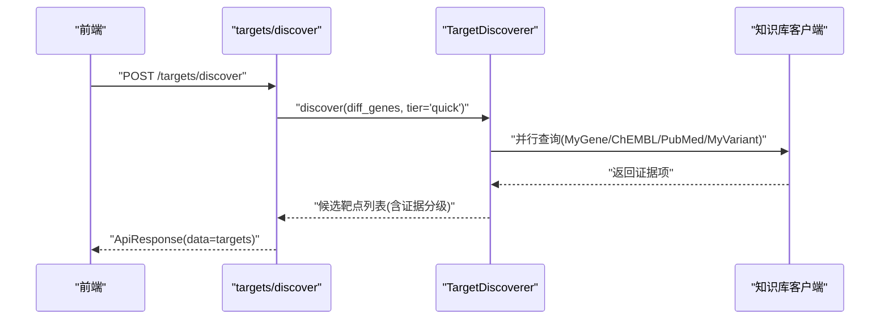
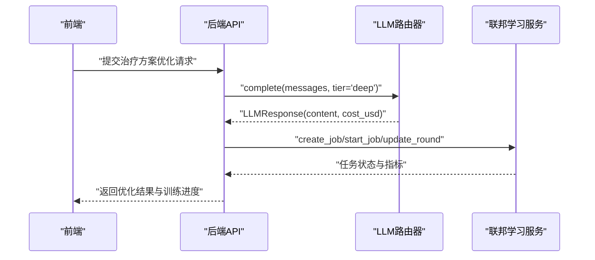
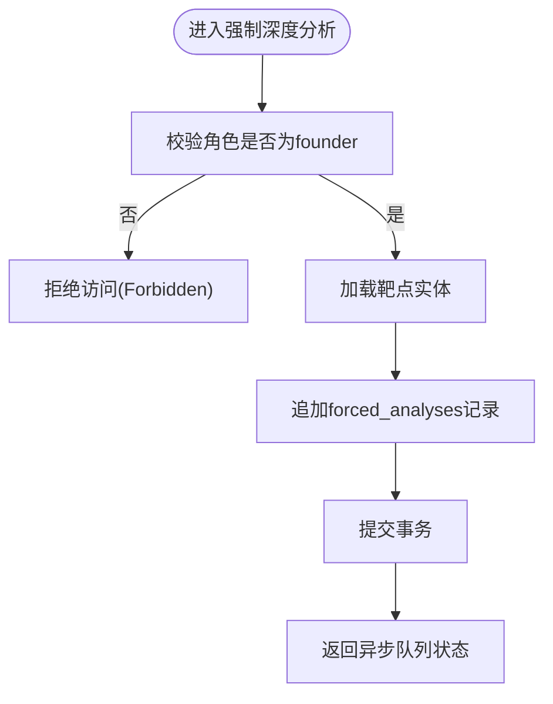
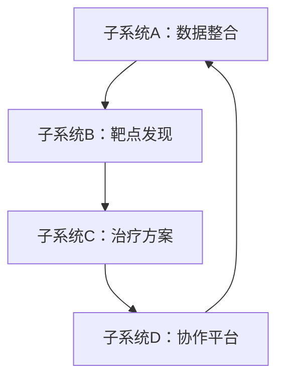
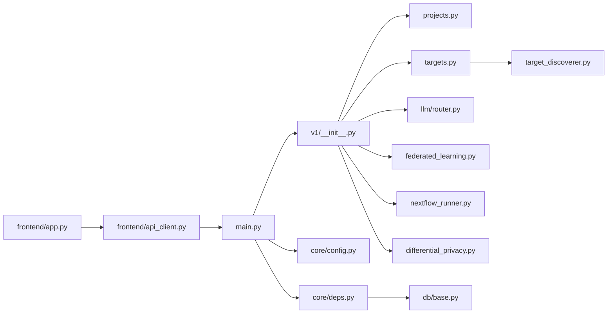

# 架构设计理念

<cite>
**本文引用的文件**   
- [README.md](file://precision-drug-design/README.md)
- [backend/app/main.py](file://precision-drug-design/backend/app/main.py)
- [backend/app/api/v1/__init__.py](file://precision-drug-design/backend/app/api/v1/__init__.py)
- [backend/app/core/config.py](file://precision-drug-design/backend/app/core/config.py)
- [backend/app/core/deps.py](file://precision-drug-design/backend/app/core/deps.py)
- [backend/app/db/base.py](file://precision-drug-design/backend/app/db/base.py)
- [backend/app/services/analyzer/target_discoverer.py](file://precision-drug-design/backend/app/services/analyzer/target_discoverer.py)
- [backend/app/services/llm/router.py](file://precision-drug-design/backend/app/services/llm/router.py)
- [backend/app/services/optimizer/federated_learning.py](file://precision-drug-design/backend/app/services/optimizer/federated_learning.py)
- [backend/app/services/workflow/nextflow_runner.py](file://precision-drug-design/backend/app/services/workflow/nextflow_runner.py)
- [backend/app/services/privacy/differential_privacy.py](file://precision-drug-design/backend/app/services/privacy/differential_privacy.py)
- [backend/app/api/v1/projects.py](file://precision-drug-design/backend/app/api/v1/projects.py)
- [backend/app/api/v1/targets.py](file://precision-drug-design/backend/app/api/v1/targets.py)
- [frontend/app.py](file://precision-drug-design/frontend/app.py)
- [frontend/api_client.py](file://precision-drug-design/frontend/api_client.py)
</cite>

## 目录
1. [引言](#引言)
2. [项目结构](#项目结构)
3. [核心组件](#核心组件)
4. [架构总览](#架构总览)
5. [详细组件分析](#详细组件分析)
6. [依赖关系分析](#依赖关系分析)
7. [性能与可扩展性](#性能与可扩展性)
8. [故障排查指南](#故障排查指南)
9. [结论](#结论)
10. [附录：技术决策权衡](#附录技术决策权衡)

## 引言
本设计文档面向架构师与高级开发者，系统化阐述AI药物设计平台的整体架构理念与实践。系统采用分层架构、模块化设计与微服务化边界划分，围绕四大子系统（数据整合、靶点发现、治疗方案、协作平台）构建统一的数据流与事件驱动机制。本文提供架构图、组件关系图与部署拓扑图，并解释关键选型（如FastAPI、Streamlit）的权衡考量。

## 项目结构
仓库采用前后端分离与领域内聚的组织方式：
- 后端：FastAPI应用，按“API路由层—服务层—模型/数据库—工具”分层；服务层按能力域划分为分析器、知识库、LLM、优化器、解析器、隐私、报告与工作流等子域。
- 前端：基于Streamlit的多页面应用，封装统一的API客户端，负责认证、缓存与可视化导航。
- 配置与环境：集中式配置加载，支持多环境变量覆盖。
- 测试与脚本：覆盖单元测试、集成测试与端到端验证。

图表来源
- [backend/app/main.py:187-248](file://precision-drug-design/backend/app/main.py#L187-L248)
- [backend/app/api/v1/__init__.py:1-41](file://precision-drug-design/backend/app/api/v1/__init__.py#L1-L41)
- [backend/app/core/config.py:21-144](file://precision-drug-design/backend/app/core/config.py#L21-L144)
- [backend/app/core/deps.py:1-129](file://precision-drug-design/backend/app/core/deps.py#L1-L129)
- [backend/app/db/base.py:13-48](file://precision-drug-design/backend/app/db/base.py#L13-L48)
- [backend/app/services/analyzer/target_discoverer.py:26-176](file://precision-drug-design/backend/app/services/analyzer/target_discoverer.py#L26-L176)
- [backend/app/services/llm/router.py:55-198](file://precision-drug-design/backend/app/services/llm/router.py#L55-L198)
- [backend/app/services/optimizer/federated_learning.py:53-199](file://precision-drug-design/backend/app/services/optimizer/federated_learning.py#L53-L199)
- [backend/app/services/workflow/nextflow_runner.py:54-173](file://precision-drug-design/backend/app/services/workflow/nextflow_runner.py#L54-L173)
- [backend/app/services/privacy/differential_privacy.py:51-151](file://precision-drug-design/backend/app/services/privacy/differential_privacy.py#L51-L151)
- [frontend/app.py:1-157](file://precision-drug-design/frontend/app.py#L1-L157)
- [frontend/api_client.py:1-251](file://precision-drug-design/frontend/api_client.py#L1-L251)

章节来源
- [README.md:190-235](file://precision-drug-design/README.md#L190-L235)

## 核心组件
- 应用入口与中间件：创建FastAPI实例，注册CORS、统一信封响应中间件、异常处理器与v1路由集合，暴露健康检查与指标端点。
- 配置管理：基于pydantic-settings的环境变量加载，提供类型校验与默认值，支持生产/开发环境切换。
- 依赖注入：提供数据库会话、当前用户对象（含短TTL内存缓存）、分页参数与请求追踪ID注入。
- ORM基类：声明式基类与公共字段混入（UUID主键、时间戳），保证跨表一致性。
- 业务服务：
  - 靶点发现编排器：协调多源知识库（MyGene/ChEMBL/PubMed/MyVariant），并行检索与证据分级。
  - LLM路由器：LiteLLM统一调用，快速/深度两层模型选择、预算控制与成本追踪。
  - 联邦学习服务：任务生命周期管理、客户端注册与轮次指标更新（内存实现，可替换为持久化）。
  - Nextflow运行器：提交生物信息学流水线、异步执行与日志收集，支持模拟模式。
  - 差分隐私：ε-预算管理与噪声注入（拉普拉斯/高斯/随机响应）。
- API端点：项目CRUD与权限控制、靶点发现与网络协同预测等。
- 前端：Streamlit页面组织、登录态与会话管理、统一API客户端（连接池、缓存、错误解包）。

章节来源
- [backend/app/main.py:187-248](file://precision-drug-design/backend/app/main.py#L187-L248)
- [backend/app/core/config.py:21-144](file://precision-drug-design/backend/app/core/config.py#L21-L144)
- [backend/app/core/deps.py:1-129](file://precision-drug-design/backend/app/core/deps.py#L1-L129)
- [backend/app/db/base.py:13-48](file://precision-drug-design/backend/app/db/base.py#L13-L48)
- [backend/app/services/analyzer/target_discoverer.py:26-176](file://precision-drug-design/backend/app/services/analyzer/target_discoverer.py#L26-L176)
- [backend/app/services/llm/router.py:55-198](file://precision-drug-design/backend/app/services/llm/router.py#L55-L198)
- [backend/app/services/optimizer/federated_learning.py:53-199](file://precision-drug-design/backend/app/services/optimizer/federated_learning.py#L53-L199)
- [backend/app/services/workflow/nextflow_runner.py:54-173](file://precision-drug-design/backend/app/services/workflow/nextflow_runner.py#L54-L173)
- [backend/app/services/privacy/differential_privacy.py:51-151](file://precision-drug-design/backend/app/services/privacy/differential_privacy.py#L51-L151)
- [backend/app/api/v1/projects.py:1-169](file://precision-drug-design/backend/app/api/v1/projects.py#L1-L169)
- [backend/app/api/v1/targets.py:1-344](file://precision-drug-design/backend/app/api/v1/targets.py#L1-L344)
- [frontend/app.py:1-157](file://precision-drug-design/frontend/app.py#L1-L157)
- [frontend/api_client.py:1-251](file://precision-drug-design/frontend/api_client.py#L1-L251)

## 架构总览
系统采用“前端—网关—服务—外部资源”的分层架构，结合领域服务模块化的微服务边界。数据流以REST为主，辅以异步工作流与事件化扩展点（如Nextflow任务状态、联邦学习任务进度）。

图表来源
- [backend/app/main.py:187-248](file://precision-drug-design/backend/app/main.py#L187-L248)
- [backend/app/api/v1/__init__.py:1-41](file://precision-drug-design/backend/app/api/v1/__init__.py#L1-L41)
- [backend/app/api/v1/projects.py:1-169](file://precision-drug-design/backend/app/api/v1/projects.py#L1-L169)
- [backend/app/api/v1/targets.py:1-344](file://precision-drug-design/backend/app/api/v1/targets.py#L1-L344)
- [backend/app/services/analyzer/target_discoverer.py:26-176](file://precision-drug-design/backend/app/services/analyzer/target_discoverer.py#L26-L176)
- [backend/app/services/llm/router.py:55-198](file://precision-drug-design/backend/app/services/llm/router.py#L55-L198)
- [backend/app/services/optimizer/federated_learning.py:53-199](file://precision-drug-design/backend/app/services/optimizer/federated_learning.py#L53-L199)
- [backend/app/services/workflow/nextflow_runner.py:54-173](file://precision-drug-design/backend/app/services/workflow/nextflow_runner.py#L54-L173)
- [backend/app/services/privacy/differential_privacy.py:51-151](file://precision-drug-design/backend/app/services/privacy/differential_privacy.py#L51-L151)
- [backend/app/core/config.py:21-144](file://precision-drug-design/backend/app/core/config.py#L21-L144)
- [backend/app/core/deps.py:1-129](file://precision-drug-design/backend/app/core/deps.py#L1-L129)
- [backend/app/db/base.py:13-48](file://precision-drug-design/backend/app/db/base.py#L13-L48)
- [frontend/app.py:1-157](file://precision-drug-design/frontend/app.py#L1-L157)
- [frontend/api_client.py:1-251](file://precision-drug-design/frontend/api_client.py#L1-L251)

## 详细组件分析

### 组件A：极限诊断数据整合平台（数据管线）
- 职责：多组学数据上传与预处理、差异表达分析、CDISC导出、质量治理。
- 关键流程：通过Nextflow运行器提交流水线，异步执行并收集输出与日志；在需要时引入差分隐私保护统计结果。
- 交互：API层接收数据集处理请求，调度NextflowRunner；结果落盘或对象存储，供后续分析使用。

图表来源
- [backend/app/services/workflow/nextflow_runner.py:76-173](file://precision-drug-design/backend/app/services/workflow/nextflow_runner.py#L76-L173)
- [backend/app/services/privacy/differential_privacy.py:51-151](file://precision-drug-design/backend/app/services/privacy/differential_privacy.py#L51-L151)

章节来源
- [backend/app/services/workflow/nextflow_runner.py:54-173](file://precision-drug-design/backend/app/services/workflow/nextflow_runner.py#L54-L173)
- [backend/app/services/privacy/differential_privacy.py:51-151](file://precision-drug-design/backend/app/services/privacy/differential_privacy.py#L51-L151)

### 组件B：AI辅助靶点发现引擎
- 职责：整合多源知识库，生成候选靶点与证据项，支持快速筛查与深度洞察。
- 关键流程：API端点接收差异基因或数据集ID，调用TargetDiscoverer；快速模式同步返回，深度模式异步任务；证据分级由统一策略完成。
- 交互：与MyGene/ChEMBL/PubMed/MyVariant客户端并发交互，结果汇总后排序输出。

图表来源
- [backend/app/services/analyzer/target_discoverer.py:26-176](file://precision-drug-design/backend/app/services/analyzer/target_discoverer.py#L26-L176)

图表来源
- [backend/app/api/v1/targets.py:42-131](file://precision-drug-design/backend/app/api/v1/targets.py#L42-L131)
- [backend/app/services/analyzer/target_discoverer.py:52-139](file://precision-drug-design/backend/app/services/analyzer/target_discoverer.py#L52-L139)

章节来源
- [backend/app/api/v1/targets.py:1-344](file://precision-drug-design/backend/app/api/v1/targets.py#L1-L344)
- [backend/app/services/analyzer/target_discoverer.py:26-176](file://precision-drug-design/backend/app/services/analyzer/target_discoverer.py#L26-L176)

### 组件C：并行治疗方案设计系统
- 职责：多疗法组合优化、实时疗效监测、动态方案调整。
- 关键流程：通过LLM路由器进行快速/深度推理，结合联邦学习服务在多中心场景下协同训练与评估。
- 交互：API层调用LLMRouter与FederatedLearningService，产出优化建议与训练进度。

图表来源
- [backend/app/services/llm/router.py:92-171](file://precision-drug-design/backend/app/services/llm/router.py#L92-L171)
- [backend/app/services/optimizer/federated_learning.py:60-199](file://precision-drug-design/backend/app/services/optimizer/federated_learning.py#L60-L199)

章节来源
- [backend/app/services/llm/router.py:55-198](file://precision-drug-design/backend/app/services/llm/router.py#L55-L198)
- [backend/app/services/optimizer/federated_learning.py:53-199](file://precision-drug-design/backend/app/services/optimizer/federated_learning.py#L53-L199)

### 组件D：AI模式协作平台
- 职责：RBAC权限、假设沙盒、审计日志、创始人强制深度分析。
- 关键流程：API层校验角色与权限，记录操作历史；支持对特定靶点发起强制深度分析，用于对照数据集构建。
- 交互：与项目、靶点、报告等实体紧密耦合，确保操作可追溯。

图表来源
- [backend/app/api/v1/targets.py:228-271](file://precision-drug-design/backend/app/api/v1/targets.py#L228-L271)
- [backend/app/api/v1/projects.py:32-44](file://precision-drug-design/backend/app/api/v1/projects.py#L32-L44)

章节来源
- [backend/app/api/v1/targets.py:228-271](file://precision-drug-design/backend/app/api/v1/targets.py#L228-L271)
- [backend/app/api/v1/projects.py:1-169](file://precision-drug-design/backend/app/api/v1/projects.py#L1-L169)

### 概念总览

[此图为概念性工作流示意，不直接映射具体代码文件]

## 依赖关系分析
- 组件耦合与内聚：
  - API路由层仅负责协议适配与参数校验，业务逻辑下沉至服务层，保持高内聚低耦合。
  - 服务层通过依赖注入获取数据库会话与用户上下文，避免隐式全局状态。
  - 外部知识库与LLM调用被封装为独立客户端/路由器，便于替换与降级。
- 直接/间接依赖：
  - main.py依赖配置与异常处理器，挂载v1路由。
  - targets.py依赖deps与models/schemas，调用TargetDiscoverer。
  - frontend/api_client.py复用httpx连接池，统一错误与信封解包。
- 潜在循环依赖：
  - 服务层不应反向导入API层；当前结构清晰，未见循环。
- 外部依赖与集成点：
  - 外部知识库API、LLM提供商、Nextflow、对象存储、Redis/PostgreSQL。

图表来源
- [backend/app/main.py:187-248](file://precision-drug-design/backend/app/main.py#L187-L248)
- [backend/app/api/v1/__init__.py:1-41](file://precision-drug-design/backend/app/api/v1/__init__.py#L1-L41)
- [backend/app/api/v1/projects.py:1-169](file://precision-drug-design/backend/app/api/v1/projects.py#L1-L169)
- [backend/app/api/v1/targets.py:1-344](file://precision-drug-design/backend/app/api/v1/targets.py#L1-L344)
- [backend/app/services/analyzer/target_discoverer.py:26-176](file://precision-drug-design/backend/app/services/analyzer/target_discoverer.py#L26-L176)
- [backend/app/services/llm/router.py:55-198](file://precision-drug-design/backend/app/services/llm/router.py#L55-L198)
- [backend/app/services/optimizer/federated_learning.py:53-199](file://precision-drug-design/backend/app/services/optimizer/federated_learning.py#L53-L199)
- [backend/app/services/workflow/nextflow_runner.py:54-173](file://precision-drug-design/backend/app/services/workflow/nextflow_runner.py#L54-L173)
- [backend/app/services/privacy/differential_privacy.py:51-151](file://precision-drug-design/backend/app/services/privacy/differential_privacy.py#L51-L151)
- [backend/app/core/config.py:21-144](file://precision-drug-design/backend/app/core/config.py#L21-L144)
- [backend/app/core/deps.py:1-129](file://precision-drug-design/backend/app/core/deps.py#L1-L129)
- [backend/app/db/base.py:13-48](file://precision-drug-design/backend/app/db/base.py#L13-L48)
- [frontend/app.py:1-157](file://precision-drug-design/frontend/app.py#L1-L157)
- [frontend/api_client.py:1-251](file://precision-drug-design/frontend/api_client.py#L1-L251)

章节来源
- [backend/app/main.py:187-248](file://precision-drug-design/backend/app/main.py#L187-L248)
- [backend/app/api/v1/__init__.py:1-41](file://precision-drug-design/backend/app/api/v1/__init__.py#L1-L41)
- [backend/app/core/config.py:21-144](file://precision-drug-design/backend/app/core/config.py#L21-L144)
- [backend/app/core/deps.py:1-129](file://precision-drug-design/backend/app/core/deps.py#L1-L129)
- [backend/app/db/base.py:13-48](file://precision-drug-design/backend/app/db/base.py#L13-L48)
- [frontend/app.py:1-157](file://precision-drug-design/frontend/app.py#L1-L157)
- [frontend/api_client.py:1-251](file://precision-drug-design/frontend/api_client.py#L1-L251)

## 性能与可扩展性
- 中间件与响应信封：统一注入X-Request-ID与耗时头，便于链路追踪与性能观测。
- 连接池与缓存：前端API客户端复用httpx连接池，减少握手开销；内置TTL缓存降低重复请求压力。
- 异步与并发：服务层广泛使用asyncio.gather并行调用外部知识库，缩短端到端延迟。
- 可扩展点：
  - 将联邦学习与Nextflow运行器从内存实现迁移到持久化与消息队列，提升可靠性与水平扩展能力。
  - 引入Redis作为分布式缓存与会话存储，替代进程内缓存。
  - 对外部API调用增加熔断与重试策略，增强鲁棒性。

[本节为通用指导，无需特定文件引用]

## 故障排查指南
- 健康检查与指标：
  - 使用健康端点确认后端可用性；查看响应头中的X-Response-Time-ms定位慢请求。
- 认证与权限：
  - 未认证/无权限会返回相应错误码；检查JWT令牌与角色权限。
- 外部服务失败：
  - 知识库/LLM调用失败时，服务层应捕获异常并降级返回空结果或提示；检查网络与密钥配置。
- 工作流执行：
  - Nextflow未安装时进入模拟模式；检查命令路径与工作目录权限。
- 隐私预算不足：
  - 差分隐私抛出预算不足异常；调整ε预算或减少查询次数。

章节来源
- [backend/app/main.py:187-248](file://precision-drug-design/backend/app/main.py#L187-L248)
- [backend/app/api/v1/targets.py:97-131](file://precision-drug-design/backend/app/api/v1/targets.py#L97-L131)
- [backend/app/services/workflow/nextflow_runner.py:68-127](file://precision-drug-design/backend/app/services/workflow/nextflow_runner.py#L68-L127)
- [backend/app/services/privacy/differential_privacy.py:79-90](file://precision-drug-design/backend/app/services/privacy/differential_privacy.py#L79-L90)

## 结论
本架构以分层与模块化为核心，通过清晰的子系统边界与统一的数据流规范，支撑AI药物设计的复杂业务流程。FastAPI提供高性能网关，Streamlit简化前端交付；服务层以领域为中心组织，配合LLM与外部知识库形成强大的分析与推理能力。未来可通过消息队列、分布式缓存与持久化任务管理进一步提升系统的可靠性与扩展性。

[本节为总结，无需特定文件引用]

## 附录：技术决策权衡
- 为什么选择FastAPI：
  - 原生异步与类型提示，自动生成OpenAPI文档，中间件生态完善，适合高并发与复杂业务编排。
- 为什么采用Streamlit：
  - 快速原型与数据科学友好，内置状态管理与页面组织，适合内部研究平台与交互式分析。
- 为什么使用SQLite/PostgreSQL双栈：
  - 本地开发用SQLite零运维，生产切换PostgreSQL保障并发与事务一致性。
- 为什么引入LiteLLM：
  - 统一多模型接口，支持快速/深度两层模型与成本追踪，便于灰度与降级。
- 为什么采用Nextflow：
  - 标准化生信流水线，具备可移植性与可重现性，支持集群与容器化部署。
- 为什么引入差分隐私：
  - 在共享统计与模型训练中保护个体隐私，满足合规要求。

章节来源
- [README.md:81-110](file://precision-drug-design/README.md#L81-L110)
- [backend/app/services/llm/router.py:55-198](file://precision-drug-design/backend/app/services/llm/router.py#L55-L198)
- [backend/app/services/workflow/nextflow_runner.py:54-173](file://precision-drug-design/backend/app/services/workflow/nextflow_runner.py#L54-L173)
- [backend/app/services/privacy/differential_privacy.py:51-151](file://precision-drug-design/backend/app/services/privacy/differential_privacy.py#L51-L151)