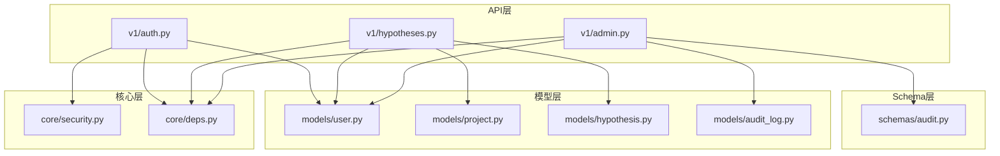
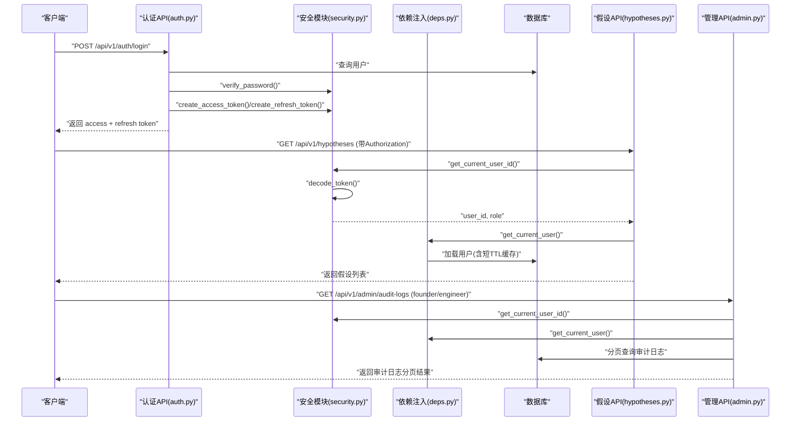
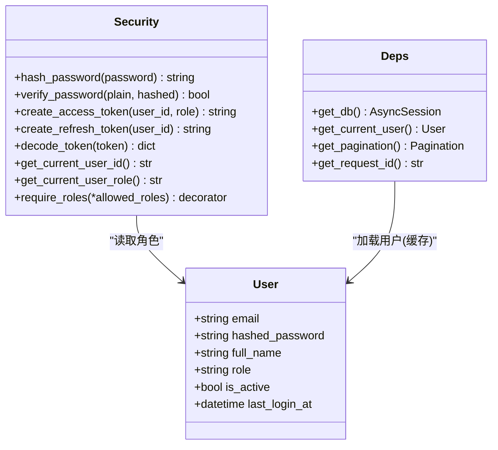
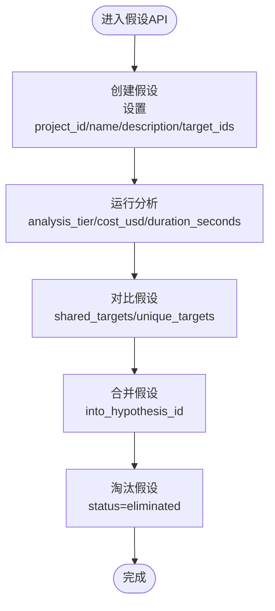
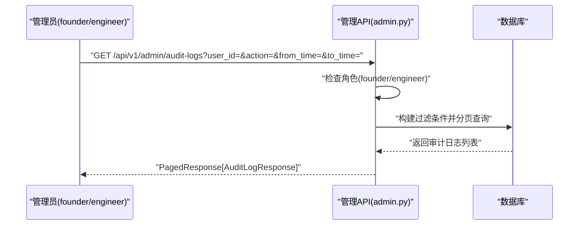
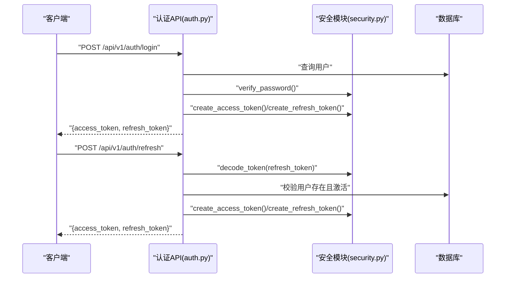
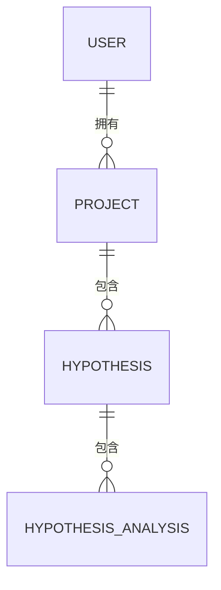
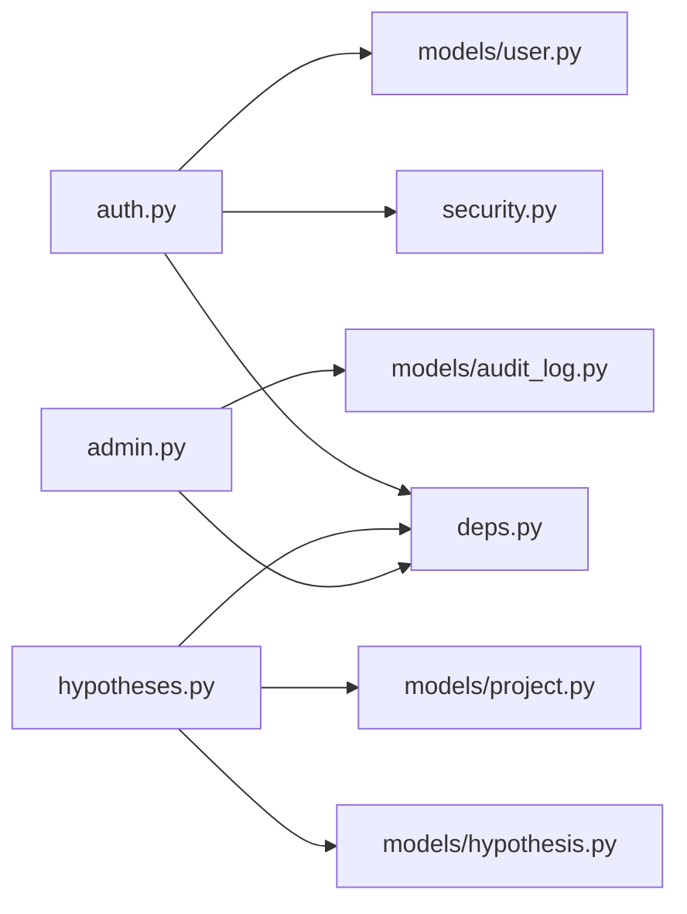

# 协作平台（子系统D）

<cite>
**本文引用的文件**   
- [backend/app/models/user.py](file://backend/app/models/user.py)
- [backend/app/core/security.py](file://backend/app/core/security.py)
- [backend/app/api/v1/auth.py](file://backend/app/api/v1/auth.py)
- [backend/app/core/deps.py](file://backend/app/core/deps.py)
- [backend/app/models/audit_log.py](file://backend/app/models/audit_log.py)
- [backend/app/schemas/audit.py](file://backend/app/schemas/audit.py)
- [backend/app/api/v1/admin.py](file://backend/app/api/v1/admin.py)
- [backend/app/models/hypothesis.py](file://backend/app/models/hypothesis.py)
- [backend/app/api/v1/hypotheses.py](file://backend/app/api/v1/hypotheses.py)
- [backend/app/models/project.py](file://backend/app/models/project.py)
</cite>

## 目录
1. [简介](#简介)
2. [项目结构](#项目结构)
3. [核心组件](#核心组件)
4. [架构总览](#架构总览)
5. [详细组件分析](#详细组件分析)
6. [依赖关系分析](#依赖关系分析)
7. [性能考量](#性能考量)
8. [故障排查指南](#故障排查指南)
9. [结论](#结论)
10. [附录](#附录)

## 简介
本文件面向AI药物设计系统的“协作平台（子系统D）”，聚焦以下能力：
- RBAC五角色权限管理体系（founder/pi/researcher/doctor/engineer），包括角色定义、权限矩阵与访问控制策略。
- 假设沙盒（Hypothesis Sandbox）：支持科学假设的创建、验证、对比与版本管理，并内置创始人强制深度分析机制。
- 审计日志系统（append-only，不可篡改）：记录所有用户操作和数据变更，提供查询接口。
- JWT认证与刷新令牌机制、项目协作与团队协作工作流。
- 权限配置示例、审计日志查询方法与安全最佳实践。

## 项目结构
协作平台后端采用分层组织：
- API层：按功能划分路由模块（如auth、hypotheses、admin）。
- 核心层：安全、依赖注入、异常与配置。
- 数据模型层：SQLAlchemy ORM模型（User、Project、Hypothesis、AuditLog等）。
- Schema层：Pydantic请求/响应模型。
- 服务层：业务逻辑与分析编排（不在本节展开）。

图表来源
- [backend/app/api/v1/auth.py:1-147](file://backend/app/api/v1/auth.py#L1-L147)
- [backend/app/api/v1/hypotheses.py:1-273](file://backend/app/api/v1/hypotheses.py#L1-L273)
- [backend/app/api/v1/admin.py:1-124](file://backend/app/api/v1/admin.py#L1-L124)
- [backend/app/core/security.py:1-211](file://backend/app/core/security.py#L1-L211)
- [backend/app/core/deps.py:1-129](file://backend/app/core/deps.py#L1-L129)
- [backend/app/models/user.py:1-36](file://backend/app/models/user.py#L1-L36)
- [backend/app/models/project.py:1-42](file://backend/app/models/project.py#L1-L42)
- [backend/app/models/hypothesis.py:1-66](file://backend/app/models/hypothesis.py#L1-L66)
- [backend/app/models/audit_log.py:1-45](file://backend/app/models/audit_log.py#L1-L45)
- [backend/app/schemas/audit.py:1-39](file://backend/app/schemas/audit.py#L1-L39)

章节来源
- [backend/app/api/v1/auth.py:1-147](file://backend/app/api/v1/auth.py#L1-L147)
- [backend/app/api/v1/hypotheses.py:1-273](file://backend/app/api/v1/hypotheses.py#L1-L273)
- [backend/app/api/v1/admin.py:1-124](file://backend/app/api/v1/admin.py#L1-L124)
- [backend/app/core/security.py:1-211](file://backend/app/core/security.py#L1-L211)
- [backend/app/core/deps.py:1-129](file://backend/app/core/deps.py#L1-L129)
- [backend/app/models/user.py:1-36](file://backend/app/models/user.py#L1-L36)
- [backend/app/models/project.py:1-42](file://backend/app/models/project.py#L1-L42)
- [backend/app/models/hypothesis.py:1-66](file://backend/app/models/hypothesis.py#L1-L66)
- [backend/app/models/audit_log.py:1-45](file://backend/app/models/audit_log.py#L1-L45)
- [backend/app/schemas/audit.py:1-39](file://backend/app/schemas/audit.py#L1-L39)

## 核心组件
- 用户与RBAC
  - 用户模型包含邮箱、密码哈希、姓名、角色、活跃状态与最后登录时间。
  - 角色取值：founder、pi、researcher、doctor、engineer。
- 安全与JWT
  - 提供bcrypt密码哈希与校验、access/refresh token生成与解析、FastAPI依赖注入获取当前用户ID与角色、基于角色的守卫工厂。
- 依赖注入
  - 提供数据库会话、分页参数、请求追踪ID、当前用户对象（含短TTL内存缓存）。
- 假设沙盒
  - 假设与假设分析记录模型；支持状态机（active/merged/archived/eliminated）、优先级（low/normal/high/forced）及创始人强制深度分析标记。
- 审计日志
  - append-only模型，提供索引与JSONB字段，记录动作、资源、前后值、IP与UA等。
- 管理端点
  - Prometheus指标与审计日志查询（仅founder/engineer可访问）。

章节来源
- [backend/app/models/user.py:1-36](file://backend/app/models/user.py#L1-L36)
- [backend/app/core/security.py:1-211](file://backend/app/core/security.py#L1-L211)
- [backend/app/core/deps.py:1-129](file://backend/app/core/deps.py#L1-L129)
- [backend/app/models/hypothesis.py:1-66](file://backend/app/models/hypothesis.py#L1-L66)
- [backend/app/models/audit_log.py:1-45](file://backend/app/models/audit_log.py#L1-L45)
- [backend/app/api/v1/admin.py:1-124](file://backend/app/api/v1/admin.py#L1-L124)

## 架构总览
协作平台在请求处理链路中，通过OAuth2 Bearer提取token，解码后得到用户ID与角色，再由依赖注入加载完整用户对象并进行权限判定。关键业务（假设沙盒、审计日志查询）均受此流程保护。

图表来源
- [backend/app/api/v1/auth.py:70-134](file://backend/app/api/v1/auth.py#L70-L134)
- [backend/app/core/security.py:155-211](file://backend/app/core/security.py#L155-L211)
- [backend/app/core/deps.py:101-124](file://backend/app/core/deps.py#L101-L124)
- [backend/app/api/v1/hypotheses.py:62-100](file://backend/app/api/v1/hypotheses.py#L62-L100)
- [backend/app/api/v1/admin.py:53-123](file://backend/app/api/v1/admin.py#L53-L123)

## 详细组件分析

### RBAC五角色权限体系
- 角色定义
  - founder：创始人/患者，最高权限。
  - pi：首席研究员。
  - researcher：研究员。
  - doctor：医生（只读）。
  - engineer：数据工程师（运维）。
- 权限矩阵（建议）
  - 用户注册：仅founder。
  - 登录/刷新：所有已激活用户。
  - 假设沙盒：
    - 创建/运行分析：pi、researcher、founder。
    - 合并/淘汰：pi、founder。
    - 查看/对比：doctor及以上。
  - 审计日志查询：founder、engineer。
  - 项目管理：owner为founder或pi，成员由项目级协作策略决定。
- 访问控制策略
  - 使用require_roles装饰器进行声明式授权。
  - 对敏感操作（如注册、审计日志查询）显式限制角色集合。
  - 结合项目归属与用户活跃状态进行二次校验。

图表来源
- [backend/app/models/user.py:14-36](file://backend/app/models/user.py#L14-L36)
- [backend/app/core/security.py:32-211](file://backend/app/core/security.py#L32-L211)
- [backend/app/core/deps.py:101-124](file://backend/app/core/deps.py#L101-L124)

章节来源
- [backend/app/models/user.py:14-36](file://backend/app/models/user.py#L14-L36)
- [backend/app/core/security.py:194-211](file://backend/app/core/security.py#L194-L211)
- [backend/app/api/v1/admin.py:69-70](file://backend/app/api/v1/admin.py#L69-L70)

### 假设沙盒（Hypothesis Sandbox）
- 功能概览
  - 创建假设：关联项目与目标靶点集。
  - 运行分析：在假设下触发分析任务（异步队列）。
  - 对比假设：并排比较多个假设的分析结果与共享/独有靶点。
  - 合并假设：将源假设的靶点并入目标假设，源标记为merged。
  - 淘汰假设：保留历史，状态置为eliminated。
  - 版本管理：每次分析作为独立记录，支持按时间顺序回溯。
- 强制深度分析
  - 优先级字段支持forced，表示由创始人发起的深度分析流程，确保关键决策的科学严谨性。
- 数据模型
  - Hypothesis：项目关联、名称、描述、状态、优先级、强制分析标记、目标靶点集。
  - HypothesisAnalysis：一次分析的报告引用、分析层级、成本与耗时。

图表来源
- [backend/app/api/v1/hypotheses.py:39-100](file://backend/app/api/v1/hypotheses.py#L39-L100)
- [backend/app/api/v1/hypotheses.py:103-164](file://backend/app/api/v1/hypotheses.py#L103-L164)
- [backend/app/api/v1/hypotheses.py:214-272](file://backend/app/api/v1/hypotheses.py#L214-L272)
- [backend/app/models/hypothesis.py:15-66](file://backend/app/models/hypothesis.py#L15-L66)

章节来源
- [backend/app/models/hypothesis.py:15-66](file://backend/app/models/hypothesis.py#L15-L66)
- [backend/app/api/v1/hypotheses.py:39-100](file://backend/app/api/v1/hypotheses.py#L39-L100)
- [backend/app/api/v1/hypotheses.py:103-164](file://backend/app/api/v1/hypotheses.py#L103-L164)
- [backend/app/api/v1/hypotheses.py:214-272](file://backend/app/api/v1/hypotheses.py#L214-L272)

### 审计日志系统（append-only，不可篡改）
- 设计要点
  - 应用层不提供UPDATE/DELETE接口；数据库层通过权限回收保护。
  - BIGSERIAL主键便于时间范围扫描；JSONB存储before/after快照。
  - 索引优化：action+created_at组合索引。
- 查询接口
  - 仅founder/engineer可访问。
  - 支持按user_id、action、resource_type、时间范围过滤与分页。
- 数据结构
  - user_id、action、resource_type、resource_id、before_value、after_value、ip_address、user_agent、created_at。

图表来源
- [backend/app/api/v1/admin.py:53-123](file://backend/app/api/v1/admin.py#L53-L123)
- [backend/app/models/audit_log.py:15-45](file://backend/app/models/audit_log.py#L15-L45)
- [backend/app/schemas/audit.py:14-39](file://backend/app/schemas/audit.py#L14-L39)

章节来源
- [backend/app/models/audit_log.py:15-45](file://backend/app/models/audit_log.py#L15-L45)
- [backend/app/schemas/audit.py:14-39](file://backend/app/schemas/audit.py#L14-39)
- [backend/app/api/v1/admin.py:53-123](file://backend/app/api/v1/admin.py#L53-L123)

### JWT认证与刷新令牌机制
- 登录流程
  - 校验邮箱与密码，更新最后登录时间，签发access与refresh token。
- 刷新流程
  - 校验refresh token类型与有效期，重新签发新的access与refresh token。
- 依赖注入
  - get_current_user_id从Authorization头提取并校验access token。
  - get_current_user_role从payload中提取角色。
  - require_roles用于声明式权限守卫。

图表来源
- [backend/app/api/v1/auth.py:70-134](file://backend/app/api/v1/auth.py#L70-L134)
- [backend/app/core/security.py:96-149](file://backend/app/core/security.py#L96-L149)

章节来源
- [backend/app/api/v1/auth.py:70-134](file://backend/app/api/v1/auth.py#L70-L134)
- [backend/app/core/security.py:96-149](file://backend/app/core/security.py#L96-L149)

### 项目协作与团队协作工作流
- 项目模型
  - 项目拥有者（owner_id）、状态、癌症类型、患者伪名与元数据。
  - 与数据集、假设的一对多关系。
- 协作工作流
  - 项目创建后，由所有者邀请团队成员（角色由外部策略决定）。
  - 假设沙盒在项目维度隔离，不同角色具备不同读写权限。
  - 审计日志贯穿项目与假设生命周期，保障合规与追溯。

图表来源
- [backend/app/models/project.py:14-42](file://backend/app/models/project.py#L14-L42)
- [backend/app/models/hypothesis.py:15-66](file://backend/app/models/hypothesis.py#L15-L66)

章节来源
- [backend/app/models/project.py:14-42](file://backend/app/models/project.py#L14-L42)
- [backend/app/models/hypothesis.py:15-66](file://backend/app/models/hypothesis.py#L15-L66)

## 依赖关系分析
- 组件耦合
  - API层依赖security与deps进行鉴权与上下文注入。
  - 模型层被API与服务层共同使用，保持高内聚低耦合。
- 外部依赖
  - FastAPI、SQLAlchemy、Pydantic、jose、bcrypt。
- 潜在循环依赖
  - 当前代码未出现直接循环导入；关系定义通过字符串延迟解析。

图表来源
- [backend/app/api/v1/auth.py:1-147](file://backend/app/api/v1/auth.py#L1-L147)
- [backend/app/api/v1/hypotheses.py:1-273](file://backend/app/api/v1/hypotheses.py#L1-L273)
- [backend/app/api/v1/admin.py:1-124](file://backend/app/api/v1/admin.py#L1-L124)
- [backend/app/core/security.py:1-211](file://backend/app/core/security.py#L1-L211)
- [backend/app/core/deps.py:1-129](file://backend/app/core/deps.py#L1-L129)
- [backend/app/models/user.py:1-36](file://backend/app/models/user.py#L1-L36)
- [backend/app/models/project.py:1-42](file://backend/app/models/project.py#L1-L42)
- [backend/app/models/hypothesis.py:1-66](file://backend/app/models/hypothesis.py#L1-L66)
- [backend/app/models/audit_log.py:1-45](file://backend/app/models/audit_log.py#L1-L45)

## 性能考量
- 用户对象短TTL缓存
  - 减少频繁数据库查询，提升鉴权路径性能。
- 分页与索引
  - 假设列表与审计日志查询均采用分页；审计日志使用action+created_at索引优化范围扫描。
- Token解码开销
  - 避免重复解码，可在网关或中间件层缓存用户上下文。
- 大对象存储
  - before_value/after_value使用JSONB，注意大小与序列化开销，必要时裁剪快照内容。

[本节为通用指导，不直接分析具体文件]

## 故障排查指南
- 认证失败
  - 检查Authorization头是否携带有效access token。
  - 确认用户未被禁用（is_active=false会拒绝访问）。
- 权限不足
  - 确认当前角色是否在允许列表中（如审计日志查询需founder/engineer）。
- 审计日志缺失
  - 确认写入审计日志的业务逻辑是否执行；检查数据库权限是否阻止了写操作。
- 假设对比错误
  - 检查传入的假设ID是否为逗号分隔的有效UUID列表；至少需要两个假设。

章节来源
- [backend/app/core/security.py:155-191](file://backend/app/core/security.py#L155-L191)
- [backend/app/api/v1/admin.py:69-70](file://backend/app/api/v1/admin.py#L69-L70)
- [backend/app/api/v1/hypotheses.py:103-118](file://backend/app/api/v1/hypotheses.py#L103-L118)

## 结论
协作平台以RBAC为核心，结合JWT与依赖注入实现细粒度访问控制；假设沙盒提供完整的科学假设生命周期管理与对比能力；审计日志保证全链路可追溯与合规。通过合理的缓存、分页与索引策略，系统在安全性与性能之间取得平衡。

[本节为总结性内容，不直接分析具体文件]

## 附录

### 权限配置示例（声明式）
- 注册新用户（仅founder）
  - 在注册路由上添加require_roles("founder")守卫。
- 审计日志查询（founder/engineer）
  - 已在管理端点实现角色检查。
- 假设合并/淘汰（pi/founder）
  - 在对应路由上添加require_roles("pi", "founder")守卫。

章节来源
- [backend/app/api/v1/admin.py:69-70](file://backend/app/api/v1/admin.py#L69-L70)
- [backend/app/core/security.py:194-211](file://backend/app/core/security.py#L194-L211)

### 审计日志查询方法
- 查询参数
  - user_id、action、resource_type、from_time、to_time、page、page_size。
- 调用方式
  - GET /api/v1/admin/audit-logs?user_id=&action=&resource_type=&from_time=&to_time=&page=&page_size=
- 返回格式
  - PagedResponse[AuditLogResponse]，包含审计条目与分页元信息。

章节来源
- [backend/app/schemas/audit.py:28-39](file://backend/app/schemas/audit.py#L28-L39)
- [backend/app/api/v1/admin.py:53-123](file://backend/app/api/v1/admin.py#L53-L123)

### 安全最佳实践
- 密码安全
  - 使用bcrypt哈希与恒定时间比较，防止时序攻击。
- Token安全
  - access token短期有效，refresh token长期有效但需定期轮换；服务端校验type与sub。
- 最小权限原则
  - 仅开放必要接口给特定角色；默认拒绝未知角色。
- 审计与合规
  - 所有关键操作写入审计日志；数据库层禁止UPDATE/DELETE审计记录。
- 输入校验
  - 严格校验UUID、枚举值与分页参数，避免越界与注入风险。

章节来源
- [backend/app/core/security.py:32-59](file://backend/app/core/security.py#L32-L59)
- [backend/app/core/security.py:125-149](file://backend/app/core/security.py#L125-L149)
- [backend/app/models/audit_log.py:15-45](file://backend/app/models/audit_log.py#L15-L45)