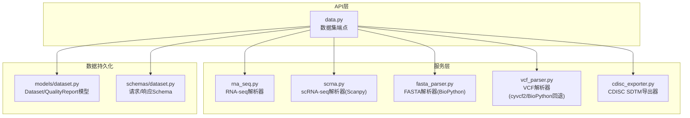
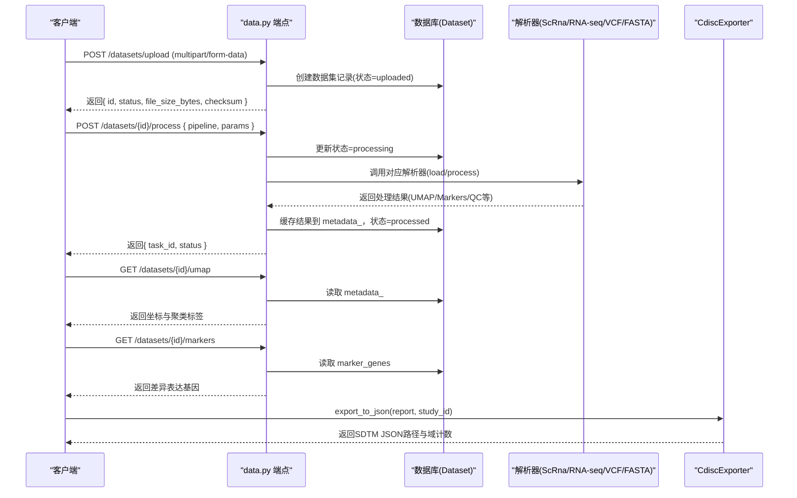
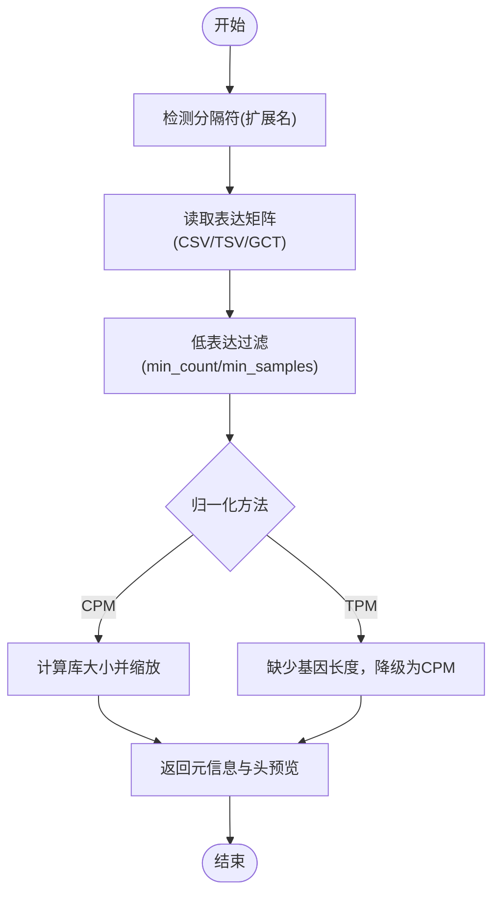
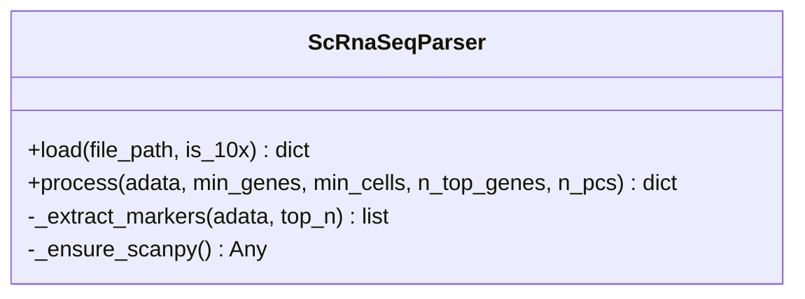
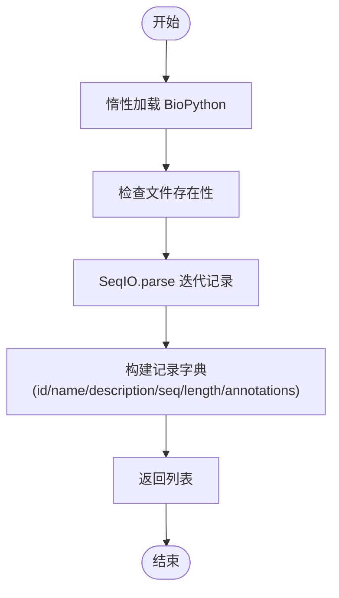
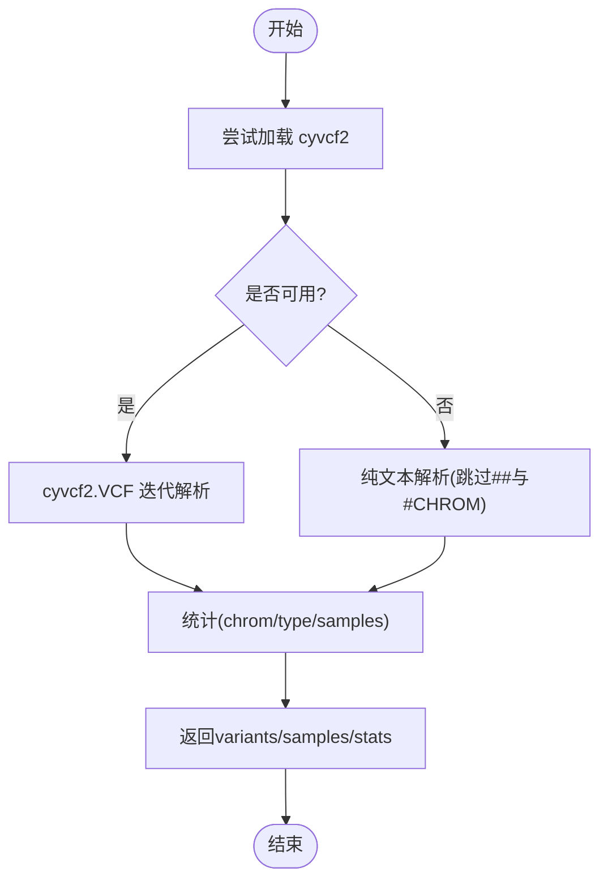
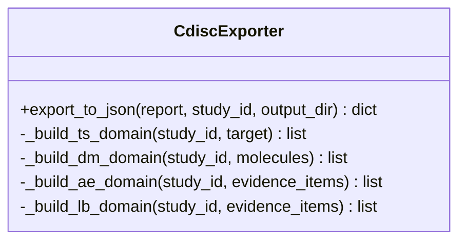
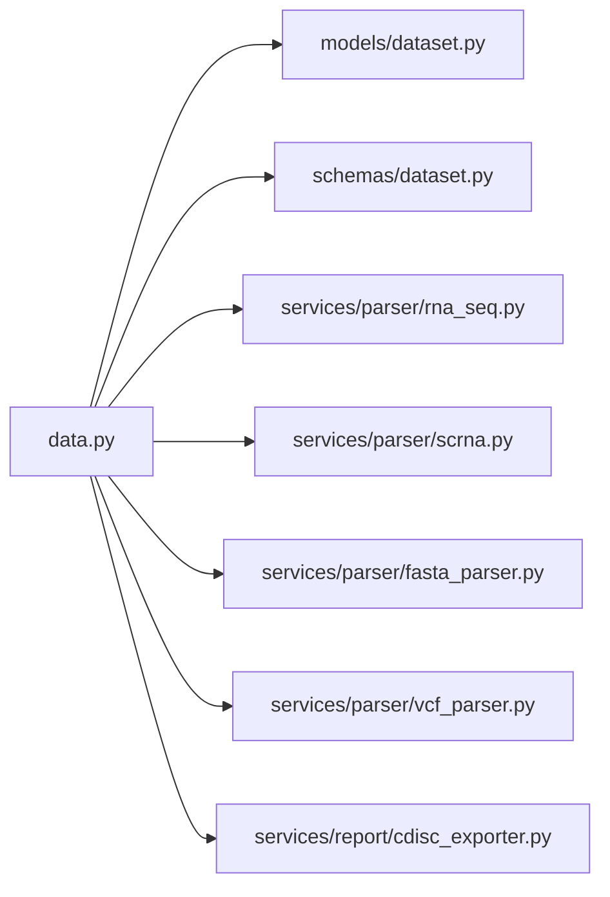

# 数据整合平台（子系统A）

<cite>
**本文引用的文件列表**
- [backend/app/services/parser/rna_seq.py](file://backend/app/services/parser/rna_seq.py)
- [backend/app/services/parser/scrna.py](file://backend/app/services/parser/scrna.py)
- [backend/app/services/parser/fasta_parser.py](file://backend/app/services/parser/fasta_parser.py)
- [backend/app/services/parser/vcf_parser.py](file://backend/app/services/parser/vcf_parser.py)
- [backend/app/services/report/cdisc_exporter.py](file://backend/app/services/report/cdisc_exporter.py)
- [backend/app/api/v1/data.py](file://backend/app/api/v1/data.py)
- [backend/app/schemas/dataset.py](file://backend/app/schemas/dataset.py)
- [backend/app/models/dataset.py](file://backend/app/models/dataset.py)
- [tests/test_fasta_parser.py](file://tests/test_fasta_parser.py)
- [tests/test_vcf_parser.py](file://tests/test_vcf_parser.py)
- [tests/test_cdisc_exporter.py](file://tests/test_cdisc_exporter.py)
</cite>

## 目录
1. [简介](#简介)
2. [项目结构](#项目结构)
3. [核心组件](#核心组件)
4. [架构总览](#架构总览)
5. [详细组件分析](#详细组件分析)
6. [依赖关系分析](#依赖关系分析)
7. [性能与优化建议](#性能与优化建议)
8. [故障排查指南](#故障排查指南)
9. [结论](#结论)
10. [附录：API 调用示例与输出规范](#附录api-调用示例与输出规范)

## 简介
本文件面向AI药物设计系统的数据整合平台（子系统A），聚焦多组学数据的接入、解析、预处理与标准化导出能力。覆盖以下关键特性：
- RNA-seq 批量表达数据（CSV/TSV/GCT）上传与解析，支持低表达过滤与归一化（CPM/TPM降级策略）
- 10x Genomics 单细胞数据（h5/mtx/csv）接入，封装Scanpy标准流水线：质控→归一化→高变基因→PCA→UMAP→Leiden聚类→差异表达标记基因提取
- FASTA/FASTQ/VCF 文件解析（FASTA基于BioPython；VCF优先cyvcf2，未安装时回退纯文本解析）
- CDISC SDTM JSON 导出（TS/DM/AE/LB域）
- 数据质量治理接口（完整性/一致性评估占位，可扩展）

文档提供每个数据格式的解析流程、参数配置、质量控制指标与输出格式说明，并给出API调用示例、错误处理与性能优化建议。

## 项目结构
数据整合平台位于后端服务中，采用分层组织：
- API层：FastAPI路由，负责上传、查询、触发处理、获取结果
- 模型与Schema：SQLAlchemy模型定义与Pydantic响应/请求校验
- 服务层：各数据类型的解析器与报告导出器
- 测试：针对解析器与导出器的单元测试

图表来源
- [backend/app/api/v1/data.py:1-369](file://backend/app/api/v1/data.py#L1-L369)
- [backend/app/services/parser/rna_seq.py:1-106](file://backend/app/services/parser/rna_seq.py#L1-L106)
- [backend/app/services/parser/scrna.py:1-160](file://backend/app/services/parser/scrna.py#L1-L160)
- [backend/app/services/parser/fasta_parser.py:1-100](file://backend/app/services/parser/fasta_parser.py#L1-L100)
- [backend/app/services/parser/vcf_parser.py:1-136](file://backend/app/services/parser/vcf_parser.py#L1-L136)
- [backend/app/services/report/cdisc_exporter.py:1-187](file://backend/app/services/report/cdisc_exporter.py#L1-L187)
- [backend/app/models/dataset.py:1-70](file://backend/app/models/dataset.py#L1-L70)
- [backend/app/schemas/dataset.py:1-147](file://backend/app/schemas/dataset.py#L1-L147)

章节来源
- [backend/app/api/v1/data.py:1-369](file://backend/app/api/v1/data.py#L1-L369)
- [backend/app/models/dataset.py:1-70](file://backend/app/models/dataset.py#L1-L70)
- [backend/app/schemas/dataset.py:1-147](file://backend/app/schemas/dataset.py#L1-L147)

## 核心组件
- RnaSeqParser：加载CSV/TSV/GCT表达矩阵，支持低表达过滤与CPM/TPM归一化（无长度信息时降级为CPM）
- ScRnaSeqParser：封装Scanpy工作流，支持10x h5/mtx/csv输入，执行QC、归一化、高变基因选择、PCA、UMAP、Leiden聚类与rank_genes_groups
- FastaParser：基于BioPython的FASTA解析与写入，支持批量读取与注释提取
- VcfParser：优先使用cyvcf2解析VCF，未安装时回退到纯文本解析，返回变异预览与统计
- CdiscExporter：将内部报告转换为SDTM JSON（TS/DM/AE/LB域），生成带时间戳的文件名

章节来源
- [backend/app/services/parser/rna_seq.py:1-106](file://backend/app/services/parser/rna_seq.py#L1-L106)
- [backend/app/services/parser/scrna.py:1-160](file://backend/app/services/parser/scrna.py#L1-L160)
- [backend/app/services/parser/fasta_parser.py:1-100](file://backend/app/services/parser/fasta_parser.py#L1-L100)
- [backend/app/services/parser/vcf_parser.py:1-136](file://backend/app/services/parser/vcf_parser.py#L1-L136)
- [backend/app/services/report/cdisc_exporter.py:1-187](file://backend/app/services/report/cdisc_exporter.py#L1-L187)

## 架构总览
数据从前端或外部系统通过API上传，后端保存至文件系统并记录元数据；随后根据数据类型触发相应解析器进行预处理；结果缓存于数据库metadata_字段，并通过专用接口返回可视化与差异表达结果；最终可通过CDISC导出器生成临床试验标准数据。

图表来源
- [backend/app/api/v1/data.py:54-254](file://backend/app/api/v1/data.py#L54-L254)
- [backend/app/services/parser/scrna.py:75-134](file://backend/app/services/parser/scrna.py#L75-L134)
- [backend/app/services/report/cdisc_exporter.py:28-88](file://backend/app/services/report/cdisc_exporter.py#L28-L88)

## 详细组件分析

### RNA-seq 批量表达数据解析器（RnaSeqParser）
- 支持格式：CSV、TSV、GCT
- 解析流程：
  - 自动推断分隔符（tsv/gct用制表符，csv用逗号）
  - 读取表达矩阵（行=基因，列=样本）
  - 低表达过滤：按最小计数与最小样本数阈值筛选
  - 归一化：CPM（每百万计数）；TPM需要基因长度，当前实现无长度信息时降级为CPM并记录警告
- 输出：
  - 元信息：n_genes、n_samples、columns、index_name、head预览
  - 归一化后的DataFrame（供下游分析）

图表来源
- [backend/app/services/parser/rna_seq.py:32-86](file://backend/app/services/parser/rna_seq.py#L32-L86)

章节来源
- [backend/app/services/parser/rna_seq.py:1-106](file://backend/app/services/parser/rna_seq.py#L1-L106)

### scRNA-seq 解析器（ScRnaSeqParser，Scanpy流水线）
- 支持格式：10x h5、10x mtx（目录）、CSV
- 处理流程：
  - 加载AnnData对象
  - 质控：过滤细胞与基因、计算QC指标（含线粒体比例）
  - 归一化：total normalization + log1p
  - 高变基因选择
  - 降维：scale → PCA → neighbors → UMAP
  - 聚类：Leiden
  - 差异表达：rank_genes_groups（t-test）
- 输出：
  - QC后细胞/基因数量、聚类数
  - UMAP坐标与聚类标签（前100条预览）
  - 标记基因列表（cluster/gene/score）
  - 质量指标：每细胞基因数中位数、每细胞总计数中位数、最大线粒体比例

图表来源
- [backend/app/services/parser/scrna.py:13-159](file://backend/app/services/parser/scrna.py#L13-L159)

章节来源
- [backend/app/services/parser/scrna.py:1-160](file://backend/app/services/parser/scrna.py#L1-L160)

### FASTA 解析器（FastaParser）
- 基于BioPython SeqIO，支持批量解析与单序列解析
- 输出：每条记录的id、name、description、sequence、length、annotations
- 写入：write_fasta静态方法，按80字符换行写入

图表来源
- [backend/app/services/parser/fasta_parser.py:29-58](file://backend/app/services/parser/fasta_parser.py#L29-L58)

章节来源
- [backend/app/services/parser/fasta_parser.py:1-100](file://backend/app/services/parser/fasta_parser.py#L1-L100)
- [tests/test_fasta_parser.py:1-124](file://tests/test_fasta_parser.py#L1-L124)

### VCF 解析器（VcfParser）
- 优先使用cyvcf2解析VCF，未安装时回退到纯文本解析
- 输出：
  - variants预览（最多100条）
  - samples列表
  - 统计：按染色体/类型计数、样本数
- 降级路径：跳过注释头、解析#CHROM行提取样本、逐行解析变异字段

图表来源
- [backend/app/services/parser/vcf_parser.py:32-87](file://backend/app/services/parser/vcf_parser.py#L32-L87)
- [backend/app/services/parser/vcf_parser.py:89-135](file://backend/app/services/parser/vcf_parser.py#L89-L135)

章节来源
- [backend/app/services/parser/vcf_parser.py:1-136](file://backend/app/services/parser/vcf_parser.py#L1-L136)
- [tests/test_vcf_parser.py:1-128](file://tests/test_vcf_parser.py#L1-L128)

### CDISC SDTM 导出器（CdiscExporter）
- 目标：将内部报告转换为SDTM JSON（TS/DM/AE/LB域）
- 输入：report包含target、evidence_items、related_molecules
- 输出：JSON文件路径、各域记录数、标准版本、生成时间

图表来源
- [backend/app/services/report/cdisc_exporter.py:22-186](file://backend/app/services/report/cdisc_exporter.py#L22-L186)

章节来源
- [backend/app/services/report/cdisc_exporter.py:1-187](file://backend/app/services/report/cdisc_exporter.py#L1-L187)
- [tests/test_cdisc_exporter.py:1-205](file://tests/test_cdisc_exporter.py#L1-L205)

## 依赖关系分析
- API层依赖：
  - FastAPI路由（data.py）
  - SQLAlchemy异步会话（get_db）
  - Pydantic Schema（dataset.py）
  - 配置（Settings，用于存储路径）
- 服务层依赖：
  - pandas（RnaSeqParser）
  - scanpy（ScRnaSeqParser）
  - biopython（FastaParser）
  - cyvcf2（VcfParser，可选）
- 导出器依赖：
  - json、datetime、loguru

图表来源
- [backend/app/api/v1/data.py:1-369](file://backend/app/api/v1/data.py#L1-L369)
- [backend/app/models/dataset.py:1-70](file://backend/app/models/dataset.py#L1-L70)
- [backend/app/schemas/dataset.py:1-147](file://backend/app/schemas/dataset.py#L1-L147)

章节来源
- [backend/app/api/v1/data.py:1-369](file://backend/app/api/v1/data.py#L1-L369)
- [backend/app/models/dataset.py:1-70](file://backend/app/models/dataset.py#L1-L70)
- [backend/app/schemas/dataset.py:1-147](file://backend/app/schemas/dataset.py#L1-L147)

## 性能与优化建议
- 惰性加载：解析器在首次使用时才导入重型依赖（pandas、scanpy、biopython、cyvcf2），避免启动开销
- 大文件限制：
  - VCF解析默认仅返回前100条预览，max_variants可控制上限
  - scRNA-seq UMAP坐标与聚类标签仅返回前100条预览，避免传输过大
- 并行度：ScRnaSeqParser支持n_jobs参数，可按CPU核数调整
- 内存管理：
  - 对超大表达矩阵，建议在RnaSeqParser中增加分块读取与稀疏表示
  - Scanpy处理时可结合AnnData的稀疏矩阵与缓存机制
- I/O优化：
  - 文件保存路径按项目隔离，减少锁竞争
  - 导出JSON时使用UTF-8编码与缩进便于调试

[本节为通用指导，不直接分析具体文件]

## 故障排查指南
- 依赖缺失：
  - pandas未安装：RnaSeqParser会抛出运行时异常
  - scanpy未安装：ScRnaSeqParser会抛出运行时异常
  - biopython未安装：FastaParser会抛出运行时异常
  - cyvcf2未安装：VcfParser回退到纯文本解析并记录警告
- 文件不存在：所有解析器在文件不存在时抛出文件未找到异常
- 空FASTA：parse_single对空文件抛出值错误
- 数据处理失败：
  - scRNA-seq处理异常时，API会将状态回退为“uploaded”并返回任务失败
- 质量报告为空：
  - 若尚未生成质量报告，GET /quality返回空指标与空问题列表

章节来源
- [backend/app/services/parser/rna_seq.py:22-30](file://backend/app/services/parser/rna_seq.py#L22-L30)
- [backend/app/services/parser/scrna.py:28-36](file://backend/app/services/parser/scrna.py#L28-L36)
- [backend/app/services/parser/fasta_parser.py:19-27](file://backend/app/services/parser/fasta_parser.py#L19-L27)
- [backend/app/services/parser/vcf_parser.py:21-30](file://backend/app/services/parser/vcf_parser.py#L21-L30)
- [backend/app/api/v1/data.py:216-247](file://backend/app/api/v1/data.py#L216-L247)
- [backend/app/api/v1/data.py:309-340](file://backend/app/api/v1/data.py#L309-L340)

## 结论
数据整合平台提供了完善的多组学数据接入与处理能力，涵盖RNA-seq与scRNA-seq的标准流水线、FASTA/VCF解析以及CDISC SDTM导出。通过API统一暴露上传、处理、结果查询与质量报告接口，满足AI药物设计系统对数据治理与标准化的需求。后续可在质量评估模块增强完整性/一致性度量，并在大规模数据处理上引入分布式与增量计算以提升吞吐。

[本节为总结，不直接分析具体文件]

## 附录：API 调用示例与输出规范

### 上传数据集
- 方法：POST /datasets/upload
- 表单字段：
  - file：二进制文件
  - project_id：UUID
  - name：字符串
  - data_type：枚举（rna_seq | scrna | vcf | fasta | wes | wgs | ihc | proteomics | metabolomics）
  - metadata：可选JSON字符串
- 成功响应：
  - data.id：UUID
  - data.status："uploaded"
  - data.file_size_bytes：整数
  - data.checksum：sha256哈希
  - meta.request_id：请求追踪ID

章节来源
- [backend/app/api/v1/data.py:54-121](file://backend/app/api/v1/data.py#L54-L121)
- [backend/app/schemas/dataset.py:57-64](file://backend/app/schemas/dataset.py#L57-L64)

### 触发数据处理（以scrna为例）
- 方法：POST /datasets/{dataset_id}/process
- 请求体：
  - pipeline："scrna_standard"
  - params：可选参数（如min_genes、min_cells、n_top_genes、n_pcs）
- 成功响应：
  - data.task_id：UUID
  - data.status："completed"
- 失败响应：
  - data.status："failed"（当scRNA-seq处理异常时）

章节来源
- [backend/app/api/v1/data.py:191-254](file://backend/app/api/v1/data.py#L191-L254)
- [backend/app/schemas/dataset.py:66-80](file://backend/app/schemas/dataset.py#L66-L80)

### 获取UMAP坐标与聚类标签
- 方法：GET /datasets/{dataset_id}/umap
- 响应：
  - data.coordinates：二维坐标数组
  - data.clusters：聚类标签数组
  - data.gene_names：基因名称（预留）

章节来源
- [backend/app/api/v1/data.py:257-281](file://backend/app/api/v1/data.py#L257-L281)
- [backend/app/schemas/dataset.py:82-87](file://backend/app/schemas/dataset.py#L82-L87)

### 获取差异表达基因
- 方法：GET /datasets/{dataset_id}/markers
- 响应：
  - data.markers：差异表达基因列表（含gene_symbol、cluster、logfoldchange、pval_adj、pct_expr）
  - data.clusters：聚类集合

章节来源
- [backend/app/api/v1/data.py:284-306](file://backend/app/api/v1/data.py#L284-L306)
- [backend/app/schemas/dataset.py:90-104](file://backend/app/schemas/dataset.py#L90-L104)

### 获取数据质量报告
- 方法：GET /datasets/{dataset_id}/quality
- 响应：
  - data.completeness/accuracy/consistency：浮点数（可为空）
  - data.issues：质量问题项列表（severity、field、message）

章节来源
- [backend/app/api/v1/data.py:309-340](file://backend/app/api/v1/data.py#L309-L340)
- [backend/app/schemas/dataset.py:115-123](file://backend/app/schemas/dataset.py#L115-L123)

### CDISC SDTM 导出
- 调用方式：CdiscExporter.export_to_json(report, study_id, output_dir)
- 返回：
  - format："sdtm-json"
  - study_id：研究标识
  - datasets：各域记录数
  - filepath：生成的JSON文件路径
  - standard："SDTM-IG 3.2"
  - generated_at：ISO时间戳

章节来源
- [backend/app/services/report/cdisc_exporter.py:28-88](file://backend/app/services/report/cdisc_exporter.py#L28-L88)