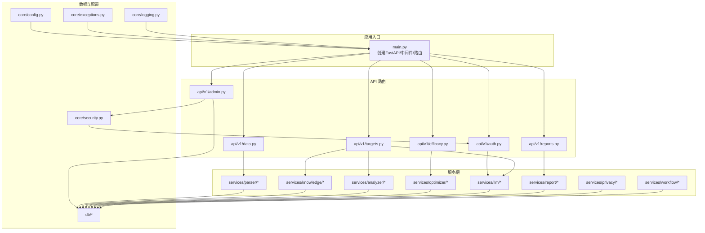
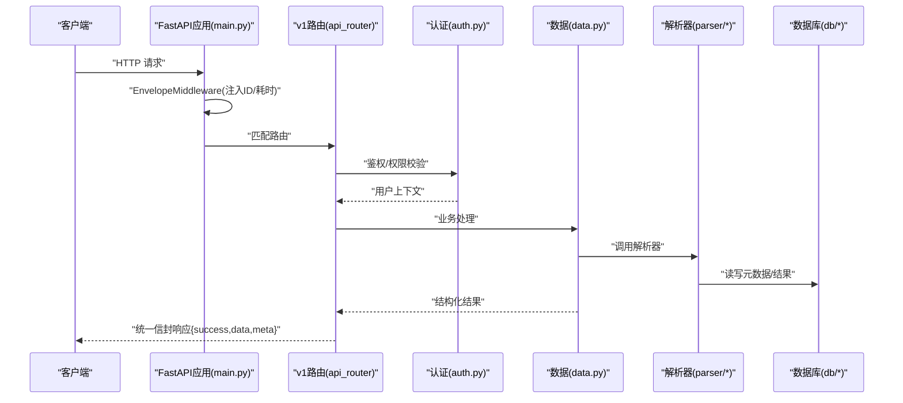
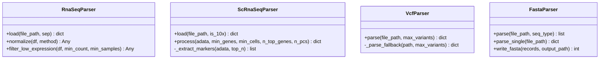
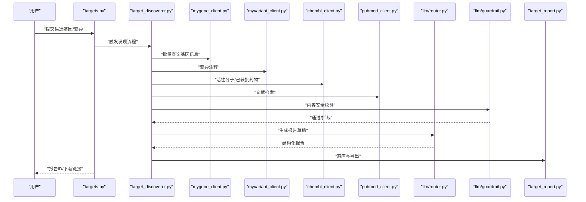
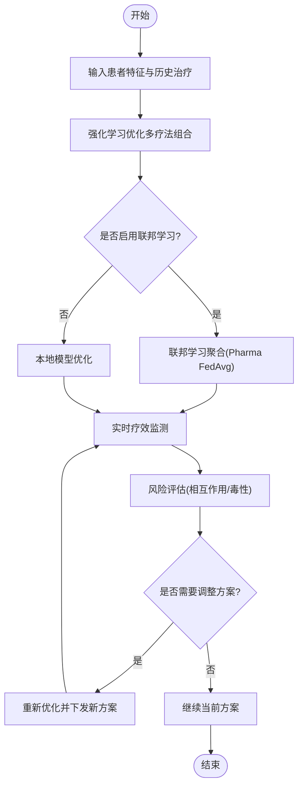
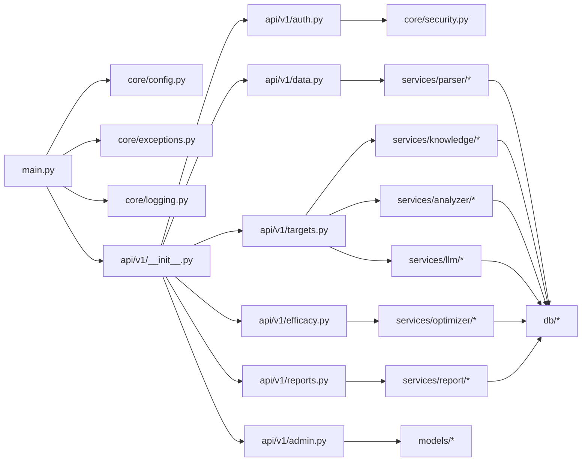

# 核心功能特性

<cite>
**本文引用的文件**
- [README.md](file://precision-drug-design/README.md)
- [main.py](file://precision-drug-design/backend/app/main.py)
- [api_router.py](file://precision-drug-design/backend/app/api/v1/__init__.py)
- [auth.py](file://precision-drug-design/backend/app/api/v1/auth.py)
- [data.py](file://precision-drug-design/backend/app/api/v1/data.py)
- [targets.py](file://precision-drug-design/backend/app/api/v1/targets.py)
- [efficacy.py](file://precision-drug-design/backend/app/api/v1/efficacy.py)
- [reports.py](file://precision-drug-design/backend/app/api/v1/reports.py)
- [admin.py](file://precision-drug-design/backend/app/api/v1/admin.py)
- [user.py](file://precision-drug-design/backend/app/models/user.py)
- [audit_log.py](file://precision-drug-design/backend/app/models/audit_log.py)
- [dataset.py](file://precision-drug-design/backend/app/models/dataset.py)
- [target.py](file://precision-drug-design/backend/app/models/target.py)
- [report.py](file://precision-drug-design/backend/app/models/report.py)
- [hypothesis.py](file://precision-drug-design/backend/app/models/hypothesis.py)
- [project.py](file://precision-drug-design/backend/app/models/project.py)
- [molecule.py](file://precision-drug-design/backend/app/models/molecule.py)
- [config.py](file://precision-drug-design/backend/app/core/config.py)
- [security.py](file://precision-drug-design/backend/app/core/security.py)
- [exceptions.py](file://precision-drug-design/backend/app/core/exceptions.py)
- [logging.py](file://precision-drug-design/backend/app/core/logging.py)
- [deps.py](file://precision-drug-design/backend/app/core/deps.py)
- [base.py](file://precision-drug-design/backend/app/db/base.py)
- [session.py](file://precision-drug-design/backend/app/db/session.py)
- [types.py](file://precision-drug-design/backend/app/db/types.py)
- [init_db.py](file://precision-drug-design/backend/app/db/init_db.py)
- [rna_seq.py](file://precision-drug-design/backend/app/services/parser/rna_seq.py)
- [scrna.py](file://precision-drug-design/backend/app/services/parser/scrna.py)
- [vcf_parser.py](file://precision-drug-design/backend/app/services/parser/vcf_parser.py)
- [fasta_parser.py](file://precision-drug-design/backend/app/services/parser/fasta_parser.py)
- [mygene_client.py](file://precision-drug-design/backend/app/services/knowledge/mygene_client.py)
- [chembl_client.py](file://precision-drug-design/backend/app/services/knowledge/chembl_client.py)
- [pubmed_client.py](file://precision-drug-design/backend/app/services/knowledge/pubmed_client.py)
- [myvariant_client.py](file://precision-drug-design/backend/app/services/knowledge/myvariant_client.py)
- [target_discoverer.py](file://precision-drug-design/backend/app/services/analyzer/target_discoverer.py)
- [target_report.py](file://precision-drug-design/backend/app/services/report/target_report.py)
- [cdisc_exporter.py](file://precision-drug-design/backend/app/services/report/cdisc_exporter.py)
- [treatment_designer.py](file://precision-drug-design/backend/app/services/optimizer/treatment_designer.py)
- [treatment_optimizer.py](file://precision-drug-design/backend/app/services/optimizer/treatment_optimizer.py)
- [efficacy_monitor.py](file://precision-drug-design/backend/app/services/optimizer/efficacy_monitor.py)
- [federated_learning.py](file://precision-drug-design/backend/app/services/optimizer/federated_learning.py)
- [pharma_fedavg.py](file://precision-drug-design/backend/app/services/optimizer/pharma_fedavg.py)
- [fl_client.py](file://precision-drug-design/backend/app/services/optimizer/fl_client.py)
- [risk_assessor.py](file://precision-drug-design/backend/app/services/optimizer/risk_assessor.py)
- [guardrail.py](file://precision-drug-design/backend/app/services/llm/guardrail.py)
- [router.py](file://precision-drug-design/backend/app/services/llm/router.py)
- [rag.py](file://precision-drug-design/backend/app/services/llm/rag.py)
- [cost_tracker.py](file://precision-drug-design/backend/app/services/llm/cost_tracker.py)
- [privacy_layer.py](file://precision-drug-design/backend/app/services/privacy/privacy_layer.py)
- [differential_privacy.py](file://precision-drug-design/backend/app/services/privacy/differential_privacy.py)
- [data_masker.py](file://precision-drug-design/backend/app/services/privacy/data_masker.py)
- [feedback_loop.py](file://precision-drug-design/backend/app/services/workflow/feedback_loop.py)
- [lims_importer.py](file://precision-drug-design/backend/app/services/workflow/lims_importer.py)
- [nextflow_runner.py](file://precision-drug-design/backend/app/services/workflow/nextflow_runner.py)
</cite>

## 目录
1. [简介](#简介)
2. [项目结构](#项目结构)
3. [核心组件](#核心组件)
4. [架构总览](#架构总览)
5. [详细组件分析](#详细组件分析)
6. [依赖关系分析](#依赖关系分析)
7. [性能考量](#性能考量)
8. [故障排查指南](#故障排查指南)
9. [结论](#结论)
10. [附录：使用示例与预期输出](#附录使用示例与预期输出)

## 简介
本系统为“AI 模式精准药物设计平台”，围绕四大子系统构建：A 极限诊断数据整合平台、B AI 辅助靶点发现引擎、C 并行治疗方案设计系统、D AI 模式协作平台。后端基于 FastAPI，前端采用 Streamlit；数据库支持 SQLite（开发）与 PostgreSQL（生产），并集成 Redis、Chroma、对象存储与工作流引擎等基础设施。系统提供统一信封响应格式、全局中间件、RBAC 权限与审计日志、LLM 安全护栏与多知识库检索能力，覆盖从多组学数据处理到报告生成与方案优化的端到端流程。

## 项目结构
- 后端应用入口负责创建 FastAPI 实例、注册中间件（统一信封、CORS）、异常处理器与 v1 路由，暴露健康检查与指标端点。
- API 层按模块划分（认证、数据、靶点、疗效、报告、管理、联邦学习、隐私、假设、分子、聊天、健康等）。
- 服务层按领域组织：解析器（RNA-seq/scRNA/VCF/FASTA）、知识库客户端（MyGene/ChEMBL/PubMed/MyVariant）、分析器（靶点发现/分子设计/通路/网络）、优化器（治疗方案/强化学习/风险）、LLM（路由/护栏/RAG/成本跟踪）、隐私（差分隐私/掩码/隐私层）、报告（CDISC/靶点报告）、工作流（Nextflow/LIMS/反馈循环）。
- 模型与 Schema 分别定义 ORM 实体与请求/响应结构。
- 数据库会话、类型与初始化脚本位于 db 包。
- 前端页面通过 Streamlit 提供可视化交互。



图表来源
- [main.py:187-248](file://precision-drug-design/backend/app/main.py#L187-L248)
- [api_router.py](file://precision-drug-design/backend/app/api/v1/__init__.py)

章节来源
- [README.md:29-42](file://precision-drug-design/README.md#L29-L42)
- [main.py:187-248](file://precision-drug-design/backend/app/main.py#L187-L248)

## 核心组件
- 数据整合平台（子系统 A）
  - 支持 RNA-seq CSV/TSV/GCT、scRNA-seq 10x MTX/HDF5/CSV、VCF 4.x、FASTA/GenBank 序列解析。
  - 标准预处理：过滤→归一化→高变基因选择→PCA→UMAP→Leiden 聚类→标记基因提取。
  - 差异表达分析与质量评估，支持 CDISC SDTM 导出。
- 靶点发现引擎（子系统 B）
  - 整合 MyGene.info、MyVariant.info、ChEMBL、PubMed 知识库，结合 RDKit 类药性评估。
  - LLM 驱动的报告生成与证据分级，安全护栏拒绝越界建议。
- 治疗方案设计（子系统 C）
  - 多疗法组合优化（靶向+免疫+化疗），强化学习与联邦学习协同。
  - 实时疗效监测与动态调整，风险评估与药物相互作用预警。
- 协作平台（子系统 D）
  - RBAC 五角色权限控制，JWT 认证与刷新令牌。
  - 假设沙盒、强制深度分析、审计日志（append-only，不可篡改）。

章节来源
- [README.md:44-78](file://precision-drug-design/README.md#L44-L78)

## 架构总览
系统以 FastAPI 为核心，统一信封中间件注入追踪与耗时信息，CORS 跨域支持，异常处理器统一错误返回。API 路由分发至各业务服务，服务层调用解析器、知识库、分析器、优化器、LLM、报告与隐私模块，持久化至数据库并通过对象存储与工作流引擎扩展能力。



图表来源
- [main.py:29-185](file://precision-drug-design/backend/app/main.py#L29-L185)
- [api_router.py](file://precision-drug-design/backend/app/api/v1/__init__.py)
- [auth.py](file://precision-drug-design/backend/app/api/v1/auth.py)
- [data.py](file://precision-drug-design/backend/app/api/v1/data.py)
- [base.py](file://precision-drug-design/backend/app/db/base.py)
- [session.py](file://precision-drug-design/backend/app/db/session.py)

## 详细组件分析

### 子系统A：数据整合平台（RNA-seq / scRNA-seq / VCF / FASTA）
- 实现要点
  - RNA-seq 解析器支持 CSV/TSV/GCT，惰性加载 pandas，提供加载、过滤低表达、CPM/TPM 归一化接口。
  - scRNA-seq 解析器封装 Scanpy 工作流：质控、归一化、高变基因、PCA/UMAP、Leiden 聚类与标记基因提取。
  - VCF 解析器优先使用 cyvcf2，未安装时回退纯文本解析，支持最大变异数限制与统计摘要。
  - FASTA 解析器基于 BioPython SeqIO，支持批量读取与写入。
- 使用场景
  - 上传批量表达矩阵或单细胞数据，触发标准化预处理与可视化预览。
  - 导入 VCF 变异清单进行质控与分布统计，快速定位高置信位点。
  - 导入参考序列或引物序列用于后续比对与注释。
- 技术优势
  - 惰性加载关键依赖，降低启动开销。
  - 降级策略保障可用性（如 cyvcf2 缺失）。
  - 标准化流程可复现，便于流水线集成。



图表来源
- [rna_seq.py:15-106](file://precision-drug-design/backend/app/services/parser/rna_seq.py#L15-L106)
- [scrna.py:13-160](file://precision-drug-design/backend/app/services/parser/scrna.py#L13-L160)
- [vcf_parser.py:14-136](file://precision-drug-design/backend/app/services/parser/vcf_parser.py#L14-L136)
- [fasta_parser.py:12-100](file://precision-drug-design/backend/app/services/parser/fasta_parser.py#L12-L100)

章节来源
- [rna_seq.py:15-106](file://precision-drug-design/backend/app/services/parser/rna_seq.py#L15-L106)
- [scrna.py:13-160](file://precision-drug-design/backend/app/services/parser/scrna.py#L13-L160)
- [vcf_parser.py:14-136](file://precision-drug-design/backend/app/services/parser/vcf_parser.py#L14-L136)
- [fasta_parser.py:12-100](file://precision-drug-design/backend/app/services/parser/fasta_parser.py#L12-L100)

### 子系统B：靶点发现引擎（MyGene/ChEMBL/PubMed + LLM 报告）
- 实现要点
  - 知识库客户端：MyGene、MyVariant、ChEMBL、PubMed 提供查询与注释能力。
  - 靶点发现分析器整合多源证据，结合 LLM 生成报告并进行证据分级。
  - 报告模块支持靶点报告与 CDISC 导出。
  - LLM 网关与安全护栏确保合规输出，拒绝诊断/用药建议。
- 使用场景
  - 输入候选基因/变异列表，自动聚合文献、活性分子与临床信息，生成带证据分级的靶点报告。
  - 对报告进行版本管理与对比，支撑决策评审。
- 技术优势
  - 多源异构数据融合，增强证据强度。
  - LLM 报告自动化提升产出效率，护栏机制保障合规。



图表来源
- [targets.py](file://precision-drug-design/backend/app/api/v1/targets.py)
- [target_discoverer.py](file://precision-drug-design/backend/app/services/analyzer/target_discoverer.py)
- [mygene_client.py](file://precision-drug-design/backend/app/services/knowledge/mygene_client.py)
- [myvariant_client.py](file://precision-drug-design/backend/app/services/knowledge/myvariant_client.py)
- [chembl_client.py](file://precision-drug-design/backend/app/services/knowledge/chembl_client.py)
- [pubmed_client.py](file://precision-drug-design/backend/app/services/knowledge/pubmed_client.py)
- [router.py](file://precision-drug-design/backend/app/services/llm/router.py)
- [guardrail.py](file://precision-drug-design/backend/app/services/llm/guardrail.py)
- [target_report.py](file://precision-drug-design/backend/app/services/report/target_report.py)

章节来源
- [targets.py](file://precision-drug-design/backend/app/api/v1/targets.py)
- [target_discoverer.py](file://precision-drug-design/backend/app/services/analyzer/target_discoverer.py)
- [target_report.py](file://precision-drug-design/backend/app/services/report/target_report.py)
- [guardrail.py](file://precision-drug-design/backend/app/services/llm/guardrail.py)
- [router.py](file://precision-drug-design/backend/app/services/llm/router.py)

### 子系统C：治疗方案设计与实时疗效监测
- 实现要点
  - 治疗方案设计器与优化器支持多疗法组合优化，结合强化学习策略搜索最优方案。
  - 联邦学习模块与 Pharma FedAvg 算法支持跨机构协作训练，保护数据隐私。
  - 疗效监测模块整合多模态数据，动态追踪肿瘤负荷与生物标志物变化。
  - 风险评估器提供药物相互作用与不良反应预警。
- 使用场景
  - 根据患者基因组与转录组特征，自动生成个性化治疗组合建议。
  - 在随访中持续更新模型参数，动态调整剂量与周期。
- 技术优势
  - 联邦学习在不共享原始数据的前提下联合建模。
  - 实时监测与闭环反馈提升治疗依从性与有效性。



图表来源
- [treatment_designer.py](file://precision-drug-design/backend/app/services/optimizer/treatment_designer.py)
- [treatment_optimizer.py](file://precision-drug-design/backend/app/services/optimizer/treatment_optimizer.py)
- [federated_learning.py](file://precision-drug-design/backend/app/services/optimizer/federated_learning.py)
- [pharma_fedavg.py](file://precision-drug-design/backend/app/services/optimizer/pharma_fedavg.py)
- [fl_client.py](file://precision-drug-design/backend/app/services/optimizer/fl_client.py)
- [efficacy_monitor.py](file://precision-drug-design/backend/app/services/optimizer/efficacy_monitor.py)
- [risk_assessor.py](file://precision-drug-design/backend/app/services/optimizer/risk_assessor.py)

章节来源
- [treatment_designer.py](file://precision-drug-design/backend/app/services/optimizer/treatment_designer.py)
- [treatment_optimizer.py](file://precision-drug-design/backend/app/services/optimizer/treatment_optimizer.py)
- [federated_learning.py](file://precision-drug-design/backend/app/services/optimizer/federated_learning.py)
- [pharma_fedavg.py](file://precision-drug-design/backend/app/services/optimizer/pharma_fedavg.py)
- [fl_client.py](file://precision-drug-design/backend/app/services/optimizer/fl_client.py)
- [efficacy_monitor.py](file://precision-drug-design/backend/app/services/optimizer/efficacy_monitor.py)
- [risk_assessor.py](file://precision-drug-design/backend/app/services/optimizer/risk_assessor.py)

### 子系统D：协作平台（RBAC 权限与审计日志）
- 实现要点
  - 用户模型与权限体系支持 founder/pi/researcher/doctor/engineer 五角色。
  - 认证模块提供登录、刷新令牌与会话管理。
  - 审计日志模型记录关键操作，保证 append-only 与不可篡改。
  - 管理员接口支持权限分配与审计查看。
- 使用场景
  - 项目负责人分配成员角色与资源访问范围。
  - 审计员追溯敏感操作，满足合规要求。
- 技术优势
  - 细粒度权限控制与全链路审计，降低内部风险。
  - JWT 无状态认证提升可扩展性。

```mermaid
classDiagram
class User {
+id
+email
+role
+is_active
+created_at
+updated_at
}
class AuditLog {
+id
+user_id
+action
+resource_type
+resource_id
+details
+created_at
}
class Project {
+id
+name
+owner_id
+status
+created_at
+updated_at
}
class Hypothesis {
+id
+project_id
+title
+status
+created_at
+updated_at
}
class Target {
+id
+project_id
+gene_symbol
+evidence_level
+created_at
+updated_at
}
class Report {
+id
+project_id
+type
+content_ref
+created_at
+updated_at
}
class Molecule {
+id
+project_id
+smiles
+properties
+created_at
+updated_at
}
User ||--o{ Project : "拥有"
Project ||--o{ Hypothesis : "包含"
Project ||--o{ Target : "包含"
Project ||--o{ Report : "包含"
Project ||--o{ Molecule : "包含"
User ||--o{ AuditLog : "产生"
```

图表来源
- [user.py](file://precision-drug-design/backend/app/models/user.py)
- [audit_log.py](file://precision-drug-design/backend/app/models/audit_log.py)
- [project.py](file://precision-drug-design/backend/app/models/project.py)
- [hypothesis.py](file://precision-drug-design/backend/app/models/hypothesis.py)
- [target.py](file://precision-drug-design/backend/app/models/target.py)
- [report.py](file://precision-drug-design/backend/app/models/report.py)
- [molecule.py](file://precision-drug-design/backend/app/models/molecule.py)

章节来源
- [user.py](file://precision-drug-design/backend/app/models/user.py)
- [audit_log.py](file://precision-drug-design/backend/app/models/audit_log.py)
- [auth.py](file://precision-drug-design/backend/app/api/v1/auth.py)
- [admin.py](file://precision-drug-design/backend/app/api/v1/admin.py)

## 依赖关系分析
- 应用入口依赖配置、异常处理器、日志与路由。
- API 路由依赖认证、权限与具体业务服务。
- 服务层依赖解析器、知识库、分析器、优化器、LLM、报告、隐私与工作流模块。
- 数据层依赖数据库会话与类型定义。



图表来源
- [main.py:187-248](file://precision-drug-design/backend/app/main.py#L187-L248)
- [api_router.py](file://precision-drug-design/backend/app/api/v1/__init__.py)
- [auth.py](file://precision-drug-design/backend/app/api/v1/auth.py)
- [data.py](file://precision-drug-design/backend/app/api/v1/data.py)
- [targets.py](file://precision-drug-design/backend/app/api/v1/targets.py)
- [efficacy.py](file://precision-drug-design/backend/app/api/v1/efficacy.py)
- [reports.py](file://precision-drug-design/backend/app/api/v1/reports.py)
- [admin.py](file://precision-drug-design/backend/app/api/v1/admin.py)
- [config.py](file://precision-drug-design/backend/app/core/config.py)
- [security.py](file://precision-drug-design/backend/app/core/security.py)
- [exceptions.py](file://precision-drug-design/backend/app/core/exceptions.py)
- [logging.py](file://precision-drug-design/backend/app/core/logging.py)
- [base.py](file://precision-drug-design/backend/app/db/base.py)
- [session.py](file://precision-drug-design/backend/app/db/session.py)

章节来源
- [main.py:187-248](file://precision-drug-design/backend/app/main.py#L187-L248)
- [api_router.py](file://precision-drug-design/backend/app/api/v1/__init__.py)

## 性能考量
- 中间件缓冲重写统一信封响应，避免流式响应被截断，同时注入 X-Request-ID 与耗时头，便于追踪与性能分析。
- 惰性加载重型依赖（pandas、scanpy、cyvcf2、BioPython）减少冷启动时间。
- scRNA-seq 预处理默认仅返回前 100 条 UMAP 坐标与聚类标签用于预览，降低传输与渲染开销。
- VCF 解析支持最大变异数限制，避免大文件阻塞。
- 联邦学习聚合与本地优化分离，平衡通信与计算负载。

[本节为通用指导，不直接分析具体文件]

## 故障排查指南
- 统一信封中间件问题
  - 现象：响应体缺少 meta.duration_ms 或缺少追踪头。
  - 排查：确认响应状态码为 200 且 content-type 为 application/json；检查中间件是否正确挂载。
- 外部依赖缺失
  - 现象：pandas/scanpy/cyvcf2/biopython 未安装导致运行时异常。
  - 排查：根据报错提示安装对应依赖；VCF 解析将自动降级为纯文本解析。
- 权限与认证失败
  - 现象：401/403 错误。
  - 排查：检查 JWT 令牌有效性与用户角色；确认 RBAC 配置与资源归属。
- 数据库连接异常
  - 现象：无法建立会话或迁移失败。
  - 排查：核对 DATABASE_URL；确认 init_db 已执行；检查数据库服务可达性。
- LLM 安全护栏拦截
  - 现象：422 GUARDRAIL_BLOCKED。
  - 排查：检查提示词是否包含诊断/用药建议；调整护栏策略或提示词模板。

章节来源
- [main.py:29-185](file://precision-drug-design/backend/app/main.py#L29-L185)
- [exceptions.py](file://precision-drug-design/backend/app/core/exceptions.py)
- [security.py](file://precision-drug-design/backend/app/core/security.py)
- [session.py](file://precision-drug-design/backend/app/db/session.py)
- [guardrail.py](file://precision-drug-design/backend/app/services/llm/guardrail.py)

## 结论
本系统以模块化架构与统一信封响应为基础，打通多组学数据处理、知识库整合、LLM 报告生成、治疗方案优化与协作治理的全链路。通过惰性加载、降级策略与联邦学习等技术手段，在保证可用性的同时兼顾性能与合规。RBAC 与审计日志为团队协作提供安全保障，CDISC 导出与报告管理满足监管与评审需求。

[本节为总结性内容，不直接分析具体文件]

## 附录：使用示例与预期输出

- 数据上传与预处理（子系统 A）
  - 步骤：POST /api/v1/datasets 上传 CSV/TSV/GCT 或 10x 数据；GET /api/v1/datasets/{id}/process 触发处理；GET /api/v1/datasets/{id}/umap 获取 UMAP 预览；GET /api/v1/datasets/{id}/markers 获取标记基因。
  - 预期输出：统一信封响应，data 中包含 n_cells/n_genes、UMAP 坐标、聚类标签与标记基因列表；meta.duration_ms 显示处理耗时。
  - 参考路径
    - [data.py](file://precision-drug-design/backend/app/api/v1/data.py)
    - [scrna.py:75-134](file://precision-drug-design/backend/app/services/parser/scrna.py#L75-L134)
    - [rna_seq.py:32-86](file://precision-drug-design/backend/app/services/parser/rna_seq.py#L32-L86)

- 靶点发现与报告（子系统 B）
  - 步骤：POST /api/v1/targets/discover 提交候选基因/变异；GET /api/v1/reports 查看报告列表；GET /api/v1/reports/{id} 获取详情；POST /api/v1/reports/{id}/cdisc-export 导出 CDISC。
  - 预期输出：报告包含证据分级 I-IV、文献与活性分子摘要、安全性提示；CDISC 导出文件可下载。
  - 参考路径
    - [targets.py](file://precision-drug-design/backend/app/api/v1/targets.py)
    - [target_discoverer.py](file://precision-drug-design/backend/app/services/analyzer/target_discoverer.py)
    - [target_report.py](file://precision-drug-design/backend/app/services/report/target_report.py)
    - [cdisc_exporter.py](file://precision-drug-design/backend/app/services/report/cdisc_exporter.py)

- 治疗方案优化与监测（子系统 C）
  - 步骤：POST /api/v1/efficacy/design 提交患者特征；GET /api/v1/efficacy/monitor/{trial_id} 获取实时监测；POST /api/v1/efficacy/adjust/{trial_id} 动态调整方案。
  - 预期输出：推荐的多疗法组合、剂量与周期；监测指标包括肿瘤负荷趋势与生物标志物变化；风险评估给出相互作用与毒性预警。
  - 参考路径
    - [efficacy.py](file://precision-drug-design/backend/app/api/v1/efficacy.py)
    - [treatment_designer.py](file://precision-drug-design/backend/app/services/optimizer/treatment_designer.py)
    - [treatment_optimizer.py](file://precision-drug-design/backend/app/services/optimizer/treatment_optimizer.py)
    - [efficacy_monitor.py](file://precision-drug-design/backend/app/services/optimizer/efficacy_monitor.py)
    - [risk_assessor.py](file://precision-drug-design/backend/app/services/optimizer/risk_assessor.py)

- 协作与权限（子系统 D）
  - 步骤：POST /api/v1/auth/login 登录；GET /api/v1/auth/me 获取用户信息；POST /api/v1/projects 创建项目；GET /api/v1/audit-logs 查看审计日志。
  - 预期输出：JWT 令牌与用户角色；项目资源访问受 RBAC 控制；审计日志包含操作人、动作、资源与时间戳。
  - 参考路径
    - [auth.py](file://precision-drug-design/backend/app/api/v1/auth.py)
    - [admin.py](file://precision-drug-design/backend/app/api/v1/admin.py)
    - [user.py](file://precision-drug-design/backend/app/models/user.py)
    - [audit_log.py](file://precision-drug-design/backend/app/models/audit_log.py)