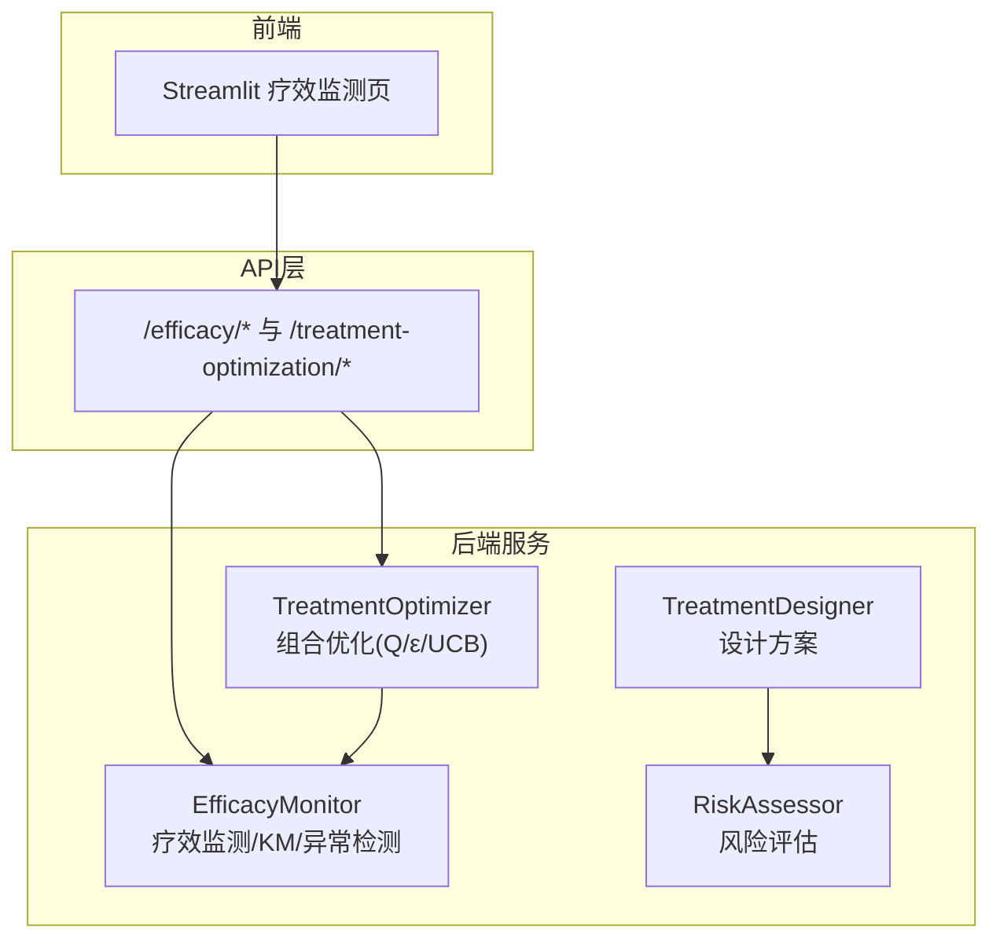
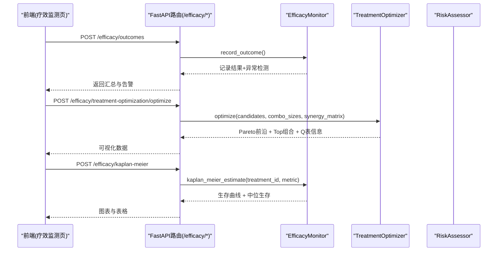
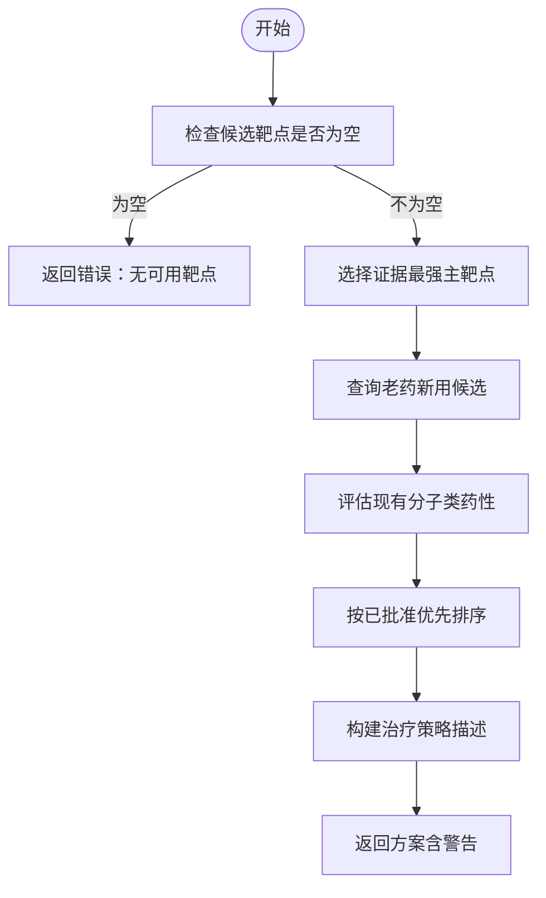
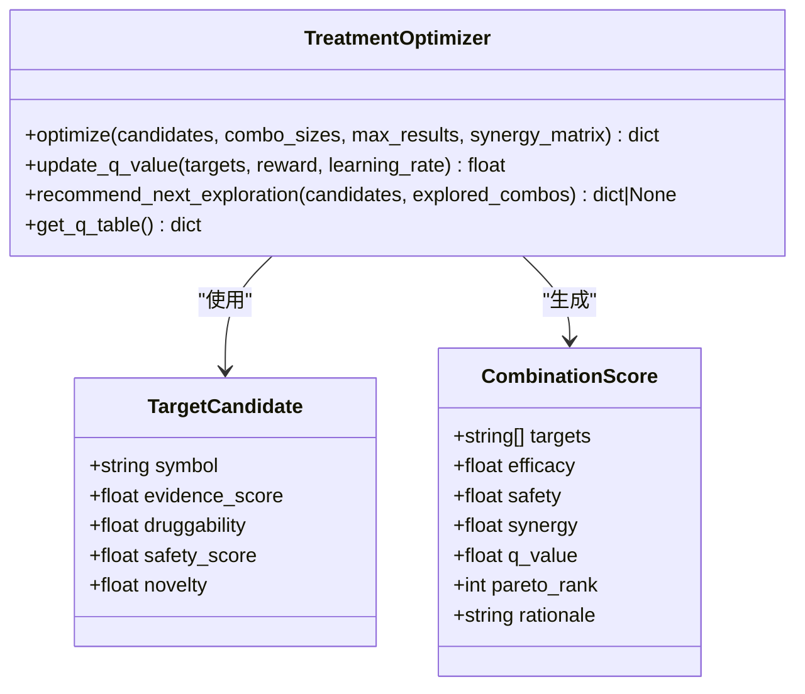
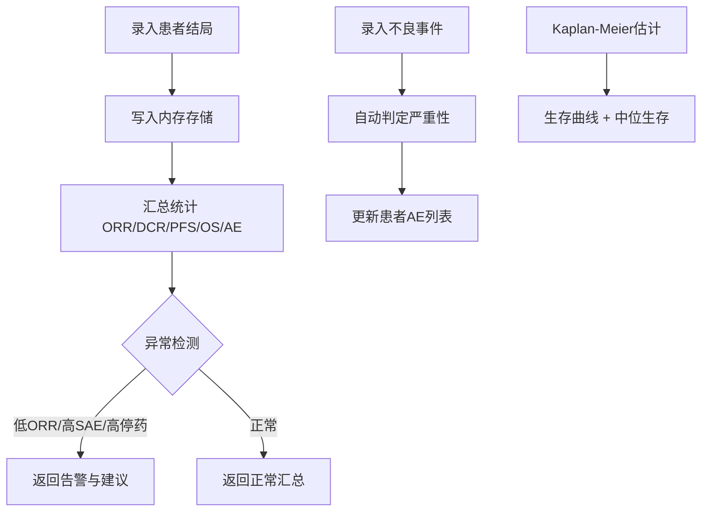
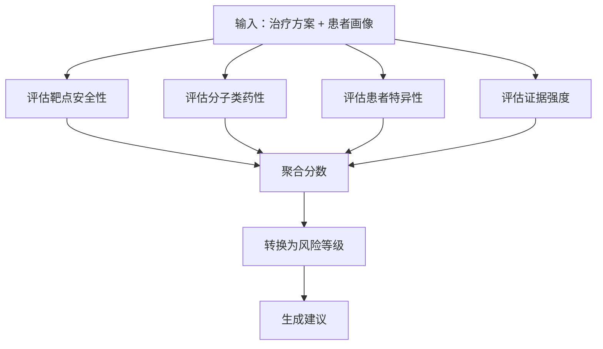
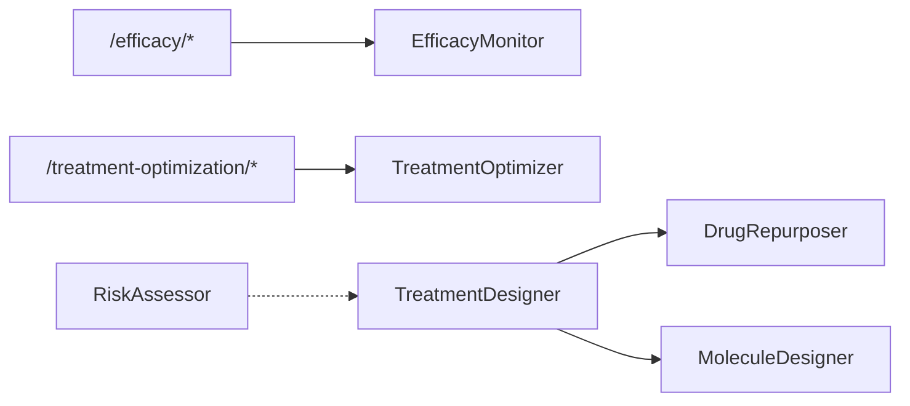

# 治疗方案设计系统（子系统C）

<cite>
**本文引用的文件列表**
- [treatment_designer.py](file://precision-drug-design/backend/app/services/optimizer/treatment_designer.py)
- [treatment_optimizer.py](file://precision-drug-design/backend/app/services/optimizer/treatment_optimizer.py)
- [efficacy_monitor.py](file://precision-drug-design/backend/app/services/optimizer/efficacy_monitor.py)
- [risk_assessor.py](file://precision-drug-design/backend/app/services/optimizer/risk_assessor.py)
- [efficacy.py](file://precision-drug-design/backend/app/api/v1/efficacy.py)
- [efficacy.py (schemas)](file://precision-drug-design/backend/app/schemas/efficacy.py)
- [README.md](file://precision-drug-design/README.md)
- [INTEGRATION_DEPLOYMENT_REPORT.md](file://precision-drug-design/docs/INTEGRATION_DEPLOYMENT_REPORT.md)
- [12_疗效监测.py](file://precision-drug-design/frontend/pages/12_📊_疗效监测.py)
- [test_treatment_designer.py](file://precision-drug-design/tests/test_treatment_designer.py)
</cite>

## 目录
1. [引言](#引言)
2. [项目结构](#项目结构)
3. [核心组件](#核心组件)
4. [架构总览](#架构总览)
5. [详细组件分析](#详细组件分析)
6. [依赖关系分析](#依赖关系分析)
7. [性能与可扩展性](#性能与可扩展性)
8. [故障排查指南](#故障排查指南)
9. [结论](#结论)
10. [附录：参数、指标与阈值配置](#附录参数指标与阈值配置)

## 引言
本文件面向“AI药物设计系统”的“治疗方案设计系统（子系统C）”，聚焦以下目标：
- 强化学习启发的多疗法组合优化算法，支持靶向+免疫+化疗联合用药方案候选生成与排序。
- 实时疗效监测机制：患者结局录入、不良事件上报、异常检测、生存曲线估计。
- 风险评估模型：靶点安全性、分子类药性、患者特异性风险、证据强度综合评估。
- 动态调整策略与个性化推荐：基于Q表更新与UCB探索的下一步组合建议。
- 临床决策支持：前端可视化、阈值告警、Pareto前沿展示与Top组合解释。
- 提供优化参数配置、监测指标定义、风险阈值设置与效果评估方法，并给出实际案例与预期输出。

说明：当前实现为“启发式Q值近似 + Pareto前沿选择 + ε-贪心探索 + UCB推荐”的组合优化；ctDNA肿瘤负荷追踪与动态调整机制在集成报告中标注为“未开发”。

**章节来源**
- [README.md:44-97](file://precision-drug-design/README.md#L44-L97)
- [INTEGRATION_DEPLOYMENT_REPORT.md:294-411](file://precision-drug-design/docs/INTEGRATION_DEPLOYMENT_REPORT.md#L294-L411)

## 项目结构
子系统C位于后端服务优化器与服务API层，并通过Streamlit前端页面提供交互能力。关键路径如下：
- 后端服务：
  - 治疗方案设计器：整合靶点-分子-患者数据生成个性化方案
  - 治疗方案组合优化器：RL启发式搜索、Pareto前沿、ε-贪心、UCB推荐
  - 疗效监测器：RECIST响应、CTCAE AE、ORR/DCR/PFS/OS统计、KM估计、异常检测
  - 风险评估器：四维度风险评分与建议
- API路由：暴露疗效监测与治疗方案优化接口，以及数据脱敏接口
- 前端页面：疗效监测与方案优化交互界面

**图表来源**
- [efficacy.py:1-347](file://precision-drug-design/backend/app/api/v1/efficacy.py#L1-L347)
- [12_疗效监测.py:1-583](file://precision-drug-design/frontend/pages/12_📊_疗效监测.py#L1-L583)
- [treatment_designer.py:1-146](file://precision-drug-design/backend/app/services/optimizer/treatment_designer.py#L1-L146)
- [treatment_optimizer.py:1-363](file://precision-drug-design/backend/app/services/optimizer/treatment_optimizer.py#L1-L363)
- [efficacy_monitor.py:1-407](file://precision-drug-design/backend/app/services/optimizer/efficacy_monitor.py#L1-L407)
- [risk_assessor.py:1-155](file://precision-drug-design/backend/app/services/optimizer/risk_assessor.py#L1-L155)

**章节来源**
- [efficacy.py:1-347](file://precision-drug-design/backend/app/api/v1/efficacy.py#L1-L347)
- [12_疗效监测.py:1-583](file://precision-drug-design/frontend/pages/12_📊_疗效监测.py#L1-L583)

## 核心组件
- 治疗方案设计器（TreatmentDesigner）
  - 输入：患者画像、候选靶点、已有候选分子
  - 输出：主靶点、老药新用候选、分子评估结果、策略建议与风险提示
  - 策略优先级：已批准老药 > 类药性合格的新分子 > 探索性发现
- 治疗方案组合优化器（TreatmentOptimizer）
  - 组合枚举：按指定大小枚举多靶点组合
  - Q值近似：有效性×α + 安全性×β + 协同×γ − 复杂度惩罚×δ
  - Pareto前沿：在(有效性, 安全性)二维空间筛选非支配解
  - ε-贪心：以概率ε随机探索，否则选最优
  - UCB推荐：平衡利用与探索，推荐下一组合
- 疗效监测器（EfficacyMonitor）
  - 记录患者结局（CR/PR/SD/PD/未知）、PFS/OS、肿瘤缩小百分比
  - 记录不良事件（CTCAE v5.0等级），自动判定严重性
  - 汇总ORR/DCR、中位PFS/OS、AE率、停药率
  - Kaplan-Meier生存估计（简化版）
  - 异常检测：低ORR、高SAE率、高停药率触发告警
- 风险评估器（RiskAssessor）
  - 四维度：靶点安全性、分子类药性、患者特异性、证据强度
  - 输出：总体风险分数与等级、各维度详情与建议

**章节来源**
- [treatment_designer.py:17-146](file://precision-drug-design/backend/app/services/optimizer/treatment_designer.py#L17-L146)
- [treatment_optimizer.py:24-363](file://precision-drug-design/backend/app/services/optimizer/treatment_optimizer.py#L24-L363)
- [efficacy_monitor.py:35-407](file://precision-drug-design/backend/app/services/optimizer/efficacy_monitor.py#L35-L407)
- [risk_assessor.py:15-155](file://precision-drug-design/backend/app/services/optimizer/risk_assessor.py#L15-L155)

## 架构总览
从请求到响应的端到端流程：
- 前端提交患者结局或优化请求
- API路由校验并调用对应服务
- 服务内部进行计算、统计与风险评估
- 返回结构化结果供前端展示与决策

**图表来源**
- [efficacy.py:62-224](file://precision-drug-design/backend/app/api/v1/efficacy.py#L62-L224)
- [efficacy_monitor.py:123-407](file://precision-drug-design/backend/app/services/optimizer/efficacy_monitor.py#L123-L407)
- [treatment_optimizer.py:102-165](file://precision-drug-design/backend/app/services/optimizer/treatment_optimizer.py#L102-L165)

## 详细组件分析

### 治疗方案设计器（TreatmentDesigner）
- 功能要点
  - 选择证据最强的主靶点
  - 查询老药新用候选（按已批准优先排序）
  - 评估现有分子的类药性（Lipinski规则通过）
  - 构建策略描述（已批准药物/新分子/探索性）
  - 返回包含警告提示的方案摘要
- 关键流程
  - 输入校验 → 主靶点选择 → 老药新用候选 → 分子评估 → 策略构建 → 返回方案

**图表来源**
- [treatment_designer.py:34-101](file://precision-drug-design/backend/app/services/optimizer/treatment_designer.py#L34-L101)
- [treatment_designer.py:103-141](file://precision-drug-design/backend/app/services/optimizer/treatment_designer.py#L103-L141)

**章节来源**
- [treatment_designer.py:17-146](file://precision-drug-design/backend/app/services/optimizer/treatment_designer.py#L17-L146)
- [test_treatment_designer.py:49-193](file://precision-drug-design/tests/test_treatment_designer.py#L49-L193)

### 治疗方案组合优化器（TreatmentOptimizer）
- 数据结构
  - TargetCandidate：symbol、证据强度、可成药性、安全性、新颖性
  - CombinationScore：targets、efficacy、safety、synergy、q_value、pareto_rank、rationale
- 算法要点
  - 组合枚举：按combo_sizes枚举所有组合
  - 评分函数：有效性=平均证据×0.5 + 平均可成药性×0.5；安全性=平均安全分 − 复杂度惩罚；协同=矩阵均值或新颖性互补
  - Q值：α·efficacy + β·safety + γ·synergy − δ·complexity
  - Pareto前沿：迭代剔除被支配解，同前沿内按Q值降序
  - ε-贪心：以ε概率在前K名中随机选择
  - UCB推荐：Q(s,a) + c·sqrt(ln(N)/n_a)，推荐下一组合
- 输出
  - Pareto前沿列表、Top组合、Q表大小、总评估组合数、权重与ε

**图表来源**
- [treatment_optimizer.py:24-64](file://precision-drug-design/backend/app/services/optimizer/treatment_optimizer.py#L24-L64)
- [treatment_optimizer.py:66-165](file://precision-drug-design/backend/app/services/optimizer/treatment_optimizer.py#L66-L165)
- [treatment_optimizer.py:167-230](file://precision-drug-design/backend/app/services/optimizer/treatment_optimizer.py#L167-L230)
- [treatment_optimizer.py:232-266](file://precision-drug-design/backend/app/services/optimizer/treatment_optimizer.py#L232-L266)
- [treatment_optimizer.py:281-363](file://precision-drug-design/backend/app/services/optimizer/treatment_optimizer.py#L281-L363)

**章节来源**
- [treatment_optimizer.py:24-363](file://precision-drug-design/backend/app/services/optimizer/treatment_optimizer.py#L24-L363)

### 疗效监测器（EfficacyMonitor）
- 数据模型
  - PatientOutcome：患者ID、治疗方案ID、最佳响应、日期、PFS/OS、肿瘤缩小百分比、备注、时间戳
  - AdverseEvent：事件名称、CTCAE等级、严重性、因果关系、发生/缓解日期、采取措施
  - EfficacySummary：总患者数、响应计数、ORR、DCR、中位PFS/OS、AE率、严重AE率、停药率
- 功能要点
  - 录入结局与AE，自动严重性判定（grade≥3）
  - 汇总统计与异常检测（ORR<20%、严重AE率>30%、停药率>20%）
  - Kaplan-Meier生存估计（简化版）
- 前端集成
  - Streamlit页面提供表单录入、指标展示、KM曲线与数据表

**图表来源**
- [efficacy_monitor.py:123-157](file://precision-drug-design/backend/app/services/optimizer/efficacy_monitor.py#L123-L157)
- [efficacy_monitor.py:159-208](file://precision-drug-design/backend/app/services/optimizer/efficacy_monitor.py#L159-L208)
- [efficacy_monitor.py:210-268](file://precision-drug-design/backend/app/services/optimizer/efficacy_monitor.py#L210-L268)
- [efficacy_monitor.py:270-307](file://precision-drug-design/backend/app/services/optimizer/efficacy_monitor.py#L270-L307)
- [efficacy_monitor.py:339-406](file://precision-drug-design/backend/app/services/optimizer/efficacy_monitor.py#L339-L406)

**章节来源**
- [efficacy_monitor.py:35-407](file://precision-drug-design/backend/app/services/optimizer/efficacy_monitor.py#L35-L407)
- [12_疗效监测.py:54-376](file://precision-drug-design/frontend/pages/12_📊_疗效监测.py#L54-L376)

### 风险评估器（RiskAssessor）
- 维度
  - 靶点安全性：依据证据数量分级
  - 分子类药性：已批准药物 > Lipinski通过 > 存疑
  - 患者特异性：合并症、合并用药、高龄、肾功能不全等
  - 证据强度：高质量证据数量分布
- 输出
  - 总体风险分数与等级、各维度详情与建议

**图表来源**
- [risk_assessor.py:18-64](file://precision-drug-design/backend/app/services/optimizer/risk_assessor.py#L18-L64)
- [risk_assessor.py:66-155](file://precision-drug-design/backend/app/services/optimizer/risk_assessor.py#L66-L155)

**章节来源**
- [risk_assessor.py:15-155](file://precision-drug-design/backend/app/services/optimizer/risk_assessor.py#L15-L155)

## 依赖关系分析
- API层依赖
  - 疗效监测API依赖EfficacyMonitor与Schema
  - 治疗方案优化API依赖TreatmentOptimizer与Schema
  - 数据脱敏API依赖DataMasker（不在本文件范围）
- 服务间耦合
  - TreatmentDesigner依赖DrugRepurposer与MoleculeDesigner（外部服务）
  - TreatmentOptimizer独立，维护Q表与UCB状态
  - EfficacyMonitor维护内存中的结局与AE数据
  - RiskAssessor独立，用于方案风险评估

**图表来源**
- [efficacy.py:1-347](file://precision-drug-design/backend/app/api/v1/efficacy.py#L1-L347)
- [treatment_designer.py:1-146](file://precision-drug-design/backend/app/services/optimizer/treatment_designer.py#L1-L146)

**章节来源**
- [efficacy.py:1-347](file://precision-drug-design/backend/app/api/v1/efficacy.py#L1-L347)
- [treatment_designer.py:1-146](file://precision-drug-design/backend/app/services/optimizer/treatment_designer.py#L1-L146)

## 性能与可扩展性
- 组合优化
  - 组合枚举复杂度随候选数与组合大小呈指数增长；建议限制combo_sizes与max_results
  - Q表持久化与增量更新：通过update_q_value与get_q_table接口支持离线训练与在线微调
- 疗效监测
  - 内存存储适合演示与中小规模；生产环境需引入数据库与缓存
  - KM估计为简化实现，生产环境建议使用标准库（如lifelines）
- 前端交互
  - Streamlit页面提供快速验证与可视化；生产环境可替换为React/Vue前端

[本节为通用指导，不直接分析具体文件]

## 故障排查指南
- 常见错误
  - 无候选靶点：优化器返回错误，需检查输入candidates是否有效
  - 字段缺失或类型错误：API层会抛出验证错误，检查请求体是否符合Schema
  - 样本不足：异常检测需要至少5例患者才触发告警
- 定位步骤
  - 查看API返回的meta.request_id与错误消息
  - 检查EfficacyMonitor的总结与异常检测结果
  - 确认Q表更新是否正确（旧Q与新Q对比）

**章节来源**
- [efficacy.py:229-282](file://precision-drug-design/backend/app/api/v1/efficacy.py#L229-L282)
- [efficacy_monitor.py:270-307](file://precision-drug-design/backend/app/services/optimizer/efficacy_monitor.py#L270-L307)

## 结论
子系统C实现了“多疗法组合优化 + 实时疗效监测 + 风险评估”的核心闭环，具备：
- RL启发式的组合搜索与Pareto前沿选择
- 基于Q表与UCB的动态探索与推荐
- RECIST与CTCAE标准的疗效与安全监测
- 多维度风险评估与临床决策支持
未来扩展方向包括：ctDNA肿瘤负荷追踪、真实世界数据驱动的RL策略网络训练、DeepDDI药物相互作用模型接入。

[本节为总结，不直接分析具体文件]

## 附录：参数、指标与阈值配置

### 优化参数配置
- 权重系数
  - α（有效性权重）：默认0.4
  - β（安全性权重）：默认0.3
  - γ（协同效应权重）：默认0.2
  - δ（复杂度惩罚）：默认0.1
- 探索策略
  - ε-贪心概率：默认0.1
  - UCB探索系数：c = sqrt(2)
- 组合大小
  - combo_sizes：默认[1, 2, 3]
- Q表更新
  - 学习率：默认0.1
  - 奖励：观测到的临床响应率（0-1）

**章节来源**
- [treatment_optimizer.py:75-99](file://precision-drug-design/backend/app/services/optimizer/treatment_optimizer.py#L75-L99)
- [treatment_optimizer.py:167-230](file://precision-drug-design/backend/app/services/optimizer/treatment_optimizer.py#L167-L230)
- [treatment_optimizer.py:285-309](file://precision-drug-design/backend/app/services/optimizer/treatment_optimizer.py#L285-L309)
- [treatment_optimizer.py:311-363](file://precision-drug-design/backend/app/services/optimizer/treatment_optimizer.py#L311-L363)

### 监测指标定义
- 响应类别：CR、PR、SD、PD、未知
- ORR（客观响应率）：(CR + PR) / total
- DCR（疾病控制率）：(CR + PR + SD) / total
- PFS（无进展生存天数）
- OS（总生存天数）
- AE率与严重AE率（grade≥3）
- 停药率（因AE采取drug_withdrawn）

**章节来源**
- [efficacy_monitor.py:23-33](file://precision-drug-design/backend/app/services/optimizer/efficacy_monitor.py#L23-L33)
- [efficacy_monitor.py:88-112](file://precision-drug-design/backend/app/services/optimizer/efficacy_monitor.py#L88-L112)
- [efficacy_monitor.py:210-268](file://precision-drug-design/backend/app/services/optimizer/efficacy_monitor.py#L210-L268)

### 风险阈值设置
- 异常检测阈值
  - ORR < 20%：低疗效告警
  - 严重AE率 > 30%：安全性告警
  - 停药率 > 20%：停药率告警
  - 样本量 < 5：不触发告警
- 风险等级划分
  - low：< 0.35
  - medium：0.35–0.65
  - high：≥ 0.65

**章节来源**
- [efficacy_monitor.py:270-307](file://precision-drug-design/backend/app/services/optimizer/efficacy_monitor.py#L270-L307)
- [risk_assessor.py:131-138](file://precision-drug-design/backend/app/services/optimizer/risk_assessor.py#L131-L138)

### 效果评估方法
- 组合优化评估
  - Pareto前沿质量：前沿解数量与分布
  - Top组合Q值与理由（rationale）
  - Q表大小与更新轨迹
- 疗效评估
  - ORR/DCR趋势、中位PFS/OS
  - KM曲线形状与中位生存
  - 异常检测触发次数与处置建议

**章节来源**
- [treatment_optimizer.py:102-165](file://precision-drug-design/backend/app/services/optimizer/treatment_optimizer.py#L102-L165)
- [efficacy_monitor.py:339-406](file://precision-drug-design/backend/app/services/optimizer/efficacy_monitor.py#L339-L406)

### 实际案例与预期输出
- 案例一：多靶点组合优化
  - 输入：候选靶点EGFR、KRAS、TP53，combo_sizes=[1,2,3]
  - 输出：Pareto前沿列表、Top组合（含靶点、Q值、有效性、安全性、理由）、Q表大小、权重
- 案例二：疗效监测与异常检测
  - 输入：患者结局（response=pr, pfs=120, os=300）
  - 输出：汇总（ORR/DCR/中位PFS/OS/AE率/严重AE率/停药率）、异常告警（若触发）
- 案例三：Kaplan-Meier生存估计
  - 输入：treatment_id、metric=pfs/os
  - 输出：生存曲线数据点、中位生存时间
- 案例四：Q值更新
  - 输入：targets=["EGFR","KRAS"], reward=0.7, learning_rate=0.1
  - 输出：旧Q值与新Q值

**章节来源**
- [12_疗效监测.py:381-583](file://precision-drug-design/frontend/pages/12_📊_疗效监测.py#L381-L583)
- [efficacy.py:229-309](file://precision-drug-design/backend/app/api/v1/efficacy.py#L229-L309)