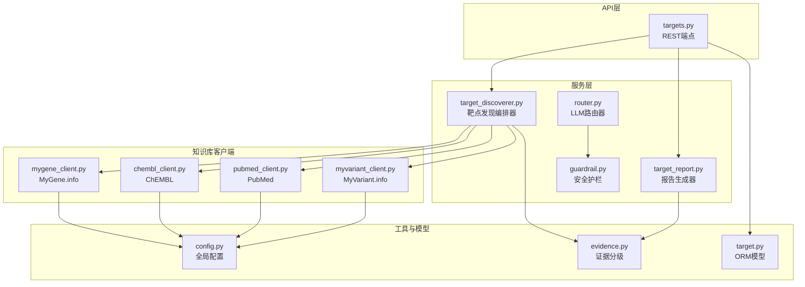
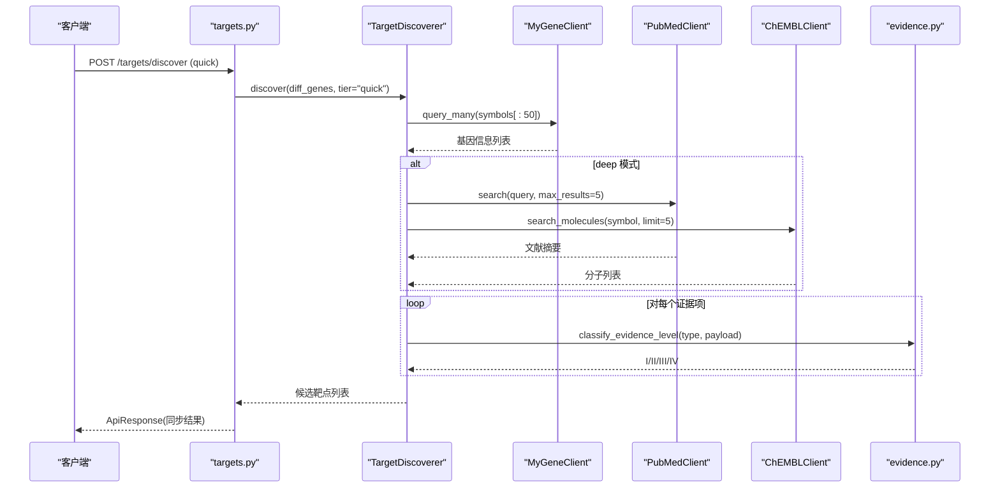
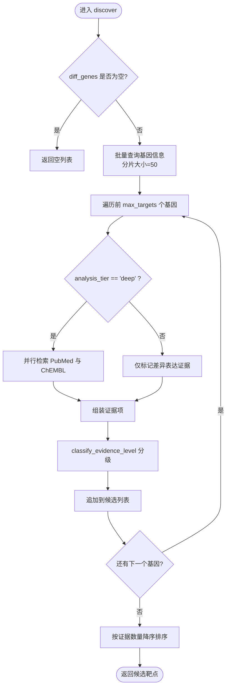
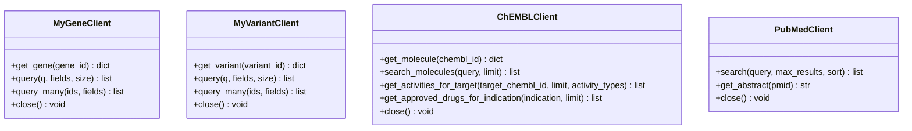
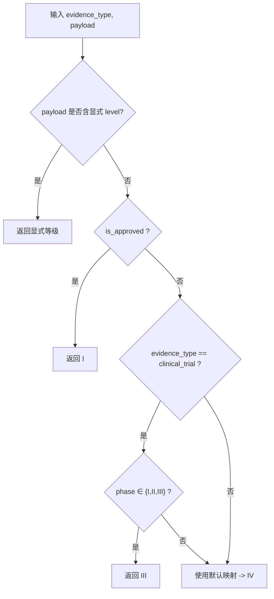
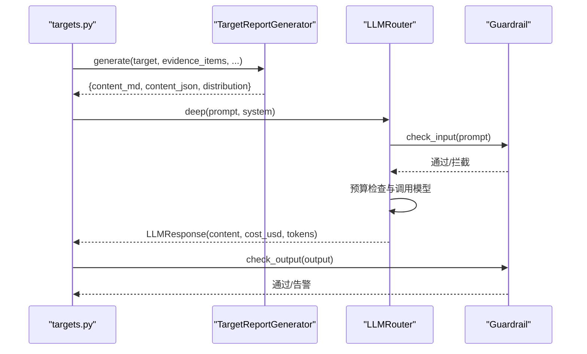
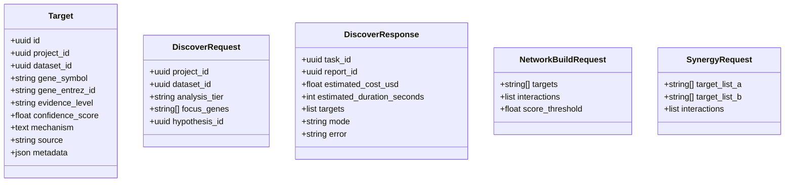
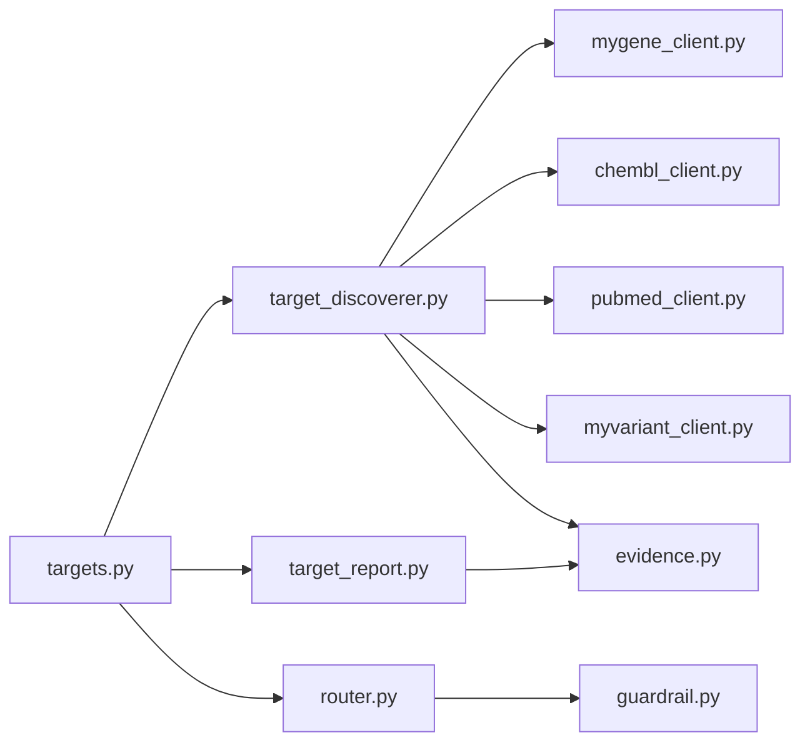

# 靶点发现引擎（子系统B）

<cite>
**本文引用的文件**   
- [backend/app/services/analyzer/target_discoverer.py](file://backend/app/services/analyzer/target_discoverer.py)
- [backend/app/api/v1/targets.py](file://backend/app/api/v1/targets.py)
- [backend/app/schemas/target.py](file://backend/app/schemas/target.py)
- [backend/app/models/target.py](file://backend/app/models/target.py)
- [backend/app/services/knowledge/mygene_client.py](file://backend/app/services/knowledge/mygene_client.py)
- [backend/app/services/knowledge/myvariant_client.py](file://backend/app/services/knowledge/myvariant_client.py)
- [backend/app/services/knowledge/chembl_client.py](file://backend/app/services/knowledge/chembl_client.py)
- [backend/app/services/knowledge/pubmed_client.py](file://backend/app/services/knowledge/pubmed_client.py)
- [backend/app/utils/evidence.py](file://backend/app/utils/evidence.py)
- [backend/app/services/report/target_report.py](file://backend/app/services/report/target_report.py)
- [backend/app/services/llm/router.py](file://backend/app/services/llm/router.py)
- [backend/app/services/llm/guardrail.py](file://backend/app/services/llm/guardrail.py)
- [backend/app/core/config.py](file://backend/app/core/config.py)
- [docs/design/04-api-spec.md](file://docs/design/04-api-spec.md)
</cite>

## 目录
1. [简介](#简介)
2. [项目结构](#项目结构)
3. [核心组件](#核心组件)
4. [架构总览](#架构总览)
5. [详细组件分析](#详细组件分析)
6. [依赖关系分析](#依赖关系分析)
7. [性能与调优](#性能与调优)
8. [故障排查指南](#故障排查指南)
9. [结论](#结论)
10. [附录：API 接口文档](#附录api-接口文档)

## 简介
本文件面向“AI药物设计系统”的靶点发现引擎（子系统B），系统性阐述其知识库整合能力、LLM驱动的报告生成机制、证据分级体系、安全护栏策略，以及完整的API接口、客户端配置、报告模板定制与性能调优指南。目标读者包括算法工程师、后端开发者、生物信息分析师与产品/临床协作人员。

## 项目结构
靶点发现引擎围绕“编排器 + 知识库客户端 + 报告生成 + LLM路由与安全护栏 + API层”的组织方式构建，采用分层与模块化设计，便于扩展与维护。

图表来源
- [backend/app/api/v1/targets.py](file://backend/app/api/v1/targets.py)
- [backend/app/services/analyzer/target_discoverer.py](file://backend/app/services/analyzer/target_discoverer.py)
- [backend/app/services/report/target_report.py](file://backend/app/services/report/target_report.py)
- [backend/app/services/llm/router.py](file://backend/app/services/llm/router.py)
- [backend/app/services/llm/guardrail.py](file://backend/app/services/llm/guardrail.py)
- [backend/app/services/knowledge/mygene_client.py](file://backend/app/services/knowledge/mygene_client.py)
- [backend/app/services/knowledge/myvariant_client.py](file://backend/app/services/knowledge/myvariant_client.py)
- [backend/app/services/knowledge/chembl_client.py](file://backend/app/services/knowledge/chembl_client.py)
- [backend/app/services/knowledge/pubmed_client.py](file://backend/app/services/knowledge/pubmed_client.py)
- [backend/app/utils/evidence.py](file://backend/app/utils/evidence.py)
- [backend/app/models/target.py](file://backend/app/models/target.py)
- [backend/app/core/config.py](file://backend/app/core/config.py)

章节来源
- [backend/app/api/v1/targets.py](file://backend/app/api/v1/targets.py)
- [backend/app/services/analyzer/target_discoverer.py](file://backend/app/services/analyzer/target_discoverer.py)
- [backend/app/services/report/target_report.py](file://backend/app/services/report/target_report.py)
- [backend/app/services/llm/router.py](file://backend/app/services/llm/router.py)
- [backend/app/services/llm/guardrail.py](file://backend/app/services/llm/guardrail.py)
- [backend/app/services/knowledge/mygene_client.py](file://backend/app/services/knowledge/mygene_client.py)
- [backend/app/services/knowledge/myvariant_client.py](file://backend/app/services/knowledge/myvariant_client.py)
- [backend/app/services/knowledge/chembl_client.py](file://backend/app/services/knowledge/chembl_client.py)
- [backend/app/services/knowledge/pubmed_client.py](file://backend/app/services/knowledge/pubmed_client.py)
- [backend/app/utils/evidence.py](file://backend/app/utils/evidence.py)
- [backend/app/models/target.py](file://backend/app/models/target.py)
- [backend/app/core/config.py](file://backend/app/core/config.py)

## 核心组件
- 靶点发现编排器：协调多源知识库，从差异基因出发产出候选靶点及证据项，支持快速筛查与深度洞察两种层级。
- 知识库客户端：封装 MyGene.info、MyVariant.info、ChEMBL、PubMed 的异步HTTP调用，提供批量查询与字段裁剪能力。
- 证据分级工具：依据证据类型与载荷推断 I–IV 级证据，并统计分布与最高等级。
- 报告生成器：将靶点信息、证据项、相关分子、文献与临床试验汇总为 Markdown 与 JSON 结构化输出。
- LLM 路由器与安全护栏：统一多模型调用、成本追踪与预算控制；输入/输出拦截与脱敏，拒绝诊断/用药建议等违规内容。
- API 层：暴露 REST 接口，支持触发发现、列表/详情查询、强制深度分析、网络建模与协同预测等。

章节来源
- [backend/app/services/analyzer/target_discoverer.py](file://backend/app/services/analyzer/target_discoverer.py)
- [backend/app/utils/evidence.py](file://backend/app/utils/evidence.py)
- [backend/app/services/report/target_report.py](file://backend/app/services/report/target_report.py)
- [backend/app/services/llm/router.py](file://backend/app/services/llm/router.py)
- [backend/app/services/llm/guardrail.py](file://backend/app/services/llm/guardrail.py)
- [backend/app/api/v1/targets.py](file://backend/app/api/v1/targets.py)

## 架构总览
下图展示一次“快速筛查”端到端流程：API 接收请求 → 编排器批量查询基因 → 并行检索文献与活性数据 → 证据分级 → 返回候选靶点。

图表来源
- [backend/app/api/v1/targets.py](file://backend/app/api/v1/targets.py)
- [backend/app/services/analyzer/target_discoverer.py](file://backend/app/services/analyzer/target_discoverer.py)
- [backend/app/services/knowledge/mygene_client.py](file://backend/app/services/knowledge/mygene_client.py)
- [backend/app/services/knowledge/pubmed_client.py](file://backend/app/services/knowledge/pubmed_client.py)
- [backend/app/services/knowledge/chembl_client.py](file://backend/app/services/knowledge/chembl_client.py)
- [backend/app/utils/evidence.py](file://backend/app/utils/evidence.py)

## 详细组件分析

### 靶点发现编排器（TargetDiscoverer）
- 职责：接收差异基因列表，按分析层级组织知识库调用，聚合证据项并分级，输出候选靶点。
- 关键流程：
  - 批量查询基因信息（分批，每批最多50个）。
  - quick 模式仅标记基础表达证据；deep 模式并行检索文献与ChEMBL活性。
  - 对每条证据调用证据分级工具，计算等级并排序。
- 错误处理：外部调用异常时记录警告并继续；关闭时并发关闭所有客户端。

图表来源
- [backend/app/services/analyzer/target_discoverer.py](file://backend/app/services/analyzer/target_discoverer.py)
- [backend/app/utils/evidence.py](file://backend/app/utils/evidence.py)

章节来源
- [backend/app/services/analyzer/target_discoverer.py](file://backend/app/services/analyzer/target_discoverer.py)

### 知识库客户端
- MyGene.info 客户端
  - 功能：按 symbol/HGNC/Ensembl ID 查询基因详情；支持关键词与批量POST查询。
  - 限制：批量最多1000个ID；超时与重试由底层HTTP客户端管理。
- MyVariant.info 客户端
  - 功能：按HGVS/rsID/ClinVar ID查询变异注释；支持批量查询。
  - 限制：批量最多1000个ID。
- ChEMBL 客户端
  - 功能：分子搜索、靶点活性数据获取、已批准药物查询。
  - 用途：为靶点提供活性与已获批药物线索。
- PubMed 客户端
  - 功能：esearch+esummary两步检索，遵守NCBI限速；支持单篇摘要抓取。
  - 用途：为靶点提供文献证据。

图表来源
- [backend/app/services/knowledge/mygene_client.py](file://backend/app/services/knowledge/mygene_client.py)
- [backend/app/services/knowledge/myvariant_client.py](file://backend/app/services/knowledge/myvariant_client.py)
- [backend/app/services/knowledge/chembl_client.py](file://backend/app/services/knowledge/chembl_client.py)
- [backend/app/services/knowledge/pubmed_client.py](file://backend/app/services/knowledge/pubmed_client.py)

章节来源
- [backend/app/services/knowledge/mygene_client.py](file://backend/app/services/knowledge/mygene_client.py)
- [backend/app/services/knowledge/myvariant_client.py](file://backend/app/services/knowledge/myvariant_client.py)
- [backend/app/services/knowledge/chembl_client.py](file://backend/app/services/knowledge/chembl_client.py)
- [backend/app/services/knowledge/pubmed_client.py](file://backend/app/services/knowledge/pubmed_client.py)

### 证据分级体系与策略
- 等级定义
  - I：已获批靶向药/标准治疗
  - II：指南推荐但未获批
  - III：临床试验阶段
  - IV：临床前/个案/理论推测
- 分级策略
  - 优先读取显式等级；若未提供则根据 is_approved、clinical_trial phase 或默认映射推断。
  - 快速筛查：仅使用表达差异作为证据（IV级）。
  - 深度洞察：引入文献与活性证据，提升高等级证据占比。
- 统计与汇总
  - 统计各等级数量分布，并取最高等级用于报告展示。

图表来源
- [backend/app/utils/evidence.py](file://backend/app/utils/evidence.py)

章节来源
- [backend/app/utils/evidence.py](file://backend/app/utils/evidence.py)

### LLM 驱动的靶点报告生成机制
- 报告生成器
  - 输入：靶点基本信息、证据项、相关分子、临床试验、文献。
  - 输出：Markdown 报告与 JSON 结构化数据，包含证据等级分布与最高等级。
- LLM 路由器
  - 快速层与深度层模型选择，自动成本追踪与预算控制。
  - 延迟加载 litellm，避免未安装时启动失败。
- 安全护栏
  - 输入/输出规则：拒绝剂量处方、绝对化承诺、提示词注入与非医学话题；敏感术语告警；PII 脱敏。

图表来源
- [backend/app/services/report/target_report.py](file://backend/app/services/report/target_report.py)
- [backend/app/services/llm/router.py](file://backend/app/services/llm/router.py)
- [backend/app/services/llm/guardrail.py](file://backend/app/services/llm/guardrail.py)
- [backend/app/api/v1/targets.py](file://backend/app/api/v1/targets.py)

章节来源
- [backend/app/services/report/target_report.py](file://backend/app/services/report/target_report.py)
- [backend/app/services/llm/router.py](file://backend/app/services/llm/router.py)
- [backend/app/services/llm/guardrail.py](file://backend/app/services/llm/guardrail.py)

### API 层与数据模型
- 端点
  - POST /targets/discover：触发发现（quick同步返回；deep异步任务）。
  - GET /targets：分页列表，支持按项目、证据等级、基因符号过滤。
  - GET /targets/{id}：详情（含证据项与相关分子）。
  - POST /targets/{id}/force-deep-analysis：创始人强制深度分析（记录理由）。
  - POST /targets/network：PPI网络构建与关键节点识别。
  - POST /targets/synergy：多靶点组合协同效应预测。
- 数据模型
  - Target：存储靶点元数据、证据等级、置信度、机制、来源与JSON元信息。
  - Schemas：定义请求/响应结构与校验规则。

图表来源
- [backend/app/models/target.py](file://backend/app/models/target.py)
- [backend/app/schemas/target.py](file://backend/app/schemas/target.py)
- [backend/app/api/v1/targets.py](file://backend/app/api/v1/targets.py)

章节来源
- [backend/app/api/v1/targets.py](file://backend/app/api/v1/targets.py)
- [backend/app/schemas/target.py](file://backend/app/schemas/target.py)
- [backend/app/models/target.py](file://backend/app/models/target.py)

## 依赖关系分析
- 组件耦合
  - API层依赖编排器与报告生成器；编排器依赖多个知识库客户端与证据分级工具。
  - LLM路由器与安全护栏独立于知识库，服务于报告与问答场景。
- 外部依赖
  - MyGene.info、MyVariant.info、ChEMBL、PubMed、LLM提供商（OpenAI/Anthropic）。
- 潜在循环
  - 当前模块间无直接循环依赖；通过API与服务层解耦。

图表来源
- [backend/app/api/v1/targets.py](file://backend/app/api/v1/targets.py)
- [backend/app/services/analyzer/target_discoverer.py](file://backend/app/services/analyzer/target_discoverer.py)
- [backend/app/services/report/target_report.py](file://backend/app/services/report/target_report.py)
- [backend/app/services/llm/router.py](file://backend/app/services/llm/router.py)
- [backend/app/services/llm/guardrail.py](file://backend/app/services/llm/guardrail.py)
- [backend/app/utils/evidence.py](file://backend/app/utils/evidence.py)
- [backend/app/services/knowledge/mygene_client.py](file://backend/app/services/knowledge/mygene_client.py)
- [backend/app/services/knowledge/myvariant_client.py](file://backend/app/services/knowledge/myvariant_client.py)
- [backend/app/services/knowledge/chembl_client.py](file://backend/app/services/knowledge/chembl_client.py)
- [backend/app/services/knowledge/pubmed_client.py](file://backend/app/services/knowledge/pubmed_client.py)

## 性能与调优
- 并发与限流
  - 编排器在 deep 模式下并行检索 PubMed 与 ChEMBL，减少整体延迟。
  - PubMed 客户端遵循 NCBI 限速（约3 req/s），通过 sleep 控制请求频率。
- 批量与分片
  - MyGene/MyVariant 批量查询上限为1000；编排器以50为批次进行分片，降低单次负载。
- 超时与重试
  - 各客户端设置合理超时与最大重试次数，增强鲁棒性。
- LLM 成本控制
  - 路由器按 tier 区分预算，记录 token 用量与估算费用，防止超支。
- 数据库与分页
  - 列表接口使用分页与索引字段（project_id、evidence_level、gene_symbol）优化查询。
- 缓存建议
  - 对高频查询（如热门基因/分子）可引入本地缓存或Redis缓存，降低上游压力。
- 降级策略
  - 当外部服务不可用时，API层返回降级响应并携带错误信息，保障前端可用性。

[本节为通用指导，不直接分析具体文件]

## 故障排查指南
- 常见问题
  - 上游API失败：检查超时、重试与网络连通性；查看日志中的警告信息。
  - 速率限制：PubMed 需遵守限速；必要时降低并发或增加间隔。
  - 预算超限：调整 llm_quick_budget_usd 与 llm_max_budget_usd。
  - 参数校验失败：确认 analysis_tier、evidence_level 等枚举值合法。
- 定位方法
  - 使用 request_id 追踪请求链路。
  - 查看 API 层的异常捕获与降级返回。
  - 核对客户端的 close 调用确保资源释放。

章节来源
- [backend/app/api/v1/targets.py](file://backend/app/api/v1/targets.py)
- [backend/app/services/knowledge/pubmed_client.py](file://backend/app/services/knowledge/pubmed_client.py)
- [backend/app/services/llm/router.py](file://backend/app/services/llm/router.py)

## 结论
靶点发现引擎通过编排器整合多源知识库，结合证据分级与LLM报告生成，形成从快速筛查到深度洞察的完整闭环。API层提供标准化接口，配合安全护栏与成本管控，满足研发与临床协作需求。建议在部署中完善缓存、监控与审计，持续提升稳定性与可观测性。

[本节为总结性内容，不直接分析具体文件]

## 附录：API 接口文档
- 基础约定
  - 认证：除登录与健康检查外，均需 JWT Bearer Token。
  - 请求格式：application/json，UTF-8，ISO 8601时间。
  - 响应格式：统一信封 success/data/meta；错误包含 code/message/details。
  - 分页：page/page_size；错误码涵盖验证、鉴权、护栏拦截、速率限制与上游错误。
- 靶点端点
  - POST /targets/discover：支持 quick（同步）与 deep（异步任务）。
  - GET /targets：分页列表，支持 project_id、evidence_level、gene_symbol 过滤。
  - GET /targets/{target_id}：详情含证据项与相关分子。
  - POST /targets/{target_id}/force-deep-analysis：创始人强制深度分析（记录原因）。
  - POST /targets/network：PPI网络构建与关键节点识别。
  - POST /targets/synergy：多靶点协同效应预测。
- 其他端点
  - 报告、假设、聊天、联邦学习、隐私计算与管理端点详见规范文档。

章节来源
- [docs/design/04-api-spec.md](file://docs/design/04-api-spec.md)
- [backend/app/api/v1/targets.py](file://backend/app/api/v1/targets.py)