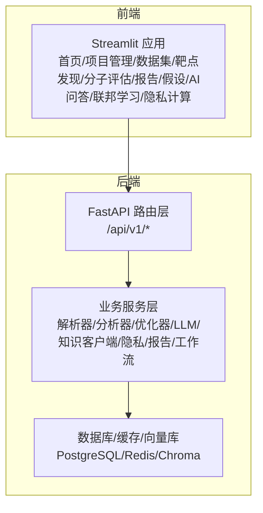
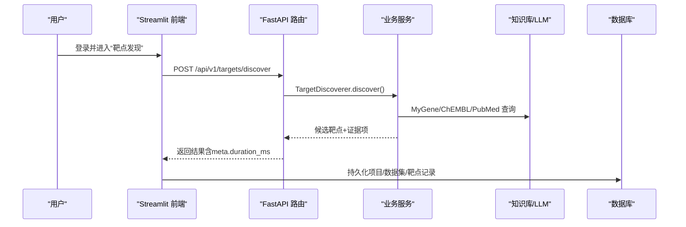
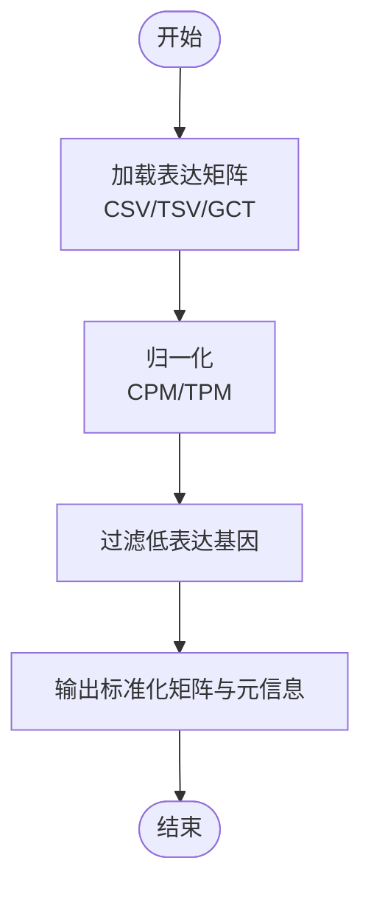
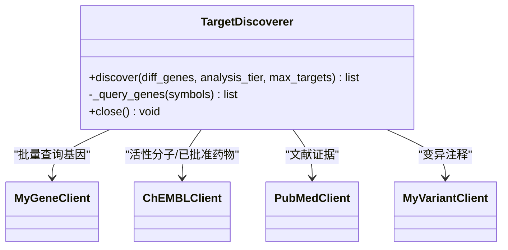
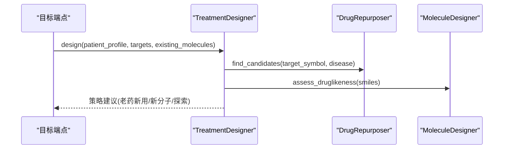
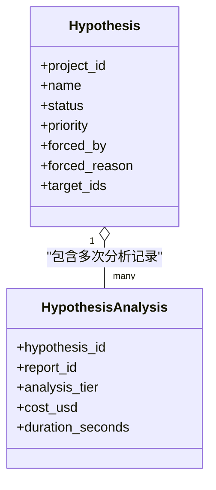
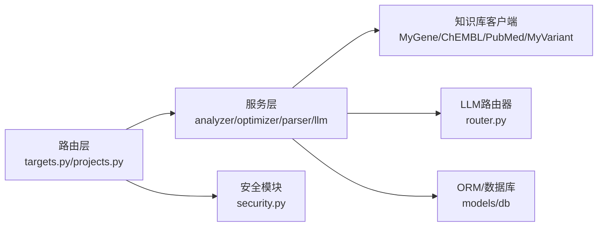

# 系统简介与价值

<cite>
**本文引用的文件**   
- [README.md](file://precision-drug-design/README.md)
- [main.py](file://precision-drug-design/backend/app/main.py)
- [app.py](file://precision-drug-design/frontend/app.py)
- [targets.py](file://precision-drug-design/backend/app/api/v1/targets.py)
- [projects.py](file://precision-drug-design/backend/app/api/v1/projects.py)
- [target_discoverer.py](file://precision-drug-design/backend/app/services/analyzer/target_discoverer.py)
- [treatment_designer.py](file://precision-drug-design/backend/app/services/optimizer/treatment_designer.py)
- [rna_seq.py](file://precision-drug-design/backend/app/services/parser/rna_seq.py)
- [hypothesis.py](file://precision-drug-design/backend/app/models/hypothesis.py)
- [router.py](file://precision-drug-design/backend/app/services/llm/router.py)
- [security.py](file://precision-drug-design/backend/app/core/security.py)
</cite>

## 目录
1. [引言](#引言)
2. [项目结构](#项目结构)
3. [核心组件](#核心组件)
4. [架构总览](#架构总览)
5. [详细组件分析](#详细组件分析)
6. [依赖关系分析](#依赖关系分析)
7. [性能考量](#性能考量)
8. [故障排查指南](#故障排查指南)
9. [结论](#结论)
10. [附录](#附录)

## 引言
本系统以“创始人思维驱动”为核心理念，构建覆盖从极限诊断数据整合、AI辅助靶点发现、并行治疗方案设计到团队协作的全流程精准药物研发平台。与传统“线性、长周期、高失败率”的研发模式不同，系统通过多源证据融合、分级分析与可审计的协作机制，显著缩短从假设到验证的路径，提升决策质量与资源利用效率。

核心价值主张：
- 用数据与证据说话：将多组学数据、知识库与文献证据统一纳入同一工作流，形成可追溯的证据链。
- 创始人直觉与AI协同：在关键节点引入“创始人强制深度分析”，让经验判断与算法排序相互校验，避免单一视角偏差。
- 成本可控、风险前置：LLM分层调用与预算控制、安全护栏与权限治理，确保研发过程既高效又合规。
- 端到端闭环：从数据上传、靶点发现、分子评估到方案设计与报告导出，形成一体化流水线，减少工具切换与数据搬运。

## 项目结构
系统采用前后端分离架构：后端基于FastAPI提供REST API与业务服务；前端基于Streamlit提供交互式界面。四大子系统分别对应不同的服务模块与页面入口，贯穿数据、模型、知识与协作全链路。

图表来源
- [main.py:187-248](file://precision-drug-design/backend/app/main.py#L187-L248)
- [app.py:1-157](file://precision-drug-design/frontend/app.py#L1-L157)

章节来源
- [README.md:190-235](file://precision-drug-design/README.md#L190-L235)
- [main.py:187-248](file://precision-drug-design/backend/app/main.py#L187-L248)
- [app.py:1-157](file://precision-drug-design/frontend/app.py#L1-L157)

## 核心组件
- 极限诊断数据整合平台（子系统A）
  - 支持RNA-seq/scRNA-seq/VCF/FASTA等多组学数据接入与预处理，输出标准化表达矩阵与差异基因列表，作为后续靶点发现的输入。
- AI辅助靶点发现引擎（子系统B）
  - 整合MyGene/MyVariant/ChEMBL/PubMed等外部知识库，结合LLM生成带证据分级的靶点报告，支持快速筛查与深度洞察两种策略。
- 并行治疗方案设计系统（子系统C）
  - 基于患者画像与候选靶点，联动老药新用与分子类药性评估，输出个性化治疗策略与优先级建议。
- AI模式协作平台（子系统D）
  - 提供RBAC五角色权限、假设沙盒、创始人强制深度分析、审计日志与JWT认证，保障协作过程的透明与合规。

章节来源
- [README.md:29-78](file://precision-drug-design/README.md#L29-L78)
- [app.py:67-116](file://precision-drug-design/frontend/app.py#L67-L116)

## 架构总览
系统以API网关为中心，承载统一信封响应、CORS、异常处理与请求追踪；业务服务按领域划分，面向数据解析、知识检索、LLM路由与方案优化；前端通过HTTP客户端访问API，呈现可视化与交互能力。

图表来源
- [targets.py:42-130](file://precision-drug-design/backend/app/api/v1/targets.py#L42-L130)
- [target_discoverer.py:52-139](file://precision-drug-design/backend/app/services/analyzer/target_discoverer.py#L52-L139)
- [main.py:29-185](file://precision-drug-design/backend/app/main.py#L29-L185)

## 详细组件分析

### 子系统A：极限诊断数据整合平台
- 解决的核心问题
  - 多组学数据格式多样、质量参差，难以直接用于下游分析。
- 带来的价值
  - 标准化预处理与质量控制，产出可直接用于差异表达与靶点筛选的数据基础。
- 关键实现要点
  - RNA-seq批量解析与归一化（CPM/TPM），低表达过滤，便于后续分析。
  - 与Scanpy生态对接，支撑单细胞与批量数据的统一处理流程。
- 应用场景与预期效果
  - 临床队列或科研样本的快速质控与差异分析，缩短数据准备时间，提高下游命中率。

图表来源
- [rna_seq.py:32-106](file://precision-drug-design/backend/app/services/parser/rna_seq.py#L32-L106)

章节来源
- [README.md:46-53](file://precision-drug-design/README.md#L46-L53)
- [rna_seq.py:15-106](file://precision-drug-design/backend/app/services/parser/rna_seq.py#L15-L106)

### 子系统B：AI辅助靶点发现引擎
- 解决的核心问题
  - 靶点选择缺乏系统性证据整合与分级，易受主观影响。
- 带来的价值
  - 多源证据聚合与自动分级，快速锁定高置信度候选，降低试错成本。
- 关键实现要点
  - 编排器协调多个知识库客户端，支持快速筛查与深度洞察两种策略。
  - LLM分层调用与成本追踪，兼顾效率与费用控制。
- 应用场景与预期效果
  - 针对特定疾病或突变谱进行靶点初筛与深度论证，加速立项与实验设计。

图表来源
- [target_discoverer.py:26-176](file://precision-drug-design/backend/app/services/analyzer/target_discoverer.py#L26-L176)

章节来源
- [README.md:55-64](file://precision-drug-design/README.md#L55-L64)
- [target_discoverer.py:26-176](file://precision-drug-design/backend/app/services/analyzer/target_discoverer.py#L26-L176)
- [router.py:55-198](file://precision-drug-design/backend/app/services/llm/router.py#L55-L198)

### 子系统C：并行治疗方案设计系统
- 解决的核心问题
  - 传统方案制定依赖经验，组合优化与动态调整困难。
- 带来的价值
  - 基于患者画像与靶点证据，智能推荐老药新用或新分子开发路径，给出优先级与理由。
- 关键实现要点
  - 优先已批准药物的复用策略，其次评估类药性合格的新分子，最后探索性策略。
  - 内置风险提示，强调AI建议需由主治医师最终决策。
- 应用场景与预期效果
  - 复杂肿瘤或多通路疾病的联合用药设计，缩短方案迭代周期，提高成功率。

图表来源
- [treatment_designer.py:34-146](file://precision-drug-design/backend/app/services/optimizer/treatment_designer.py#L34-L146)

章节来源
- [README.md:66-70](file://precision-drug-design/README.md#L66-L70)
- [treatment_designer.py:17-146](file://precision-drug-design/backend/app/services/optimizer/treatment_designer.py#L17-L146)

### 子系统D：AI模式协作平台
- 解决的核心问题
  - 团队协作中权限不清、过程不可审计、关键决策缺乏约束。
- 带来的价值
  - RBAC五角色、假设沙盒、创始人强制深度分析、审计日志与JWT认证，保障协作透明与合规。
- 关键实现要点
  - 假设模型支持状态与优先级管理，记录强制深度分析原因与历史。
  - 安全模块提供密码哈希、JWT签发与角色守卫。
- 应用场景与预期效果
  - 多中心团队并行推进多个假设，确保关键节点有权威把关与完整留痕。

图表来源
- [hypothesis.py:15-66](file://precision-drug-design/backend/app/models/hypothesis.py#L15-L66)

章节来源
- [README.md:72-77](file://precision-drug-design/README.md#L72-L77)
- [hypothesis.py:15-66](file://precision-drug-design/backend/app/models/hypothesis.py#L15-L66)
- [security.py:32-211](file://precision-drug-design/backend/app/core/security.py#L32-L211)

## 依赖关系分析
- 组件耦合与内聚
  - 路由层仅负责参数校验与响应封装，业务逻辑下沉至服务层，保持高内聚低耦合。
  - 服务层通过依赖注入方式组合各客户端与分析器，便于替换与扩展。
- 直接与间接依赖
  - 靶点发现依赖多知识库客户端与LLM路由器；治疗方案设计依赖老药新用与分子设计器；协作平台依赖安全与ORM模型。
- 外部依赖与集成点
  - 外部知识库（MyGene/MyVariant/ChEMBL/PubMed）、LLM网关（LiteLLM）、对象存储与工作流引擎（Nextflow）。
- 接口契约与实现细节
  - 统一信封响应格式，包含success/data/meta；错误码规范清晰，便于前端与第三方集成。

图表来源
- [targets.py:1-344](file://precision-drug-design/backend/app/api/v1/targets.py#L1-L344)
- [projects.py:1-169](file://precision-drug-design/backend/app/api/v1/projects.py#L1-L169)
- [router.py:55-198](file://precision-drug-design/backend/app/services/llm/router.py#L55-L198)
- [security.py:155-211](file://precision-drug-design/backend/app/core/security.py#L155-L211)

章节来源
- [README.md:239-296](file://precision-drug-design/README.md#L239-L296)
- [main.py:187-248](file://precision-drug-design/backend/app/main.py#L187-L248)

## 性能考量
- 异步与并发
  - 靶点发现使用异步并发调用多个知识库，降低整体延迟。
- 分层与降级
  - LLM分层调用与自动降级，保证可用性；网络建模在PyG不可用时回退到启发式方法。
- 缓存与限流
  - 外部API限流与重试策略，结合Redis缓存减少重复请求。
- 资源控制
  - LLM预算硬上限与每日预算跟踪，防止成本失控。

[本节为通用指导，不直接分析具体文件]

## 故障排查指南
- 常见问题定位
  - 外部API不可用：检查MyGene/ChEMBL/PubMed连通性与限流策略。
  - LLM调用失败：确认密钥配置与预算是否超限，查看错误码与日志。
  - 权限不足：核对JWT token类型与角色，确认RBAC设置。
- 调试建议
  - 使用统一信封响应中的meta.request_id与X-Request-ID进行跨层追踪。
  - 关注中间件注入的X-Response-Time-ms，识别慢请求瓶颈。
- 恢复措施
  - 启用降级策略（如网络建模回退、快速层LLM替代）。
  - 重启服务或清理缓存后重试。

章节来源
- [main.py:29-185](file://precision-drug-design/backend/app/main.py#L29-L185)
- [security.py:155-211](file://precision-drug-design/backend/app/core/security.py#L155-L211)

## 结论
“创始人思维驱动”的系统设计，将人类经验与AI能力深度融合，在多源证据、分级分析、权限治理与成本控制的共同作用下，显著提升精准药物研发的效率与确定性。四大子系统各司其职、协同工作，形成从数据到决策的完整闭环，为传统研发流程带来创新优势与竞争优势。

[本节为总结性内容，不直接分析具体文件]

## 附录
- 技术栈概览
  - 后端：FastAPI、SQLAlchemy 2.0、PostgreSQL/SQLite、Redis、Chroma、LiteLLM、RDKit、Scanpy。
  - 前端：Streamlit、httpx、Plotly/Altair。
  - 基础设施：MinIO/S3、Nextflow、Flower+PySyft、Docker。
- 快速开始与部署
  - 本地开发使用SQLite与本地文件系统；生产环境推荐PostgreSQL+Redis+MinIO。
  - 提供容器化部署与脚本工具，简化环境初始化与服务启动。

章节来源
- [README.md:81-110](file://precision-drug-design/README.md#L81-L110)
- [README.md:375-404](file://precision-drug-design/README.md#L375-L404)