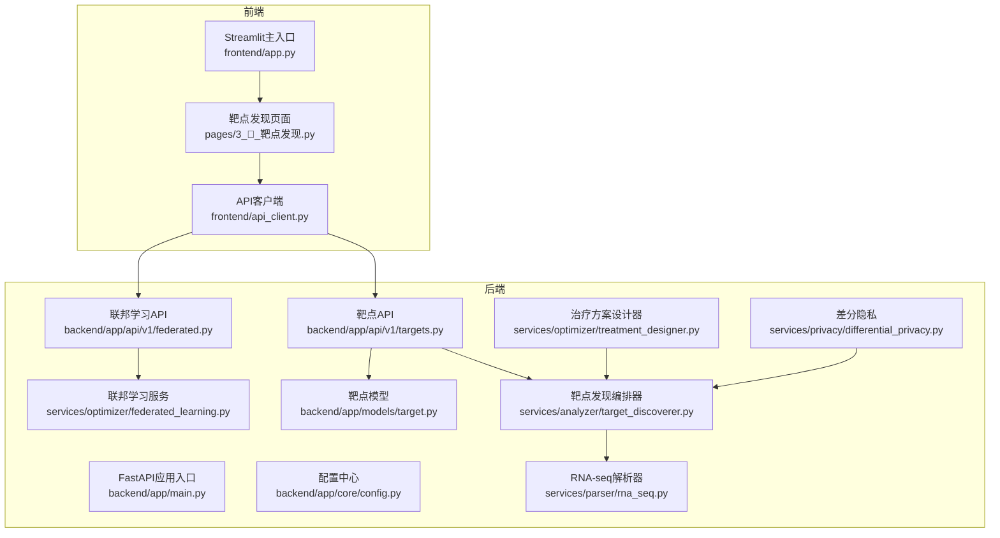
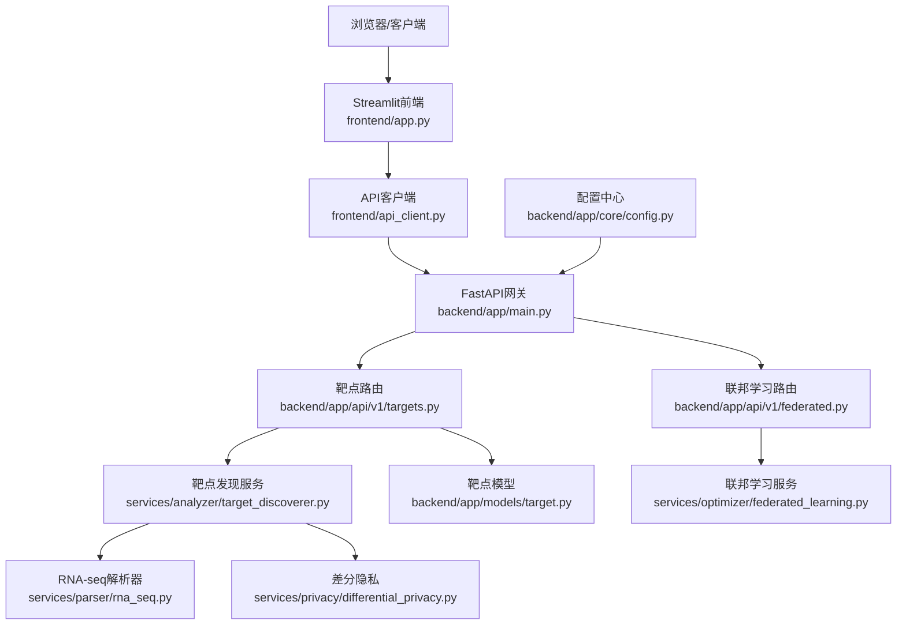
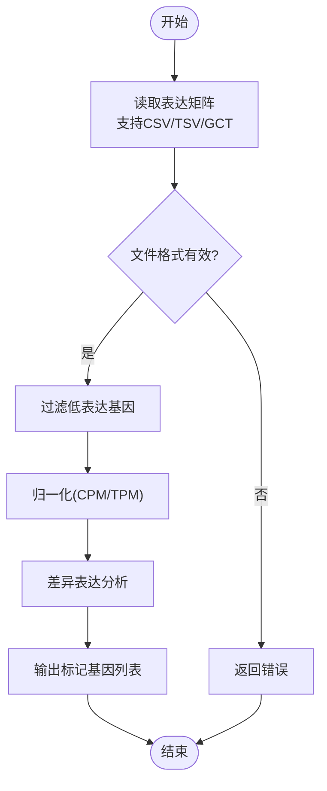
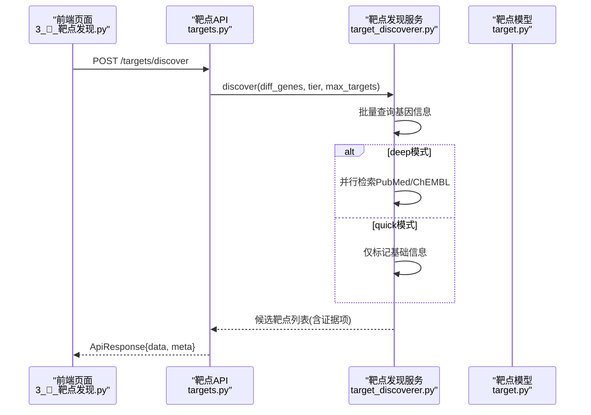
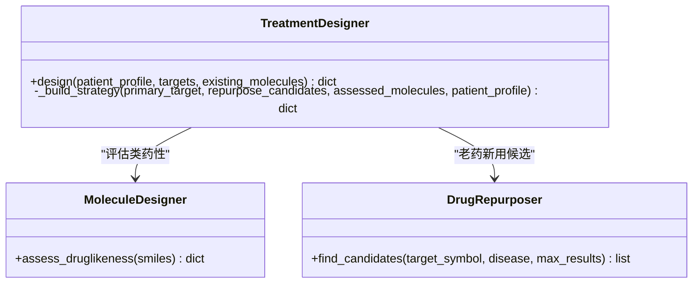
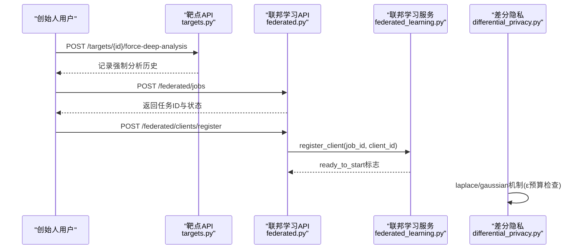
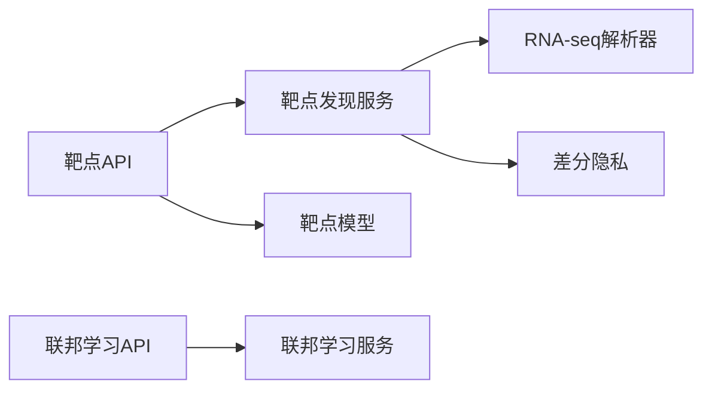

# 项目概述

<cite>
**本文引用的文件**   
- [README.md](file://precision-drug-design/README.md)
- [main.py](file://precision-drug-design/backend/app/main.py)
- [config.py](file://precision-drug-design/backend/app/core/config.py)
- [targets.py](file://precision-drug-design/backend/app/api/v1/targets.py)
- [target_discoverer.py](file://precision-drug-design/backend/app/services/analyzer/target_discoverer.py)
- [treatment_designer.py](file://precision-drug-design/backend/app/services/optimizer/treatment_designer.py)
- [rna_seq.py](file://precision-drug-design/backend/app/services/parser/rna_seq.py)
- [differential_privacy.py](file://precision-drug-design/backend/app/services/privacy/differential_privacy.py)
- [federated_learning.py](file://precision-drug-design/backend/app/services/optimizer/federated_learning.py)
- [federated.py](file://precision-drug-design/backend/app/api/v1/federated.py)
- [target.py](file://precision-drug-design/backend/app/models/target.py)
- [app.py](file://precision-drug-design/frontend/app.py)
- [3_🎯_靶点发现.py](file://precision-drug-design/frontend/pages/3_🎯_靶点发现.py)
- [api_client.py](file://precision-drug-design/frontend/api_client.py)
</cite>

## 目录
1. [引言](#引言)
2. [项目结构](#项目结构)
3. [核心组件](#核心组件)
4. [架构总览](#架构总览)
5. [详细组件分析](#详细组件分析)
6. [依赖关系分析](#依赖关系分析)
7. [性能与可扩展性](#性能与可扩展性)
8. [故障排查指南](#故障排查指南)
9. [结论](#结论)
10. [附录：使用场景与预期效果](#附录使用场景与预期效果)

## 引言
本系统是一个以“创始人思维”驱动的AI精准药物设计平台，覆盖从多组学数据整合、AI辅助靶点发现、并行治疗方案设计到团队协作的全流程研发。系统通过四大子系统协同工作：极限诊断数据整合平台（A）、AI辅助靶点发现引擎（B）、并行治疗方案设计系统（C）、AI模式协作平台（D），在精准药物研发领域提供端到端能力，显著缩短从数据到决策的周期，提升候选靶点与方案的证据质量与可追溯性。

核心价值主张
- 多源证据融合：将组学差异表达、文献、活性分子、临床变异等多维证据统一分级，形成高可信度的靶点候选。
- 快速筛查与深度洞察双轨：支持轻量级快速筛选与高成本深度分析，兼顾效率与严谨性。
- 个性化方案生成：基于患者画像与候选分子评估，输出策略建议与风险提示，辅助临床前与临床路径规划。
- 隐私与合规优先：内置差分隐私预算管理与联邦学习框架，满足跨机构协作的数据不出域需求。
- 可审计与可解释：RBAC权限控制、强制深度分析与审计日志，确保关键决策可追溯。

## 项目结构
仓库采用前后端分离与模块化服务组织方式：
- 后端：FastAPI应用，按路由、模型、Schema、服务分层；服务按功能域划分（analyzer/knowledge/llm/optimizer/parser/privacy/report/workflow）。
- 前端：Streamlit页面化交互，封装统一的API客户端，提供登录、导航与缓存优化。
- 配置与环境：集中式配置加载，环境变量优先级清晰，便于本地与生产环境切换。

图示来源
- [main.py:187-248](file://precision-drug-design/backend/app/main.py#L187-L248)
- [config.py:21-144](file://precision-drug-design/backend/app/core/config.py#L21-L144)
- [targets.py:42-131](file://precision-drug-design/backend/app/api/v1/targets.py#L42-L131)
- [federated.py:35-133](file://precision-drug-design/backend/app/api/v1/federated.py#L35-L133)
- [target_discoverer.py:26-176](file://precision-drug-design/backend/app/services/analyzer/target_discoverer.py#L26-L176)
- [treatment_designer.py:17-146](file://precision-drug-design/backend/app/services/optimizer/treatment_designer.py#L17-L146)
- [rna_seq.py:15-106](file://precision-drug-design/backend/app/services/parser/rna_seq.py#L15-L106)
- [differential_privacy.py:51-151](file://precision-drug-design/backend/app/services/privacy/differential_privacy.py#L51-L151)
- [federated_learning.py:53-199](file://precision-drug-design/backend/app/services/optimizer/federated_learning.py#L53-L199)
- [target.py:14-52](file://precision-drug-design/backend/app/models/target.py#L14-L52)
- [app.py:1-157](file://precision-drug-design/frontend/app.py#L1-L157)
- [3_🎯_靶点发现.py:1-157](file://precision-drug-design/frontend/pages/3_🎯_靶点发现.py#L1-L157)
- [api_client.py:42-200](file://precision-drug-design/frontend/api_client.py#L42-L200)

章节来源
- [README.md:29-110](file://precision-drug-design/README.md#L29-L110)
- [README.md:190-235](file://precision-drug-design/README.md#L190-L235)

## 核心组件
- 应用入口与中间件：统一信封响应、CORS、异常处理、请求追踪ID注入与耗时统计。
- 配置中心：集中管理数据库、Redis、对象存储、向量库、LLM、外部知识库、联邦学习与隐私等参数。
- 靶点发现API与服务：提供快速筛查与深度洞察两种模式，调用多源知识库并输出证据分级的候选靶点。
- 治疗方案设计器：结合老药新用与类药性评估，生成策略建议与风险提示。
- 数据解析器：支持RNA-seq批量表达矩阵加载、过滤与归一化。
- 隐私保护：差分隐私预算管理与噪声机制，保障个体隐私。
- 联邦学习：任务创建、客户端注册、轮次指标更新与状态管理。
- 靶点模型：持久化靶点信息、证据项与相关分子，支撑查询与报告。
- 前端界面：登录、导航、表单输入、结果可视化与快速入口。

章节来源
- [main.py:29-185](file://precision-drug-design/backend/app/main.py#L29-L185)
- [config.py:21-144](file://precision-drug-design/backend/app/core/config.py#L21-L144)
- [targets.py:42-131](file://precision-drug-design/backend/app/api/v1/targets.py#L42-L131)
- [target_discoverer.py:26-176](file://precision-drug-design/backend/app/services/analyzer/target_discoverer.py#L26-L176)
- [treatment_designer.py:17-146](file://precision-drug-design/backend/app/services/optimizer/treatment_designer.py#L17-L146)
- [rna_seq.py:15-106](file://precision-drug-design/backend/app/services/parser/rna_seq.py#L15-L106)
- [differential_privacy.py:51-151](file://precision-drug-design/backend/app/services/privacy/differential_privacy.py#L51-L151)
- [federated_learning.py:53-199](file://precision-drug-design/backend/app/services/optimizer/federated_learning.py#L53-L199)
- [federated.py:35-133](file://precision-drug-design/backend/app/api/v1/federated.py#L35-L133)
- [target.py:14-52](file://precision-drug-design/backend/app/models/target.py#L14-L52)
- [app.py:1-157](file://precision-drug-design/frontend/app.py#L1-L157)
- [3_🎯_靶点发现.py:1-157](file://precision-drug-design/frontend/pages/3_🎯_靶点发现.py#L1-L157)
- [api_client.py:42-200](file://precision-drug-design/frontend/api_client.py#L42-L200)

## 架构总览
系统采用前后端分离与微服务化思想，后端以FastAPI为核心，暴露REST API；前端以Streamlit构建交互式页面；服务层按功能域拆分，数据层通过ORM与多种存储（关系型、缓存、对象存储、向量库）协同。

图示来源
- [main.py:187-248](file://precision-drug-design/backend/app/main.py#L187-L248)
- [targets.py:42-131](file://precision-drug-design/backend/app/api/v1/targets.py#L42-L131)
- [federated.py:35-133](file://precision-drug-design/backend/app/api/v1/federated.py#L35-L133)
- [target_discoverer.py:26-176](file://precision-drug-design/backend/app/services/analyzer/target_discoverer.py#L26-L176)
- [federated_learning.py:53-199](file://precision-drug-design/backend/app/services/optimizer/federated_learning.py#L53-L199)
- [rna_seq.py:15-106](file://precision-drug-design/backend/app/services/parser/rna_seq.py#L15-L106)
- [differential_privacy.py:51-151](file://precision-drug-design/backend/app/services/privacy/differential_privacy.py#L51-L151)
- [config.py:21-144](file://precision-drug-design/backend/app/core/config.py#L21-L144)

## 详细组件分析

### 子系统A：极限诊断数据整合平台
- 设计理念：标准化接入多组学数据（RNA-seq/scRNA-seq/VCF/FASTA），执行标准预处理流程，产出可用于下游分析的标记基因与可视化结果。
- 技术实现要点：
  - RNA-seq解析器支持CSV/TSV/GCT格式，惰性加载pandas，提供过滤低表达与归一化（CPM/TPM降级）能力。
  - 与靶点发现流程衔接，输出差异表达基因列表作为输入。
- 典型流程：
  - 上传表达矩阵 → 解析与校验 → 过滤与归一化 → 差异表达分析 → 导出标记基因。

图示来源
- [rna_seq.py:32-106](file://precision-drug-design/backend/app/services/parser/rna_seq.py#L32-L106)

章节来源
- [README.md:44-53](file://precision-drug-design/README.md#L44-L53)
- [rna_seq.py:15-106](file://precision-drug-design/backend/app/services/parser/rna_seq.py#L15-L106)

### 子系统B：AI辅助靶点发现引擎
- 设计理念：以差异基因为起点，并行检索多源知识库（MyGene/ChEMBL/PubMed/MyVariant），综合证据并分级，输出候选靶点。
- 技术实现要点：
  - 目标发现编排器协调多个客户端，支持quick/deep两种分析层级。
  - 证据分类与分级工具为每条证据赋予I-IV等级。
  - API层提供快速同步与异步深度分析两种模式，并支持网络分析与协同效应预测。
- 序列流程（快速筛查）：
  - 接收差异基因 → 批量查询基因信息 → 根据层级选择是否深度检索 → 组装证据项 → 排序返回。

图示来源
- [3_🎯_靶点发现.py:84-100](file://precision-drug-design/frontend/pages/3_🎯_靶点发现.py#L84-L100)
- [targets.py:42-131](file://precision-drug-design/backend/app/api/v1/targets.py#L42-L131)
- [target_discoverer.py:52-139](file://precision-drug-design/backend/app/services/analyzer/target_discoverer.py#L52-L139)
- [target.py:14-52](file://precision-drug-design/backend/app/models/target.py#L14-L52)

章节来源
- [README.md:55-64](file://precision-drug-design/README.md#L55-L64)
- [targets.py:42-131](file://precision-drug-design/backend/app/api/v1/targets.py#L42-L131)
- [target_discoverer.py:26-176](file://precision-drug-design/backend/app/services/analyzer/target_discoverer.py#L26-L176)

### 子系统C：并行治疗方案设计系统
- 设计理念：基于患者画像与候选靶点，结合老药新用与类药性评估，生成个性化治疗策略与风险提示。
- 技术实现要点：
  - 治疗方案设计器选择证据最强的主靶点，检索老药新用候选，评估现有分子类药性，输出策略描述与优先级。
  - 与靶点发现服务联动，复用候选分子与证据信息。

图示来源
- [treatment_designer.py:17-146](file://precision-drug-design/backend/app/services/optimizer/treatment_designer.py#L17-L146)

章节来源
- [README.md:66-71](file://precision-drug-design/README.md#L66-L71)
- [treatment_designer.py:17-146](file://precision-drug-design/backend/app/services/optimizer/treatment_designer.py#L17-L146)

### 子系统D：AI模式协作平台
- 设计理念：通过RBAC权限、假设沙盒、强制深度分析与审计日志，保障团队协作的可控性与可追溯性。
- 技术实现要点：
  - 创始人强制深度分析接口记录原因与时间戳，用于对照“创始人直觉 vs AI排序”。
  - 联邦学习API提供任务创建、客户端注册与状态管理，支持多中心协同训练。
  - 差分隐私模块提供ε预算管理与噪声机制，确保个体隐私。

图示来源
- [targets.py:228-271](file://precision-drug-design/backend/app/api/v1/targets.py#L228-L271)
- [federated.py:35-133](file://precision-drug-design/backend/app/api/v1/federated.py#L35-L133)
- [federated_learning.py:107-154](file://precision-drug-design/backend/app/services/optimizer/federated_learning.py#L107-L154)
- [differential_privacy.py:63-116](file://precision-drug-design/backend/app/services/privacy/differential_privacy.py#L63-L116)

章节来源
- [README.md:72-78](file://precision-drug-design/README.md#L72-L78)
- [targets.py:228-271](file://precision-drug-design/backend/app/api/v1/targets.py#L228-L271)
- [federated.py:35-133](file://precision-drug-design/backend/app/api/v1/federated.py#L35-L133)
- [federated_learning.py:53-199](file://precision-drug-design/backend/app/services/optimizer/federated_learning.py#L53-L199)
- [differential_privacy.py:51-151](file://precision-drug-design/backend/app/services/privacy/differential_privacy.py#L51-L151)

## 依赖关系分析
- 组件耦合与内聚：
  - API层仅负责请求校验、权限控制与响应封装，业务逻辑下沉至服务层，保持高内聚低耦合。
  - 服务层通过依赖注入或默认实例化组合子服务（如靶点发现编排器组合多个知识库客户端）。
- 直接依赖：
  - 靶点API依赖靶点发现服务与靶点模型。
  - 联邦学习API依赖联邦学习服务。
  - 靶点发现服务依赖RNA-seq解析器与差分隐私模块。
- 外部依赖：
  - 外部知识库（MyGene/ChEMBL/PubMed/MyVariant）与对象存储、向量库、LLM网关等。
- 潜在循环依赖：
  - 当前结构未发现明显循环导入；服务间通过明确接口调用，避免相互引用。

图示来源
- [targets.py:42-131](file://precision-drug-design/backend/app/api/v1/targets.py#L42-L131)
- [federated.py:35-133](file://precision-drug-design/backend/app/api/v1/federated.py#L35-L133)
- [target_discoverer.py:26-176](file://precision-drug-design/backend/app/services/analyzer/target_discoverer.py#L26-L176)
- [federated_learning.py:53-199](file://precision-drug-design/backend/app/services/optimizer/federated_learning.py#L53-L199)
- [rna_seq.py:15-106](file://precision-drug-design/backend/app/services/parser/rna_seq.py#L15-L106)
- [differential_privacy.py:51-151](file://precision-drug-design/backend/app/services/privacy/differential_privacy.py#L51-L151)

章节来源
- [README.md:190-235](file://precision-drug-design/README.md#L190-L235)

## 性能与可扩展性
- 连接池与缓存：
  - 前端API客户端使用httpx连接池复用，减少握手开销；首页健康检查带TTL缓存，降低重复请求。
- 异步与并发：
  - 靶点发现服务在deep模式下并行检索文献与活性数据，提高吞吐。
- 中间件增强：
  - 统一信封中间件注入请求ID与耗时头，便于链路追踪与性能分析。
- 扩展建议：
  - 引入消息队列进行异步任务调度（深度分析、CDISC导出等）。
  - 对热点查询增加Redis缓存层。
  - 对外部知识库调用增加重试与熔断策略。

章节来源
- [api_client.py:24-39](file://precision-drug-design/frontend/api_client.py#L24-L39)
- [api_client.py:186-200](file://precision-drug-design/frontend/api_client.py#L186-L200)
- [main.py:29-185](file://precision-drug-design/backend/app/main.py#L29-L185)
- [target_discoverer.py:82-91](file://precision-drug-design/backend/app/services/analyzer/target_discoverer.py#L82-L91)

## 故障排查指南
- 常见问题定位：
  - 认证失败：检查JWT令牌与Authorization头是否正确注入。
  - 资源不存在：确认ID与权限，查看NotFound错误响应。
  - LLM安全护栏拦截：检查提示词与护栏规则，避免触发拒绝策略。
  - 外部API失败：检查网络连通性与密钥配置，关注UPSTREAM_ERROR。
- 调试建议：
  - 利用X-Request-ID与X-Response-Time-ms进行链路追踪。
  - 查看后端日志（Loguru）与前端控制台输出。
  - 使用OpenAPI文档验证请求格式与参数。

章节来源
- [README.md:283-296](file://precision-drug-design/README.md#L283-L296)
- [main.py:29-185](file://precision-drug-design/backend/app/main.py#L29-L185)

## 结论
本系统以“创始人思维”为核心，构建了从数据整合到方案设计的完整闭环，具备多源证据融合、快速筛查与深度洞察双轨、个性化方案生成、隐私与合规优先、可审计与可解释等优势。通过清晰的架构与模块化服务，系统在精准药物研发领域提供了高效、可靠且可扩展的技术底座。

## 附录：使用场景与预期效果
- 场景一：肿瘤基因组差异表达驱动靶点发现
  - 输入：RNA-seq差异基因列表
  - 过程：快速筛查→证据分级→候选靶点排序
  - 输出：带证据项的靶点清单与可视化概览
- 场景二：老药新用与类药性评估
  - 输入：主靶点与患者画像
  - 过程：检索已批准药物→评估类药性→生成策略
  - 输出：推荐药物与风险提示
- 场景三：多中心联邦学习
  - 输入：联邦任务与客户端注册
  - 过程：启动训练→轮次指标更新→完成状态
  - 输出：任务状态与聚合指标

章节来源
- [README.md:44-78](file://precision-drug-design/README.md#L44-L78)
- [3_🎯_靶点发现.py:84-100](file://precision-drug-design/frontend/pages/3_🎯_靶点发现.py#L84-L100)
- [federated.py:35-133](file://precision-drug-design/backend/app/api/v1/federated.py#L35-L133)