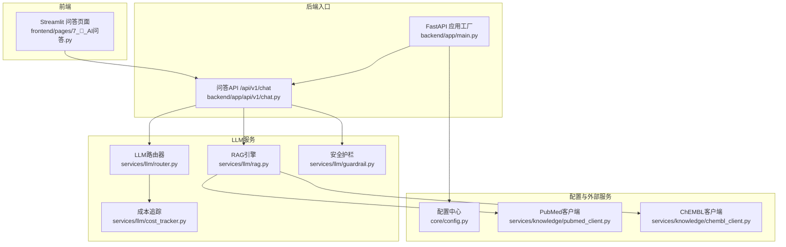
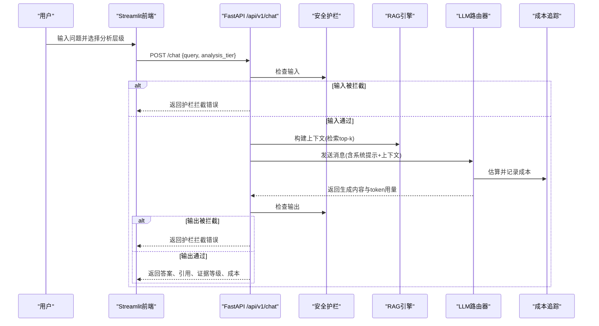
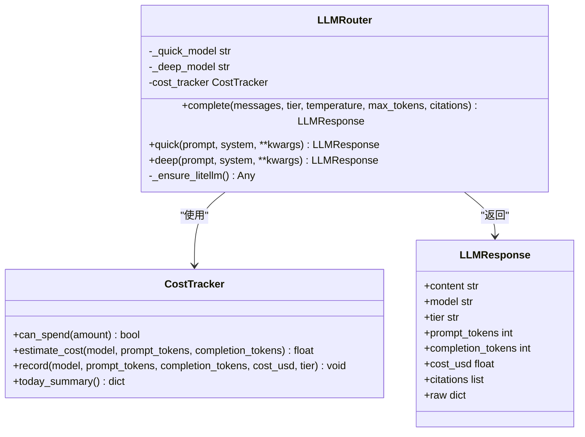
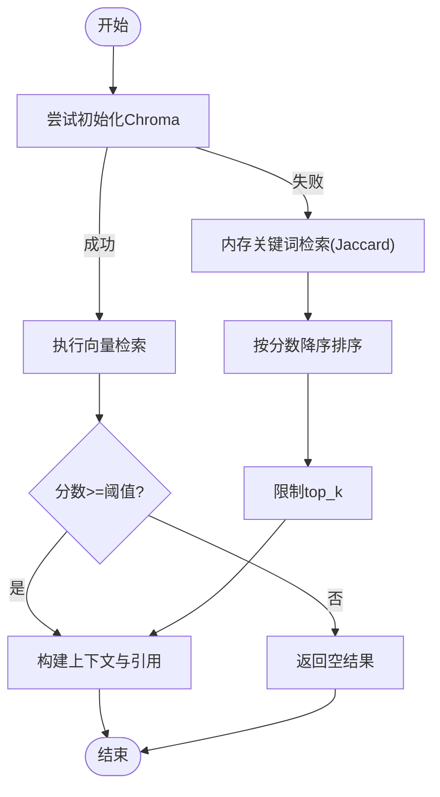
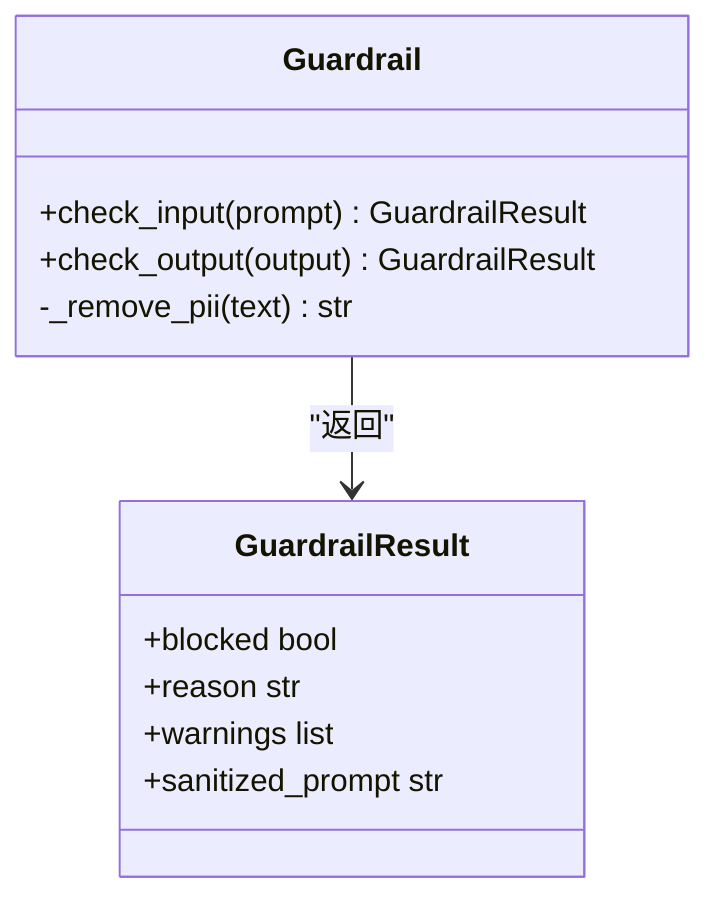
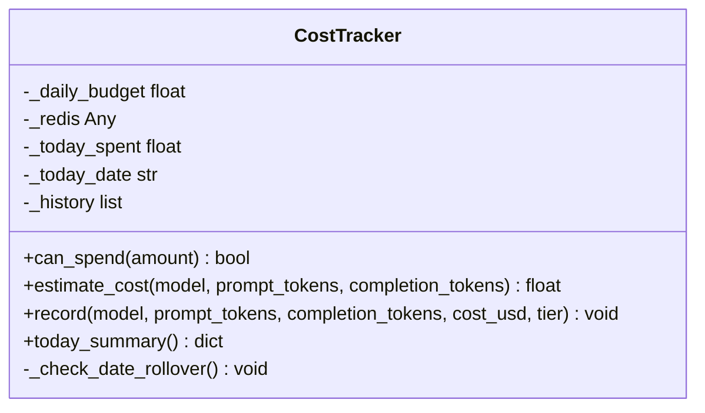
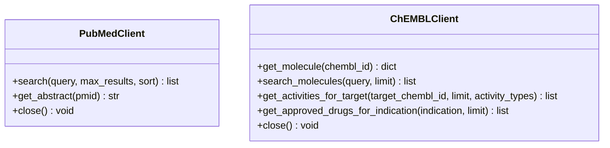
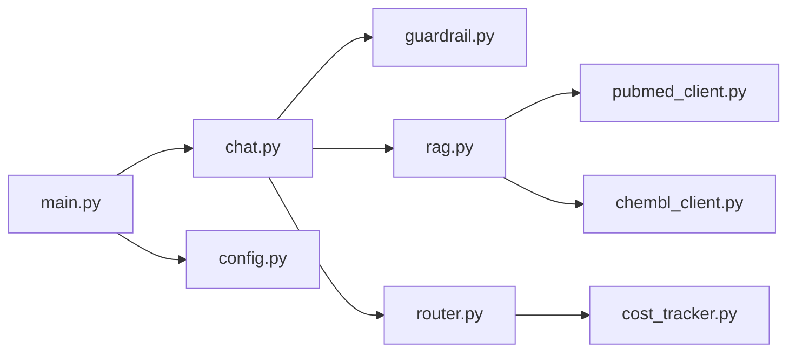

# AI智能问答

<cite>
**本文引用的文件**   
- [README.md](file://precision-drug-design/README.md)
- [main.py](file://precision-drug-design/backend/app/main.py)
- [chat.py](file://precision-drug-design/backend/app/api/v1/chat.py)
- [router.py](file://precision-drug-design/backend/app/services/llm/router.py)
- [rag.py](file://precision-drug-design/backend/app/services/llm/rag.py)
- [cost_tracker.py](file://precision-drug-design/backend/app/services/llm/cost_tracker.py)
- [guardrail.py](file://precision-drug-design/backend/app/services/llm/guardrail.py)
- [config.py](file://precision-drug-design/backend/app/core/config.py)
- [pubmed_client.py](file://precision-drug-design/backend/app/services/knowledge/pubmed_client.py)
- [chembl_client.py](file://precision-drug-design/backend/app/services/knowledge/chembl_client.py)
- [7_🤖_AI问答.py](file://precision-drug-design/frontend/pages/7_🤖_AI问答.py)
- [test_rag.py](file://precision-drug-design/tests/test_rag.py)
- [test_llm_router.py](file://precision-drug-design/tests/test_llm_router.py)
- [test_guardrail.py](file://precision-drug-design/tests/test_guardrail.py)
</cite>

## 目录
1. [简介](#简介)
2. [项目结构](#项目结构)
3. [核心组件](#核心组件)
4. [架构总览](#架构总览)
5. [详细组件分析](#详细组件分析)
6. [依赖关系分析](#依赖关系分析)
7. [性能与成本优化](#性能与成本优化)
8. [故障排查指南](#故障排查指南)
9. [结论](#结论)
10. [附录](#附录)

## 简介
本技术文档围绕“AI智能问答”子系统，系统性阐述RAG检索增强生成、多模型路由策略、对话管理流程，以及向量数据库集成、知识图谱构建思路、语义搜索优化方案。同时覆盖大语言模型集成（OpenAI、Anthropic、本地模型）、提示词工程、上下文管理、对话状态跟踪、意图识别与实体抽取的实现建议，并给出在药物研发领域的应用场景（文献检索、靶点信息查询、分子性质预测等）与最佳实践（成本追踪、安全防护、性能优化）。

## 项目结构
后端采用 FastAPI 分层架构：入口应用注册中间件与路由；API层编排业务流；服务层实现LLM路由、RAG检索、安全护栏、成本追踪；配置中心集中管理环境变量；外部知识库客户端提供PubMed、ChEMBL等数据源；前端Streamlit页面提供问答交互界面。

图表来源
- [main.py:187-248](file://precision-drug-design/backend/app/main.py#L187-L248)
- [chat.py:30-157](file://precision-drug-design/backend/app/api/v1/chat.py#L30-L157)
- [router.py:55-198](file://precision-drug-design/backend/app/services/llm/router.py#L55-L198)
- [rag.py:35-238](file://precision-drug-design/backend/app/services/llm/rag.py#L35-L238)
- [guardrail.py:58-168](file://precision-drug-design/backend/app/services/llm/guardrail.py#L58-L168)
- [cost_tracker.py:27-167](file://precision-drug-design/backend/app/services/llm/cost_tracker.py#L27-L167)
- [config.py:21-144](file://precision-drug-design/backend/app/core/config.py#L21-L144)
- [pubmed_client.py:16-125](file://precision-drug-design/backend/app/services/knowledge/pubmed_client.py#L16-L125)
- [chembl_client.py:20-127](file://precision-drug-design/backend/app/services/knowledge/chembl_client.py#L20-L127)

章节来源
- [README.md:1-421](file://precision-drug-design/README.md#L1-L421)
- [main.py:187-248](file://precision-drug-design/backend/app/main.py#L187-L248)

## 核心组件
- LLM路由器：基于LiteLLM统一调用OpenAI/Anthropic等模型，支持quick/deep两层级选择、预算控制与成本记录。
- RAG引擎：以Chroma为向量库，提供文档入库、相似度检索、上下文拼接；不可用时降级为内存关键词检索。
- 安全护栏：输入/输出双重校验，拦截违规内容、提示词注入、非医学话题，并对PII进行脱敏。
- 成本追踪：按模型与层级统计费用，支持日预算上限与累计记录。
- 外部知识库：PubMed与ChEMBL客户端，支撑文献检索与分子活性数据查询。
- 配置中心：集中化环境变量加载与类型校验，提供CORS、数据库、Redis、对象存储、LLM密钥等配置项。

章节来源
- [router.py:55-198](file://precision-drug-design/backend/app/services/llm/router.py#L55-L198)
- [rag.py:35-238](file://precision-drug-design/backend/app/services/llm/rag.py#L35-L238)
- [guardrail.py:58-168](file://precision-drug-design/backend/app/services/llm/guardrail.py#L58-L168)
- [cost_tracker.py:27-167](file://precision-drug-design/backend/app/services/llm/cost_tracker.py#L27-L167)
- [pubmed_client.py:16-125](file://precision-drug-design/backend/app/services/knowledge/pubmed_client.py#L16-L125)
- [chembl_client.py:20-127](file://precision-drug-design/backend/app/services/knowledge/chembl_client.py#L20-L127)
- [config.py:21-144](file://precision-drug-design/backend/app/core/config.py#L21-L144)

## 架构总览
问答请求从前端进入后端API，依次经过安全护栏检查、RAG检索构建上下文、LLM路由生成回答，再经输出护栏校验后返回结果。若LLM不可用，则降级返回RAG检索摘要。

图表来源
- [chat.py:30-157](file://precision-drug-design/backend/app/api/v1/chat.py#L30-L157)
- [guardrail.py:70-145](file://precision-drug-design/backend/app/services/llm/guardrail.py#L70-L145)
- [rag.py:126-238](file://precision-drug-design/backend/app/services/llm/rag.py#L126-L238)
- [router.py:92-171](file://precision-drug-design/backend/app/services/llm/router.py#L92-L171)
- [cost_tracker.py:80-141](file://precision-drug-design/backend/app/services/llm/cost_tracker.py#L80-L141)

## 详细组件分析

### LLM路由器（多模型路由与成本追踪）
- 设计要点
  - quick/deep两层级：快速层用于简单问答与分类，深度层用于综合推理与报告生成。
  - 预算控制：每次调用前检查剩余预算，超支直接拒绝。
  - 成本估算：依据模型定价表计算input/output token费用，并记录到历史。
  - 延迟加载：避免未安装litellm时启动失败。
- 关键数据结构
  - LLMResponse：封装content、model、tier、tokens、cost_usd、citations、raw等字段。
- 复杂度与性能
  - 时间复杂度：O(1)（路由选择与成本估算），主要耗时在外部LLM调用。
  - 空间复杂度：O(1)，仅维护少量状态与历史记录。
- 错误处理
  - 未安装依赖抛出运行时异常；外部API异常包装为统一错误；预算不足抛出明确提示。

图表来源
- [router.py:30-198](file://precision-drug-design/backend/app/services/llm/router.py#L30-L198)
- [cost_tracker.py:27-167](file://precision-drug-design/backend/app/services/llm/cost_tracker.py#L27-L167)

章节来源
- [router.py:55-198](file://precision-drug-design/backend/app/services/llm/router.py#L55-L198)
- [test_llm_router.py:1-258](file://precision-drug-design/tests/test_llm_router.py#L1-L258)

### RAG引擎（检索增强生成）
- 设计要点
  - 向量库优先：使用Chroma持久化集合，cosine距离转相似度评分。
  - 降级策略：当chromadb不可用时，回退到内存Jaccard关键词检索。
  - 上下文构建：将top-k检索结果拼接为结构化上下文，附带引用元数据。
- 关键数据结构
  - RetrievalResult：包含content、source、score、metadata。
- 算法与复杂度
  - Chroma检索：近似最近邻搜索，时间复杂度取决于索引规模与n_results。
  - 内存检索：Jaccard相似度，时间复杂度O(N·|V|)，N为文档数，|V|为词汇量。
- 错误处理
  - 初始化失败或查询异常时记录警告并降级；空查询返回空列表。

图表来源
- [rag.py:62-238](file://precision-drug-design/backend/app/services/llm/rag.py#L62-L238)

章节来源
- [rag.py:35-238](file://precision-drug-design/backend/app/services/llm/rag.py#L35-L238)
- [test_rag.py:1-207](file://precision-drug-design/tests/test_rag.py#L1-L207)

### 安全护栏（输入/输出防护）
- 规则体系
  - 输入拦截：剂量处方、绝对化承诺、提示词注入、非医学话题。
  - 输出检查：检测违规模式与潜在剂量建议，附加警告。
  - PII脱敏：手机号、身份证号、邮箱替换为占位符。
- 数据结构
  - GuardrailResult：blocked、reason、warnings、sanitized_prompt。
- 适用性
  - 适用于所有LLM调用路径，确保合规与安全。

图表来源
- [guardrail.py:41-168](file://precision-drug-design/backend/app/services/llm/guardrail.py#L41-L168)

章节来源
- [guardrail.py:58-168](file://precision-drug-design/backend/app/services/llm/guardrail.py#L58-L168)
- [test_guardrail.py:1-90](file://precision-drug-design/tests/test_guardrail.py#L1-L90)

### 成本追踪器（预算控制与统计）
- 功能特性
  - 按模型与层级累计费用，支持日预算上限。
  - 实时预算检查，超支拒绝后续调用。
  - 今日汇总：总花费、剩余预算、调用次数、按模型/层级分解。
- 定价策略
  - 内置主流模型单价表，未知模型使用默认平均价格估算。

图表来源
- [cost_tracker.py:27-167](file://precision-drug-design/backend/app/services/llm/cost_tracker.py#L27-L167)

章节来源
- [cost_tracker.py:27-167](file://precision-drug-design/backend/app/services/llm/cost_tracker.py#L27-L167)

### 外部知识库客户端（PubMed与ChEMBL）
- PubMed客户端
  - 通过NCBI E-utilities进行esearch/esummary/efetch检索，支持分页与限速。
- ChEMBL客户端
  - 提供分子详情、活性数据、适应症药物查询接口。

图表来源
- [pubmed_client.py:16-125](file://precision-drug-design/backend/app/services/knowledge/pubmed_client.py#L16-L125)
- [chembl_client.py:20-127](file://precision-drug-design/backend/app/services/knowledge/chembl_client.py#L20-L127)

章节来源
- [pubmed_client.py:16-125](file://precision-drug-design/backend/app/services/knowledge/pubmed_client.py#L16-L125)
- [chembl_client.py:20-127](file://precision-drug-design/backend/app/services/knowledge/chembl_client.py#L20-L127)

### 前端问答页面（Streamlit）
- 交互流程
  - 用户选择分析层级（quick/deep），输入问题，展示助手回复与引用源。
  - 会话历史保存在session_state中，支持清空。
- 错误提示
  - 当LLM不可用时，提示配置API Key并显示降级信息。

章节来源
- [7_🤖_AI问答.py:1-139](file://precision-drug-design/frontend/pages/7_🤖_AI问答.py#L1-L139)

## 依赖关系分析
- 模块耦合
  - chat.py依赖guardrail、rag、router；router依赖cost_tracker；rag依赖外部知识库客户端；main.py聚合路由与配置。
- 外部依赖
  - litellm（可选，延迟导入）、chromadb（可选，降级策略）、HTTP客户端（PubMed/ChEMBL）。
- 循环依赖
  - 未发现直接循环依赖；各服务通过函数式调用解耦。

图表来源
- [main.py:187-248](file://precision-drug-design/backend/app/main.py#L187-L248)
- [chat.py:30-157](file://precision-drug-design/backend/app/api/v1/chat.py#L30-L157)
- [router.py:55-198](file://precision-drug-design/backend/app/services/llm/router.py#L55-L198)
- [rag.py:35-238](file://precision-drug-design/backend/app/services/llm/rag.py#L35-L238)
- [guardrail.py:58-168](file://precision-drug-design/backend/app/services/llm/guardrail.py#L58-L168)
- [cost_tracker.py:27-167](file://precision-drug-design/backend/app/services/llm/cost_tracker.py#L27-L167)
- [pubmed_client.py:16-125](file://precision-drug-design/backend/app/services/knowledge/pubmed_client.py#L16-L125)
- [chembl_client.py:20-127](file://precision-drug-design/backend/app/services/knowledge/chembl_client.py#L20-L127)
- [config.py:21-144](file://precision-drug-design/backend/app/core/config.py#L21-L144)

章节来源
- [main.py:187-248](file://precision-drug-design/backend/app/main.py#L187-L248)
- [chat.py:30-157](file://precision-drug-design/backend/app/api/v1/chat.py#L30-L157)

## 性能与成本优化
- 性能优化
  - 向量检索：合理设置top_k与min_score，减少无关噪声；生产环境启用Chroma持久化与HNSW索引。
  - 并发控制：外部API调用增加重试与超时保护，遵循限速策略（如NCBI 3 req/s）。
  - 缓存策略：对高频查询结果进行短期缓存（Redis），降低重复检索开销。
- 成本优化
  - 层级选择：简单问题使用quick层，复杂任务使用deep层；结合预算动态调整。
  - Token裁剪：精简上下文长度，避免过长prompt导致高成本。
  - 监控告警：基于CostTracker.today_summary设置预算阈值告警。

[本节为通用指导，不直接分析具体文件]

## 故障排查指南
- 常见问题
  - LLM不可用：检查OPENAI_API_KEY/ANTHROPIC_API_KEY配置与网络连通性；查看降级逻辑是否生效。
  - 向量库不可用：确认chromadb安装与持久化目录权限；验证降级到内存检索是否正常。
  - 预算超支：调整每日预算或减少deep层调用频率；查看今日汇总明细。
  - 安全拦截：核对输入是否触发违规模式；必要时调整护栏规则或提示词。
- 定位方法
  - 查看日志中的request_id与响应头X-Response-Time-ms，定位慢请求。
  - 使用单元测试覆盖关键路径（RAG、Router、Guardrail），快速复现与修复。

章节来源
- [chat.py:120-157](file://precision-drug-design/backend/app/api/v1/chat.py#L120-L157)
- [rag.py:62-88](file://precision-drug-design/backend/app/services/llm/rag.py#L62-L88)
- [router.py:125-140](file://precision-drug-design/backend/app/services/llm/router.py#L125-L140)
- [guardrail.py:70-145](file://precision-drug-design/backend/app/services/llm/guardrail.py#L70-L145)

## 结论
本AI智能问答系统以RAG为核心，结合多模型路由与严格的安全护栏，实现了在药物研发领域的精准、可追溯、可控的智能问答能力。通过成本追踪与性能优化策略，系统在保障质量的同时兼顾了经济性与稳定性。未来可扩展知识图谱构建、更复杂的对话状态管理与意图识别，进一步提升专业场景的可用性与准确性。

[本节为总结性内容，不直接分析具体文件]

## 附录
- 应用场景示例
  - 文献检索：基于PubMed检索BRCA1相关最新研究，RAG检索并生成带证据等级的综述。
  - 靶点信息查询：结合ChEMBL获取EGFR抑制剂活性数据，辅助靶点评估。
  - 分子性质预测：对接RDKit/NVIDIA NIM等工具，进行类药性与对接打分（扩展方向）。
- 最佳实践清单
  - 提示词工程：明确角色、约束与输出格式；嵌入证据等级要求。
  - 上下文管理：控制top_k与min_score，避免上下文过长；保留引用元数据。
  - 对话状态跟踪：在后续版本引入会话持久化与状态机，支持多轮对话与记忆。
  - 意图识别与实体抽取：在前端或API层增加NLU预处理，提取基因名、药物名、适应症等实体。
  - 安全防护：持续更新护栏规则，定期审计敏感词与注入模式。
  - 成本治理：设定团队预算与个人配额，结合监控看板进行动态调整。

[本节为概念性内容，不直接分析具体文件]