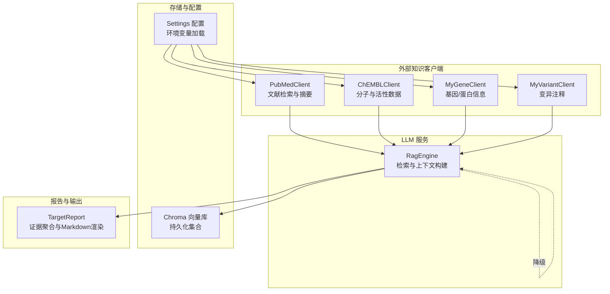
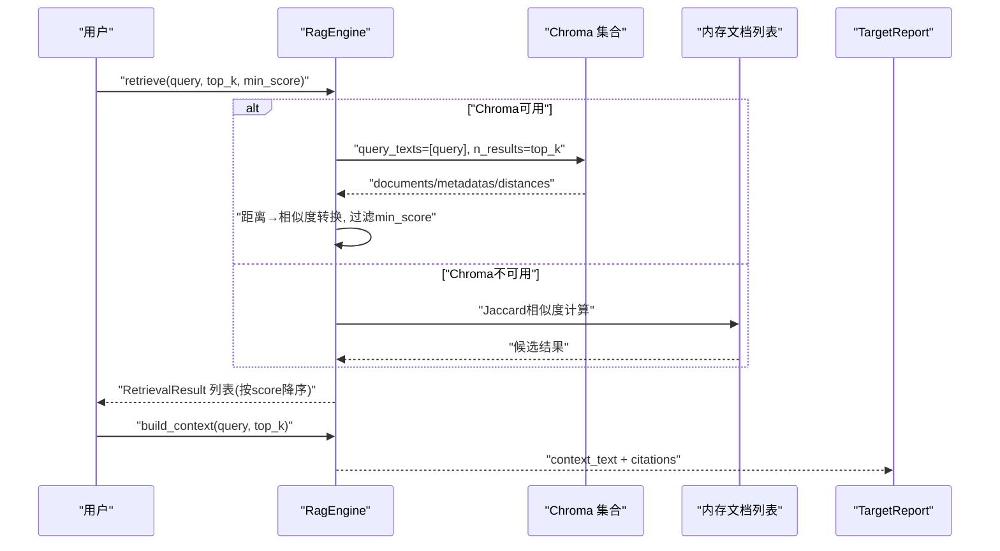
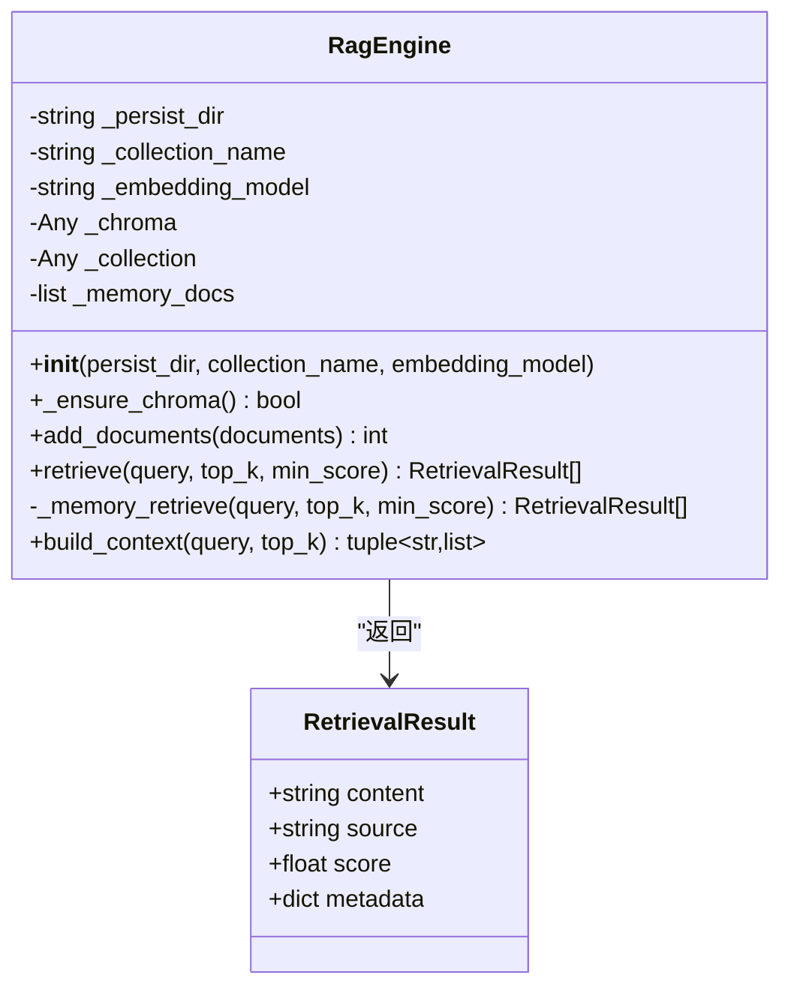
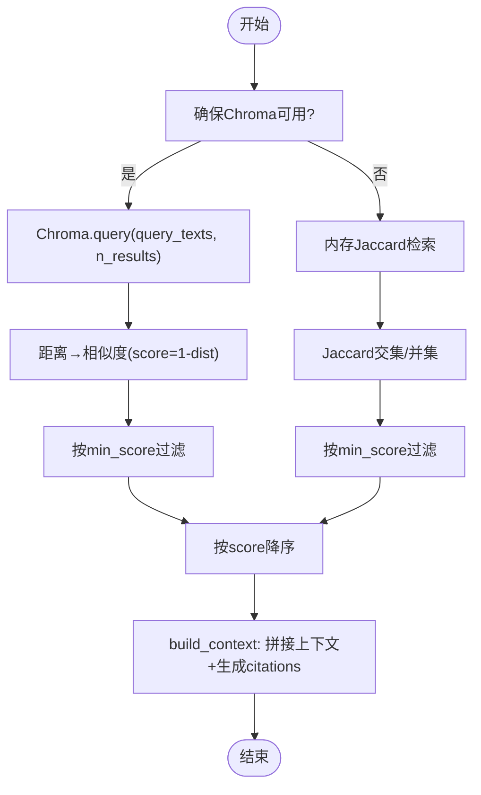
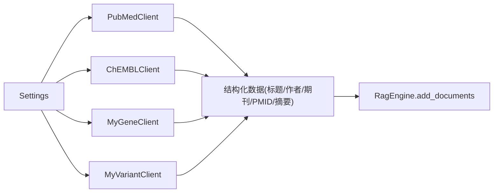
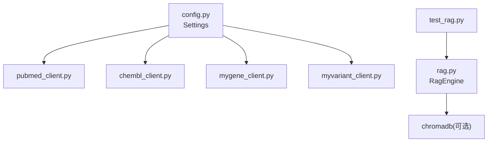

# RAG检索增强引擎

<cite>
**本文引用的文件**
- [rag.py](file://backend/app/services/llm/rag.py)
- [test_rag.py](file://tests/test_rag.py)
- [pubmed_client.py](file://backend/app/services/knowledge/pubmed_client.py)
- [chembl_client.py](file://backend/app/services/knowledge/chembl_client.py)
- [mygene_client.py](file://backend/app/services/knowledge/mygene_client.py)
- [myvariant_client.py](file://backend/app/services/knowledge/myvariant_client.py)
- [config.py](file://backend/app/core/config.py)
- [target_report.py](file://backend/app/services/report/target_report.py)
</cite>

## 目录
1. [简介](#简介)
2. [项目结构](#项目结构)
3. [核心组件](#核心组件)
4. [架构总览](#架构总览)
5. [详细组件分析](#详细组件分析)
6. [依赖关系分析](#依赖关系分析)
7. [性能与索引优化](#性能与索引优化)
8. [故障排查指南](#故障排查指南)
9. [结论](#结论)
10. [附录：应用案例与提示词模板](#附录应用案例与提示词模板)

## 简介
本技术文档面向“RAG检索增强生成引擎”，聚焦以下目标：
- 向量数据库集成（Chroma）配置与使用，包括文本嵌入模型选择、相似度计算方法、索引优化策略
- 语义搜索算法与降级方案（内存关键词检索）
- 多源知识库整合（PubMed、ChEMBL、MyGene、MyVariant）的数据清洗、向量化处理与元数据管理
- 检索结果排序、去重、相关性评分的算法实现
- 上下文构建策略、引用格式标准化
- 在药物研发领域的具体应用案例（文献检索、靶点信息查询、分子性质预测等）

## 项目结构
RAG相关代码位于后端服务模块中，核心由“检索引擎 + 外部知识客户端 + 报告渲染”三部分构成。

图表来源
- [rag.py:35-238](file://backend/app/services/llm/rag.py#L35-L238)
- [pubmed_client.py:16-125](file://backend/app/services/knowledge/pubmed_client.py#L16-L125)
- [chembl_client.py:20-127](file://backend/app/services/knowledge/chembl_client.py#L20-L127)
- [mygene_client.py:19-97](file://backend/app/services/knowledge/mygene_client.py#L19-L97)
- [myvariant_client.py:19-85](file://backend/app/services/knowledge/myvariant_client.py#L19-L85)
- [config.py:51-76](file://backend/app/core/config.py#L51-L76)
- [target_report.py:38-214](file://backend/app/services/report/target_report.py#L38-L214)

章节来源
- [rag.py:35-238](file://backend/app/services/llm/rag.py#L35-L238)
- [config.py:51-76](file://backend/app/core/config.py#L51-L76)

## 核心组件
- RagEngine：负责文档入库、向量检索、上下文构建；支持 Chroma 优先、内存降级
- RetrievalResult：单条检索结果的结构体（内容、来源、分数、元数据）
- 外部知识客户端：PubMed、ChEMBL、MyGene、MyVariant，提供结构化数据并便于后续清洗与向量化
- Settings：集中式配置，包含 Chroma 持久化路径、外部 API 基址等
- TargetReport：将证据项、文献、临床试验等信息聚合为 Markdown/JSON，用于报告输出

章节来源
- [rag.py:18-238](file://backend/app/services/llm/rag.py#L18-L238)
- [pubmed_client.py:16-125](file://backend/app/services/knowledge/pubmed_client.py#L16-L125)
- [chembl_client.py:20-127](file://backend/app/services/knowledge/chembl_client.py#L20-L127)
- [mygene_client.py:19-97](file://backend/app/services/knowledge/mygene_client.py#L19-L97)
- [myvariant_client.py:19-85](file://backend/app/services/knowledge/myvariant_client.py#L19-L85)
- [config.py:21-144](file://backend/app/core/config.py#L21-L144)
- [target_report.py:38-214](file://backend/app/services/report/target_report.py#L38-L214)

## 架构总览
RAG 工作流从查询进入，先尝试通过 Chroma 进行向量检索；若不可用则回退到内存关键词检索。随后将检索结果组装为 LLM 上下文，并附带标准化引用。

图表来源
- [rag.py:126-238](file://backend/app/services/llm/rag.py#L126-L238)
- [target_report.py:38-214](file://backend/app/services/report/target_report.py#L38-L214)

## 详细组件分析

### 组件A：RagEngine 类图

图表来源
- [rag.py:18-238](file://backend/app/services/llm/rag.py#L18-L238)

章节来源
- [rag.py:18-238](file://backend/app/services/llm/rag.py#L18-L238)

### 组件B：Chroma 向量库配置与使用
- 初始化与集合创建
  - 惰性初始化：首次调用时尝试导入 chromadb 并建立 PersistentClient
  - 集合元数据设置：hnsw:space=cosine（余弦空间）
- 文档入库
  - add_documents：批量写入 documents 与 metadatas（source 字段），失败不影响内存备份
- 检索流程
  - retrieve：优先走 Chroma.query，将距离转换为相似度（score = 1 - dist），并按 min_score 过滤
  - 降级：当 chromadb 未安装或异常时，回退至内存关键词检索（Jaccard）
- 上下文构建
  - build_context：将检索结果拼接为上下文文本，并生成标准化 citations（id、source、score）

图表来源
- [rag.py:62-238](file://backend/app/services/llm/rag.py#L62-L238)

章节来源
- [rag.py:62-238](file://backend/app/services/llm/rag.py#L62-L238)

### 组件C：外部知识客户端（PubMed、ChEMBL、MyGene、MyVariant）
- 共同特征
  - 基于 HttpClient 封装，统一超时与重试策略
  - 从 Settings 读取 base_url，避免硬编码
- PubMedClient
  - esearch → esummary 获取 PMIDs 与基本信息
  - efetch 获取摘要文本
- ChEMBLClient
  - 分子查询、靶点活性数据、适应症药物
- MyGeneClient
  - 基因查询、批量查询（POST）
- MyVariantClient
  - 变异查询、批量查询（POST）

图表来源
- [config.py:68-76](file://backend/app/core/config.py#L68-L76)
- [pubmed_client.py:16-125](file://backend/app/services/knowledge/pubmed_client.py#L16-L125)
- [chembl_client.py:20-127](file://backend/app/services/knowledge/chembl_client.py#L20-L127)
- [mygene_client.py:19-97](file://backend/app/services/knowledge/mygene_client.py#L19-L97)
- [myvariant_client.py:19-85](file://backend/app/services/knowledge/myvariant_client.py#L19-L85)

章节来源
- [pubmed_client.py:16-125](file://backend/app/services/knowledge/pubmed_client.py#L16-L125)
- [chembl_client.py:20-127](file://backend/app/services/knowledge/chembl_client.py#L20-L127)
- [mygene_client.py:19-97](file://backend/app/services/knowledge/mygene_client.py#L19-L97)
- [myvariant_client.py:19-85](file://backend/app/services/knowledge/myvariant_client.py#L19-L85)
- [config.py:68-76](file://backend/app/core/config.py#L68-L76)

### 组件D：检索结果排序、去重、相关性评分
- 排序：Chroma 模式下按 score 降序；内存模式显式 sort(key=lambda r: r.score, reverse=True)
- 去重：当前实现未显式去重；可在上层根据 source 或 content 哈希做去重
- 相关性评分：
  - Chroma：余弦相似度（集合元数据 hnsw:space=cosine），距离转相似度
  - 内存：Jaccard 相似度（交集大小/并集大小）

章节来源
- [rag.py:126-209](file://backend/app/services/llm/rag.py#L126-L209)

### 组件E：上下文构建与引用格式标准化
- build_context 将检索结果拼接为带编号的上下文文本，并为每条结果生成 citation（id、source、score）
- 无结果时返回空字符串与空列表，保证下游稳定

章节来源
- [rag.py:211-238](file://backend/app/services/llm/rag.py#L211-L238)

### 组件F：报告渲染与证据聚合
- TargetReport 聚合证据项、相关分子、临床试验、文献，输出 Markdown 与 JSON
- 参考文献部分采用标准格式（作者、标题、期刊、年份、PMID）

章节来源
- [target_report.py:38-214](file://backend/app/services/report/target_report.py#L38-L214)

## 依赖关系分析
- 配置依赖：所有外部客户端均从 Settings 读取 base_url，便于环境切换
- 运行时依赖：RagEngine 依赖 chromadb（可选），否则回退内存模式
- 测试覆盖：针对初始化、降级、检索阈值、top_k、上下文构建等进行断言

图表来源
- [config.py:21-144](file://backend/app/core/config.py#L21-L144)
- [rag.py:62-88](file://backend/app/services/llm/rag.py#L62-L88)
- [test_rag.py:1-207](file://tests/test_rag.py#L1-L207)

章节来源
- [config.py:21-144](file://backend/app/core/config.py#L21-L144)
- [rag.py:62-88](file://backend/app/services/llm/rag.py#L62-L88)
- [test_rag.py:1-207](file://tests/test_rag.py#L1-L207)

## 性能与索引优化
- 向量索引
  - 使用 HNSW 索引，空间度量设置为 cosine，适合语义相似度检索
- 相似度转换
  - Chroma 返回距离值，需转换为相似度（score = 1 - dist），并对负值截断为 0
- 阈值与Top-K
  - 通过 min_score 过滤低质量结果，top_k 控制返回数量，平衡召回与延迟
- 降级策略
  - 内存 Jaccard 检索作为兜底，避免系统不可用时完全失效
- 建议优化
  - 对长文本进行分块（段落/句子级），提升检索粒度
  - 引入元数据过滤（如来源类型、时间范围）减少候选集规模
  - 缓存高频查询结果，降低重复检索开销

章节来源
- [rag.py:81-88](file://backend/app/services/llm/rag.py#L81-L88)
- [rag.py:142-169](file://backend/app/services/llm/rag.py#L142-L169)
- [rag.py:171-209](file://backend/app/services/llm/rag.py#L171-L209)

## 故障排查指南
- 常见问题
  - chromadb 未安装：日志警告并降级为内存检索
  - Chroma 初始化失败：记录异常并降级
  - 检索结果为空：检查 min_score 阈值是否过高、查询词是否过短
- 定位方法
  - 查看日志中的警告/错误信息
  - 确认 Settings 中 chroma_persist_dir 可写
  - 验证外部 API 可达性与限速（如 NCBI 3 req/s）

章节来源
- [rag.py:70-88](file://backend/app/services/llm/rag.py#L70-L88)
- [pubmed_client.py:67-75](file://backend/app/services/knowledge/pubmed_client.py#L67-L75)

## 结论
本 RAG 引擎以 Chroma 为核心，结合外部生物医学知识库，实现了高可用的检索增强生成链路。其关键优势在于：
- 稳定的降级机制保障可用性
- 清晰的相似度计算与阈值控制
- 标准化的上下文与引用格式，便于溯源
- 模块化的外部客户端设计，易于扩展新的知识源

## 附录：应用案例与提示词模板

### 应用案例一：文献检索（PubMed）
- 流程
  - 使用 PubMedClient 检索文献（esearch/esummary），必要时 efetch 获取摘要
  - 将摘要与元数据（PMID、标题、作者、期刊、日期）清洗后入库
  - 通过 RagEngine 检索并构建上下文，供 LLM 回答
- 关键点
  - 遵守 NCBI 速率限制（sleep 间隔）
  - 元数据中包含 source 标识，便于引用

章节来源
- [pubmed_client.py:33-125](file://backend/app/services/knowledge/pubmed_client.py#L33-L125)
- [rag.py:90-124](file://backend/app/services/llm/rag.py#L90-L124)

### 应用案例二：靶点信息查询（MyGene + MyVariant）
- 流程
  - 通过 MyGeneClient 查询基因详情（symbol/HGNC/Ensembl）
  - 通过 MyVariantClient 查询变异注释（HGVS/rsID/ClinVar）
  - 将结构化数据清洗、格式化后入库，RAG 检索并生成报告
- 关键点
  - 批量查询接口提高吞吐
  - 元数据标注来源与字段，便于证据分级

章节来源
- [mygene_client.py:39-97](file://backend/app/services/knowledge/mygene_client.py#L39-L97)
- [myvariant_client.py:35-85](file://backend/app/services/knowledge/myvariant_client.py#L35-L85)
- [target_report.py:190-214](file://backend/app/services/report/target_report.py#L190-L214)

### 应用案例三：分子性质预测（ChEMBL）
- 流程
  - 使用 ChEMBLClient 查询分子属性与活性数据（IC50/Ki/Kd）
  - 将分子描述与活性指标清洗入库
  - 通过 RAG 检索相似分子或活性记录，辅助预测与解释
- 关键点
  - 使用统一的 source 标识（如 chembl:CHEMBLxxxx）
  - 结合证据等级统计与报告渲染

章节来源
- [chembl_client.py:36-127](file://backend/app/services/knowledge/chembl_client.py#L36-L127)
- [target_report.py:45-76](file://backend/app/services/report/target_report.py#L45-L76)

### 提示词模板与引用格式
- 上下文模板
  - 将检索结果按编号组织，附带来源与相似度，便于 LLM 引用
- 引用格式
  - citations 包含 id、source、score，确保可追溯
- 示例路径
  - 参考 build_context 的输出结构与 TargetReport 的参考文献渲染

章节来源
- [rag.py:211-238](file://backend/app/services/llm/rag.py#L211-L238)
- [target_report.py:190-214](file://backend/app/services/report/target_report.py#L190-L214)