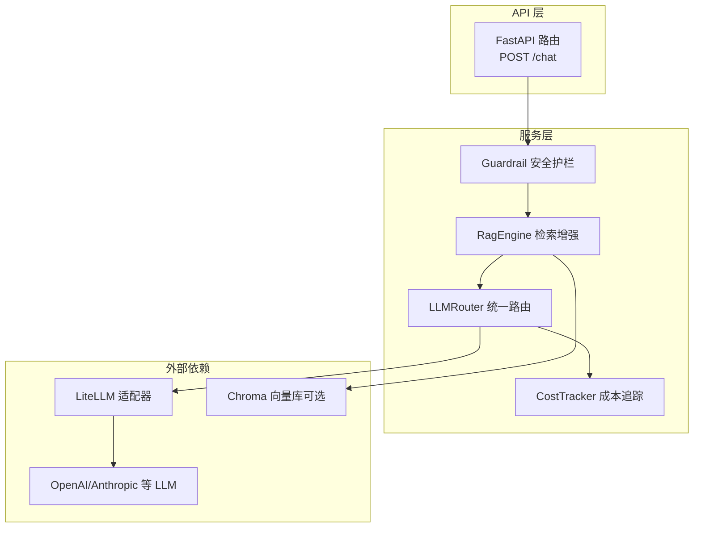
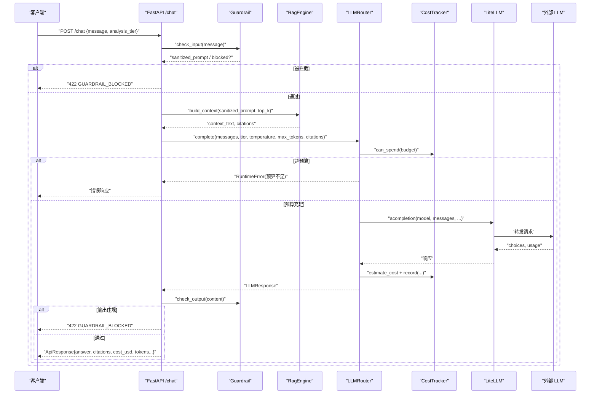
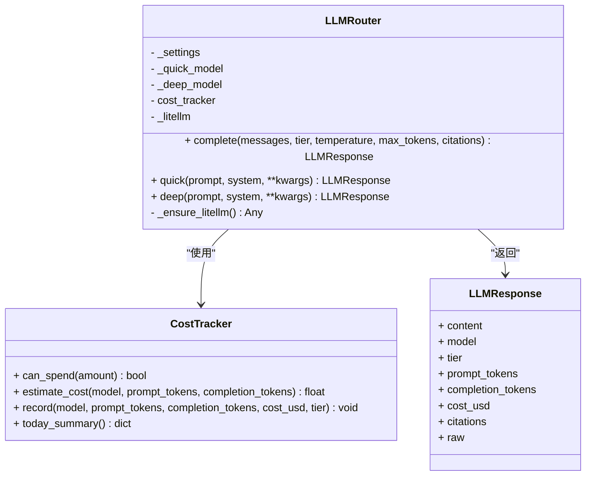
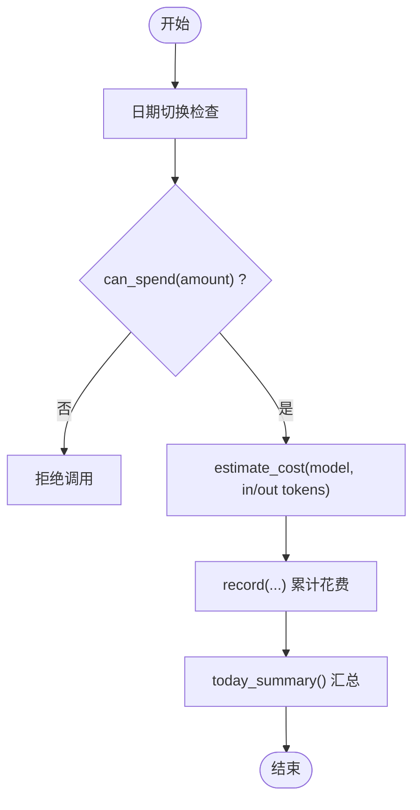
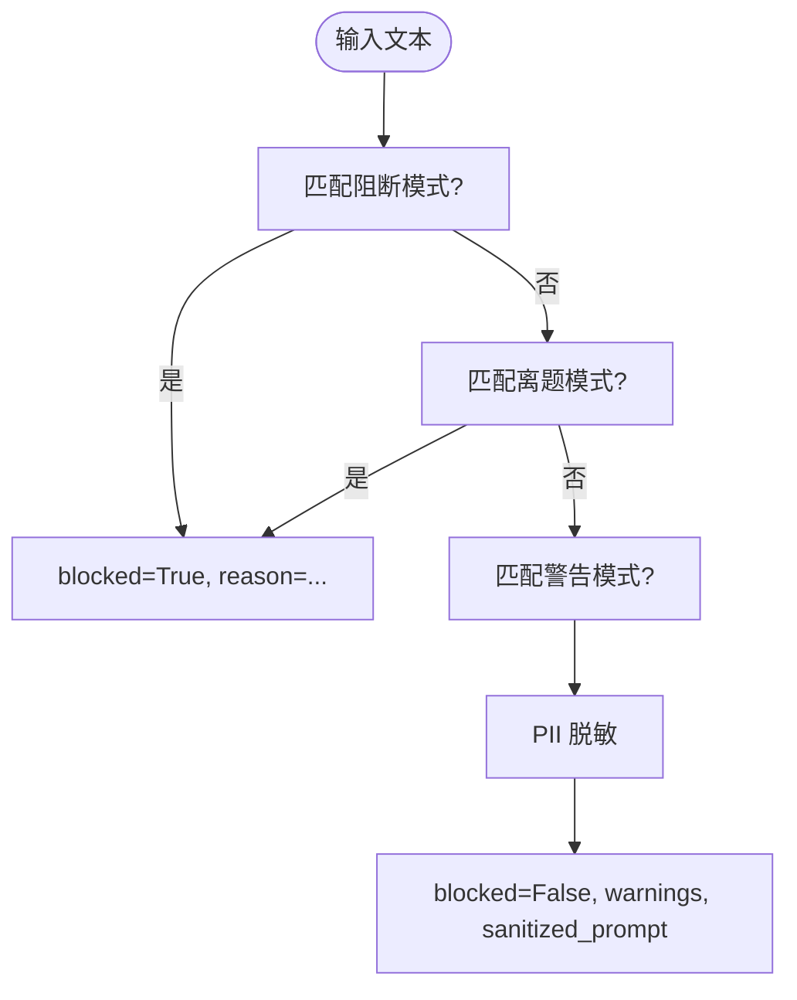
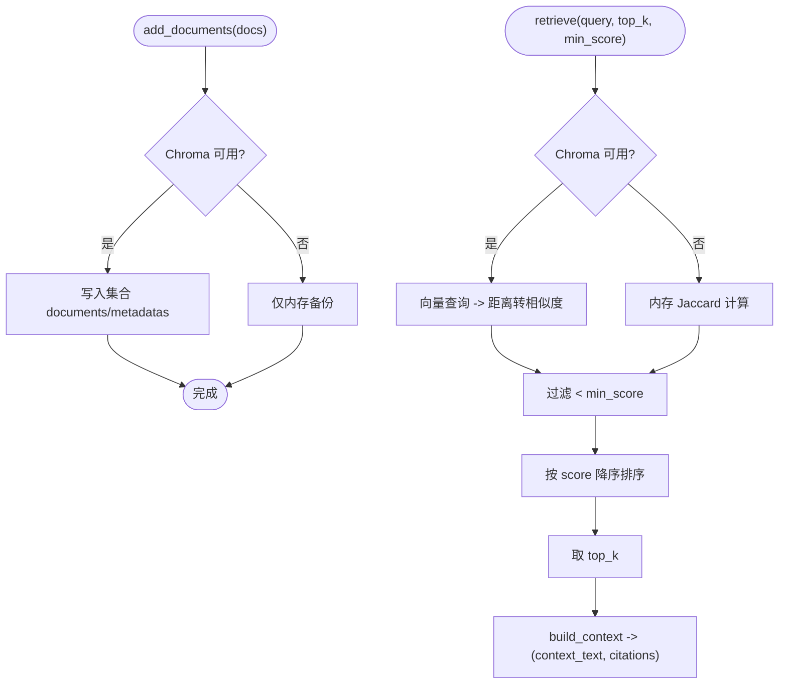
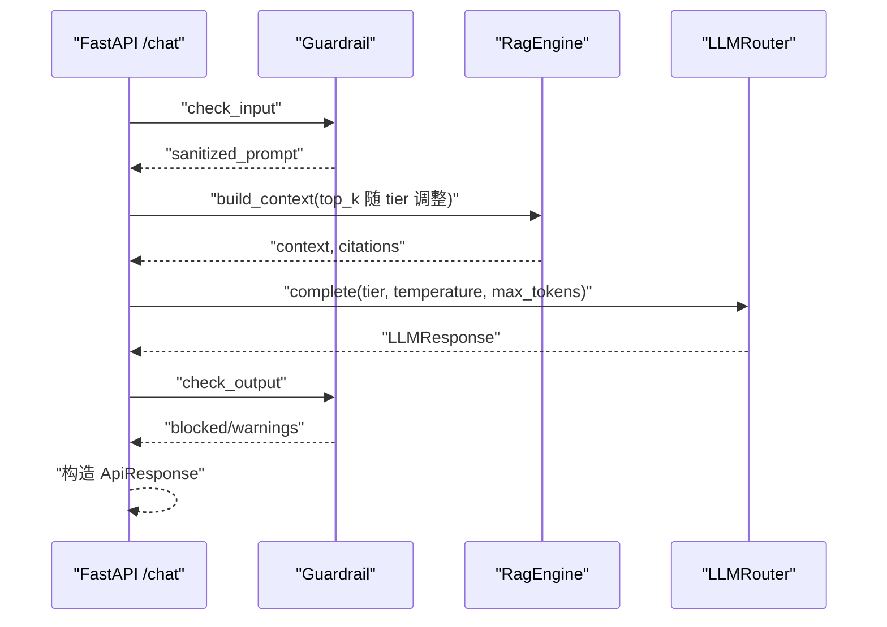
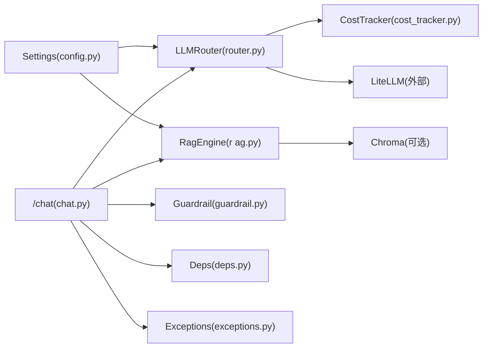

# 大语言模型路由

<cite>
**本文引用的文件**   
- [router.py](file://backend/app/services/llm/router.py)
- [cost_tracker.py](file://backend/app/services/llm/cost_tracker.py)
- [guardrail.py](file://backend/app/services/llm/guardrail.py)
- [rag.py](file://backend/app/services/llm/rag.py)
- [config.py](file://backend/app/core/config.py)
- [chat.py](file://backend/app/api/v1/chat.py)
- [deps.py](file://backend/app/core/deps.py)
- [exceptions.py](file://backend/app/core/exceptions.py)
- [chat.py（schemas）](file://backend/app/schemas/chat.py)
- [test_llm_router.py](file://tests/test_llm_router.py)
- [test_cost_tracker.py](file://tests/test_cost_tracker.py)
- [test_guardrail.py](file://tests/test_guardrail.py)
- [test_rag.py](file://tests/test_rag.py)
</cite>

## 目录
1. [简介](#简介)
2. [项目结构](#项目结构)
3. [核心组件](#核心组件)
4. [架构总览](#架构总览)
5. [详细组件分析](#详细组件分析)
6. [依赖关系分析](#依赖关系分析)
7. [性能与成本优化](#性能与成本优化)
8. [故障排查指南](#故障排查指南)
9. [结论](#结论)
10. [附录](#附录)

## 简介
本技术文档围绕“大语言模型路由系统”展开，聚焦多模型统一接入、分层调用策略、安全护栏、检索增强生成（RAG）、成本追踪与预算控制，以及面向药物问答场景的适配实践。系统通过 LiteLLM 对 OpenAI GPT-4/GPT-4o-mini、Anthropic Claude 等外部模型进行统一封装，并提供 quick/deep 两级分析路径；同时内置输入输出安全护栏、RAG 上下文注入、成本估算与预算拦截，确保在医疗/药学领域的安全合规与可审计性。

## 项目结构
与 LLM 路由相关的核心代码位于后端服务层：
- 路由与响应封装：services/llm/router.py
- 成本追踪：services/llm/cost_tracker.py
- 安全护栏：services/llm/guardrail.py
- RAG 引擎：services/llm/rag.py
- 配置中心：core/config.py
- API 入口（自然语言问答）：api/v1/chat.py
- 通用依赖与异常：core/deps.py、core/exceptions.py
- 请求/响应模式定义：schemas/chat.py
- 单元测试：tests/*_test.py

图表来源
- [chat.py:30-157](file://backend/app/api/v1/chat.py#L30-L157)
- [guardrail.py:58-145](file://backend/app/services/llm/guardrail.py#L58-L145)
- [rag.py:35-238](file://backend/app/services/llm/rag.py#L35-L238)
- [router.py:55-198](file://backend/app/services/llm/router.py#L55-L198)
- [cost_tracker.py:27-167](file://backend/app/services/llm/cost_tracker.py#L27-L167)

章节来源
- [chat.py:30-157](file://backend/app/api/v1/chat.py#L30-L157)
- [router.py:55-198](file://backend/app/services/llm/router.py#L55-L198)
- [rag.py:35-238](file://backend/app/services/llm/rag.py#L35-L238)
- [guardrail.py:58-145](file://backend/app/services/llm/guardrail.py#L58-L145)
- [cost_tracker.py:27-167](file://backend/app/services/llm/cost_tracker.py#L27-L167)

## 核心组件
- LLMRouter：基于 LiteLLM 的多模型统一调用，支持 quick/deep 两层模型选择、温度与最大 token 控制、成本估算与记录。
- CostTracker：按模型与层级统计费用，提供预算检查与今日汇总，支持未知模型默认价格估算。
- Guardrail：输入/输出双重校验，拦截处方剂量、绝对化承诺、提示词注入与非医学话题，并对 PII 脱敏。
- RagEngine：优先使用 Chroma 向量检索，不可用时降级为内存关键词检索（Jaccard），并构建 LLM 上下文与引用列表。
- Chat API：串联护栏→RAG→路由→护栏的完整链路，并在 LLM 失败时回退到 RAG 摘要。

章节来源
- [router.py:55-198](file://backend/app/services/llm/router.py#L55-L198)
- [cost_tracker.py:27-167](file://backend/app/services/llm/cost_tracker.py#L27-L167)
- [guardrail.py:58-145](file://backend/app/services/llm/guardrail.py#L58-L145)
- [rag.py:35-238](file://backend/app/services/llm/rag.py#L35-L238)
- [chat.py:30-157](file://backend/app/api/v1/chat.py#L30-L157)

## 架构总览
下图展示一次自然语言问答请求从进入 FastAPI 到返回结果的端到端流程，包括安全护栏、RAG 上下文注入、模型路由与成本记录。

图表来源
- [chat.py:30-157](file://backend/app/api/v1/chat.py#L30-L157)
- [guardrail.py:70-145](file://backend/app/services/llm/guardrail.py#L70-L145)
- [rag.py:211-238](file://backend/app/services/llm/rag.py#L211-L238)
- [router.py:92-171](file://backend/app/services/llm/router.py#L92-L171)
- [cost_tracker.py:68-141](file://backend/app/services/llm/cost_tracker.py#L68-L141)

## 详细组件分析

### LLMRouter 与分层策略
- 分层设计
  - quick 层：适合分类、简单问答，默认映射 gpt-4o-mini（或配置覆盖）。
  - deep 层：适合综合推理、报告生成，默认映射 gpt-4o（或配置覆盖）。
- 参数控制
  - temperature、max_tokens 由调用方传入；quick/deep 分别采用不同上限。
- 成本与预算
  - 每次调用前执行 can_spend 检查；成功后 estimate_cost 并 record。
- 延迟加载
  - 惰性导入 litellm，避免未安装时启动失败。

图表来源
- [router.py:30-198](file://backend/app/services/llm/router.py#L30-L198)
- [cost_tracker.py:27-167](file://backend/app/services/llm/cost_tracker.py#L27-L167)

章节来源
- [router.py:55-198](file://backend/app/services/llm/router.py#L55-L198)
- [test_llm_router.py:89-200](file://tests/test_llm_router.py#L89-L200)

### CostTracker 成本追踪与预算控制
- 定价表：内置主流模型单价（input/output per 1K tokens），未知模型走默认均价。
- 预算检查：can_spend 判断是否允许继续花费；record 累计当日花费并写入历史。
- 今日汇总：today_summary 提供 total_spent_usd、by_model、by_tier、total_calls 等指标。

图表来源
- [cost_tracker.py:60-167](file://backend/app/services/llm/cost_tracker.py#L60-L167)

章节来源
- [cost_tracker.py:27-167](file://backend/app/services/llm/cost_tracker.py#L27-L167)
- [test_cost_tracker.py:8-77](file://tests/test_cost_tracker.py#L8-L77)

### Guardrail 安全护栏
- 输入规则：拦截处方剂量建议、绝对化承诺、提示词注入、非医学话题；检测敏感术语并告警；对手机号、邮箱、身份证号等进行脱敏。
- 输出规则：再次扫描阻断违规内容；若出现具体剂量建议则给出警告。
- 结果对象：包含 blocked、reason、warnings、sanitized_prompt。

图表来源
- [guardrail.py:17-168](file://backend/app/services/llm/guardrail.py#L17-L168)

章节来源
- [guardrail.py:58-145](file://backend/app/services/llm/guardrail.py#L58-L145)
- [test_guardrail.py:8-90](file://tests/test_guardrail.py#L8-L90)

### RagEngine 检索增强生成
- 首选 Chroma 向量检索（cosine 空间），失败或未安装时降级为内存 Jaccard 相似度检索。
- add_documents 同步持久化与内存备份；retrieve 返回 RetrievalResult 列表；build_context 组装上下文与引用元数据。

图表来源
- [rag.py:62-238](file://backend/app/services/llm/rag.py#L62-L238)

章节来源
- [rag.py:35-238](file://backend/app/services/llm/rag.py#L35-L238)
- [test_rag.py:86-207](file://tests/test_rag.py#L86-L207)

### API 层：自然语言问答
- 流程：输入护栏 → RAG 构建上下文 → LLM 路由（含预算检查与成本记录）→ 输出护栏 → 返回 ApiResponse。
- 降级策略：当 LLM 调用失败时，返回 RAG 检索结果摘要，并标记 degraded。
- 证据分级：system prompt 要求回答标注证据等级，低等级需附加谨慎提示。

图表来源
- [chat.py:30-157](file://backend/app/api/v1/chat.py#L30-L157)
- [guardrail.py:70-145](file://backend/app/services/llm/guardrail.py#L70-L145)
- [rag.py:211-238](file://backend/app/services/llm/rag.py#L211-L238)
- [router.py:92-171](file://backend/app/services/llm/router.py#L92-L171)

章节来源
- [chat.py:30-157](file://backend/app/api/v1/chat.py#L30-L157)
- [chat.py（schemas）:22-81](file://backend/app/schemas/chat.py#L22-L81)

## 依赖关系分析
- 配置来源：Settings 集中管理 LLM 密钥、默认模型、预算阈值等，供 Router 与 RAG 读取。
- 依赖注入：get_request_id 用于请求追踪；全局异常处理器将业务异常转换为统一信封响应。
- 外部依赖：LiteLLM 作为统一适配器；Chroma 作为可选向量库。

图表来源
- [config.py:54-60](file://backend/app/core/config.py#L54-L60)
- [router.py:70-76](file://backend/app/services/llm/router.py#L70-L76)
- [rag.py:62-88](file://backend/app/services/llm/rag.py#L62-L88)
- [chat.py:30-157](file://backend/app/api/v1/chat.py#L30-L157)
- [deps.py:91-129](file://backend/app/core/deps.py#L91-L129)
- [exceptions.py:131-179](file://backend/app/core/exceptions.py#L131-L179)

章节来源
- [config.py:21-144](file://backend/app/core/config.py#L21-L144)
- [deps.py:91-129](file://backend/app/core/deps.py#L91-L129)
- [exceptions.py:131-179](file://backend/app/core/exceptions.py#L131-L179)

## 性能与成本优化
- 分层路由
  - quick 层：gpt-4o-mini/claude-haiku，低成本、低延迟，适合快速问答与分类。
  - deep 层：gpt-4o/claude-sonnet，高能力、较高成本，适合复杂推理与报告生成。
- 预算与限流
  - 通过 CostTracker.can_spend 实现按日预算控制；可按 tier 设置不同预算上限。
  - 建议在网关层增加速率限制（如令牌桶），结合 429 状态码与重试退避策略。
- 缓存与降级
  - RAG 在 Chroma 不可用时自动降级为内存检索，保证可用性。
  - LLM 调用失败时，API 层回退到 RAG 摘要，保障用户体验。
- 成本优化
  - 合理设置 temperature 与 max_tokens，减少无效输出。
  - 对高频问题做答案缓存（可结合 Redis），降低重复调用成本。
  - 监控 by_model/by_tier 成本分布，动态调整默认模型与预算。
- 监控与基准
  - 利用 today_summary 输出 total_calls、total_spent_usd、by_model、by_tier 等指标。
  - 建议引入端到端耗时与 token 用量统计，建立性能基线并持续回归。

[本节为通用指导，不直接分析具体文件]

## 故障排查指南
- 常见错误与定位
  - 预算不足：Router 在 can_spend 失败时抛出运行时错误；检查 daily_budget 与已花费。
  - LLM 调用失败：捕获上游异常并记录日志；确认 OPENAI_API_KEY/ANTHROPIC_API_KEY 配置与网络连通。
  - 安全护栏拦截：输入/输出命中阻断规则；查看 GuardrailResult.reason 与 warnings。
  - RAG 不可用：Chroma 未安装或初始化失败时自动降级；检查 persist_dir 与集合名。
- 日志与追踪
  - 使用 get_request_id 贯穿请求链路，便于跨模块关联日志。
  - 全局异常处理器将 AppException 转为统一信封，便于前端解析与上报。
- 测试验证
  - 参考单元测试用例，模拟 litellm 与 chromadb 缺失场景，验证降级与错误处理路径。

章节来源
- [router.py:115-171](file://backend/app/services/llm/router.py#L115-L171)
- [cost_tracker.py:68-141](file://backend/app/services/llm/cost_tracker.py#L68-L141)
- [guardrail.py:70-145](file://backend/app/services/llm/guardrail.py#L70-L145)
- [rag.py:62-88](file://backend/app/services/llm/rag.py#L62-L88)
- [chat.py:120-157](file://backend/app/api/v1/chat.py#L120-L157)
- [exceptions.py:131-179](file://backend/app/core/exceptions.py#L131-L179)
- [test_llm_router.py:170-200](file://tests/test_llm_router.py#L170-L200)
- [test_guardrail.py:20-90](file://tests/test_guardrail.py#L20-L90)
- [test_rag.py:66-156](file://tests/test_rag.py#L66-L156)

## 结论
本路由系统以“分层模型 + 安全护栏 + RAG + 成本追踪”为核心，实现了多厂商模型的统一接入与可控调用。通过 quick/deep 分层策略与预算控制，在保证质量的同时有效降低成本；通过输入输出护栏与 PII 脱敏，满足医疗/药学领域的合规要求；通过 RAG 上下文注入与引用溯源，提升回答的可信度与可解释性。建议在后续版本中完善限流与重试机制、扩展本地部署模型接入、强化监控与基准测试，以进一步提升稳定性与可观测性。

[本节为总结性内容，不直接分析具体文件]

## 附录

### 配置项与环境变量（节选）
- LLM 相关
  - openai_api_key、anthropic_api_key：外部模型 API 密钥
  - llm_default_model、llm_deep_model：quick/deep 默认模型
  - llm_max_budget_usd、llm_quick_budget_usd：每日预算与 quick 层预算
- 向量库
  - chroma_persist_dir：Chroma 持久化目录

章节来源
- [config.py:54-60](file://backend/app/core/config.py#L54-L60)

### 模型与定价（示例）
- 内置模型单价（USD per 1K tokens，input/output 分开）
  - gpt-4o-mini、gpt-4o
  - claude-3-5-haiku-latest、claude-3-5-sonnet-latest
- 未知模型将使用默认均价估算，建议按需补充定价表。

章节来源
- [cost_tracker.py:17-24](file://backend/app/services/llm/cost_tracker.py#L17-L24)

### 请求/响应模式（节选）
- ChatRequest
  - project_id、message、analysis_tier（quick/deep）、context_dataset_ids
- ChatResponse
  - answer、citations、evidence_level、cost_usd、tokens_in、tokens_out、guardrail_triggered、guardrail_rule、generated_code

章节来源
- [chat.py（schemas）:22-81](file://backend/app/schemas/chat.py#L22-L81)