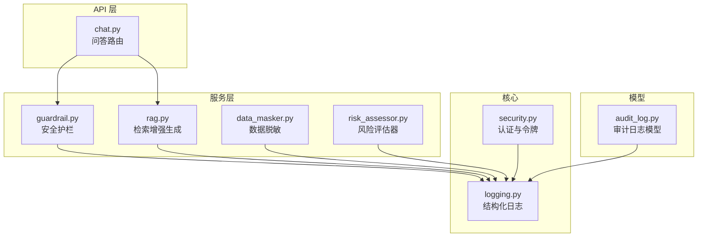
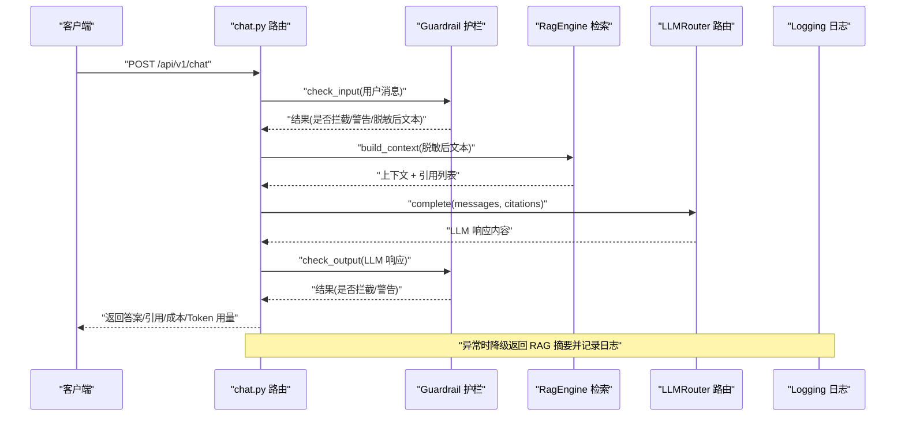
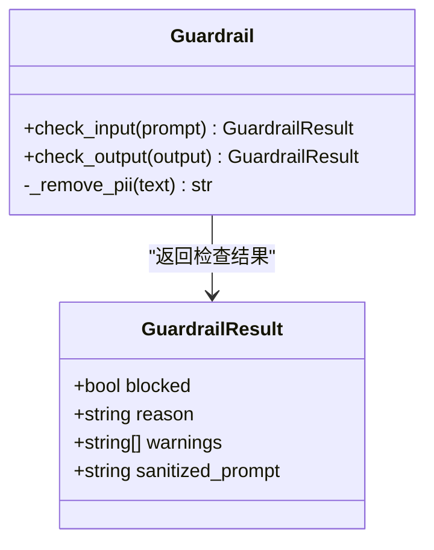
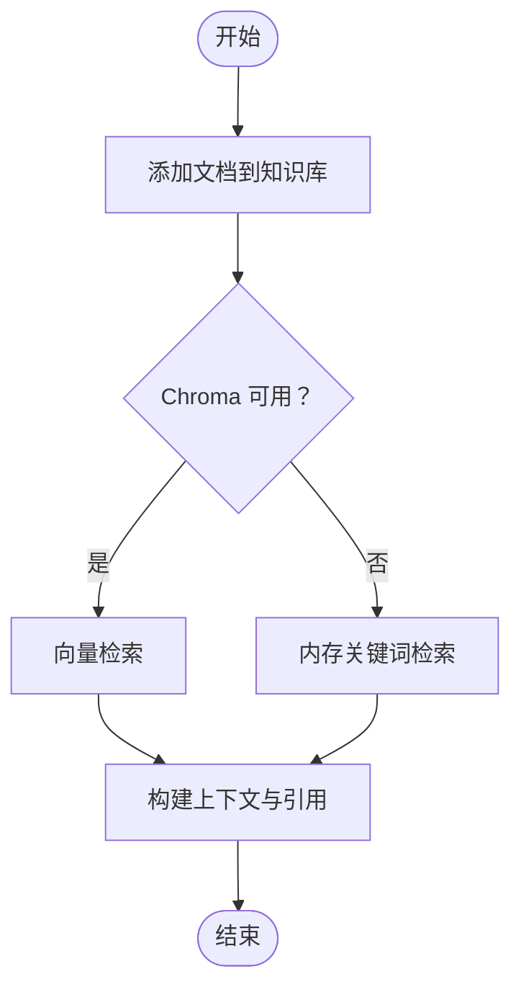
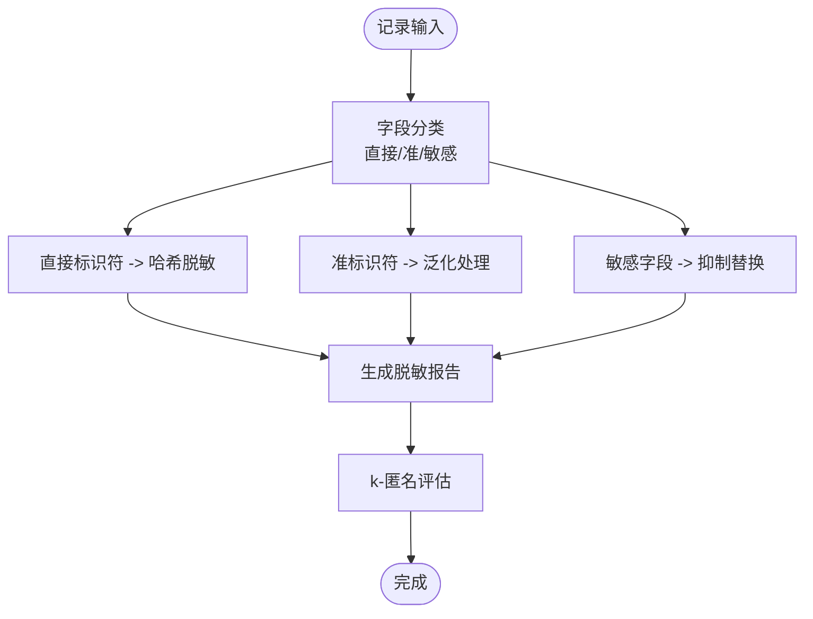
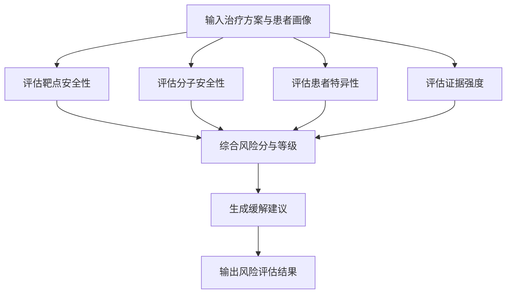
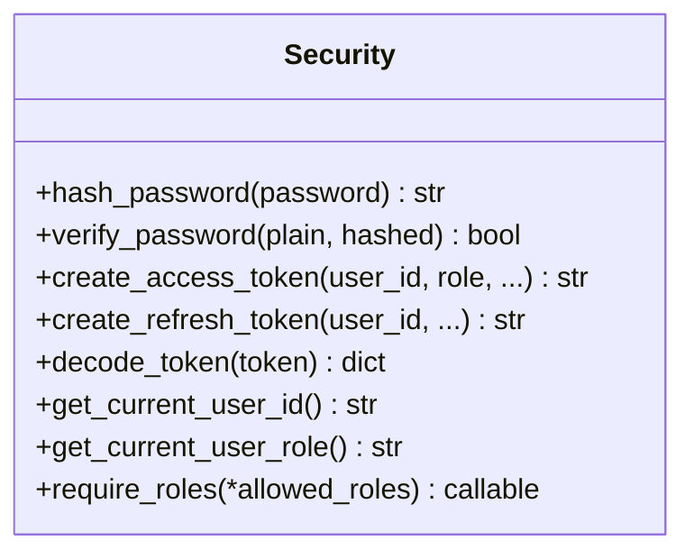
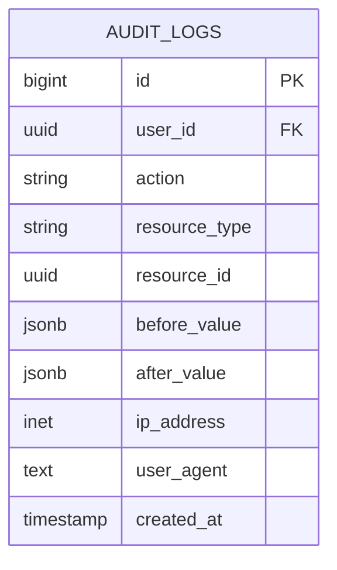
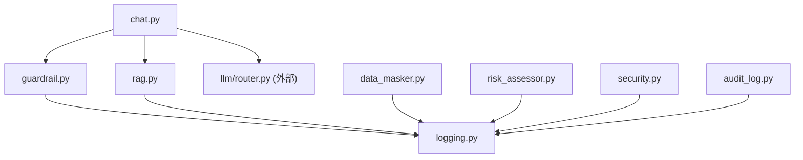

# 安全防护护栏

<cite>
**本文引用的文件**   
- [backend/app/services/llm/guardrail.py](file://backend/app/services/llm/guardrail.py)
- [tests/test_guardrail.py](file://tests/test_guardrail.py)
- [backend/app/api/v1/chat.py](file://backend/app/api/v1/chat.py)
- [backend/app/services/llm/rag.py](file://backend/app/services/llm/rag.py)
- [backend/app/core/security.py](file://backend/app/core/security.py)
- [backend/app/models/audit_log.py](file://backend/app/models/audit_log.py)
- [backend/app/core/logging.py](file://backend/app/core/logging.py)
- [backend/app/services/privacy/data_masker.py](file://backend/app/services/privacy/data_masker.py)
- [backend/app/services/optimizer/risk_assessor.py](file://backend/app/services/optimizer/risk_assessor.py)
</cite>

## 目录
1. [简介](#简介)
2. [项目结构](#项目结构)
3. [核心组件](#核心组件)
4. [架构总览](#架构总览)
5. [详细组件分析](#详细组件分析)
6. [依赖关系分析](#依赖关系分析)
7. [性能考量](#性能考量)
8. [故障排查指南](#故障排查指南)
9. [结论](#结论)
10. [附录](#附录)

## 简介
本技术文档聚焦于“安全防护护栏系统”，围绕输入输出双重检查、规则引擎设计（正则匹配、关键词检测、语义提示）、医疗领域特定安全策略（禁止剂量建议、预后预测限制、证据等级标注要求）、违规识别与自动修正、审计日志与安全事件追踪、风险评估算法，以及在药物研发场景下的最佳实践（临床试验数据保护、患者隐私保障、监管合规）进行系统化说明。文档面向具备不同技术背景的读者，提供从高层架构到代码级实现的完整视图。

## 项目结构
本项目采用分层与按功能域组织相结合的结构：API 层暴露接口，服务层实现业务逻辑，核心模块提供认证、日志等横切能力，模型层定义持久化结构，测试覆盖关键路径。

图表来源
- [backend/app/api/v1/chat.py:1-177](file://backend/app/api/v1/chat.py#L1-L177)
- [backend/app/services/llm/guardrail.py:1-168](file://backend/app/services/llm/guardrail.py#L1-L168)
- [backend/app/services/llm/rag.py:1-238](file://backend/app/services/llm/rag.py#L1-L238)
- [backend/app/services/privacy/data_masker.py:1-294](file://backend/app/services/privacy/data_masker.py#L1-L294)
- [backend/app/services/optimizer/risk_assessor.py:1-155](file://backend/app/services/optimizer/risk_assessor.py#L1-L155)
- [backend/app/core/security.py:1-211](file://backend/app/core/security.py#L1-L211)
- [backend/app/core/logging.py:1-93](file://backend/app/core/logging.py#L1-L93)
- [backend/app/models/audit_log.py:1-45](file://backend/app/models/audit_log.py#L1-L45)

章节来源
- [backend/app/api/v1/chat.py:1-177](file://backend/app/api/v1/chat.py#L1-L177)
- [backend/app/services/llm/guardrail.py:1-168](file://backend/app/services/llm/guardrail.py#L1-L168)
- [backend/app/services/llm/rag.py:1-238](file://backend/app/services/llm/rag.py#L1-L238)
- [backend/app/services/privacy/data_masker.py:1-294](file://backend/app/services/privacy/data_masker.py#L1-L294)
- [backend/app/services/optimizer/risk_assessor.py:1-155](file://backend/app/services/optimizer/risk_assessor.py#L1-L155)
- [backend/app/core/security.py:1-211](file://backend/app/core/security.py#L1-L211)
- [backend/app/core/logging.py:1-93](file://backend/app/core/logging.py#L1-L93)
- [backend/app/models/audit_log.py:1-45](file://backend/app/models/audit_log.py#L1-L45)

## 核心组件
- 安全护栏 Guardrail：对输入与输出执行规则校验、敏感信息过滤、警告与拦截；支持 PII 脱敏与注入攻击检测。
- 检索增强生成 RagEngine：基于向量库或内存关键词检索构建上下文，为 LLM 提供证据支撑。
- 数据脱敏 DataMasker：对直接标识符、准标识符与敏感字段进行哈希、泛化与抑制，并评估 k-匿名性。
- 风险评估 RiskAssessor：从靶点安全性、分子类药性、患者特异性与证据强度四个维度计算综合风险与建议。
- 认证与安全 Security：密码哈希、JWT 签发与解析、角色守卫，确保访问控制与身份可信。
- 审计日志 AuditLog：不可篡改的 append-only 记录，用于安全事件追踪与合规审计。
- 日志 Logging：结构化 JSON 输出、轮转与归档，便于生产环境可观测性与取证。

章节来源
- [backend/app/services/llm/guardrail.py:1-168](file://backend/app/services/llm/guardrail.py#L1-L168)
- [backend/app/services/llm/rag.py:1-238](file://backend/app/services/llm/rag.py#L1-L238)
- [backend/app/services/privacy/data_masker.py:1-294](file://backend/app/services/privacy/data_masker.py#L1-L294)
- [backend/app/services/optimizer/risk_assessor.py:1-155](file://backend/app/services/optimizer/risk_assessor.py#L1-L155)
- [backend/app/core/security.py:1-211](file://backend/app/core/security.py#L1-L211)
- [backend/app/models/audit_log.py:1-45](file://backend/app/models/audit_log.py#L1-L45)
- [backend/app/core/logging.py:1-93](file://backend/app/core/logging.py#L1-L93)

## 架构总览
下图展示一次自然语言问答请求在系统中的流转，包括输入护栏、RAG 检索、LLM 生成、输出护栏与降级处理。

图表来源
- [backend/app/api/v1/chat.py:30-157](file://backend/app/api/v1/chat.py#L30-L157)
- [backend/app/services/llm/guardrail.py:70-145](file://backend/app/services/llm/guardrail.py#L70-L145)
- [backend/app/services/llm/rag.py:211-238](file://backend/app/services/llm/rag.py#L211-L238)
- [backend/app/core/logging.py:20-74](file://backend/app/core/logging.py#L20-L74)

## 详细组件分析

### 安全护栏 Guardrail（输入/输出双重检查）
- 规则引擎设计
  - 正则表达式匹配：定义多组模式集合，分别用于拦截、警告与离题检测。
  - 关键词检测：针对医疗相关高风险词汇与非医学话题进行快速判定。
  - 语义提示：通过系统提示词约束 LLM 行为（见 chat.py 的系统提示）。
- 医疗领域特定策略
  - 禁止剂量建议：拦截包含“推荐/建议/告诉”+“剂量/用药量/服用量”的模式；输出侧对具体剂量单位组合进行警告。
  - 绝对化承诺拦截：如“治愈/根除/100%有效/绝对安全”。
  - 非医学话题拒绝：股票、理财、赌博、色情、政治等关键词触发拦截。
  - 提示词注入防护：拦截 system/imagine/assistant 标签及“扮演医生/医师/药师”等指令。
  - 证据等级标注要求：系统提示强制回答标注证据等级，低等级需附加谨慎提示。
- 敏感信息过滤与自动修正
  - PII 脱敏：手机号、身份证号、邮箱替换为占位符，避免泄露。
  - 脱敏后的文本继续进入后续流程，保证可用性同时降低风险。
- 违规识别与告警
  - blocked 表示阻断；warnings 收集潜在风险项供审计与提示。
- 单元测试覆盖
  - 正常医学问题通过、剂量推荐被拦截、绝对化承诺被拦截、注入攻击被拦截、无关话题被拦截、PII 被脱敏等用例。

图表来源
- [backend/app/services/llm/guardrail.py:41-167](file://backend/app/services/llm/guardrail.py#L41-L167)

章节来源
- [backend/app/services/llm/guardrail.py:1-168](file://backend/app/services/llm/guardrail.py#L1-L168)
- [tests/test_guardrail.py:1-69](file://tests/test_guardrail.py#L1-L69)
- [backend/app/api/v1/chat.py:21-27](file://backend/app/api/v1/chat.py#L21-L27)

### 检索增强生成 RagEngine（证据支撑与引用）
- 功能要点
  - 文档入库：支持批量添加文档，优先写入向量库，同步内存作为降级备份。
  - 相似度检索：优先使用向量库（余弦相似度），失败时降级为 Jaccard 关键词检索。
  - 上下文构建：将 top-k 检索结果拼接为上下文，附带来源与相似度分数，供 LLM 参考。
- 与护栏协同
  - 输入先经护栏脱敏，再送入 RAG 构建上下文，减少敏感信息扩散。
  - 输出经护栏二次检查，防止 LLM 生成违规内容。

图表来源
- [backend/app/services/llm/rag.py:90-124](file://backend/app/services/llm/rag.py#L90-L124)
- [backend/app/services/llm/rag.py:126-169](file://backend/app/services/llm/rag.py#L126-L169)
- [backend/app/services/llm/rag.py:211-238](file://backend/app/services/llm/rag.py#L211-L238)

章节来源
- [backend/app/services/llm/rag.py:1-238](file://backend/app/services/llm/rag.py#L1-L238)

### 数据脱敏 DataMasker（HIPAA Safe Harbor 与 k-匿名）
- 脱敏策略
  - 直接标识符：姓名、身份证号、医保号、电话、邮箱、IP 等采用带盐哈希。
  - 准标识符：年龄分段、邮编前缀、日期截断至月/年、种族泛化。
  - 敏感值：诊断、ICD 编码、基因结果等直接抑制为占位符。
- 合规与验证
  - 支持 HIPAA Safe Harbor 18 项标识符处理思路。
  - k-匿名评估：统计同质组大小，若小于阈值则记录违规并告警。
- 报告与审计
  - 每次处理生成报告，汇总处理数量、字段类型分布与合规情况。

图表来源
- [backend/app/services/privacy/data_masker.py:126-194](file://backend/app/services/privacy/data_masker.py#L126-L194)
- [backend/app/services/privacy/data_masker.py:257-290](file://backend/app/services/privacy/data_masker.py#L257-L290)

章节来源
- [backend/app/services/privacy/data_masker.py:1-294](file://backend/app/services/privacy/data_masker.py#L1-L294)

### 风险评估 RiskAssessor（多维度评分与建议）
- 维度设计
  - 靶点安全性：依据证据数量划分低/中/高风险。
  - 分子类药性：已批准药物、类药性良好、存疑等分级。
  - 患者特异性：合并症、合并用药、高龄、肾功能不全等加权。
  - 证据强度：高质量证据（I/II 级）数量决定整体强度。
- 综合风险与建议
  - 各维度分数平均得到总体风险分与等级。
  - 根据等级与各维度高险项生成缓解建议。

图表来源
- [backend/app/services/optimizer/risk_assessor.py:18-64](file://backend/app/services/optimizer/risk_assessor.py#L18-L64)
- [backend/app/services/optimizer/risk_assessor.py:66-130](file://backend/app/services/optimizer/risk_assessor.py#L66-L130)
- [backend/app/services/optimizer/risk_assessor.py:140-155](file://backend/app/services/optimizer/risk_assessor.py#L140-L155)

章节来源
- [backend/app/services/optimizer/risk_assessor.py:1-155](file://backend/app/services/optimizer/risk_assessor.py#L1-L155)

### 认证与安全 Security（访问控制与令牌）
- 密码安全：bcrypt 哈希与恒定时间比较，抵御时序攻击。
- JWT 管理：access/refresh token 签发与解析，携带角色声明。
- 依赖注入：FastAPI 依赖获取当前用户 ID 与角色，支持角色守卫工厂。

图表来源
- [backend/app/core/security.py:32-58](file://backend/app/core/security.py#L32-L58)
- [backend/app/core/security.py:96-122](file://backend/app/core/security.py#L96-L122)
- [backend/app/core/security.py:125-149](file://backend/app/core/security.py#L125-L149)
- [backend/app/core/security.py:155-211](file://backend/app/core/security.py#L155-L211)

章节来源
- [backend/app/core/security.py:1-211](file://backend/app/core/security.py#L1-L211)

### 审计日志 AuditLog（不可篡改记录）
- 模型设计：BIGSERIAL 主键，JSONB 存储前后值，索引优化 action 与时间范围查询。
- 不可变性：应用层不提供 UPDATE/DELETE，数据库权限回收保护。
- 用途：安全事件追踪、合规审计、问题溯源。

图表来源
- [backend/app/models/audit_log.py:15-44](file://backend/app/models/audit_log.py#L15-L44)

章节来源
- [backend/app/models/audit_log.py:1-45](file://backend/app/models/audit_log.py#L1-L45)

### 日志 Logging（结构化与可观测性）
- 输出格式：生产环境 JSON，开发环境彩色控制台。
- 轮转与归档：按大小/时间轮转，错误单独归档，保留期配置。
- 上下文绑定：支持 request_id、user_id 等上下文字段，便于追踪。

章节来源
- [backend/app/core/logging.py:1-93](file://backend/app/core/logging.py#L1-L93)

## 依赖关系分析
- 组件耦合
  - chat.py 依赖 guardrail、rag、router（LLM 路由），并在异常时降级返回 RAG 摘要。
  - guardrail 无外部依赖，仅使用标准库 re 与 dataclasses。
  - rag 可选依赖 chromadb，失败时降级为内存检索。
  - data_masker 无外部依赖，使用 hashlib 与 re。
  - risk_assessor 无外部依赖，纯计算逻辑。
  - security 依赖 bcrypt、jose、fastapi.security。
  - audit_log 依赖 sqlalchemy 与自定义类型。
  - logging 依赖 loguru 与配置模块。
- 外部集成点
  - 向量库 Chroma（可选）。
  - LLM 提供商（通过 router 抽象）。
  - 数据库（SQLAlchemy 模型）。

图表来源
- [backend/app/api/v1/chat.py:30-157](file://backend/app/api/v1/chat.py#L30-L157)
- [backend/app/services/llm/guardrail.py:1-168](file://backend/app/services/llm/guardrail.py#L1-L168)
- [backend/app/services/llm/rag.py:1-238](file://backend/app/services/llm/rag.py#L1-L238)
- [backend/app/services/privacy/data_masker.py:1-294](file://backend/app/services/privacy/data_masker.py#L1-L294)
- [backend/app/services/optimizer/risk_assessor.py:1-155](file://backend/app/services/optimizer/risk_assessor.py#L1-L155)
- [backend/app/core/security.py:1-211](file://backend/app/core/security.py#L1-L211)
- [backend/app/models/audit_log.py:1-45](file://backend/app/models/audit_log.py#L1-L45)
- [backend/app/core/logging.py:1-93](file://backend/app/core/logging.py#L1-L93)

章节来源
- [backend/app/api/v1/chat.py:1-177](file://backend/app/api/v1/chat.py#L1-L177)
- [backend/app/services/llm/guardrail.py:1-168](file://backend/app/services/llm/guardrail.py#L1-L168)
- [backend/app/services/llm/rag.py:1-238](file://backend/app/services/llm/rag.py#L1-L238)
- [backend/app/services/privacy/data_masker.py:1-294](file://backend/app/services/privacy/data_masker.py#L1-L294)
- [backend/app/services/optimizer/risk_assessor.py:1-155](file://backend/app/services/optimizer/risk_assessor.py#L1-L155)
- [backend/app/core/security.py:1-211](file://backend/app/core/security.py#L1-L211)
- [backend/app/models/audit_log.py:1-45](file://backend/app/models/audit_log.py#L1-L45)
- [backend/app/core/logging.py:1-93](file://backend/app/core/logging.py#L1-L93)

## 性能考量
- 规则引擎效率
  - 预编译正则集合，避免重复编译开销。
  - 短路径拦截优先，减少不必要的后续处理。
- 检索性能
  - 优先使用向量库检索，失败时回退到内存关键词检索，保证可用性。
  - 控制 top_k 与最小相似度阈值，平衡召回与延迟。
- 脱敏与 k-匿名
  - 批量脱敏时汇总报告，k-匿名评估仅在批量完成后进行，避免频繁计算。
- 日志与审计
  - 异步安全与轮转策略，避免 I/O 阻塞主流程。
  - 错误日志独立归档，便于快速定位问题。

[本节为通用指导，不直接分析具体文件]

## 故障排查指南
- 常见问题
  - LLM 调用失败：查看日志中的降级分支与错误信息，确认密钥与网络连通性。
  - 向量库不可用：检查 chromadb 安装与初始化异常，系统将自动降级为内存检索。
  - 护栏误拦截：核对 _BLOCKED_PATTERNS 与 _OFF_TOPIC_PATTERNS，必要时调整规则或白名单。
  - PII 未完全脱敏：扩展 _remove_pii 的正则或引入更全面的脱敏策略。
- 审计与追踪
  - 通过 AuditLog 模型查询 action 与时间范围，结合 request_id 与 user_id 定位事件。
  - 使用结构化日志 JSON 输出，配合日志聚合平台进行关联分析。

章节来源
- [backend/app/api/v1/chat.py:120-157](file://backend/app/api/v1/chat.py#L120-L157)
- [backend/app/services/llm/rag.py:62-88](file://backend/app/services/llm/rag.py#L62-L88)
- [backend/app/services/llm/guardrail.py:16-38](file://backend/app/services/llm/guardrail.py#L16-L38)
- [backend/app/models/audit_log.py:15-44](file://backend/app/models/audit_log.py#L15-L44)
- [backend/app/core/logging.py:20-74](file://backend/app/core/logging.py#L20-L74)

## 结论
本安全防护护栏系统以规则引擎为核心，结合 RAG 证据支撑、数据脱敏与风险评估，形成输入输出双重检查闭环。通过严格的医疗领域安全策略（禁止剂量建议、预后预测限制、证据等级标注要求）与完善的审计日志与可观测性，满足药物研发场景下的合规与隐私保护需求。建议在后续迭代中持续完善规则集、扩展脱敏策略与引入更强大的语义分析能力，以提升整体安全性与用户体验。

[本节为总结，不直接分析具体文件]

## 附录
- 药物研发场景下的安全最佳实践
  - 临床试验数据保护：使用 DataMasker 对直接标识符与敏感字段进行脱敏，确保 k-匿名性达标。
  - 患者隐私保障：在输入阶段即进行 PII 脱敏，避免敏感信息进入下游系统。
  - 监管合规要求：遵循 HIPAA Safe Harbor 思路处理标识符，结合审计日志与结构化日志满足审计与取证需求。
  - 证据等级标注：在系统提示中强制标注证据等级，低等级结论附加谨慎提示，提升临床决策可靠性。
  - 风险控制：通过 RiskAssessor 多维度评估，生成缓解建议，辅助研究团队做出更安全的选择。

[本节为概念性内容，不直接分析具体文件]