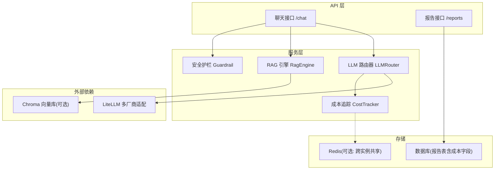
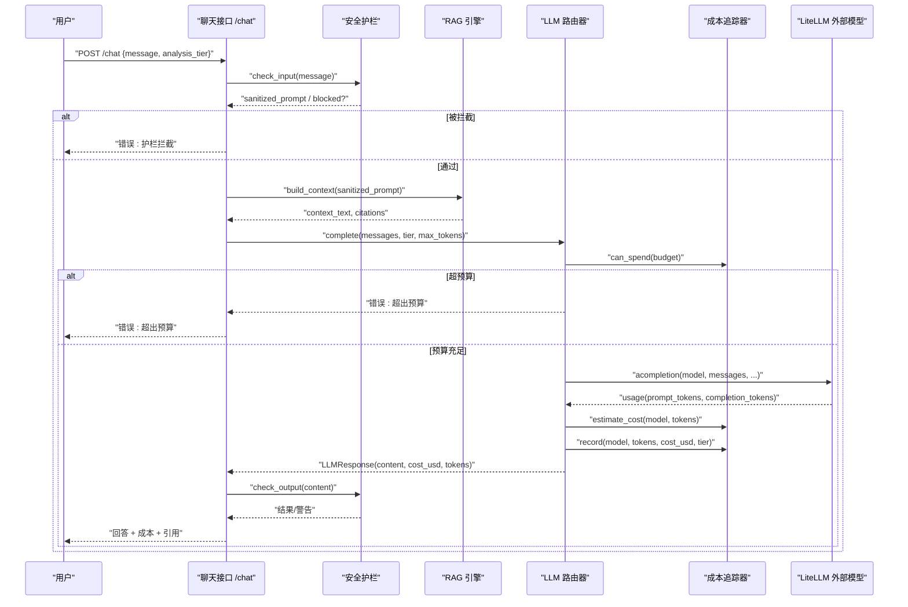
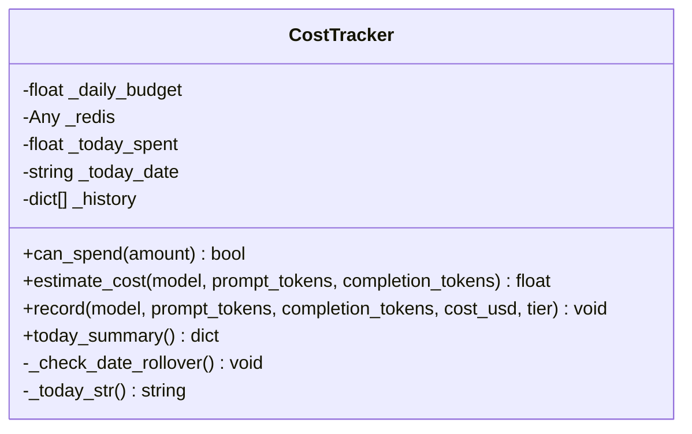
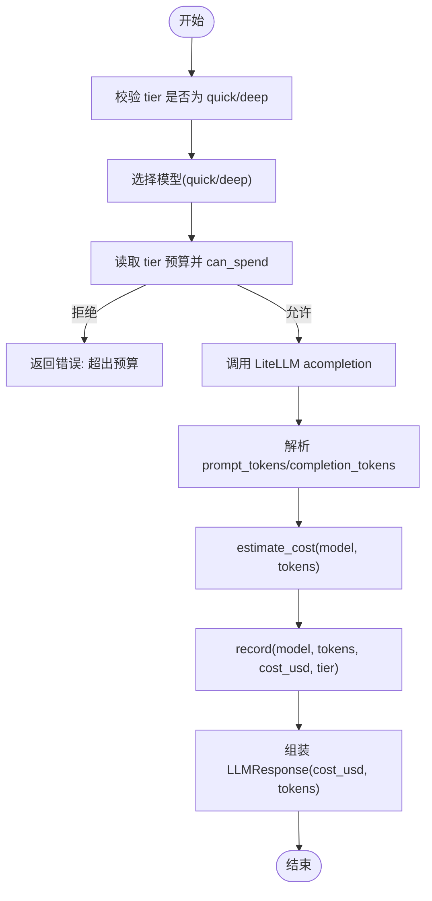
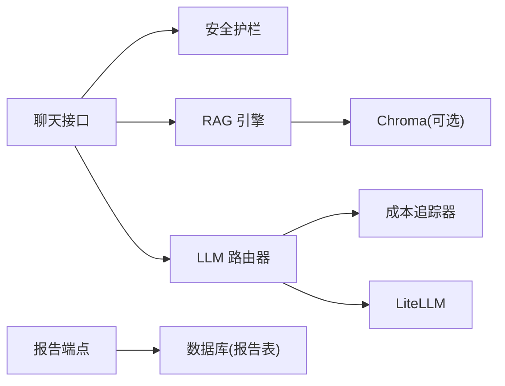

# 成本追踪系统

<cite>
**本文引用的文件**   
- [cost_tracker.py](file://backend/app/services/llm/cost_tracker.py)
- [router.py](file://backend/app/services/llm/router.py)
- [guardrail.py](file://backend/app/services/llm/guardrail.py)
- [rag.py](file://backend/app/services/llm/rag.py)
- [config.py](file://backend/app/core/config.py)
- [chat.py](file://backend/app/api/v1/chat.py)
- [reports.py](file://backend/app/api/v1/reports.py)
- [report.py](file://backend/app/models/report.py)
- [__init__.py](file://backend/app/api/v1/__init__.py)
- [test_cost_tracker.py](file://tests/test_cost_tracker.py)
- [10_📈_系统监控.py](file://frontend/pages/10_📈_系统监控.py)
</cite>

## 目录
1. [简介](#简介)
2. [项目结构](#项目结构)
3. [核心组件](#核心组件)
4. [架构总览](#架构总览)
5. [详细组件分析](#详细组件分析)
6. [依赖关系分析](#依赖关系分析)
7. [性能与扩展性](#性能与扩展性)
8. [故障排查指南](#故障排查指南)
9. [结论](#结论)
10. [附录](#附录)

## 简介
本技术文档围绕“LLM 调用成本追踪系统”展开，聚焦以下目标：
- 成本统计机制：token 计数、模型定价、费用计算算法
- 多维度成本分析：按用户、项目、模型类型、时间维度归集
- 实时监控与预算预警：实时成本监控、预算上限控制、使用量统计
- 优化策略：缓存机制、请求合并、模型降级策略
- 报表与分摊：财务报表生成、成本分摊算法、ROI 分析思路
- 团队协作最佳实践：配额管理、审批流程、成本透明化

## 项目结构
与成本追踪直接相关的后端模块位于 services/llm 与 api/v1 下，前端通过 Streamlit 页面展示成本概览。关键路径如下：
- 成本追踪器：services/llm/cost_tracker.py
- LLM 路由器（集成计费）：services/llm/router.py
- 安全护栏（输入输出合规检查）：services/llm/guardrail.py
- RAG 检索增强（影响上下文长度与 token 消耗）：services/llm/rag.py
- 配置中心（预算与模型选择）：core/config.py
- 聊天 API（串联护栏、RAG、路由与计费）：api/v1/chat.py
- 报告模型与端点（持久化成本字段）：models/report.py, api/v1/reports.py
- 前端监控页（消费汇总可视化）：frontend/pages/10_📈_系统监控.py

图表来源
- [chat.py:30-157](file://backend/app/api/v1/chat.py#L30-L157)
- [router.py:55-171](file://backend/app/services/llm/router.py#L55-L171)
- [cost_tracker.py:27-166](file://backend/app/services/llm/cost_tracker.py#L27-L166)
- [rag.py:35-237](file://backend/app/services/llm/rag.py#L35-L237)
- [report.py:15-44](file://backend/app/models/report.py#L15-L44)

章节来源
- [chat.py:30-157](file://backend/app/api/v1/chat.py#L30-L157)
- [router.py:55-171](file://backend/app/services/llm/router.py#L55-L171)
- [cost_tracker.py:27-166](file://backend/app/services/llm/cost_tracker.py#L27-L166)
- [rag.py:35-237](file://backend/app/services/llm/rag.py#L35-L237)
- [report.py:15-44](file://backend/app/models/report.py#L15-L44)

## 核心组件
- 成本追踪器（CostTracker）
  - 功能：维护当日累计花费、按模型与层级（quick/deep）聚合、提供预算校验与估算
  - 关键点：日期切换自动重置；未知模型采用默认价格估算；支持可选 Redis 共享（当前实现以内存为主）
- LLM 路由器（LLMRouter）
  - 功能：统一封装多模型调用，按 tier 选择模型，执行预算检查并记录成本
  - 关键点：延迟加载 litellm；解析 usage 中的 prompt/completion tokens；估算并记录 cost_usd
- 安全护栏（Guardrail）
  - 功能：输入/输出规则拦截与脱敏，避免不合规内容进入 LLM 或返回客户端
- RAG 引擎（RagEngine）
  - 功能：构建 LLM 上下文，影响 prompt 长度与 token 消耗；Chroma 不可用时降级为内存关键词检索
- 配置（Settings）
  - 功能：集中管理 LLM 预算、默认模型等参数，供路由器与追踪器读取
- 聊天接口（Chat API）
  - 功能：串联护栏→RAG→路由→护栏的完整链路，并在响应中回传 cost_usd 与 token 数
- 报告模型与端点
  - 功能：在报告中持久化 llm_cost_usd、llm_tokens_in/out 等字段，便于后续报表与分析

章节来源
- [cost_tracker.py:27-166](file://backend/app/services/llm/cost_tracker.py#L27-L166)
- [router.py:55-171](file://backend/app/services/llm/router.py#L55-L171)
- [guardrail.py:58-167](file://backend/app/services/llm/guardrail.py#L58-L167)
- [rag.py:35-237](file://backend/app/services/llm/rag.py#L35-L237)
- [config.py:54-61](file://backend/app/core/config.py#L54-L61)
- [chat.py:30-157](file://backend/app/api/v1/chat.py#L30-L157)
- [report.py:15-44](file://backend/app/models/report.py#L15-L44)
- [reports.py:76-120](file://backend/app/api/v1/reports.py#L76-L120)

## 架构总览
下图展示了从用户提问到成本记录的端到端流程，包括预算检查、RAG 上下文注入、LLM 调用与成本记录。

图表来源
- [chat.py:30-157](file://backend/app/api/v1/chat.py#L30-L157)
- [router.py:92-171](file://backend/app/services/llm/router.py#L92-L171)
- [cost_tracker.py:68-166](file://backend/app/services/llm/cost_tracker.py#L68-L166)
- [rag.py:211-237](file://backend/app/services/llm/rag.py#L211-L237)

## 详细组件分析

### 成本追踪器（CostTracker）
- 设计要点
  - 单价表：按模型维护 input/output 每千 token 的价格，未知模型走默认价格
  - 预算控制：can_spend(amount) 判断是否允许继续花费；record(...) 累加当日花费
  - 汇总能力：today_summary() 返回 total_spent_usd、budget_usd、remaining_usd、total_calls、by_model、by_tier
- 复杂度
  - estimate_cost/record/today_summary 均为 O(1)/O(n)（n 为历史条目数），日常查询开销低
- 可扩展点
  - 接入 Redis 做跨实例共享（构造时传入 redis_client，当前未启用）
  - 增加按用户/项目的维度聚合键空间

图表来源
- [cost_tracker.py:27-166](file://backend/app/services/llm/cost_tracker.py#L27-L166)

章节来源
- [cost_tracker.py:27-166](file://backend/app/services/llm/cost_tracker.py#L27-L166)
- [test_cost_tracker.py:1-77](file://tests/test_cost_tracker.py#L1-L77)

### LLM 路由器（LLMRouter）
- 设计要点
  - 分层模型：quick/deep 对应不同模型集合，可从配置覆盖
  - 预算前置：根据 tier 选择对应预算阈值，调用 can_spend 进行拦截
  - 成本记录：解析 usage 后调用 estimate_cost 与 record，将 cost_usd 写入响应
- 异常处理
  - 未安装 litellm 抛出运行时错误；外部调用失败包装为运行时错误
- 与追踪器协作
  - 每次成功调用均记录 model、tokens、cost_usd、tier、时间戳

图表来源
- [router.py:92-171](file://backend/app/services/llm/router.py#L92-L171)
- [cost_tracker.py:80-141](file://backend/app/services/llm/cost_tracker.py#L80-L141)

章节来源
- [router.py:55-171](file://backend/app/services/llm/router.py#L55-L171)

### 安全护栏（Guardrail）
- 设计要点
  - 输入拦截：禁止处方剂量、绝对化承诺、提示词注入、非医学话题
  - 输出检查：对敏感术语与潜在违规输出进行告警或拦截
  - PII 脱敏：手机号、身份证号、邮箱替换为占位符
- 与聊天接口的协作
  - 在 chat 接口中先 check_input，再 build_context，最后 check_output

章节来源
- [guardrail.py:58-167](file://backend/app/services/llm/guardrail.py#L58-L167)
- [chat.py:30-157](file://backend/app/api/v1/chat.py#L30-L157)

### RAG 引擎（RagEngine）
- 设计要点
  - 优先使用 Chroma 向量库进行相似度检索；不可用时降级为内存 Jaccard 关键词检索
  - build_context 返回 context_text 与 citations，用于注入 LLM 上下文与引用溯源
- 对成本的影响
  - top_k 越大，context_text 越长，prompt_tokens 越高，从而提升单次调用成本

章节来源
- [rag.py:35-237](file://backend/app/services/llm/rag.py#L35-L237)

### 配置（Settings）
- 相关项
  - llm_default_model、llm_deep_model：默认模型选择
  - llm_max_budget_usd、llm_quick_budget_usd：深度与快速层的预算上限
- 作用范围
  - 路由器读取配置决定模型与预算阈值；追踪器可读取全局日预算（当前由构造参数传入）

章节来源
- [config.py:54-61](file://backend/app/core/config.py#L54-L61)
- [router.py:61-76](file://backend/app/services/llm/router.py#L61-L76)

### 聊天接口（Chat API）
- 流程
  - 输入护栏 → RAG 构建上下文 → LLM 路由（含预算检查与成本记录）→ 输出护栏 → 返回结果
- 成本透传
  - 响应中包含 cost_usd、tokens_in、tokens_out，便于前端与报表展示
- 降级策略
  - LLM 不可用时返回 RAG 摘要，成本置零

章节来源
- [chat.py:30-157](file://backend/app/api/v1/chat.py#L30-L157)

### 报告模型与端点
- 模型字段
  - llm_cost_usd、llm_tokens_in、llm_tokens_out、analysis_tier、llm_model 等
- 端点
  - GET /reports/{id} 返回包含上述字段的详情，可用于报表与分摊

章节来源
- [report.py:15-44](file://backend/app/models/report.py#L15-L44)
- [reports.py:76-120](file://backend/app/api/v1/reports.py#L76-L120)

## 依赖关系分析
- 组件耦合
  - Chat API 强依赖 Guardrail、RagEngine、LLMRouter
  - LLMRouter 依赖 CostTracker 与 LiteLLM
  - CostTracker 可依赖 Redis（当前未启用）
- 外部依赖
  - LiteLLM：多厂商 LLM 统一调用
  - Chroma：向量检索（可选）
- 数据流
  - 调用链路上游产生 tokens，下游据此估算 cost_usd 并记录
  - 报告端点从数据库拉取成本字段，支撑报表

图表来源
- [chat.py:30-157](file://backend/app/api/v1/chat.py#L30-L157)
- [router.py:92-171](file://backend/app/services/llm/router.py#L92-L171)
- [cost_tracker.py:27-166](file://backend/app/services/llm/cost_tracker.py#L27-L166)
- [rag.py:35-237](file://backend/app/services/llm/rag.py#L35-L237)
- [reports.py:76-120](file://backend/app/api/v1/reports.py#L76-L120)
- [report.py:15-44](file://backend/app/models/report.py#L15-L44)

章节来源
- [__init__.py:1-41](file://backend/app/api/v1/__init__.py#L1-L41)

## 性能与扩展性
- 性能特性
  - 成本估算与记录为轻量操作，主要耗时在 LLM 调用与向量检索
  - RAG 的 Chroma 检索失败会优雅降级至内存检索，保障可用性
- 扩展建议
  - 多维归集：在 CostTracker 中引入 user_id/project_id 维度键，按用户/项目聚合
  - 预算预警：在 can_spend 附近增加阈值告警（如达到 80% 触发通知）
  - 跨实例共享：启用 Redis 作为共享状态存储，避免多实例重复预算窗口
  - 请求合并：对相同 query 的短期重复请求进行缓存（结合 RAG 上下文指纹）
  - 模型降级：当主模型超时或错误率升高时，自动切换到更便宜/更快的备用模型

[本节为通用指导，无需代码来源]

## 故障排查指南
- 常见错误
  - 未安装 litellm：路由器初始化时会抛出运行时错误，需安装依赖
  - 预算不足：can_spend 返回 False，导致调用被拒绝
  - LLM 调用失败：包装为运行时错误，聊天接口会降级返回 RAG 摘要
- 定位方法
  - 查看日志：记录包含 model、tier、cost_usd、累计花费等信息
  - 前端监控：访问系统监控页查看今日总花费、剩余预算、按模型/层级分解
- 修复建议
  - 调整预算阈值或模型选择
  - 检查外部密钥与网络连通性
  - 降低 top_k 以减少上下文长度，从而降低 token 消耗

章节来源
- [router.py:80-90](file://backend/app/services/llm/router.py#L80-L90)
- [chat.py:120-157](file://backend/app/api/v1/chat.py#L120-L157)
- [10_📈_系统监控.py:49-79](file://frontend/pages/10_📈_系统监控.py#L49-L79)

## 结论
本系统通过“护栏+RAG+路由+追踪”的分层设计，实现了 LLM 调用的合规、可控与可观测。成本估算基于 token 用量与模型定价，预算前置拦截有效防止超支。配合报告模型与前端监控，可实现多维度的成本分析与可视化。未来可在多维归集、预算预警、跨实例共享与请求合并等方面进一步增强，以满足更大规模团队的成本治理需求。

[本节为总结，无需代码来源]

## 附录

### 成本计算与预算控制算法
- 费用估算
  - cost = (prompt_tokens / 1000) × price_input + (completion_tokens / 1000) × price_output
  - 未知模型使用默认价格估算
- 预算控制
  - 按 tier 选择预算阈值，can_spend(total_spent + amount) ≤ budget
- 维度归集
  - 当前实现按模型与层级聚合；可扩展加入用户/项目维度

章节来源
- [cost_tracker.py:80-166](file://backend/app/services/llm/cost_tracker.py#L80-L166)
- [router.py:119-160](file://backend/app/services/llm/router.py#L119-L160)

### 实时成本监控与使用量统计
- 前端监控
  - 系统监控页通过 /chat/cost-summary 获取汇总，展示总花费、预算、剩余、调用次数及分解
- 后端汇总
  - today_summary 返回 by_model 与 by_tier 的聚合结果

章节来源
- [10_📈_系统监控.py:49-79](file://frontend/pages/10_📈_系统监控.py#L49-L79)
- [cost_tracker.py:143-166](file://backend/app/services/llm/cost_tracker.py#L143-L166)

### 成本优化策略
- 缓存机制
  - 对高频相似查询进行缓存（结合 RAG 上下文指纹），减少重复 LLM 调用
- 请求合并
  - 短时间窗口内合并相同意图的请求，复用一次 LLM 结果
- 模型降级
  - 主模型不可用或成本过高时，自动降级到更便宜的 quick 层模型

[本节为通用指导，无需代码来源]

### 财务报表、成本分摊与 ROI 分析
- 财务报表
  - 利用报告模型中的 llm_cost_usd、llm_tokens_in/out、analysis_tier 等字段，按项目/时间维度导出报表
- 成本分摊
  - 按用户/项目维度聚合成本，结合业务指标（如产出报告数量）进行分摊
- ROI 分析
  - 对比投入成本与业务收益（如研发周期缩短、命中率提升），评估 LLM 使用的投资回报

章节来源
- [report.py:15-44](file://backend/app/models/report.py#L15-L44)
- [reports.py:76-120](file://backend/app/api/v1/reports.py#L76-L120)

### 团队协作最佳实践
- 配额管理
  - 为每个用户/项目设置独立预算阈值，结合 can_spend 进行细粒度控制
- 审批流程
  - 对高成本 deep 层调用实施审批（例如超过阈值的请求需二次确认）
- 成本透明化
  - 在聊天响应与前端监控中暴露 cost_usd、tokens、tier 等指标，提升团队成本意识

[本节为通用指导，无需代码来源]