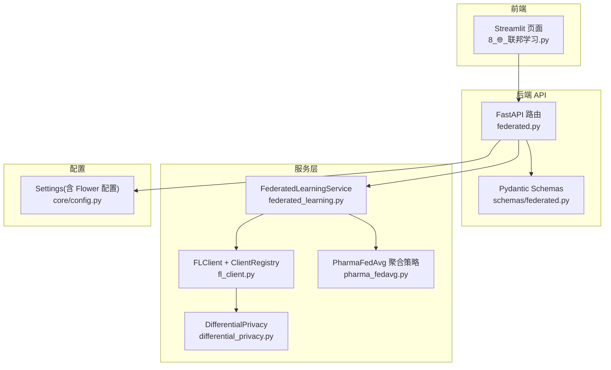
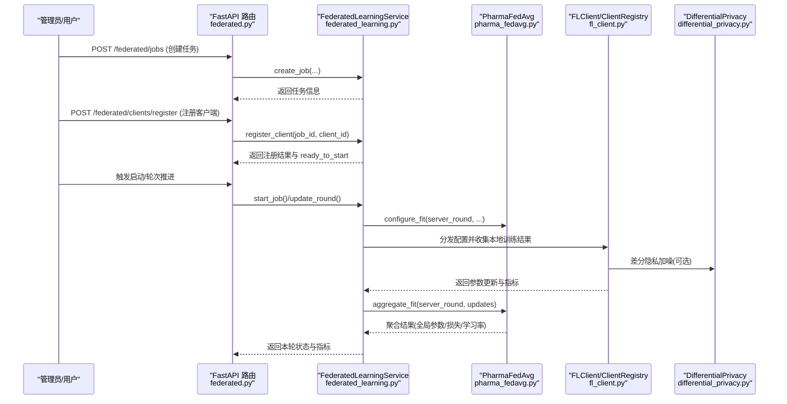
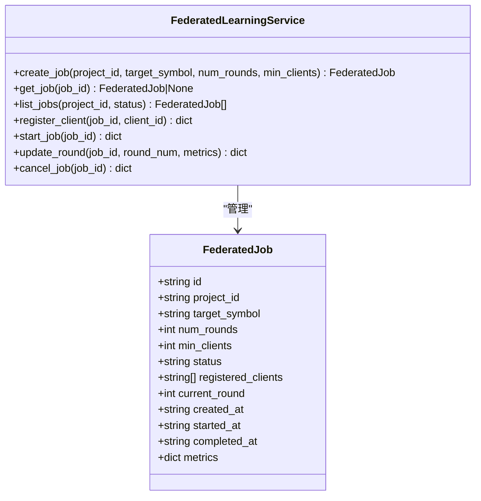
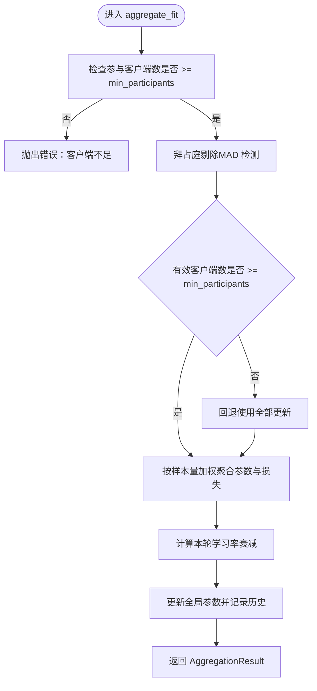
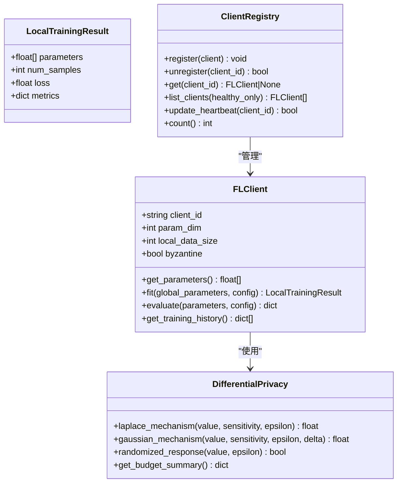
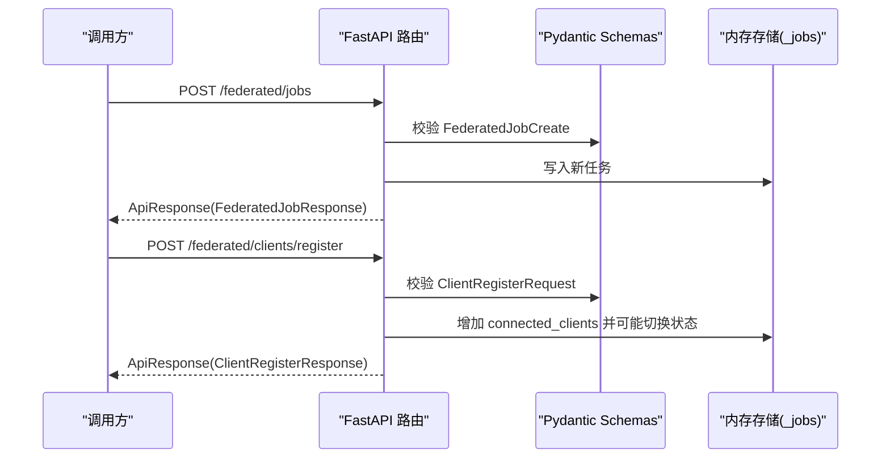
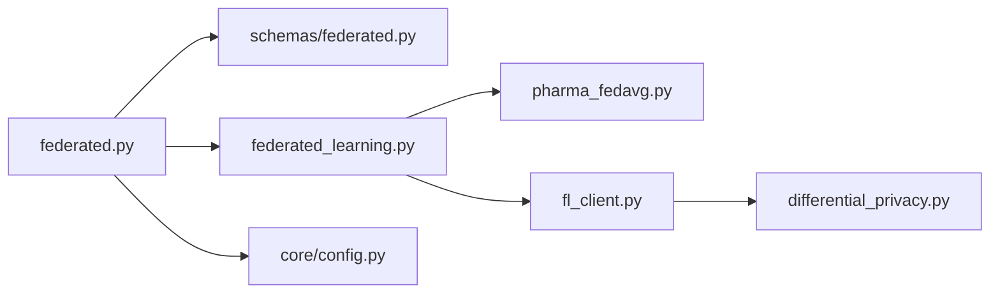

# 联邦学习系统

<cite>
**本文引用的文件**   
- [backend/app/services/optimizer/federated_learning.py](file://precision-drug-design/backend/app/services/optimizer/federated_learning.py)
- [backend/app/services/optimizer/pharma_fedavg.py](file://precision-drug-design/backend/app/services/optimizer/pharma_fedavg.py)
- [backend/app/services/optimizer/fl_client.py](file://precision-drug-design/backend/app/services/optimizer/fl_client.py)
- [backend/app/api/v1/federated.py](file://precision-drug-design/backend/app/api/v1/federated.py)
- [backend/app/schemas/federated.py](file://precision-drug-design/backend/app/schemas/federated.py)
- [backend/app/services/privacy/differential_privacy.py](file://precision-drug-design/backend/app/services/privacy/differential_privacy.py)
- [backend/app/core/config.py](file://precision-drug-design/backend/app/core/config.py)
- [tests/test_federated_learning.py](file://precision-drug-design/tests/test_federated_learning.py)
- [frontend/pages/8_🌐_联邦学习.py](file://precision-drug-design/frontend/pages/8_🌐_联邦学习.py)
- [2026-07-03-github-opensource-integration-guide.md](file://2026-07-03-github-opensource-integration-guide.md)
</cite>

## 目录
1. [简介](#简介)
2. [项目结构](#项目结构)
3. [核心组件](#核心组件)
4. [架构总览](#架构总览)
5. [详细组件分析](#详细组件分析)
6. [依赖关系分析](#依赖关系分析)
7. [性能与可扩展性](#性能与可扩展性)
8. [故障排查指南](#故障排查指南)
9. [结论](#结论)
10. [附录：API 参考与部署要点](#附录api-参考与部署要点)

## 简介
本技术文档围绕“精准药物设计”系统中的联邦学习子系统，系统性阐述分布式机器学习架构、Flower 框架集成方案、联邦节点管理、模型聚合算法（FedAvg 与 Pharma-FedAvg）、任务生命周期管理、客户端注册机制、参数同步协议、配置项、通信协议、容错处理、性能监控、隐私保护策略以及与传统机器学习的差异。文档同时提供 API 调用示例与多机构协作部署建议，帮助读者快速理解并落地生产环境。

## 项目结构
联邦学习相关代码主要分布在后端服务层、API 层、Schema 定义、隐私模块与前端页面中，形成清晰的分层职责：
- 服务层：联邦学习任务编排、聚合策略、客户端模拟与注册表
- API 层：REST 接口暴露任务创建、查询、停止与客户端注册
- Schema 层：请求/响应数据模型校验
- 隐私层：差分隐私预算管理与噪声注入
- 配置层：全局配置（含 Flower 相关）
- 前端：联邦学习页面入口与交互说明

图表来源
- [backend/app/api/v1/federated.py:1-133](file://precision-drug-design/backend/app/api/v1/federated.py#L1-L133)
- [backend/app/schemas/federated.py:1-63](file://precision-drug-design/backend/app/schemas/federated.py#L1-L63)
- [backend/app/services/optimizer/federated_learning.py:1-199](file://precision-drug-design/backend/app/services/optimizer/federated_learning.py#L1-L199)
- [backend/app/services/optimizer/pharma_fedavg.py:1-246](file://precision-drug-design/backend/app/services/optimizer/pharma_fedavg.py#L1-L246)
- [backend/app/services/optimizer/fl_client.py:1-254](file://precision-drug-design/backend/app/services/optimizer/fl_client.py#L1-L254)
- [backend/app/services/privacy/differential_privacy.py:1-151](file://precision-drug-design/backend/app/services/privacy/differential_privacy.py#L1-L151)
- [backend/app/core/config.py:1-144](file://precision-drug-design/backend/app/core/config.py#L1-L144)
- [frontend/pages/8_🌐_联邦学习.py:1-33](file://precision-drug-design/frontend/pages/8_🌐_联邦学习.py#L1-L33)

章节来源
- [backend/app/api/v1/federated.py:1-133](file://precision-drug-design/backend/app/api/v1/federated.py#L1-L133)
- [backend/app/schemas/federated.py:1-63](file://precision-drug-design/backend/app/schemas/federated.py#L1-L63)
- [backend/app/services/optimizer/federated_learning.py:1-199](file://precision-drug-design/backend/app/services/optimizer/federated_learning.py#L1-L199)
- [backend/app/services/optimizer/pharma_fedavg.py:1-246](file://precision-drug-design/backend/app/services/optimizer/pharma_fedavg.py#L1-L246)
- [backend/app/services/optimizer/fl_client.py:1-254](file://precision-drug-design/backend/app/services/optimizer/fl_client.py#L1-L254)
- [backend/app/services/privacy/differential_privacy.py:1-151](file://precision-drug-design/backend/app/services/privacy/differential_privacy.py#L1-L151)
- [backend/app/core/config.py:1-144](file://precision-drug-design/backend/app/core/config.py#L1-L144)
- [frontend/pages/8_🌐_联邦学习.py:1-33](file://precision-drug-design/frontend/pages/8_🌐_联邦学习.py#L1-L33)

## 核心组件
- FederatedLearningService：联邦学习任务编排器，负责创建任务、注册客户端、启动训练、轮次推进与完成判定。当前为内存存储，生产需替换为数据库并与 Flower 服务端对接。
- PharmaFedAvg：药物研发场景的 FedAvg 聚合策略，支持按样本量加权、拜占庭剔除（MAD 检测）、学习率衰减与异步聚合。
- FLClient：联邦学习客户端模拟，实现本地训练、评估、差分隐私加噪与拜占庭故障模拟；配合 ClientRegistry 进行连接与心跳管理。
- DifferentialPrivacy：差分隐私预算管理与噪声注入（拉普拉斯/高斯/随机响应）。
- API 层：提供任务 CRUD、停止任务与客户端注册等 REST 接口。
- 配置：通过 Settings 集中加载环境变量，包含 Flower 服务器地址与轮数等联邦学习相关配置。

章节来源
- [backend/app/services/optimizer/federated_learning.py:1-199](file://precision-drug-design/backend/app/services/optimizer/federated_learning.py#L1-L199)
- [backend/app/services/optimizer/pharma_fedavg.py:1-246](file://precision-drug-design/backend/app/services/optimizer/pharma_fedavg.py#L1-L246)
- [backend/app/services/optimizer/fl_client.py:1-254](file://precision-drug-design/backend/app/services/optimizer/fl_client.py#L1-L254)
- [backend/app/services/privacy/differential_privacy.py:1-151](file://precision-drug-design/backend/app/services/privacy/differential_privacy.py#L1-L151)
- [backend/app/api/v1/federated.py:1-133](file://precision-drug-design/backend/app/api/v1/federated.py#L1-L133)
- [backend/app/core/config.py:1-144](file://precision-drug-design/backend/app/core/config.py#L1-L144)

## 架构总览
联邦学习采用“中心-边缘”架构：中心服务器负责任务调度、参数下发与聚合；各机构（医院/药企）作为边缘客户端在本地数据上训练，仅上传模型参数或梯度更新。系统以 Flower 为通信与调度框架，结合自定义聚合策略与差分隐私增强安全性。

图表来源
- [backend/app/api/v1/federated.py:1-133](file://precision-drug-design/backend/app/api/v1/federated.py#L1-L133)
- [backend/app/services/optimizer/federated_learning.py:1-199](file://precision-drug-design/backend/app/services/optimizer/federated_learning.py#L1-L199)
- [backend/app/services/optimizer/pharma_fedavg.py:1-246](file://precision-drug-design/backend/app/services/optimizer/pharma_fedavg.py#L1-L246)
- [backend/app/services/optimizer/fl_client.py:1-254](file://precision-drug-design/backend/app/services/optimizer/fl_client.py#L1-L254)
- [backend/app/services/privacy/differential_privacy.py:1-151](file://precision-drug-design/backend/app/services/privacy/differential_privacy.py#L1-L151)

## 详细组件分析

### 联邦学习任务与服务（FederatedLearningService）
- 任务建模：使用数据类描述任务元数据（ID、项目、靶点、轮数、最少客户端、状态、时间戳、指标等）。
- 生命周期：pending → ready（满足最小客户端）→ running → completed/cancelled。
- 关键方法：
  - create_job：生成任务并持久化到内存字典。
  - register_client：去重注册，计算 ready_to_start 标志。
  - start_job：校验状态与客户端数量，设置开始时间。
  - update_round：记录每轮指标，达到 num_rounds 自动完成。
  - cancel_job：终止任务并记录完成时间。
- 扩展点：注释明确生产环境应替换为数据库并接入 Flower 服务端。

图表来源
- [backend/app/services/optimizer/federated_learning.py:1-199](file://precision-drug-design/backend/app/services/optimizer/federated_learning.py#L1-L199)

章节来源
- [backend/app/services/optimizer/federated_learning.py:1-199](file://precision-drug-design/backend/app/services/optimizer/federated_learning.py#L1-L199)
- [tests/test_federated_learning.py:1-134](file://precision-drug-design/tests/test_federated_learning.py#L1-L134)

### 聚合策略（PharmaFedAvg）
- 特性：
  - 按客户端样本量加权聚合（num_samples 越大权重越高）。
  - 拜占庭剔除：基于参数向量 L2 范数的 MAD 检测异常更新。
  - 学习率衰减：lr = lr_base * decay^(server_round-1)。
  - 异步聚合：允许部分客户端延迟上报，满足 min_participants 即可触发。
- 关键流程：
  - configure_fit：生成每轮训练配置（epochs、lr、min_clients 等）。
  - aggregate_fit：执行拜占庭剔除、加权聚合、更新全局参数并记录历史。
  - _filter_byzantine：计算范数分布，识别异常客户端。
- 复杂度：
  - 聚合过程 O(D·K)，D 为参数维度，K 为有效客户端数。
  - 拜占庭剔除 O(K log K)（排序求中位数）。

图表来源
- [backend/app/services/optimizer/pharma_fedavg.py:1-246](file://precision-drug-design/backend/app/services/optimizer/pharma_fedavg.py#L1-L246)

章节来源
- [backend/app/services/optimizer/pharma_fedavg.py:1-246](file://precision-drug-design/backend/app/services/optimizer/pharma_fedavg.py#L1-L246)

### 客户端与注册表（FLClient + ClientRegistry）
- FLClient：
  - 模拟线性模型 y = w·x + b 的本地训练，通过随机扰动和学习率更新参数。
  - 支持差分隐私：梯度裁剪 + Laplace 噪声注入，预算耗尽时不再加噪。
  - 支持拜占庭模式：发送放大且偏移的参数用于测试剔除逻辑。
  - 提供 fit/evaluate/get_parameters 接口，兼容 flwr.client.NumPyClient 风格。
- ClientRegistry：
  - 内存版客户端注册表，维护连接与心跳。
  - 健康检测：基于最近心跳时间过滤存活客户端。
  - 提供注册、注销、获取、列表、计数等方法。

图表来源
- [backend/app/services/optimizer/fl_client.py:1-254](file://precision-drug-design/backend/app/services/optimizer/fl_client.py#L1-L254)
- [backend/app/services/privacy/differential_privacy.py:1-151](file://precision-drug-design/backend/app/services/privacy/differential_privacy.py#L1-L151)

章节来源
- [backend/app/services/optimizer/fl_client.py:1-254](file://precision-drug-design/backend/app/services/optimizer/fl_client.py#L1-L254)
- [backend/app/services/privacy/differential_privacy.py:1-151](file://precision-drug-design/backend/app/services/privacy/differential_privacy.py#L1-L151)

### API 层与 Schema
- 路由端点：
  - POST /federated/jobs：创建联邦学习任务。
  - GET /federated/jobs：列出任务（可按状态筛选）。
  - GET /federated/jobs/{job_id}：获取任务详情。
  - POST /federated/jobs/{job_id}/stop：停止任务。
  - POST /federated/clients/register：注册客户端（医院/机构）。
- Schema：
  - FederatedJobCreate/FederatedJobResponse：任务创建与响应模型。
  - ClientRegisterRequest/ClientRegisterResponse：客户端注册请求与响应。
  - FederatedQuery：分页与状态查询参数。

图表来源
- [backend/app/api/v1/federated.py:1-133](file://precision-drug-design/backend/app/api/v1/federated.py#L1-L133)
- [backend/app/schemas/federated.py:1-63](file://precision-drug-design/backend/app/schemas/federated.py#L1-L63)

章节来源
- [backend/app/api/v1/federated.py:1-133](file://precision-drug-design/backend/app/api/v1/federated.py#L1-L133)
- [backend/app/schemas/federated.py:1-63](file://precision-drug-design/backend/app/schemas/federated.py#L1-L63)

### 隐私保护（DifferentialPrivacy）
- 预算追踪：PrivacyBudget 维护 total_epsilon、spent_epsilon、delta 与历史记录。
- 机制：
  - Laplace 机制：对连续值添加拉普拉斯噪声，按敏感度与 ε 缩放。
  - Gaussian 机制：对连续值添加高斯噪声，考虑 δ。
  - Randomized Response：对布尔值进行概率翻转。
- 使用场景：客户端在本地训练后对参数或梯度进行加噪，再上传至服务器。

章节来源
- [backend/app/services/privacy/differential_privacy.py:1-151](file://precision-drug-design/backend/app/services/privacy/differential_privacy.py#L1-L151)

### Flower 框架集成与通信协议
- 集成方式：
  - 客户端侧：实现 flwr.client.NumPyClient 风格的接口（get/set/fit/evaluate），在各机构本地运行，数据不出域。
  - 服务器侧：使用 Flower 服务端协调多中心训练，结合自定义聚合策略（PharmaFedAvg）。
- 通信协议：
  - 基于 gRPC/TCP 的 Flower 原生协议，默认端口由配置决定（flower_server_address）。
  - 参数传输为 NumPy 数组序列化，支持大规模参数高效传输。
- 多机构协作：
  - 每个机构部署独立客户端进程，连接到中心 Flower 服务器。
  - 通过 Flower 的 ClientManager 管理连接、选择与重试。

章节来源
- [2026-07-03-github-opensource-integration-guide.md:405-447](file://2026-07-03-github-opensource-integration-guide.md#L405-L447)
- [backend/app/core/config.py:87-94](file://precision-drug-design/backend/app/core/config.py#L87-L94)

## 依赖关系分析
- 组件耦合：
  - API 层依赖 Schema 与服务层，服务层依赖聚合策略与客户端注册表。
  - 客户端依赖差分隐私模块，聚合策略独立于客户端实现。
- 外部依赖：
  - Flower 框架（通信与调度）。
  - Pydantic（配置与 Schema 校验）。
  - Loguru（日志）。
- 潜在循环依赖：
  - 当前无直接循环导入；服务层与策略层解耦良好。

图表来源
- [backend/app/api/v1/federated.py:1-133](file://precision-drug-design/backend/app/api/v1/federated.py#L1-L133)
- [backend/app/schemas/federated.py:1-63](file://precision-drug-design/backend/app/schemas/federated.py#L1-L63)
- [backend/app/services/optimizer/federated_learning.py:1-199](file://precision-drug-design/backend/app/services/optimizer/federated_learning.py#L1-L199)
- [backend/app/services/optimizer/pharma_fedavg.py:1-246](file://precision-drug-design/backend/app/services/optimizer/pharma_fedavg.py#L1-L246)
- [backend/app/services/optimizer/fl_client.py:1-254](file://precision-drug-design/backend/app/services/optimizer/fl_client.py#L1-L254)
- [backend/app/services/privacy/differential_privacy.py:1-151](file://precision-drug-design/backend/app/services/privacy/differential_privacy.py#L1-L151)
- [backend/app/core/config.py:1-144](file://precision-drug-design/backend/app/core/config.py#L1-L144)

## 性能与可扩展性
- 聚合复杂度：O(D·K)，参数维度 D 与有效客户端数 K 直接影响性能。
- 拜占庭剔除：排序操作 O(K log K)，可通过近似中位数算法优化。
- 异步聚合：降低等待时间，提高吞吐。
- 差分隐私：噪声注入带来精度下降，需权衡 ε 与模型收敛。
- 可扩展性：
  - 将内存存储替换为数据库（PostgreSQL/SQLite）与 Redis 缓存。
  - 引入消息队列（如 RabbitMQ/Kafka）进行任务与指标异步处理。
  - 水平扩展 Flower 服务端与客户端实例。

[本节为通用指导，不直接分析具体文件]

## 故障排查指南
- 任务不存在：
  - 现象：GET /federated/jobs/{job_id} 返回 404。
  - 原因：任务未创建或已删除。
  - 解决：确认 job_id 正确，重新创建任务。
- 客户端不足：
  - 现象：start_job 返回错误提示客户端不足。
  - 原因：registered_clients < min_clients。
  - 解决：增加客户端注册或调整 min_clients。
- 拜占庭剔除导致可用客户端不足：
  - 现象：aggregate_fit 警告并回退使用全部更新。
  - 原因：MAD 阈值过严或客户端数较少。
  - 解决：调整 mad_threshold 或增加客户端数量。
- 隐私预算耗尽：
  - 现象：差分隐私加噪抛出“预算不足”。
  - 原因：epsilon 累计超过 total_epsilon。
  - 解决：增大 total_epsilon 或减少加噪频率。

章节来源
- [backend/app/api/v1/federated.py:77-102](file://precision-drug-design/backend/app/api/v1/federated.py#L77-L102)
- [backend/app/services/optimizer/pharma_fedavg.py:136-191](file://precision-drug-design/backend/app/services/optimizer/pharma_fedavg.py#L136-L191)
- [backend/app/services/privacy/differential_privacy.py:79-90](file://precision-drug-design/backend/app/services/privacy/differential_privacy.py#L79-L90)

## 结论
本联邦学习子系统以 Flower 为核心，结合 Pharma-FedAvg 聚合策略与差分隐私机制，实现了多机构协同训练的安全性与鲁棒性。系统分层清晰、接口完备，具备向生产环境扩展的基础能力。后续可重点完善持久化、监控告警与更严格的隐私审计。

[本节为总结，不直接分析具体文件]

## 附录：API 参考与部署要点

### API 调用示例
- 创建联邦学习任务
  - 方法：POST /federated/jobs
  - 请求体字段：name、model_arch、num_rounds、min_clients、config
  - 响应：ApiResponse[FederatedJobResponse]
- 列出联邦学习任务
  - 方法：GET /federated/jobs?status=pending
  - 响应：ApiResponse[list[FederatedJobResponse]]
- 获取任务详情
  - 方法：GET /federated/jobs/{job_id}
  - 响应：ApiResponse[FederatedJobResponse]
- 停止任务
  - 方法：POST /federated/jobs/{job_id}/stop
  - 响应：ApiResponse[FederatedJobResponse]
- 注册客户端
  - 方法：POST /federated/clients/register
  - 请求体字段：job_id、client_name、client_url、data_size
  - 响应：ApiResponse[ClientRegisterResponse]

章节来源
- [backend/app/api/v1/federated.py:35-133](file://precision-drug-design/backend/app/api/v1/federated.py#L35-L133)
- [backend/app/schemas/federated.py:13-63](file://precision-drug-design/backend/app/schemas/federated.py#L13-L63)

### 多机构协作部署方案
- 中心服务器：
  - 部署 Flower 服务端，监听 flower_server_address（默认 localhost:8080）。
  - 配置 Flower 轮数与聚合策略（PharmaFedAvg）。
- 边缘客户端：
  - 各机构部署独立客户端进程，实现 flwr.client.NumPyClient 接口。
  - 本地数据不出域，仅上传模型参数或梯度更新。
- 网络与安全：
  - 使用 HTTPS/gRPC 加密通道。
  - 访问控制与身份认证（JWT）。
- 监控与日志：
  - 采集训练指标（loss、accuracy、learning_rate）。
  - 记录拜占庭剔除与隐私预算消耗。

章节来源
- [2026-07-03-github-opensource-integration-guide.md:405-447](file://2026-07-03-github-opensource-integration-guide.md#L405-L447)
- [backend/app/core/config.py:87-94](file://precision-drug-design/backend/app/core/config.py#L87-L94)

### 与传统机器学习的区别
- 数据隔离：传统 ML 通常集中式训练，数据汇聚到单一平台；联邦学习保持数据在本地，仅交换模型参数。
- 隐私保护：联邦学习结合差分隐私、安全聚合等技术，降低泄露风险。
- 模型更新策略：联邦学习采用迭代式参数聚合（FedAvg/Pharma-FedAvg），而非一次性全量更新。
- 容错与异步：联邦学习容忍部分客户端掉线或延迟，提升整体鲁棒性。

[本节为概念性内容，不直接分析具体文件]