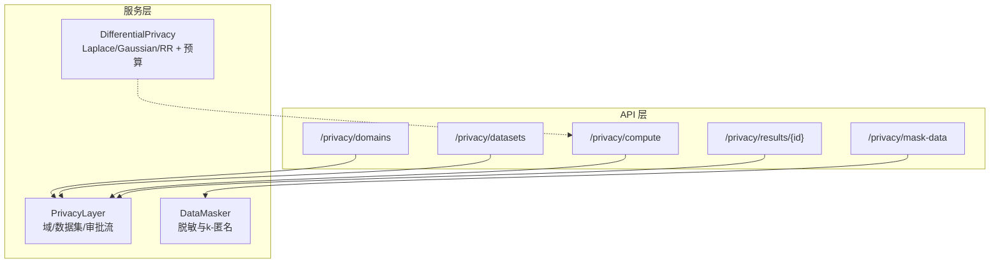
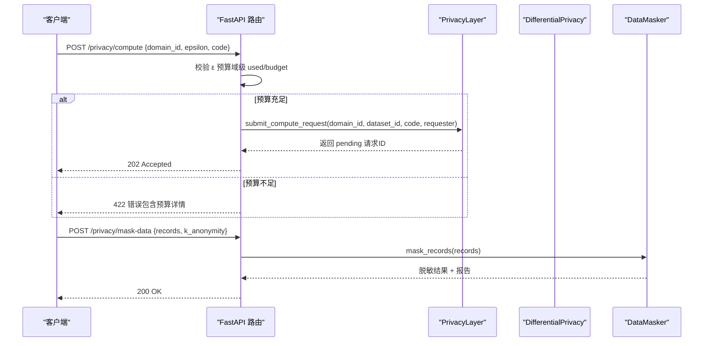
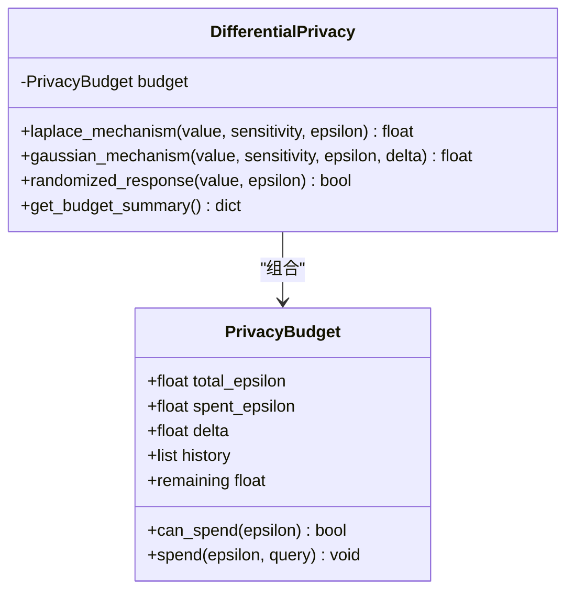
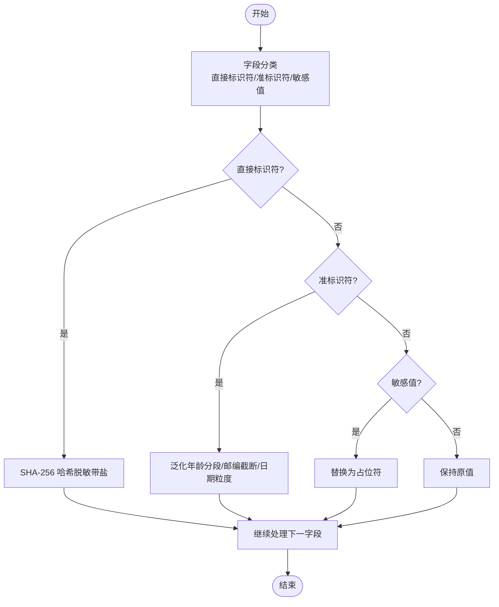
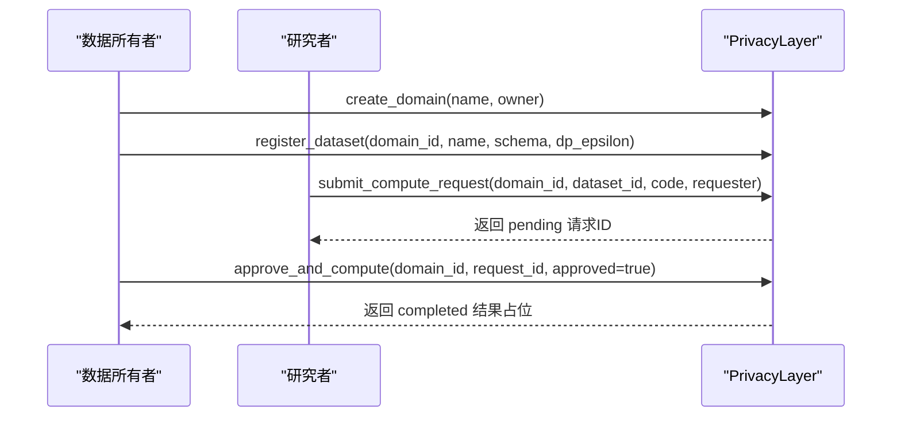
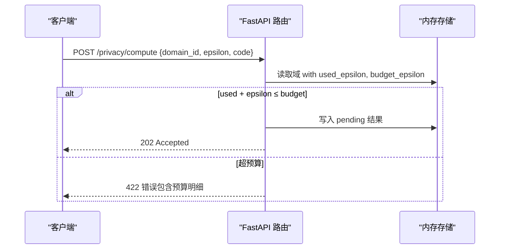
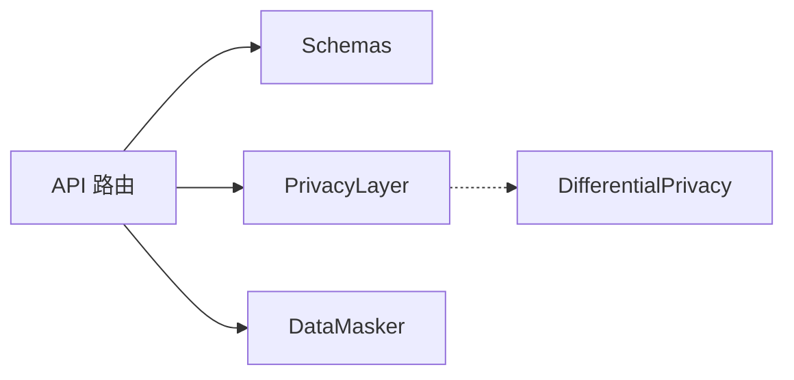

# 差分隐私算法

<cite>
**本文引用的文件**   
- [differential_privacy.py](file://backend/app/services/privacy/differential_privacy.py)
- [data_masker.py](file://backend/app/services/privacy/data_masker.py)
- [privacy_layer.py](file://backend/app/services/privacy/privacy_layer.py)
- [privacy.py](file://backend/app/api/v1/privacy.py)
- [privacy.py](file://backend/app/schemas/privacy.py)
- [test_differential_privacy.py](file://tests/test_differential_privacy.py)
</cite>

## 目录
1. [简介](#简介)
2. [项目结构](#项目结构)
3. [核心组件](#核心组件)
4. [架构总览](#架构总览)
5. [详细组件分析](#详细组件分析)
6. [依赖关系分析](#依赖关系分析)
7. [性能与精度权衡](#性能与精度权衡)
8. [故障排查指南](#故障排查指南)
9. [结论](#结论)
10. [附录：药物研发场景应用](#附录药物研发场景应用)

## 简介
本技术文档聚焦于“差分隐私算法模块”，围绕以下目标展开：
- 数学原理与定义：ε-差分隐私、(ε,δ)-差分隐私，敏感度概念。
- 噪声注入机制：拉普拉斯机制、高斯机制、随机响应机制的实现细节与参数调优。
- 预算管理与累积损失：隐私预算分配策略、累计消耗计算、预算耗尽检测。
- 工程集成：API 层对预算的校验与拒绝策略；数据脱敏与 k-匿名性评估。
- 药物研发场景：临床试验数据分析、患者统计信息保护、跨机构协作中的隐私保护方案。
- 实践建议：隐私参数选择原则、精度与隐私的权衡策略、效果评估方法。

## 项目结构
与差分隐私相关的代码主要分布在 services/privacy 与 api/v1/privacy 两个层次：
- 服务层（services/privacy）
  - differential_privacy.py：实现 Laplace/Gaussian/Randomized Response 机制与隐私预算追踪。
  - data_masker.py：直接标识符哈希、准标识符泛化、敏感值抑制及 k-匿名性评估。
  - privacy_layer.py：模拟 PySyft 域的数据所有权与审批式计算流程。
- API 层（api/v1/privacy.py）
  - 提供创建隐私域、注册数据集、提交远程计算请求、获取结果、数据脱敏等端点。
  - 在提交计算前进行 ε 预算校验，不足则拒绝。
- Schemas（schemas/privacy.py）
  - 定义隐私域、数据集、计算请求与结果的 Pydantic 模型。
- 测试（tests/test_differential_privacy.py）
  - 覆盖预算消耗、预算耗尽异常、机制输出类型与统计行为等。

图表来源
- [privacy.py:47-177](file://backend/app/api/v1/privacy.py#L47-L177)
- [privacy_layer.py:43-199](file://backend/app/services/privacy/privacy_layer.py#L43-L199)
- [data_masker.py:126-294](file://backend/app/services/privacy/data_masker.py#L126-L294)
- [differential_privacy.py:51-151](file://backend/app/services/privacy/differential_privacy.py#L51-L151)

章节来源
- [privacy.py:1-177](file://backend/app/api/v1/privacy.py#L1-L177)
- [privacy_layer.py:1-199](file://backend/app/services/privacy/privacy_layer.py#L1-L199)
- [data_masker.py:1-294](file://backend/app/services/privacy/data_masker.py#L1-L294)
- [differential_privacy.py:1-151](file://backend/app/services/privacy/differential_privacy.py#L1-L151)

## 核心组件
- 隐私预算与机制（DifferentialPrivacy）
  - 维护 total_epsilon/spent_epsilon/delta/history，支持 can_spend/spend/remaining 查询。
  - 提供 laplace_mechanism/gaussian_mechanism/randomized_response 三种加噪方式。
- 数据脱敏（DataMasker）
  - 直接标识符哈希、准标识符泛化、敏感值抑制；批量处理并评估 k-匿名性。
- 隐私计算层（PrivacyLayer）
  - 内存存储的“域”抽象，支持注册数据集、提交计算请求、审批执行。
- API 路由（/privacy/*）
  - 创建域、注册数据集、提交计算（含 ε 预算校验）、查询结果、数据脱敏。

章节来源
- [differential_privacy.py:15-151](file://backend/app/services/privacy/differential_privacy.py#L15-L151)
- [data_masker.py:80-294](file://backend/app/services/privacy/data_masker.py#L80-L294)
- [privacy_layer.py:20-199](file://backend/app/services/privacy/privacy_layer.py#L20-L199)
- [privacy.py:47-177](file://backend/app/api/v1/privacy.py#L47-L177)

## 架构总览
下图展示从客户端到服务层的调用路径，以及预算检查与脱敏流程。

图表来源
- [privacy.py:94-177](file://backend/app/api/v1/privacy.py#L94-L177)
- [privacy_layer.py:124-199](file://backend/app/services/privacy/privacy_layer.py#L124-L199)
- [data_masker.py:156-172](file://backend/app/services/privacy/data_masker.py#L156-L172)

## 详细组件分析

### 差分隐私机制与预算（DifferentialPrivacy）
- 隐私预算
  - 数据结构：total_epsilon、spent_epsilon、delta、history。
  - 关键操作：can_spend、spend、remaining、get_budget_summary。
- 拉普拉斯机制
  - 输入：value、sensitivity、epsilon。
  - 噪声尺度：scale = sensitivity / epsilon。
  - 实现要点：使用标准拉普拉斯采样公式生成噪声；若预算不足抛出运行时异常。
- 高斯机制
  - 输入：value、sensitivity、epsilon、delta（可选）。
  - 噪声尺度：sigma = sqrt(2 ln(1.25/δ)) × sensitivity / epsilon。
  - 用途：适用于 (ε,δ)-差分隐私场景。
- 随机响应机制
  - 输入：布尔值 value、epsilon。
  - 行为：以概率 p = e^ε/(1+e^ε) 保留原值，否则翻转；用于分类/布尔属性。
- 预算汇总
  - 返回 total_epsilon、spent_epsilon、remaining_epsilon、delta、query_count。

图表来源
- [differential_privacy.py:15-151](file://backend/app/services/privacy/differential_privacy.py#L15-L151)

章节来源
- [differential_privacy.py:15-151](file://backend/app/services/privacy/differential_privacy.py#L15-L151)
- [test_differential_privacy.py:13-126](file://tests/test_differential_privacy.py#L13-L126)

### 数据脱敏与 k-匿名性（DataMasker）
- 字段分类
  - 直接标识符：姓名、身份证号、社保号、手机号、邮箱、地址、IP、设备ID等 → SHA-256 哈希脱敏（带盐）。
  - 准标识符：年龄、出生日期、邮编、种族等 → 泛化处理（分段、截断、归一化）。
  - 敏感值：诊断、ICD 编码、基因结果等 → 抑制为占位符。
- 配置项（MaskingConfig）
  - salt、age_buckets、zip_prefix_len、date_granularity、k_anonymity、redact_placeholder。
- 报告（MaskingReport）
  - 记录处理条数、字段数、各类处理计数、k-匿名是否满足、最小同质组大小、违规项。
- k-匿名评估
  - 按准标识符组合分组，统计每组大小，判断是否 ≥ k。

图表来源
- [data_masker.py:174-212](file://backend/app/services/privacy/data_masker.py#L174-L212)

章节来源
- [data_masker.py:80-294](file://backend/app/services/privacy/data_masker.py#L80-L294)

### 隐私计算层（PrivacyLayer）
- 域（PrivacyDomain）
  - 拥有者、描述、已注册数据集、待审批计算请求、创建时间。
- 能力
  - create_domain/get_domain/list_domains
  - register_dataset：注册数据集并关联 dp_epsilon（作为参考预算）。
  - submit_compute_request：提交计算代码，状态 pending。
  - approve_and_compute：所有者审批后执行（当前返回占位结果）。

图表来源
- [privacy_layer.py:54-199](file://backend/app/services/privacy/privacy_layer.py#L54-L199)

章节来源
- [privacy_layer.py:20-199](file://backend/app/services/privacy/privacy_layer.py#L20-L199)

### API 层与预算校验（/privacy/*）
- 创建域：POST /privacy/domains
- 注册数据集：POST /privacy/datasets
- 提交计算：POST /privacy/compute
  - 校验 domain.used_epsilon + payload.epsilon ≤ domain.budget_epsilon，不足则返回验证错误。
- 查询结果：GET /privacy/results/{request_id}
- 数据脱敏：POST /privacy/mask-data
  - 调用 DataMasker 批量脱敏并返回报告。

图表来源
- [privacy.py:94-132](file://backend/app/api/v1/privacy.py#L94-L132)

章节来源
- [privacy.py:47-177](file://backend/app/api/v1/privacy.py#L47-L177)
- [privacy.py:14-84](file://backend/app/schemas/privacy.py#L14-L84)

## 依赖关系分析
- 模块内聚与耦合
  - DifferentialPrivacy 仅依赖标准库（math/random），内聚性强。
  - DataMasker 依赖 hashlib/re/loguru，职责清晰。
  - PrivacyLayer 使用内存字典模拟持久化，便于演示与扩展。
  - API 路由依赖 schemas 与 services，形成清晰的分层。
- 外部依赖
  - FastAPI、Pydantic、loguru、datetime、uuid 等。
- 潜在循环依赖
  - 当前未见循环导入；各模块通过函数/类接口交互。

图表来源
- [privacy.py:1-177](file://backend/app/api/v1/privacy.py#L1-L177)
- [privacy.py:1-84](file://backend/app/schemas/privacy.py#L1-L84)
- [privacy_layer.py:1-199](file://backend/app/services/privacy/privacy_layer.py#L1-L199)
- [data_masker.py:1-294](file://backend/app/services/privacy/data_masker.py#L1-L294)
- [differential_privacy.py:1-151](file://backend/app/services/privacy/differential_privacy.py#L1-L151)

章节来源
- [privacy.py:1-177](file://backend/app/api/v1/privacy.py#L1-L177)
- [privacy.py:1-84](file://backend/app/schemas/privacy.py#L1-L84)
- [privacy_layer.py:1-199](file://backend/app/services/privacy/privacy_layer.py#L1-L199)
- [data_masker.py:1-294](file://backend/app/services/privacy/data_masker.py#L1-L294)
- [differential_privacy.py:1-151](file://backend/app/services/privacy/differential_privacy.py#L1-L151)

## 性能与精度权衡
- 敏感度（sensitivity）
  - 越小噪声越低、精度越高，但需确保查询函数的全局敏感度正确估计。
- ε（隐私强度）
  - ε 越小隐私越强，噪声越大，精度下降；ε 越大反之。
- δ（高斯机制）
  - δ 越小噪声越大；通常取 1e-5~1e-6 量级。
- 预算分配策略
  - 固定分配：每次查询均分预算。
  - 自适应分配：根据查询重要性或历史误差动态调整。
  - 分批聚合：将多次查询合并以减少预算消耗。
- 精度评估
  - 相对误差、置信区间覆盖率、AUC/KS 等下游指标对比。
- 实际建议
  - 先设定业务可接受误差上限，再反推 ε 与敏感度。
  - 对高频查询采用更高 ε，低频高精度查询采用更低 ε。
  - 定期审计预算使用与误差趋势，必要时重新校准。

[本节为通用指导，不直接分析具体文件]

## 故障排查指南
- 预算不足
  - 现象：调用 Laplace/Gaussian/RR 时抛出运行时异常；API 返回 422 错误。
  - 排查：检查 total_epsilon、spent_epsilon、本次 epsilon 请求值；确认是否存在重复扣减。
  - 定位：
    - 服务层：预算检查与消耗逻辑。
    - API 层：域级预算校验与错误消息。
- 噪声过大导致精度骤降
  - 现象：输出波动大、下游指标显著退化。
  - 排查：核对敏感度估计是否偏大；ε 是否过小；δ 设置是否过严。
- k-匿名未满足
  - 现象：报告提示 min_group_size < k。
  - 排查：扩大 age_buckets 范围、降低 date granularity、提高 zip 前缀长度或放宽 k。
- 日志与审计
  - 利用日志器输出关键步骤与警告，结合预算历史进行回溯。

章节来源
- [differential_privacy.py:79-90](file://backend/app/services/privacy/differential_privacy.py#L79-L90)
- [privacy.py:105-117](file://backend/app/api/v1/privacy.py#L105-L117)
- [data_masker.py:257-290](file://backend/app/services/privacy/data_masker.py#L257-L290)

## 结论
本模块实现了差分隐私的核心机制与预算管控，并通过 API 层完成预算校验与数据脱敏能力。整体设计遵循分层解耦原则，具备可扩展性与可观测性。建议在真实场景中进一步引入更严格的敏感度分析、预算自动分配策略与离线评测流水线，以提升隐私-精度平衡的可控性与稳定性。

[本节为总结性内容，不直接分析具体文件]

## 附录：药物研发场景应用
- 临床试验数据分析
  - 使用 Laplace/Gaussian 机制对疗效指标（如 ORR、PFS）添加噪声，控制 ε 预算，保障受试者隐私的同时维持统计推断可用性。
- 患者统计信息保护
  - 对人口学特征（年龄、性别、地区）进行泛化与抑制，结合 k-匿名性评估，避免重识别风险。
- 跨机构数据协作
  - 基于隐私计算层（模拟 PySyft 域）实现“数据不出域”的计算审批流；结合差分隐私预算，在多中心联合建模中控制泄露风险。
- 参数选择与评估
  - 依据业务容忍度设定 ε 与敏感度；通过离线回测比较不同机制与参数的误差分布与下游任务表现；建立预算使用看板与告警阈值。

[本节为场景化说明，不直接分析具体文件]