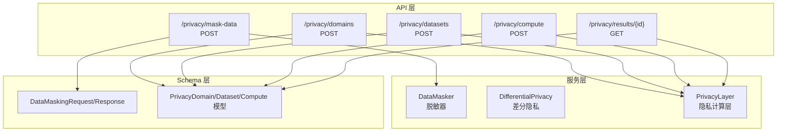
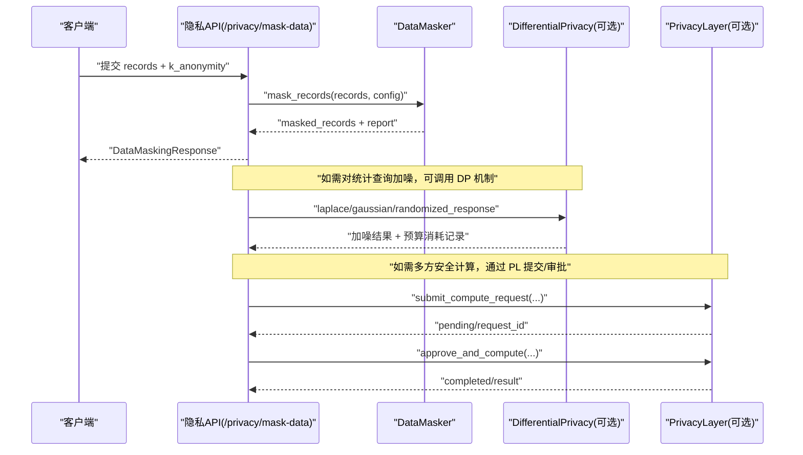
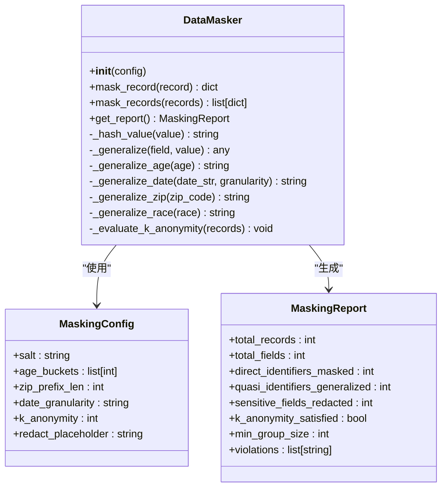
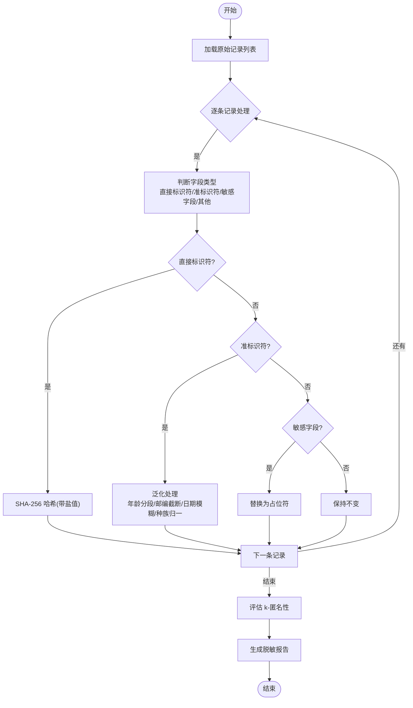
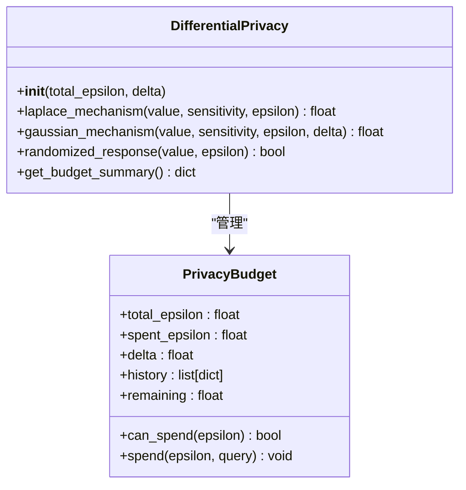
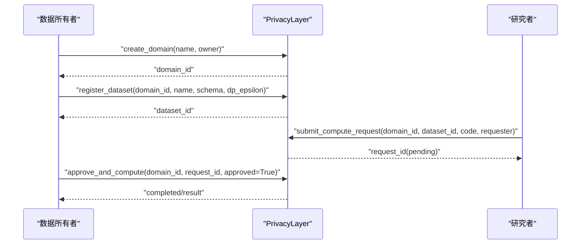
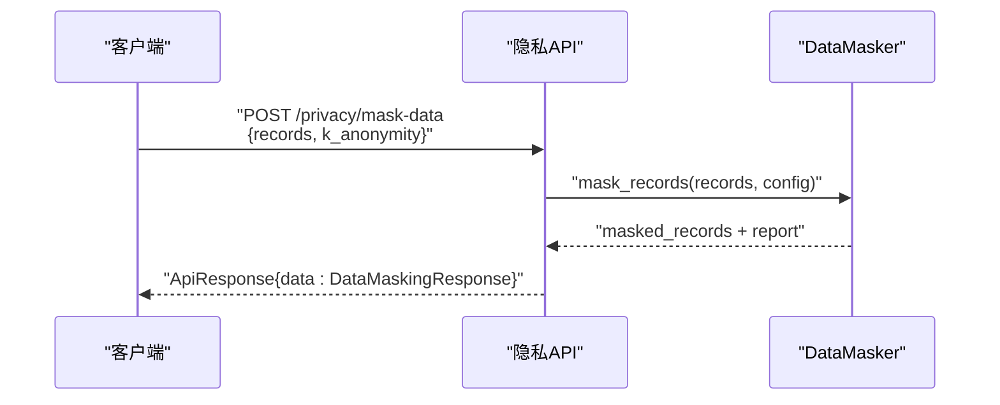
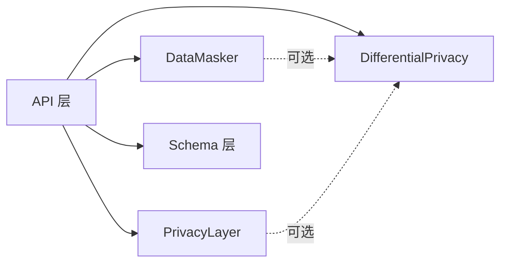

# 数据脱敏技术

<cite>
**本文引用的文件**   
- [privacy.py](file://backend/app/api/v1/privacy.py)
- [data_masker.py](file://backend/app/services/privacy/data_masker.py)
- [differential_privacy.py](file://backend/app/services/privacy/differential_privacy.py)
- [privacy_layer.py](file://backend/app/services/privacy/privacy_layer.py)
- [efficacy.py](file://backend/app/schemas/efficacy.py)
- [privacy.py](file://backend/app/schemas/privacy.py)
- [test_differential_privacy.py](file://tests/test_differential_privacy.py)
- [test_privacy_layer.py](file://tests/test_privacy_layer.py)
</cite>

## 目录
1. [简介](#简介)
2. [项目结构](#项目结构)
3. [核心组件](#核心组件)
4. [架构总览](#架构总览)
5. [详细组件分析](#详细组件分析)
6. [依赖关系分析](#依赖关系分析)
7. [性能与可用性考量](#性能与可用性考量)
8. [故障排查指南](#故障排查指南)
9. [结论](#结论)
10. [附录](#附录)

## 简介
本模块聚焦于药物研发场景下的数据脱敏与隐私保护，围绕 HIPAA Safe Harbor 标准、k-匿名性算法与敏感信息识别规则，提供直接标识符脱敏（SHA-256 哈希与盐值）、准标识符泛化（年龄分段、邮编截断、日期模糊化）以及敏感字段抑制策略。同时包含差分隐私预算管理与隐私计算层（模拟 PySyft 域），并支持脱敏配置管理、报告生成与合规性验证。文档还给出在患者个人信息保护、临床试验数据匿名化与生物样本信息脱敏中的实践建议，以及效果评估、风险检测与数据可用性保持策略。

## 项目结构
与数据脱敏相关的代码主要分布在后端 API、服务层与 Schema 定义中：
- API 层暴露 /privacy/mask-data 等端点，负责接收请求、调用脱敏服务并返回结构化响应
- 服务层实现具体脱敏逻辑、差分隐私机制与隐私计算层
- Schema 层定义请求/响应模型，约束参数范围与字段语义

图表来源
- [privacy.py:1-177](file://backend/app/api/v1/privacy.py#L1-L177)
- [data_masker.py:1-294](file://backend/app/services/privacy/data_masker.py#L1-L294)
- [differential_privacy.py:1-151](file://backend/app/services/privacy/differential_privacy.py#L1-L151)
- [privacy_layer.py:1-199](file://backend/app/services/privacy/privacy_layer.py#L1-L199)
- [efficacy.py:152-170](file://backend/app/schemas/efficacy.py#L152-L170)
- [privacy.py:14-84](file://backend/app/schemas/privacy.py#L14-L84)

章节来源
- [privacy.py:1-177](file://backend/app/api/v1/privacy.py#L1-L177)
- [data_masker.py:1-294](file://backend/app/services/privacy/data_masker.py#L1-L294)
- [differential_privacy.py:1-151](file://backend/app/services/privacy/differential_privacy.py#L1-L151)
- [privacy_layer.py:1-199](file://backend/app/services/privacy/privacy_layer.py#L1-L199)
- [efficacy.py:152-170](file://backend/app/schemas/efficacy.py#L152-L170)
- [privacy.py:14-84](file://backend/app/schemas/privacy.py#L14-L84)

## 核心组件
- DataMasker：实现 HIPAA Safe Harbor 18 项标识符处理、直接标识符哈希脱敏、准标识符泛化、敏感字段抑制与 k-匿名性评估
- DifferentialPrivacy：提供 Laplace、高斯与随机响应机制，并维护 ε 预算与审计历史
- PrivacyLayer：模拟 PySyft 隐私域，支持创建域、注册数据集、提交与审批计算请求
- API 端点：封装上述能力，对外暴露 REST 接口，统一响应格式与元数据

章节来源
- [data_masker.py:1-294](file://backend/app/services/privacy/data_masker.py#L1-L294)
- [differential_privacy.py:1-151](file://backend/app/services/privacy/differential_privacy.py#L1-L151)
- [privacy_layer.py:1-199](file://backend/app/services/privacy/privacy_layer.py#L1-L199)
- [privacy.py:1-177](file://backend/app/api/v1/privacy.py#L1-L177)

## 架构总览
整体流程从 API 入口到服务层执行，再到结果与报告返回；差分隐私与隐私计算层作为可选增强能力，用于更严格的隐私保障与多方安全计算。

图表来源
- [privacy.py:148-177](file://backend/app/api/v1/privacy.py#L148-L177)
- [data_masker.py:156-172](file://backend/app/services/privacy/data_masker.py#L156-L172)
- [differential_privacy.py:63-140](file://backend/app/services/privacy/differential_privacy.py#L63-L140)
- [privacy_layer.py:124-199](file://backend/app/services/privacy/privacy_layer.py#L124-L199)

## 详细组件分析

### 数据脱敏器（DataMasker）
- 直接标识符脱敏：使用 SHA-256 哈希并拼接盐值，输出固定长度摘要前缀，防止彩虹表攻击
- 准标识符泛化：
  - 年龄分段：按配置的 age_buckets 将连续年龄映射为区间标签
  - 邮编截断：保留前 N 位，其余替换为占位符
  - 日期模糊化：按粒度（年/月）截断，出生日期默认到年，入院/出院日期可按配置到月
  - 种族/民族：归一化为少数类别，降低细粒度泄露风险
- 敏感字段抑制：将诊断、用药、基因结果等敏感字段替换为占位符
- k-匿名性评估：基于准标识符组合分组，检查最小同质组大小是否满足 k 阈值，并记录违规项

图表来源
- [data_masker.py:80-124](file://backend/app/services/privacy/data_masker.py#L80-L124)
- [data_masker.py:126-294](file://backend/app/services/privacy/data_masker.py#L126-L294)

章节来源
- [data_masker.py:1-294](file://backend/app/services/privacy/data_masker.py#L1-L294)

#### 脱敏流程（算法流程图）

图表来源
- [data_masker.py:174-290](file://backend/app/services/privacy/data_masker.py#L174-L290)

### 差分隐私（DifferentialPrivacy）
- 预算追踪：维护 total_epsilon、spent_epsilon、delta 与历史日志，支持 can_spend/spend/remaining 操作
- 噪声机制：
  - Laplace 机制：适用于数值型统计查询，尺度由敏感度与 ε 决定
  - 高斯机制：适用于 (ε, δ)-差分隐私场景
  - 随机响应：适用于布尔值，以概率 p 保留原值或翻转
- 预算不足时抛出异常，确保隐私预算不被超额消耗

图表来源
- [differential_privacy.py:15-49](file://backend/app/services/privacy/differential_privacy.py#L15-L49)
- [differential_privacy.py:51-151](file://backend/app/services/privacy/differential_privacy.py#L51-L151)

章节来源
- [differential_privacy.py:1-151](file://backend/app/services/privacy/differential_privacy.py#L1-L151)
- [test_differential_privacy.py:1-126](file://tests/test_differential_privacy.py#L1-L126)

### 隐私计算层（PrivacyLayer）
- 隐私域：创建与管理域，记录所有者与描述
- 数据集注册：在域内注册数据集，附带 schema 与差分隐私预算
- 计算请求：研究者提交代码，进入待审批队列
- 审批与执行：数据所有者批准后可执行计算，返回结果（当前为占位实现）

图表来源
- [privacy_layer.py:54-199](file://backend/app/services/privacy/privacy_layer.py#L54-L199)

章节来源
- [privacy_layer.py:1-199](file://backend/app/services/privacy/privacy_layer.py#L1-L199)
- [test_privacy_layer.py:1-145](file://tests/test_privacy_layer.py#L1-L145)

### API 端点与 Schema
- POST /privacy/mask-data：接收 DataMaskingRequest，返回 DataMaskingResponse，包含脱敏后的记录与报告指标
- POST /privacy/domains、/privacy/datasets、/privacy/compute、GET /privacy/results/{id}：隐私域与远程计算相关端点
- Schema 约束：如 k_anonymity 的取值范围、records 非空等

图表来源
- [privacy.py:148-177](file://backend/app/api/v1/privacy.py#L148-L177)
- [efficacy.py:152-170](file://backend/app/schemas/efficacy.py#L152-L170)

章节来源
- [privacy.py:1-177](file://backend/app/api/v1/privacy.py#L1-L177)
- [efficacy.py:152-170](file://backend/app/schemas/efficacy.py#L152-L170)
- [privacy.py:14-84](file://backend/app/schemas/privacy.py#L14-L84)

## 依赖关系分析
- API 层依赖服务层的 DataMasker、DifferentialPrivacy 与 PrivacyLayer
- 服务层之间相对独立：DataMasker 不依赖 DP 与 PL；DP 与 PL 各自提供不同维度的隐私能力
- Schema 层被 API 与服务层共同引用，保证输入输出一致性

图表来源
- [privacy.py:1-177](file://backend/app/api/v1/privacy.py#L1-L177)
- [data_masker.py:1-294](file://backend/app/services/privacy/data_masker.py#L1-L294)
- [differential_privacy.py:1-151](file://backend/app/services/privacy/differential_privacy.py#L1-L151)
- [privacy_layer.py:1-199](file://backend/app/services/privacy/privacy_layer.py#L1-L199)

章节来源
- [privacy.py:1-177](file://backend/app/api/v1/privacy.py#L1-L177)
- [data_masker.py:1-294](file://backend/app/services/privacy/data_masker.py#L1-L294)
- [differential_privacy.py:1-151](file://backend/app/services/privacy/differential_privacy.py#L1-L151)
- [privacy_layer.py:1-199](file://backend/app/services/privacy/privacy_layer.py#L1-L199)

## 性能与可用性考量
- 批量脱敏：mask_records 对每条记录顺序处理，时间复杂度 O(N×F)，N 为记录数，F 为字段数；建议在大规模数据上采用并行批处理
- 哈希开销：SHA-256 计算成本较低，但需考虑盐值管理与存储安全
- 泛化策略：年龄分段与邮编截断可减少唯一性，提升 k-匿名性；日期模糊化降低重识别风险
- 差分隐私：ε 预算分配需谨慎，高 ε 提高准确性但降低隐私保护；低 ε 反之
- 可用性平衡：在保证隐私的前提下，尽量保留分析价值，例如合理设置 age_buckets 与 zip_prefix_len

## 故障排查指南
- k-匿名未满足：检查准标识符组合与 k 阈值，适当放宽泛化策略或增加数据量
- 隐私预算不足：确认 DP 的 total_epsilon 与每次查询的 ε 分配，避免超额消耗
- 字段识别错误：核对字段名是否在 DIRECT_IDENTIFIERS、QUASI_IDENTIFIERS、SENSITIVE_FIELDS 集合中
- 日期解析失败：确保日期字符串符合 YYYY-MM-DD 或 YYYY-MM 格式，否则将被视为未知并保留原值
- 测试用例参考：
  - 差分隐私预算与机制行为见测试用例
  - 隐私计算层域/数据集/请求生命周期见测试用例

章节来源
- [data_masker.py:257-290](file://backend/app/services/privacy/data_masker.py#L257-L290)
- [differential_privacy.py:79-90](file://backend/app/services/privacy/differential_privacy.py#L79-L90)
- [test_differential_privacy.py:1-126](file://tests/test_differential_privacy.py#L1-L126)
- [test_privacy_layer.py:1-145](file://tests/test_privacy_layer.py#L1-L145)

## 结论
本模块提供了面向药物研发的完整数据脱敏与隐私保护方案：以 HIPAA Safe Harbor 为基础，结合 k-匿名性与差分隐私，覆盖直接标识符、准标识符与敏感字段的处理策略，并通过 API 与 Schema 实现工程化落地。配合隐私计算层，可在数据不出域的前提下进行多方安全计算，兼顾合规性与数据可用性。

## 附录

### HIPAA Safe Harbor 与敏感信息识别规则
- 直接标识符：姓名、身份证号、社保号、医疗记录号、医保号、电话、邮箱、地址、IP、设备 ID 等
- 准标识符：年龄、出生日期、入院/出院日期、邮编、种族/民族、性别等
- 敏感字段：诊断、ICD 编码、疾病、用药剂量、实验室结果、基因结果、HIV 状态、心理健康信息等

章节来源
- [data_masker.py:22-77](file://backend/app/services/privacy/data_masker.py#L22-L77)

### 脱敏配置管理
- 盐值：防止彩虹表攻击，建议集中管理与轮换
- 年龄分段边界：根据业务分布调整，避免过细导致 k-匿名失败
- 邮编保留位数：通常保留前三位，降低地理定位精度
- 日期粒度：出生日期到年，入院/出院日期到月，平衡可用性与隐私
- k 阈值：默认 5，可根据数据集规模与风险容忍度调整

章节来源
- [data_masker.py:80-99](file://backend/app/services/privacy/data_masker.py#L80-L99)

### 脱敏报告与合规性验证
- 报告指标：总记录数、总字段数、直接标识符脱敏数、准标识符泛化数、敏感字段抑制数、k-匿名满足情况、最小同质组大小、违规项
- 合规性验证：依据 k-匿名阈值与违规项列表判定是否满足要求

章节来源
- [data_masker.py:101-124](file://backend/app/services/privacy/data_masker.py#L101-L124)
- [privacy.py:166-176](file://backend/app/api/v1/privacy.py#L166-L176)

### 药物研发中的数据脱敏实践
- 患者个人信息保护：对姓名、身份证、手机号、邮箱等进行哈希脱敏；出生日期与地址泛化
- 临床试验数据匿名化：对入组/出院日期模糊化，年龄分段，减少重识别风险
- 生物样本信息脱敏：对基因结果、实验室结果等敏感字段抑制，必要时结合差分隐私进行统计发布

### 脱敏效果评估与风险检测
- 效果评估：比较脱敏前后数据的分布变化，关注关键指标的偏差
- 风险检测：监测 k-匿名违规项与最小同质组大小，识别潜在重识别风险
- 数据可用性保持：在隐私与可用性间权衡，逐步调整泛化策略与 k 阈值

### 差分隐私与隐私计算集成
- 差分隐私：在发布统计结果时添加噪声，控制 ε 预算，记录审计历史
- 隐私计算层：模拟 PySyft 域，实现数据所有权与控制权分离，支持审批式计算

章节来源
- [differential_privacy.py:1-151](file://backend/app/services/privacy/differential_privacy.py#L1-L151)
- [privacy_layer.py:1-199](file://backend/app/services/privacy/privacy_layer.py#L1-L199)