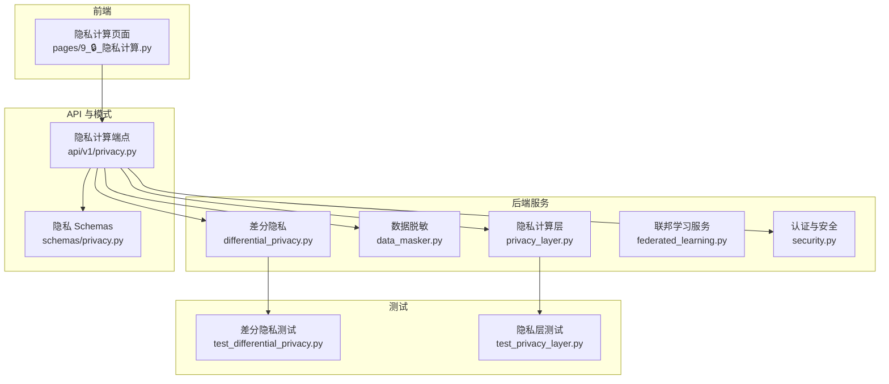
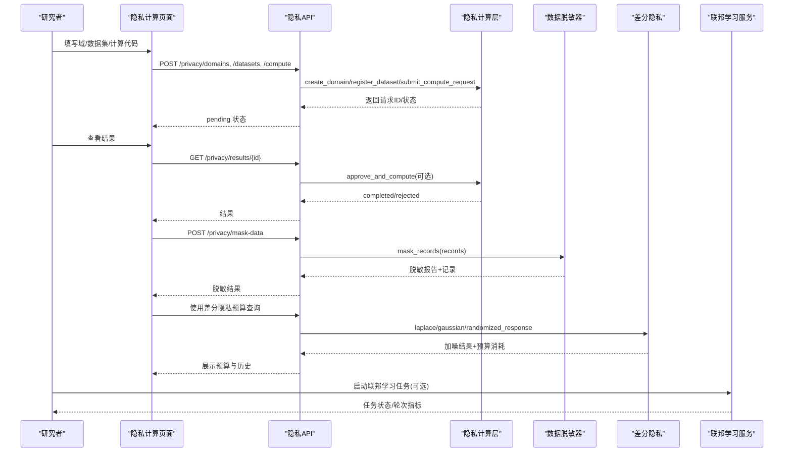
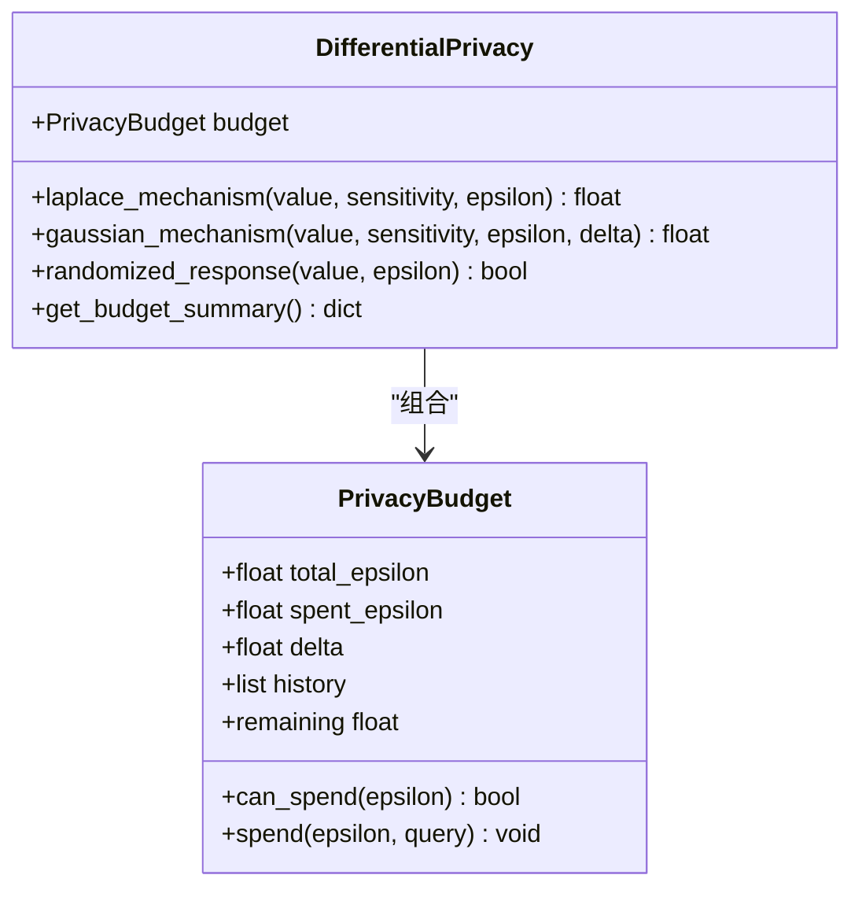
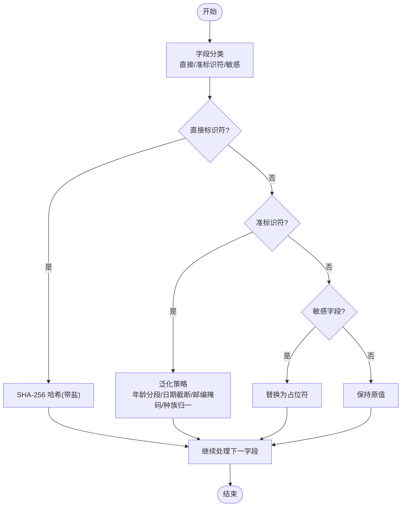
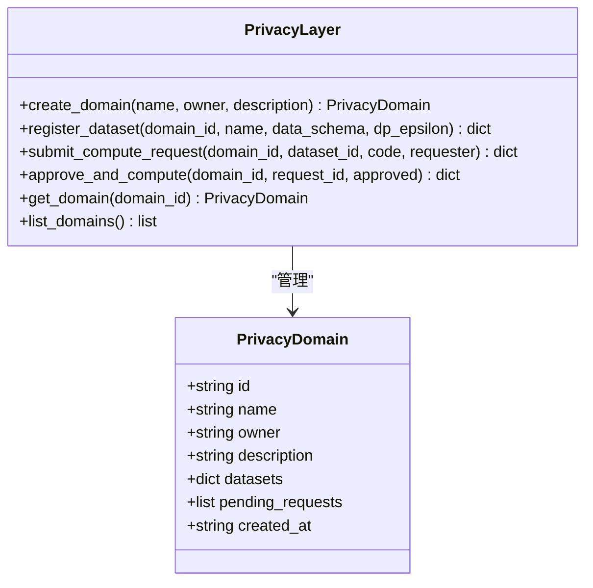
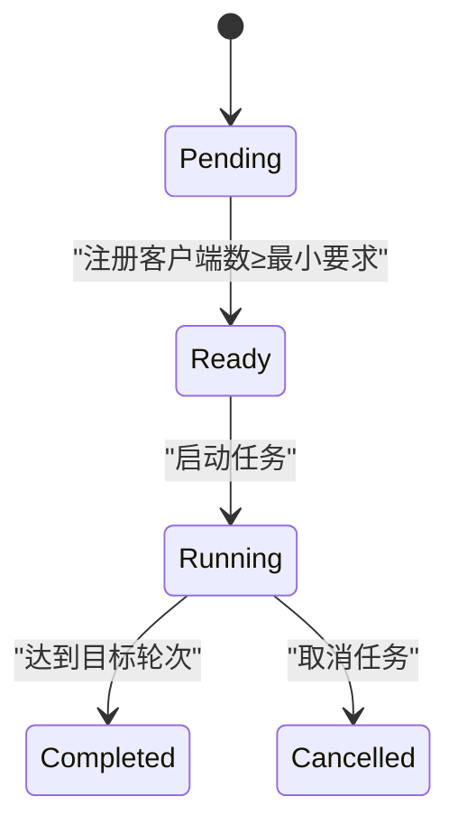
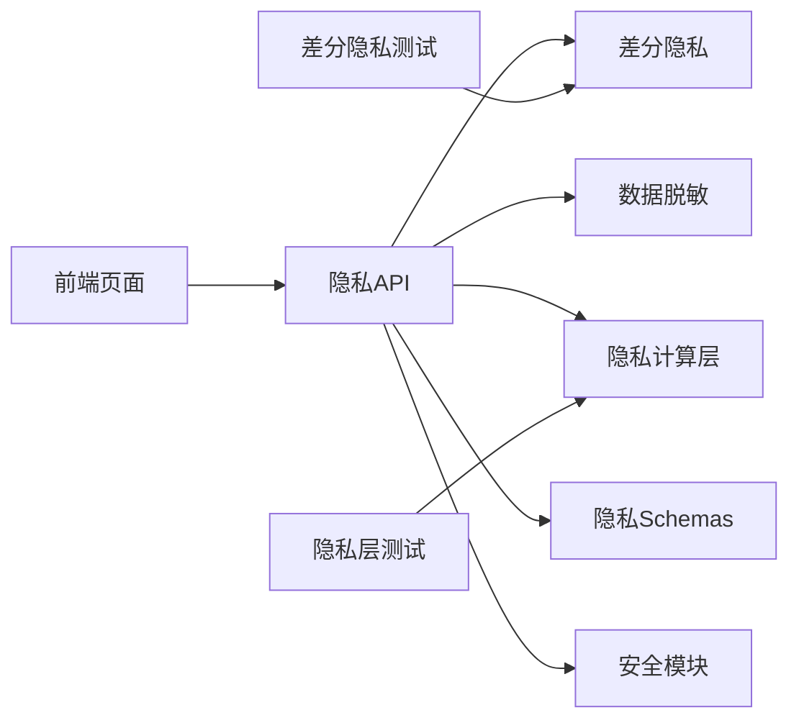

# 隐私保护计算

<cite>
**本文引用的文件列表**   
- [differential_privacy.py](file://backend/app/services/privacy/differential_privacy.py)
- [data_masker.py](file://backend/app/services/privacy/data_masker.py)
- [privacy_layer.py](file://backend/app/services/privacy/privacy_layer.py)
- [privacy.py（API）](file://backend/app/api/v1/privacy.py)
- [privacy.py（Schemas）](file://backend/app/schemas/privacy.py)
- [federated_learning.py](file://backend/app/services/optimizer/federated_learning.py)
- [security.py](file://backend/app/core/security.py)
- [9_🔒_隐私计算.py（前端页面）](file://frontend/pages/9_🔒_隐私计算.py)
- [test_differential_privacy.py](file://tests/test_differential_privacy.py)
- [test_privacy_layer.py](file://tests/test_privacy_layer.py)
</cite>

## 目录
1. [引言](#引言)
2. [项目结构](#项目结构)
3. [核心组件](#核心组件)
4. [架构总览](#架构总览)
5. [详细组件分析](#详细组件分析)
6. [依赖关系分析](#依赖关系分析)
7. [性能与可扩展性](#性能与可扩展性)
8. [故障排查指南](#故障排查指南)
9. [结论](#结论)
10. [附录：配置与合规清单](#附录：配置与合规清单)

## 引言
本模块聚焦于药物研发场景中的隐私保护计算，涵盖差分隐私算法实现、数据脱敏技术、安全多方计算原理与工程化落地。文档面向研发与合规人员，提供从架构设计、数据流保护、访问控制到参数配置、合规检查与隐私影响评估的完整实践指南，并给出在患者数据保护、临床试验数据安全与跨机构协作中的可操作方案。

## 项目结构
隐私相关能力分布在后端服务层、API 层、Schema 定义与前端交互页中，同时配套单元测试验证关键行为。

图表来源
- [privacy.py（API）:1-177](file://backend/app/api/v1/privacy.py#L1-L177)
- [privacy.py（Schemas）:1-84](file://backend/app/schemas/privacy.py#L1-L84)
- [differential_privacy.py:1-151](file://backend/app/services/privacy/differential_privacy.py#L1-L151)
- [data_masker.py:1-294](file://backend/app/services/privacy/data_masker.py#L1-L294)
- [privacy_layer.py:1-199](file://backend/app/services/privacy/privacy_layer.py#L1-L199)
- [federated_learning.py:1-199](file://backend/app/services/optimizer/federated_learning.py#L1-L199)
- [security.py:1-211](file://backend/app/core/security.py#L1-L211)
- [9_🔒_隐私计算.py（前端页面）:1-177](file://frontend/pages/9_🔒_隐私计算.py#L1-L177)
- [test_differential_privacy.py:1-126](file://tests/test_differential_privacy.py#L1-L126)
- [test_privacy_layer.py:1-145](file://tests/test_privacy_layer.py#L1-L145)

章节来源
- [privacy.py（API）:1-177](file://backend/app/api/v1/privacy.py#L1-L177)
- [privacy.py（Schemas）:1-84](file://backend/app/schemas/privacy.py#L1-L84)
- [differential_privacy.py:1-151](file://backend/app/services/privacy/differential_privacy.py#L1-L151)
- [data_masker.py:1-294](file://backend/app/services/privacy/data_masker.py#L1-L294)
- [privacy_layer.py:1-199](file://backend/app/services/privacy/privacy_layer.py#L1-L199)
- [federated_learning.py:1-199](file://backend/app/services/optimizer/federated_learning.py#L1-L199)
- [security.py:1-211](file://backend/app/core/security.py#L1-L211)
- [9_🔒_隐私计算.py（前端页面）:1-177](file://frontend/pages/9_🔒_隐私计算.py#L1-L177)
- [test_differential_privacy.py:1-126](file://tests/test_differential_privacy.py#L1-L126)
- [test_privacy_layer.py:1-145](file://tests/test_privacy_layer.py#L1-L145)

## 核心组件
- 差分隐私机制：提供预算管理与噪声注入（拉普拉斯、高斯、随机响应），支持 ε-δ 预算追踪与查询历史审计。
- 数据脱敏器：实现 HIPAA Safe Harbor 18 项标识符处理，包括直接标识符哈希、准标识符泛化、敏感值抑制，以及 k-匿名性评估。
- 隐私计算层：模拟 PySyft 域模型，支持创建域、注册数据集、提交计算请求与审批执行，确保“数据不出域”。
- 联邦学习服务：多中心协同训练任务管理（状态机、客户端注册、轮次指标聚合）。
- 安全与访问控制：基于 JWT 的认证与角色守卫，保障隐私接口受控访问。
- 前端交互：提供隐私域管理、计算请求提交与差分隐私预算监控界面。

章节来源
- [differential_privacy.py:1-151](file://backend/app/services/privacy/differential_privacy.py#L1-L151)
- [data_masker.py:1-294](file://backend/app/services/privacy/data_masker.py#L1-L294)
- [privacy_layer.py:1-199](file://backend/app/services/privacy/privacy_layer.py#L1-L199)
- [federated_learning.py:1-199](file://backend/app/services/optimizer/federated_learning.py#L1-L199)
- [security.py:1-211](file://backend/app/core/security.py#L1-L211)
- [9_🔒_隐私计算.py（前端页面）:1-177](file://frontend/pages/9_🔒_隐私计算.py#L1-L177)

## 架构总览
隐私计算整体采用“域隔离 + 预算管控 + 脱敏前置”的分层架构：
- 数据所有者在隐私域内注册数据集并设定 ε 预算；研究者提交代码型计算请求，由数据所有者审批后在域内执行。
- 输出结果经差分隐私加噪或脱敏处理后返回，避免个体信息泄露。
- 联邦学习作为跨机构协作的补充手段，在不共享原始数据的前提下进行模型参数聚合。

图表来源
- [privacy.py（API）:1-177](file://backend/app/api/v1/privacy.py#L1-L177)
- [privacy_layer.py:1-199](file://backend/app/services/privacy/privacy_layer.py#L1-L199)
- [data_masker.py:1-294](file://backend/app/services/privacy/data_masker.py#L1-L294)
- [differential_privacy.py:1-151](file://backend/app/services/privacy/differential_privacy.py#L1-L151)
- [federated_learning.py:1-199](file://backend/app/services/optimizer/federated_learning.py#L1-L199)
- [9_🔒_隐私计算.py（前端页面）:1-177](file://frontend/pages/9_🔒_隐私计算.py#L1-L177)

## 详细组件分析

### 差分隐私机制（预算与噪声）
- 预算模型：维护 total_epsilon、spent_epsilon、delta 与历史日志，提供 can_spend/spend/remaining 等能力。
- 噪声注入：
  - Laplace 机制：按敏感度与 ε 计算尺度，生成拉普拉斯噪声并消耗预算。
  - 高斯机制：引入 δ 参数，按 ε-δ 差分隐私公式计算 σ 并添加高斯噪声。
  - 随机响应：用于布尔值，以概率 p = e^ε/(1+e^ε) 保留原值，否则翻转。
- 审计：每次消耗记录 query、epsilon、剩余预算与时间戳，便于合规审计。

图表来源
- [differential_privacy.py:1-151](file://backend/app/services/privacy/differential_privacy.py#L1-L151)

章节来源
- [differential_privacy.py:1-151](file://backend/app/services/privacy/differential_privacy.py#L1-L151)
- [test_differential_privacy.py:1-126](file://tests/test_differential_privacy.py#L1-L126)

### 数据脱敏器（HIPAA 与 k-匿名）
- 标识符分类：
  - 直接标识符：姓名、身份证号、医保号、电话、邮箱、地址、IP、设备ID等，采用带盐 SHA-256 哈希。
  - 准标识符：年龄、出生日期、邮编、种族等，进行泛化处理（年龄分段、日期截断、邮编前缀掩码、种族归一化）。
  - 敏感字段：诊断、ICD 编码、基因结果等，统一替换为占位符。
- k-匿名评估：按准标识符组合分组统计最小同质组大小，若小于阈值则标记违规并告警。
- 报告：汇总处理记录数、字段数、各类处理计数、k-匿名满足情况与违规明细。

图表来源
- [data_masker.py:1-294](file://backend/app/services/privacy/data_masker.py#L1-L294)

章节来源
- [data_masker.py:1-294](file://backend/app/services/privacy/data_masker.py#L1-L294)

### 隐私计算层（域与审批）
- 域模型：每个域包含数据集字典与待审批计算请求队列，记录创建时间与所有者。
- 数据集注册：声明 schema 与差分隐私 ε 预算，支持 mock 数据预览。
- 计算流程：研究者提交代码型请求 → 进入 pending → 数据所有者审批 → 完成或拒绝。
- 内存存储：当前为内存态，生产环境应替换为持久化与真实 PySyft 域集成。

图表来源
- [privacy_layer.py:1-199](file://backend/app/services/privacy/privacy_layer.py#L1-L199)

章节来源
- [privacy_layer.py:1-199](file://backend/app/services/privacy/privacy_layer.py#L1-L199)
- [test_privacy_layer.py:1-145](file://tests/test_privacy_layer.py#L1-L145)

### 联邦学习服务（跨机构协作）
- 任务生命周期：pending → ready（达到最少客户端）→ running → completed/cancelled。
- 客户端注册：累计已注册客户端数量，达到阈值自动就绪。
- 轮次指标：记录每轮 metrics 与时间戳，便于进度跟踪与收敛判断。

图表来源
- [federated_learning.py:1-199](file://backend/app/services/optimizer/federated_learning.py#L1-L199)

章节来源
- [federated_learning.py:1-199](file://backend/app/services/optimizer/federated_learning.py#L1-L199)

### 安全与访问控制
- 密码安全：bcrypt 哈希与校验，恒定时间比较防时序攻击。
- JWT 令牌：access/refresh token 生成与解析，过期与签名校验。
- 角色守卫：基于角色的访问控制，未授权时抛出异常。

章节来源
- [security.py:1-211](file://backend/app/core/security.py#L1-L211)

### 前端交互（隐私计算页面）
- 隐私域管理：创建域、列出域、注册数据集（含 schema 与 ε 预算滑块）。
- 计算请求：提交代码型计算请求，查看 pending/completed/rejected 状态。
- 差分隐私预算监控：展示总预算、已消耗、剩余与使用率，以及历史记录。

章节来源
- [9_🔒_隐私计算.py（前端页面）:1-177](file://frontend/pages/9_🔒_隐私计算.py#L1-L177)

## 依赖关系分析
- API 层依赖服务层与 Schema 层，服务层之间通过函数调用组合，无循环依赖。
- 前端通过 HTTP 调用 API，不直接依赖服务实现。
- 测试覆盖差分隐私与隐私层的关键路径，保证预算与审批逻辑正确性。

图表来源
- [privacy.py（API）:1-177](file://backend/app/api/v1/privacy.py#L1-L177)
- [privacy.py（Schemas）:1-84](file://backend/app/schemas/privacy.py#L1-L84)
- [differential_privacy.py:1-151](file://backend/app/services/privacy/differential_privacy.py#L1-L151)
- [data_masker.py:1-294](file://backend/app/services/privacy/data_masker.py#L1-L294)
- [privacy_layer.py:1-199](file://backend/app/services/privacy/privacy_layer.py#L1-L199)
- [security.py:1-211](file://backend/app/core/security.py#L1-L211)
- [9_🔒_隐私计算.py（前端页面）:1-177](file://frontend/pages/9_🔒_隐私计算.py#L1-L177)
- [test_differential_privacy.py:1-126](file://tests/test_differential_privacy.py#L1-L126)
- [test_privacy_layer.py:1-145](file://tests/test_privacy_layer.py#L1-L145)

章节来源
- [privacy.py（API）:1-177](file://backend/app/api/v1/privacy.py#L1-L177)
- [privacy.py（Schemas）:1-84](file://backend/app/schemas/privacy.py#L1-L84)
- [differential_privacy.py:1-151](file://backend/app/services/privacy/differential_privacy.py#L1-L151)
- [data_masker.py:1-294](file://backend/app/services/privacy/data_masker.py#L1-L294)
- [privacy_layer.py:1-199](file://backend/app/services/privacy/privacy_layer.py#L1-L199)
- [security.py:1-211](file://backend/app/core/security.py#L1-L211)
- [9_🔒_隐私计算.py（前端页面）:1-177](file://frontend/pages/9_🔒_隐私计算.py#L1-L177)
- [test_differential_privacy.py:1-126](file://tests/test_differential_privacy.py#L1-L126)
- [test_privacy_layer.py:1-145](file://tests/test_privacy_layer.py#L1-L145)

## 性能与可扩展性
- 预算检查与噪声注入为 O(1) 操作，批量脱敏为 O(N×M)（N 条记录，M 个字段），k-匿名评估为 O(N×K)（K 为准标识符维度）。
- 建议：
  - 对大规模记录启用并行批处理与流式写入。
  - 将内存存储替换为数据库与消息队列，提升并发与持久化能力。
  - 在高吞吐场景下缓存常用泛化映射与哈希表，减少重复计算。
  - 差分隐私预算可分域/分数据集分配，结合配额与限流策略。

[本节为通用指导，无需具体文件引用]

## 故障排查指南
- 预算不足：当 ε 请求超过剩余预算时，差分隐私会抛出异常；API 层也会校验域级预算并返回错误详情。
  - 参考路径：[differential_privacy.py:79-89](file://backend/app/services/privacy/differential_privacy.py#L79-L89)、[privacy.py（API）:105-117](file://backend/app/api/v1/privacy.py#L105-L117)
- 隐私域/数据集不存在：API 层返回未找到错误，需确认 ID 是否正确。
  - 参考路径：[privacy.py（API）:77-78](file://backend/app/api/v1/privacy.py#L77-L78)、[privacy_layer.py:109-111](file://backend/app/services/privacy/privacy_layer.py#L109-L111)
- k-匿名未满足：脱敏报告包含违规明细与最小同质组大小，需调整泛化粒度或增加样本量。
  - 参考路径：[data_masker.py:257-289](file://backend/app/services/privacy/data_masker.py#L257-L289)
- 权限问题：JWT 缺失或类型错误将触发未授权异常；角色不足将触发禁止访问异常。
  - 参考路径：[security.py:169-174](file://backend/app/core/security.py#L169-L174)、[security.py:202-208](file://backend/app/core/security.py#L202-L208)

章节来源
- [differential_privacy.py:79-89](file://backend/app/services/privacy/differential_privacy.py#L79-L89)
- [privacy.py（API）:77-117](file://backend/app/api/v1/privacy.py#L77-L117)
- [privacy_layer.py:109-111](file://backend/app/services/privacy/privacy_layer.py#L109-L111)
- [data_masker.py:257-289](file://backend/app/services/privacy/data_masker.py#L257-L289)
- [security.py:169-208](file://backend/app/core/security.py#L169-L208)

## 结论
本隐私保护计算模块以“域隔离 + 预算管控 + 脱敏前置”为核心，结合差分隐私与 HIPAA 脱敏规范，为药物研发中的患者数据与临床试验数据提供了可审计、可配置、可扩展的隐私保障方案。配合联邦学习可实现跨机构协作而不暴露原始数据，满足合规与科研需求。

[本节为总结性内容，无需具体文件引用]

## 附录：配置与合规清单

### 隐私参数配置指南
- 差分隐私
  - ε（epsilon）：控制隐私强度与精度权衡，越小越隐私但噪声越大。
  - δ（delta）：高斯机制下的失败概率上限，通常取 1e-5 至 1e-7。
  - 敏感度（sensitivity）：根据查询函数的最大变化范围设置，直接影响噪声尺度。
  - 预算分配：按数据集或任务划分预算，避免单任务耗尽全局预算。
  - 参考路径：[differential_privacy.py:54-61](file://backend/app/services/privacy/differential_privacy.py#L54-L61)、[privacy.py（Schemas）:20-24](file://backend/app/schemas/privacy.py#L20-L24)
- 数据脱敏
  - 盐值（salt）：防止彩虹表攻击，建议定期轮换。
  - 年龄分段边界：依据业务分布调整，避免过细导致 k-匿名不满足。
  - 邮编前缀长度：保留位数越多，去标识化程度越低。
  - 日期粒度：year/month/day 三档，默认 month。
  - k-匿名阈值：默认 5，可根据数据规模与风险容忍度调整。
  - 参考路径：[data_masker.py:81-99](file://backend/app/services/privacy/data_masker.py#L81-L99)

### 合规性检查工具
- 脱敏报告：统计直接标识符、准标识符、敏感字段的处理数量与 k-匿名满足情况。
- 预算审计：导出差分隐私消耗历史，包含查询描述、epsilon、剩余预算与时间戳。
- 参考路径：[data_masker.py:101-124](file://backend/app/services/privacy/data_masker.py#L101-L124)、[differential_privacy.py:142-150](file://backend/app/services/privacy/differential_privacy.py#L142-L150)

### 隐私影响评估方法（PIA）
- 数据识别：梳理直接标识符、准标识符与敏感字段，建立字段清单与风险等级。
- 威胁建模：识别再识别风险、侧信道泄露与模型反演风险。
- 控制措施：脱敏策略、差分隐私预算、访问控制与审计日志。
- 量化评估：k-匿名最小组大小、ε 预算使用率、噪声方差与效用损失。
- 持续改进：定期复评与参数调优，形成闭环治理。

[本节为方法论说明，无需具体文件引用]

### 药物研发场景实践要点
- 患者数据保护
  - 脱敏前置：所有对外共享的数据必须经过脱敏与 k-匿名评估。
  - 差分隐私：对统计分析与可视化结果施加 ε-δ 约束，限制累积泄露。
  - 参考路径：[data_masker.py:1-294](file://backend/app/services/privacy/data_masker.py#L1-L294)、[differential_privacy.py:1-151](file://backend/app/services/privacy/differential_privacy.py#L1-L151)
- 临床试验数据安全
  - 域隔离：试验数据归属特定域，仅允许审批后的计算在域内执行。
  - 预算管控：为不同试验阶段分配独立 ε 预算，避免跨阶段泄露。
  - 参考路径：[privacy_layer.py:1-199](file://backend/app/services/privacy/privacy_layer.py#L1-L199)、[privacy.py（API）:1-177](file://backend/app/api/v1/privacy.py#L1-L177)
- 跨机构数据协作
  - 联邦学习：在多中心间进行模型参数聚合，不共享原始数据。
  - 隐私增强：在聚合过程中加入差分隐私噪声，降低成员推断风险。
  - 参考路径：[federated_learning.py:1-199](file://backend/app/services/optimizer/federated_learning.py#L1-L199)、[differential_privacy.py:92-116](file://backend/app/services/privacy/differential_privacy.py#L92-L116)