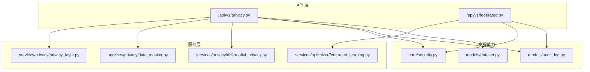
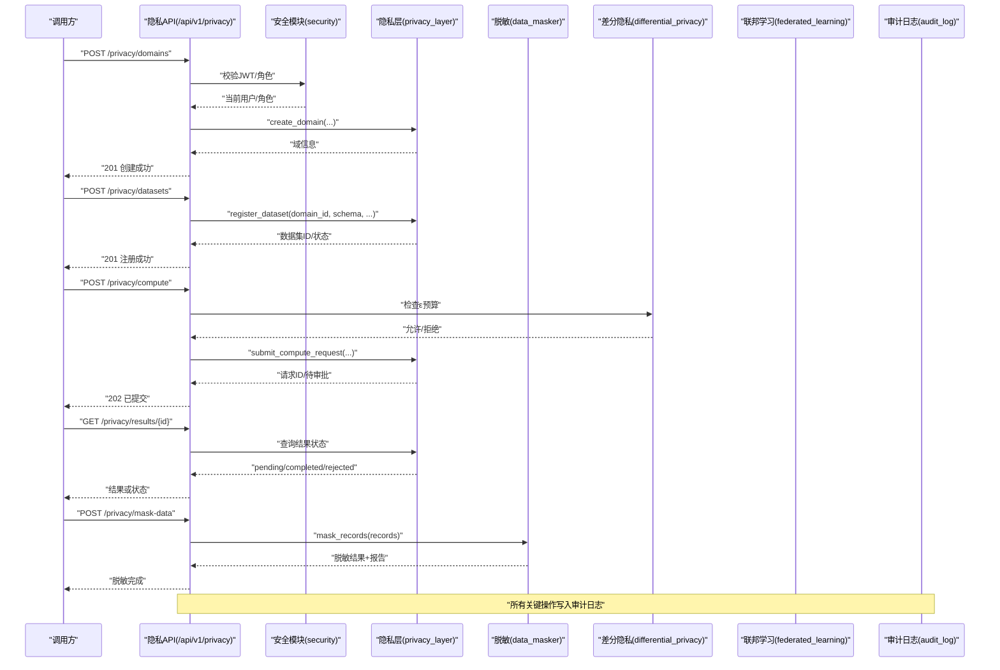
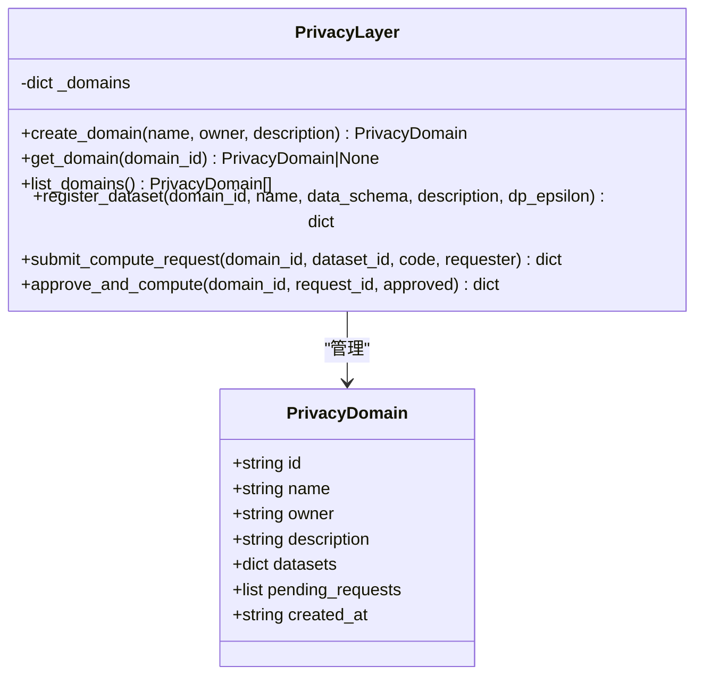
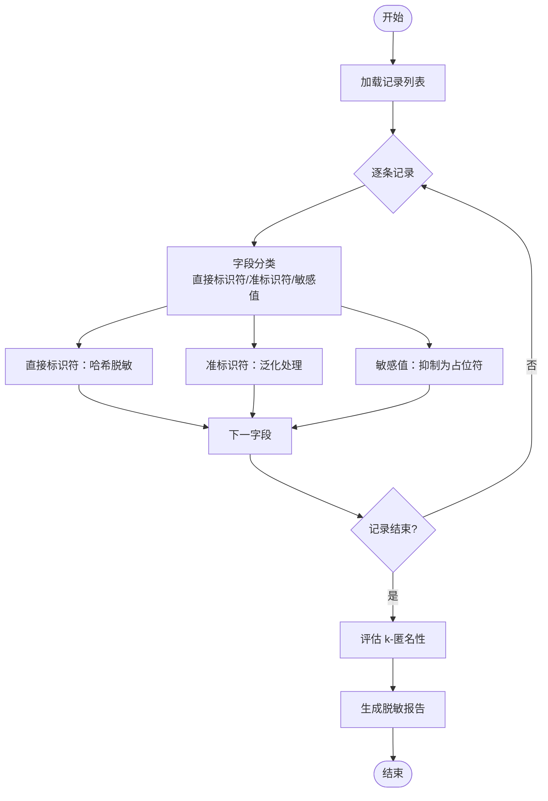
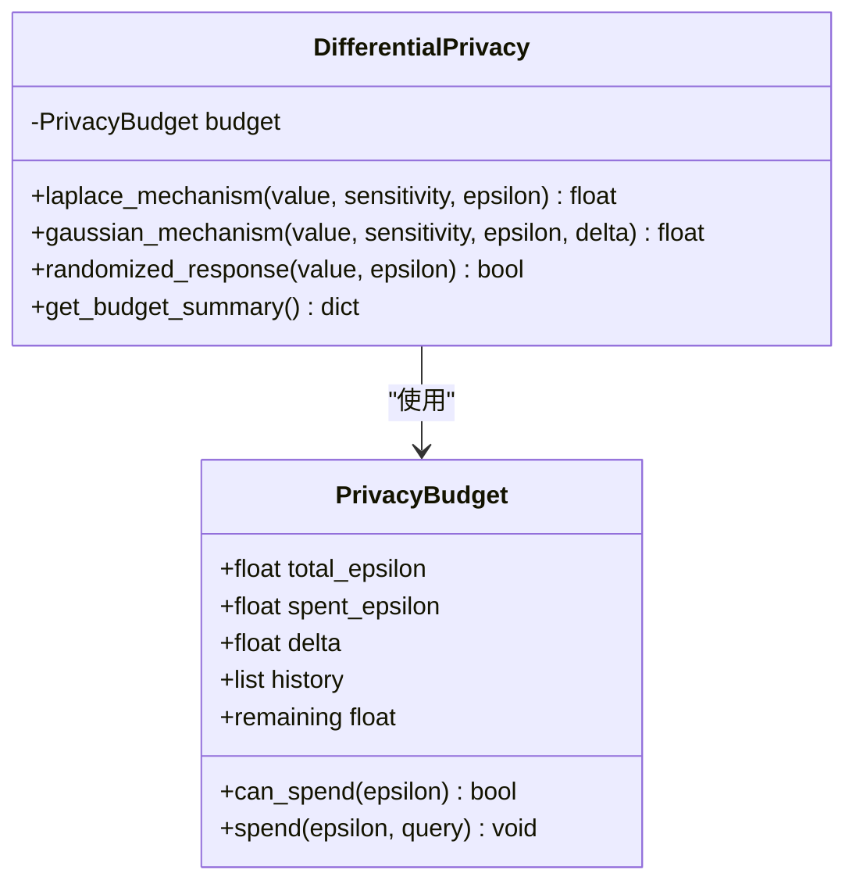
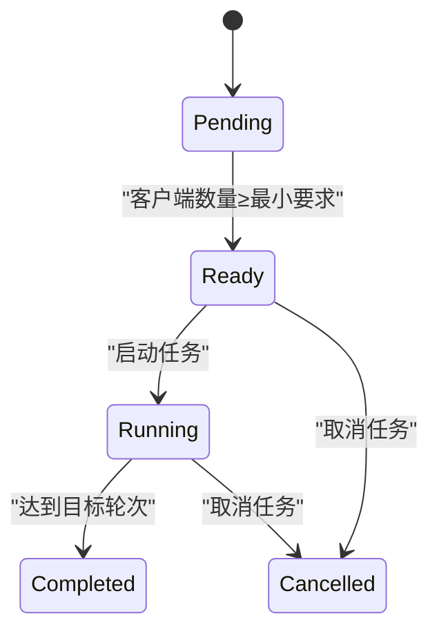
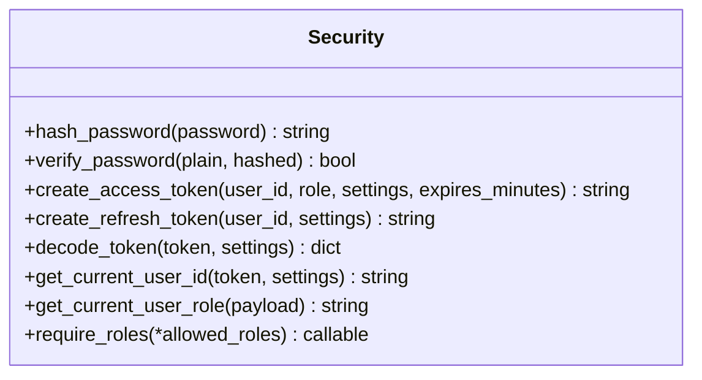
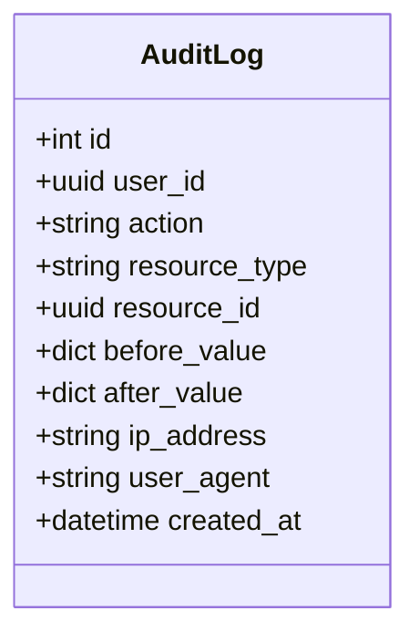
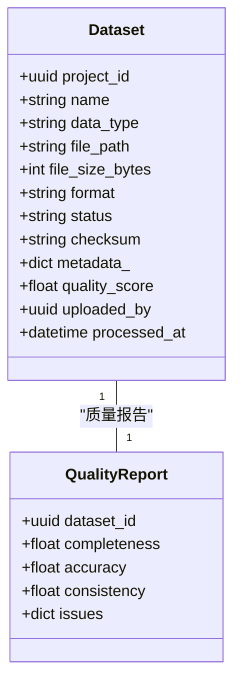
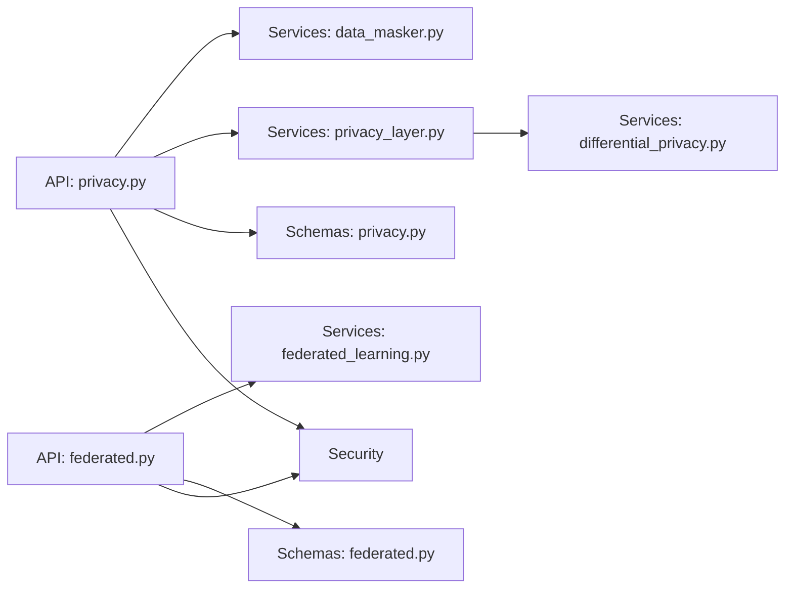

# 隐私层架构

<cite>
**本文引用的文件**   
- [privacy_layer.py](file://backend/app/services/privacy/privacy_layer.py)
- [privacy.py](file://backend/app/api/v1/privacy.py)
- [privacy.py](file://backend/app/schemas/privacy.py)
- [data_masker.py](file://backend/app/services/privacy/data_masker.py)
- [differential_privacy.py](file://backend/app/services/privacy/differential_privacy.py)
- [federated_learning.py](file://backend/app/services/optimizer/federated_learning.py)
- [federated.py](file://backend/app/api/v1/federated.py)
- [security.py](file://backend/app/core/security.py)
- [audit_log.py](file://backend/app/models/audit_log.py)
- [dataset.py](file://backend/app/models/dataset.py)
</cite>

## 目录
1. [引言](#引言)
2. [项目结构](#项目结构)
3. [核心组件](#核心组件)
4. [架构总览](#架构总览)
5. [详细组件分析](#详细组件分析)
6. [依赖关系分析](#依赖关系分析)
7. [性能考虑](#性能考虑)
8. [故障排查指南](#故障排查指南)
9. [结论](#结论)
10. [附录](#附录)

## 引言
本设计文档面向“隐私层”子系统，聚焦于在联邦学习、多机构协作场景下的数据与计算隐私保护。文档覆盖以下关键主题：
- 整体架构与组件交互模式
- 数据流保护机制（脱敏、差分隐私预算）
- 隐私域管理、数据集注册、计算请求审批与执行流程
- 访问控制策略与权限验证
- 审计日志记录
- 隐私层 API 接口规范
- 错误处理机制与性能优化策略
- 分布式部署方案（跨域数据共享、安全多方计算集成）

## 项目结构
隐私层相关代码主要分布在后端服务的三个层次：
- API 层：FastAPI 路由定义对外暴露的 REST 接口
- 服务层：隐私计算、脱敏、差分隐私、联邦学习等核心逻辑
- 模型与配置：用户认证、审计日志、数据集模型等支撑能力

图表来源
- [privacy.py:1-177](file://backend/app/api/v1/privacy.py#L1-L177)
- [federated.py:1-133](file://backend/app/api/v1/federated.py#L1-L133)
- [privacy_layer.py:1-199](file://backend/app/services/privacy/privacy_layer.py#L1-L199)
- [data_masker.py:1-294](file://backend/app/services/privacy/data_masker.py#L1-L294)
- [differential_privacy.py:1-151](file://backend/app/services/privacy/differential_privacy.py#L1-L151)
- [federated_learning.py:1-199](file://backend/app/services/optimizer/federated_learning.py#L1-L199)
- [security.py:1-211](file://backend/app/core/security.py#L1-L211)
- [audit_log.py:1-45](file://backend/app/models/audit_log.py#L1-L45)
- [dataset.py:1-70](file://backend/app/models/dataset.py#L1-L70)

章节来源
- [privacy.py:1-177](file://backend/app/api/v1/privacy.py#L1-L177)
- [privacy_layer.py:1-199](file://backend/app/services/privacy/privacy_layer.py#L1-L199)
- [data_masker.py:1-294](file://backend/app/services/privacy/data_masker.py#L1-L294)
- [differential_privacy.py:1-151](file://backend/app/services/privacy/differential_privacy.py#L1-L151)
- [federated.py:1-133](file://backend/app/api/v1/federated.py#L1-L133)
- [federated_learning.py:1-199](file://backend/app/services/optimizer/federated_learning.py#L1-L199)
- [security.py:1-211](file://backend/app/core/security.py#L1-L211)
- [audit_log.py:1-45](file://backend/app/models/audit_log.py#L1-L45)
- [dataset.py:1-70](file://backend/app/models/dataset.py#L1-L70)

## 核心组件
- 隐私计算层（PrivacyLayer）
  - 提供隐私域创建、数据集注册、计算请求提交与审批执行等内存态能力，模拟 PySyft Domain 行为，确保数据不出域、所有者保留控制权。
- 数据脱敏器（DataMasker）
  - 实现 HIPAA Safe Harbor 18 项标识符处理：直接标识符哈希、准标识符泛化、敏感值抑制，并评估 k-匿名性。
- 差分隐私（DifferentialPrivacy）
  - 提供 Laplace/Gaussian/随机响应机制，维护 ε 预算与使用历史，支持预算校验与消耗记录。
- 联邦学习服务（FederatedLearningService）
  - 管理联邦任务生命周期：创建、客户端注册、启动、轮次指标更新、取消等。
- 安全与鉴权（Security）
  - JWT access/refresh token 生成与解析、角色守卫、当前用户提取。
- 审计日志（AuditLog）
  - 不可篡改的 append-only 审计记录，包含操作主体、资源、时间戳、IP 等。
- 数据集模型（Dataset）
  - 描述上传的多组学数据集元数据与质量报告关联。

章节来源
- [privacy_layer.py:1-199](file://backend/app/services/privacy/privacy_layer.py#L1-L199)
- [data_masker.py:1-294](file://backend/app/services/privacy/data_masker.py#L1-L294)
- [differential_privacy.py:1-151](file://backend/app/services/privacy/differential_privacy.py#L1-L151)
- [federated_learning.py:1-199](file://backend/app/services/optimizer/federated_learning.py#L1-L199)
- [security.py:1-211](file://backend/app/core/security.py#L1-L211)
- [audit_log.py:1-45](file://backend/app/models/audit_log.py#L1-L45)
- [dataset.py:1-70](file://backend/app/models/dataset.py#L1-L70)

## 架构总览
隐私层采用“API 网关 + 领域服务 + 隐私原语”的分层架构。API 层负责鉴权、参数校验与结果封装；服务层实现隐私域、脱敏、差分隐私与联邦学习；底层通过审计日志与安全模块保障可追溯性与访问控制。

图表来源
- [privacy.py:1-177](file://backend/app/api/v1/privacy.py#L1-L177)
- [privacy_layer.py:1-199](file://backend/app/services/privacy/privacy_layer.py#L1-L199)
- [differential_privacy.py:1-151](file://backend/app/services/privacy/differential_privacy.py#L1-L151)
- [data_masker.py:1-294](file://backend/app/services/privacy/data_masker.py#L1-L294)
- [federated.py:1-133](file://backend/app/api/v1/federated.py#L1-L133)
- [federated_learning.py:1-199](file://backend/app/services/optimizer/federated_learning.py#L1-L199)
- [security.py:1-211](file://backend/app/core/security.py#L1-L211)
- [audit_log.py:1-45](file://backend/app/models/audit_log.py#L1-L45)

## 详细组件分析

### 隐私计算层（PrivacyLayer）
- 职责
  - 管理隐私域（创建、查询、列表）
  - 注册数据集（含 schema、差分隐私 ε 预算）
  - 提交计算请求（代码沙箱占位，等待所有者审批）
  - 审批并执行计算（简化为状态变更与占位结果）
- 数据结构
  - PrivacyDomain：域 ID、名称、所有者、描述、数据集集合、待审批请求列表、创建时间
  - 内存存储：_domains 字典
- 复杂度
  - 创建/获取/列表：O(1)/O(1)/O(n)
  - 注册数据集：O(1)
  - 提交请求：O(1)
  - 审批执行：O(m) 遍历 pending_requests 查找匹配请求
- 错误处理
  - 域不存在、数据集不存在、请求不存在时返回错误信息
- 扩展点
  - 替换内存存储为数据库持久化
  - 接入真实 PySyft 域执行引擎

图表来源
- [privacy_layer.py:1-199](file://backend/app/services/privacy/privacy_layer.py#L1-L199)

章节来源
- [privacy_layer.py:1-199](file://backend/app/services/privacy/privacy_layer.py#L1-L199)

### 数据脱敏器（DataMasker）
- 职责
  - 直接标识符：SHA-256 哈希脱敏（带盐）
  - 准标识符：年龄分段、邮编截断、日期精度控制
  - 敏感值：替换为占位符
  - k-匿名性评估：按准标识符组合分组统计最小同质组大小
- 配置与报告
  - MaskingConfig：盐值、年龄桶、邮编前缀长度、日期粒度、k 值、占位符
  - MaskingReport：处理统计、违规项、是否满足 k-匿名
- 算法流程
  - 逐字段分类处理 → 汇总统计 → 评估 k-匿名 → 输出报告

图表来源
- [data_masker.py:1-294](file://backend/app/services/privacy/data_masker.py#L1-L294)

章节来源
- [data_masker.py:1-294](file://backend/app/services/privacy/data_masker.py#L1-L294)

### 差分隐私（DifferentialPrivacy）
- 职责
  - 维护 ε 预算与 δ 参数
  - 提供 Laplace/Gaussian/随机响应加噪机制
  - 预算校验与消耗记录
- 复杂度
  - 预算检查与消耗：O(1)
  - 噪声生成：O(1)
- 错误处理
  - 预算不足时抛出运行时异常

图表来源
- [differential_privacy.py:1-151](file://backend/app/services/privacy/differential_privacy.py#L1-L151)

章节来源
- [differential_privacy.py:1-151](file://backend/app/services/privacy/differential_privacy.py#L1-L151)

### 联邦学习服务（FederatedLearningService）
- 职责
  - 创建联邦学习任务（目标靶点、轮数、最少客户端）
  - 客户端注册与就绪判定
  - 启动训练、轮次指标更新、取消任务
- 状态机
  - pending → ready（客户端足够）→ running → completed/cancelled

图表来源
- [federated_learning.py:1-199](file://backend/app/services/optimizer/federated_learning.py#L1-L199)

章节来源
- [federated_learning.py:1-199](file://backend/app/services/optimizer/federated_learning.py#L1-L199)

### 安全与鉴权（Security）
- 职责
  - bcrypt 密码哈希与校验
  - JWT access/refresh token 生成与解析
  - FastAPI 依赖注入：当前用户 ID/角色提取、角色守卫
- 关键点
  - 恒定时间比较抵抗时序攻击
  - 未携带或无效 token 抛出未授权错误
  - 角色不足抛出禁止访问错误

图表来源
- [security.py:1-211](file://backend/app/core/security.py#L1-L211)

章节来源
- [security.py:1-211](file://backend/app/core/security.py#L1-L211)

### 审计日志（AuditLog）
- 职责
  - 记录不可篡改的操作日志（append-only）
  - 包含用户、动作、资源类型/ID、前后值、IP、User-Agent、时间戳
- 索引与查询
  - 基于 action 与 created_at 的复合索引，便于按时间与动作范围扫描

图表来源
- [audit_log.py:1-45](file://backend/app/models/audit_log.py#L1-L45)

章节来源
- [audit_log.py:1-45](file://backend/app/models/audit_log.py#L1-L45)

### 数据集模型（Dataset）
- 职责
  - 描述上传的多组学数据集元数据（类型、路径、大小、格式、状态、校验和、质量评分）
  - 与质量报告一对一关联
- 状态与类型
  - 状态：uploaded/processing/ready/failed
  - 类型：rna_seq/scrna/vcf/fasta/wes/wgs/ihc/proteomics/metabolomics

图表来源
- [dataset.py:1-70](file://backend/app/models/dataset.py#L1-L70)

章节来源
- [dataset.py:1-70](file://backend/app/models/dataset.py#L1-L70)

## 依赖关系分析
- API 层依赖
  - privacy.py 依赖 security、schemas、privacy_layer、data_masker
  - federated.py 依赖 security、schemas、federated_learning
- 服务层依赖
  - privacy_layer 无外部强依赖（内存态）
  - data_masker 无外部强依赖（纯函数式处理）
  - differential_privacy 无外部强依赖（数学与随机）
  - federated_learning 无外部强依赖（内存态）
- 支撑能力依赖
  - security 依赖配置与异常
  - audit_log 与 dataset 为 ORM 模型，供上层持久化

图表来源
- [privacy.py:1-177](file://backend/app/api/v1/privacy.py#L1-L177)
- [federated.py:1-133](file://backend/app/api/v1/federated.py#L1-L133)
- [privacy_layer.py:1-199](file://backend/app/services/privacy/privacy_layer.py#L1-L199)
- [data_masker.py:1-294](file://backend/app/services/privacy/data_masker.py#L1-L294)
- [differential_privacy.py:1-151](file://backend/app/services/privacy/differential_privacy.py#L1-L151)
- [federated_learning.py:1-199](file://backend/app/services/optimizer/federated_learning.py#L1-L199)
- [security.py:1-211](file://backend/app/core/security.py#L1-L211)

章节来源
- [privacy.py:1-177](file://backend/app/api/v1/privacy.py#L1-L177)
- [federated.py:1-133](file://backend/app/api/v1/federated.py#L1-L133)
- [privacy_layer.py:1-199](file://backend/app/services/privacy/privacy_layer.py#L1-L199)
- [data_masker.py:1-294](file://backend/app/services/privacy/data_masker.py#L1-L294)
- [differential_privacy.py:1-151](file://backend/app/services/privacy/differential_privacy.py#L1-L151)
- [federated_learning.py:1-199](file://backend/app/services/optimizer/federated_learning.py#L1-L199)
- [security.py:1-211](file://backend/app/core/security.py#L1-L211)

## 性能考虑
- 内存态存储
  - 当前隐私层与联邦学习服务使用内存字典，适合演示与测试；生产环境需替换为数据库与消息队列以支持高并发与持久化。
- 差分隐私预算
  - 预算检查与消耗为 O(1)，建议在高吞吐场景下引入缓存与批量记账以减少锁竞争。
- 脱敏处理
  - 批量脱敏为 O(n×m)（n 条记录，m 个字段），可通过并行化与向量化提升性能；k-匿名评估可按分片进行。
- 联邦学习
  - 客户端注册与轮次更新为 O(1)，但实际聚合与通信开销取决于 Flower 服务端与网络拓扑；建议引入异步任务与指标落库。
- 审计日志
  - 追加写入应使用批处理与异步落库，避免阻塞主流程。

[本节为通用指导，不直接分析具体文件]

## 故障排查指南
- 常见错误
  - 未携带或无效 JWT：检查 Authorization header 与 token 有效期
  - 权限不足：确认用户角色是否符合 require_roles 限制
  - 隐私域/数据集/请求不存在：核对 ID 与生命周期状态
  - 差分隐私预算不足：调整 budget_epsilon 或降低本次 ε 请求
  - k-匿名未满足：增大 k 值或增加样本量/泛化粒度
- 定位方法
  - 查看审计日志（action、resource_id、created_at）
  - 检查隐私层状态（pending/completed/rejected）
  - 审查脱敏报告中的 violations 与 min_group_size
  - 查看联邦学习任务状态与轮次指标

章节来源
- [security.py:1-211](file://backend/app/core/security.py#L1-L211)
- [privacy.py:1-177](file://backend/app/api/v1/privacy.py#L1-L177)
- [privacy_layer.py:1-199](file://backend/app/services/privacy/privacy_layer.py#L1-L199)
- [differential_privacy.py:1-151](file://backend/app/services/privacy/differential_privacy.py#L1-L151)
- [data_masker.py:1-294](file://backend/app/services/privacy/data_masker.py#L1-L294)
- [federated.py:1-133](file://backend/app/api/v1/federated.py#L1-L133)
- [federated_learning.py:1-199](file://backend/app/services/optimizer/federated_learning.py#L1-L199)
- [audit_log.py:1-45](file://backend/app/models/audit_log.py#L1-L45)

## 结论
隐私层通过“隐私域 + 脱敏 + 差分隐私 + 联邦学习”的组合，实现了数据不出域、可审计、可控制的协作计算。当前实现以内存态为主，便于快速验证；生产部署需引入持久化、异步任务与更完善的执行沙箱。结合严格的鉴权与审计，可在多机构协作中有效平衡可用性与隐私性。

[本节为总结，不直接分析具体文件]

## 附录

### 隐私层 API 接口规范
- POST /api/v1/privacy/domains
  - 功能：创建隐私域
  - 鉴权：需要有效 JWT 与适当角色
  - 请求体：PrivacyDomainCreate（name、description、owner_id、budget_epsilon）
  - 响应：ApiResponse[PrivacyDomainResponse]
- POST /api/v1/privacy/datasets
  - 功能：注册数据集到隐私域（含 mock_data 预览）
  - 鉴权：需要有效 JWT 与适当角色
  - 请求体：PrivacyDatasetRegister（domain_id、name、schema、mock_data、real_data_ref）
  - 响应：ApiResponse[PrivacyDatasetResponse]
- POST /api/v1/privacy/compute
  - 功能：提交远程计算请求（受 ε 预算约束）
  - 鉴权：需要有效 JWT 与适当角色
  - 请求体：ComputeRequest（domain_id、dataset_name、code、epsilon）
  - 响应：ApiResponse[ComputeResultResponse]（状态：pending）
- GET /api/v1/privacy/results/{request_id}
  - 功能：获取计算结果或状态
  - 鉴权：需要有效 JWT 与适当角色
  - 响应：ApiResponse[ComputeResultResponse]
- POST /api/v1/privacy/mask-data
  - 功能：数据脱敏（HIPAA Safe Harbor）
  - 鉴权：需要有效 JWT 与适当角色
  - 请求体：DataMaskingRequest（records、k_anonymity）
  - 响应：ApiResponse[DataMaskingResponse]

章节来源
- [privacy.py:1-177](file://backend/app/api/v1/privacy.py#L1-L177)
- [privacy.py:1-84](file://backend/app/schemas/privacy.py#L1-L84)

### 联邦学习 API 接口规范
- POST /api/v1/federated/jobs
  - 功能：创建联邦学习任务
  - 鉴权：需要有效 JWT 与适当角色
  - 请求体：FederatedJobCreate（name、model_arch、num_rounds、min_clients、config）
  - 响应：ApiResponse[FederatedJobResponse]
- GET /api/v1/federated/jobs
  - 功能：列出任务（支持按状态过滤）
  - 鉴权：需要有效 JWT 与适当角色
  - 响应：ApiResponse[list[FederatedJobResponse]]
- GET /api/v1/federated/jobs/{job_id}
  - 功能：获取任务详情
  - 鉴权：需要有效 JWT 与适当角色
  - 响应：ApiResponse[FederatedJobResponse]
- POST /api/v1/federated/jobs/{job_id}/stop
  - 功能：停止任务
  - 鉴权：需要有效 JWT 与适当角色
  - 响应：ApiResponse[FederatedJobResponse]
- POST /api/v1/federated/clients/register
  - 功能：注册客户端（医院/机构）
  - 鉴权：需要有效 JWT 与适当角色
  - 请求体：ClientRegisterRequest（job_id）
  - 响应：ApiResponse[ClientRegisterResponse]

章节来源
- [federated.py:1-133](file://backend/app/api/v1/federated.py#L1-L133)

### 部署方案（联邦学习与多机构协作）
- 分布式隐私计算
  - 各机构部署本地隐私域节点（PySyft Domain），仅交换加密后的模型或中间结果
  - 中心协调节点负责任务编排、预算管理与审计
- 跨域数据共享
  - 数据留在本地，通过脱敏与差分隐私技术对外提供可分析的摘要或加噪结果
  - 使用 k-匿名与泛化策略降低重识别风险
- 安全多方计算（MPC）集成
  - 在隐私层之上引入 MPC 协议（如秘密分享），对敏感计算进行多方参与与验证
  - 将 MPC 作为隐私层的执行后端，由隐私层统一调度与审计

[本节为概念性说明，不直接分析具体文件]