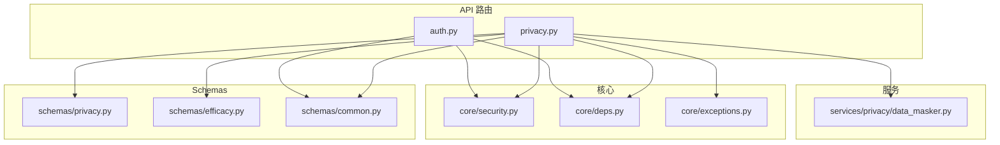
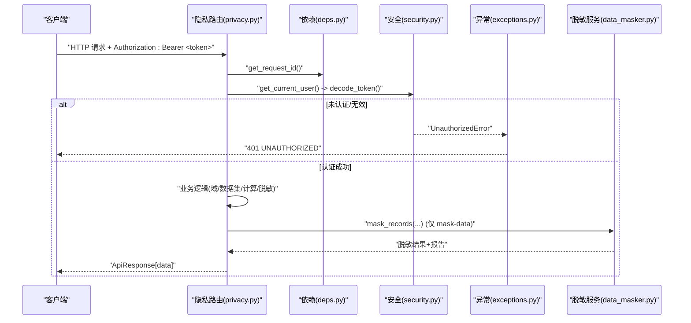
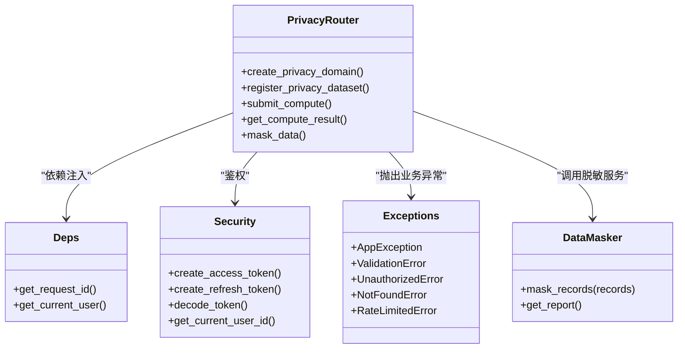

# 隐私计算API

<cite>
**本文引用的文件**   
- [privacy.py](file://precision-drug-design/backend/app/api/v1/privacy.py)
- [privacy.py](file://precision-drug-design/backend/app/schemas/privacy.py)
- [efficacy.py](file://precision-drug-design/backend/app/schemas/efficacy.py)
- [data_masker.py](file://precision-drug-design/backend/app/services/privacy/data_masker.py)
- [security.py](file://precision-drug-design/backend/app/core/security.py)
- [auth.py](file://precision-drug-design/backend/app/api/v1/auth.py)
- [deps.py](file://precision-drug-design/backend/app/core/deps.py)
- [exceptions.py](file://precision-drug-design/backend/app/core/exceptions.py)
- [common.py](file://precision-drug-design/backend/app/schemas/common.py)
</cite>

## 目录
1. [简介](#简介)
2. [项目结构](#项目结构)
3. [核心组件](#核心组件)
4. [架构总览](#架构总览)
5. [详细接口说明](#详细接口说明)
6. [依赖关系分析](#依赖关系分析)
7. [性能与扩展性](#性能与扩展性)
8. [故障排查指南](#故障排查指南)
9. [结论](#结论)
10. [附录：最佳实践与集成指南](#附录最佳实践与集成指南)

## 简介
本文件为“隐私计算”子系统的 RESTful API 文档，覆盖以下能力：
- 隐私域管理：创建与管理差分隐私预算的隐私域
- 数据集注册：将数据集（含 schema 与 mock 数据）注册到指定隐私域
- 远程计算提交：在隐私域内提交代码执行任务（支持 ε 预算检查）
- 结果查询：异步获取计算结果状态与内容
- 数据脱敏：对记录进行 HIPAA Safe Harbor 合规脱敏与 k-匿名验证

所有接口采用统一响应信封 ApiResponse[T]，错误通过全局异常处理器返回标准错误体。认证基于 OAuth2 Bearer Token（JWT），权限校验由依赖注入完成。

## 项目结构
隐私计算相关代码位于后端 FastAPI 应用中，主要文件如下：
- 路由层：backend/app/api/v1/privacy.py
- 请求/响应模型：backend/app/schemas/privacy.py、backend/app/schemas/efficacy.py
- 业务实现：backend/app/services/privacy/data_masker.py
- 认证与安全：backend/app/core/security.py、backend/app/api/v1/auth.py
- 通用依赖与异常：backend/app/core/deps.py、backend/app/core/exceptions.py、backend/app/schemas/common.py

图表来源
- [privacy.py:1-177](file://precision-drug-design/backend/app/api/v1/privacy.py#L1-L177)
- [privacy.py:1-84](file://precision-drug-design/backend/app/schemas/privacy.py#L1-L84)
- [efficacy.py:152-170](file://precision-drug-design/backend/app/schemas/efficacy.py#L152-L170)
- [data_masker.py:1-294](file://precision-drug-design/backend/app/services/privacy/data_masker.py#L1-L294)
- [security.py:1-211](file://precision-drug-design/backend/app/core/security.py#L1-L211)
- [auth.py:1-147](file://precision-drug-design/backend/app/api/v1/auth.py#L1-L147)
- [deps.py:1-129](file://precision-drug-design/backend/app/core/deps.py#L1-L129)
- [exceptions.py:1-179](file://precision-drug-design/backend/app/core/exceptions.py#L1-L179)
- [common.py:1-158](file://precision-drug-design/backend/app/schemas/common.py#L1-L158)

章节来源
- [privacy.py:1-177](file://precision-drug-design/backend/app/api/v1/privacy.py#L1-L177)
- [privacy.py:1-84](file://precision-drug-design/backend/app/schemas/privacy.py#L1-L84)
- [efficacy.py:152-170](file://precision-drug-design/backend/app/schemas/efficacy.py#L152-L170)
- [data_masker.py:1-294](file://precision-drug-design/backend/app/services/privacy/data_masker.py#L1-L294)
- [security.py:1-211](file://precision-drug-design/backend/app/core/security.py#L1-L211)
- [auth.py:1-147](file://precision-drug-design/backend/app/api/v1/auth.py#L1-L147)
- [deps.py:1-129](file://precision-drug-design/backend/app/core/deps.py#L1-L129)
- [exceptions.py:1-179](file://precision-drug-design/backend/app/core/exceptions.py#L1-L179)
- [common.py:1-158](file://precision-drug-design/backend/app/schemas/common.py#L1-L158)

## 核心组件
- 路由与控制器：定义 /privacy/* 端点，处理参数校验、权限校验、调用服务并返回统一响应。
- 数据模型：Pydantic 模型定义请求/响应结构，支持 snake_case 与 camelCase 双向兼容。
- 安全与鉴权：OAuth2 Password Bearer + JWT；提供 get_current_user 依赖注入当前用户对象。
- 异常体系：自定义 AppException 及其子类，全局异常处理器统一封装错误响应。
- 数据脱敏服务：实现直接标识符哈希、准标识符泛化、敏感字段抑制与 k-匿名评估。

章节来源
- [privacy.py:1-177](file://precision-drug-design/backend/app/api/v1/privacy.py#L1-L177)
- [privacy.py:1-84](file://precision-drug-design/backend/app/schemas/privacy.py#L1-L84)
- [efficacy.py:152-170](file://precision-drug-design/backend/app/schemas/efficacy.py#L152-L170)
- [data_masker.py:1-294](file://precision-drug-design/backend/app/services/privacy/data_masker.py#L1-L294)
- [security.py:1-211](file://precision-drug-design/backend/app/core/security.py#L1-L211)
- [auth.py:1-147](file://precision-drug-design/backend/app/api/v1/auth.py#L1-L147)
- [deps.py:1-129](file://precision-drug-design/backend/app/core/deps.py#L1-L129)
- [exceptions.py:1-179](file://precision-drug-design/backend/app/core/exceptions.py#L1-L179)
- [common.py:1-158](file://precision-drug-design/backend/app/schemas/common.py#L1-L158)

## 架构总览
隐私计算 API 的整体交互流程如下：客户端携带 JWT 访问 /api/v1/privacy/* 路由，路由层解析请求、校验权限、执行业务逻辑（内存存储或后续替换为数据库与 PySyft 域），并通过 DataMasker 等服务完成数据处理，最终返回 ApiResponse[T]。

图表来源
- [privacy.py:1-177](file://precision-drug-design/backend/app/api/v1/privacy.py#L1-L177)
- [deps.py:91-124](file://precision-drug-design/backend/app/core/deps.py#L91-L124)
- [security.py:155-184](file://precision-drug-design/backend/app/core/security.py#L155-L184)
- [exceptions.py:131-179](file://precision-drug-design/backend/app/core/exceptions.py#L131-L179)
- [data_masker.py:156-172](file://precision-drug-design/backend/app/services/privacy/data_masker.py#L156-L172)

## 详细接口说明

### 认证与授权
- 登录获取令牌
  - 方法：POST
  - URL：/api/v1/auth/login
  - 请求体：邮箱与密码
  - 响应：access_token、refresh_token、token_type、expires_in、user
  - 用途：后续请求在 Header 中携带 Authorization: Bearer <access_token>
- 刷新令牌
  - 方法：POST
  - URL：/api/v1/auth/refresh
  - 请求体：refresh_token
  - 响应：新的 access_token 与 refresh_token
- 获取当前用户信息
  - 方法：GET
  - URL：/api/v1/auth/me
  - 响应：当前用户基本信息

注意：隐私计算相关端点均受 get_current_user 保护，需携带有效 access token。

章节来源
- [auth.py:70-147](file://precision-drug-design/backend/app/api/v1/auth.py#L70-L147)
- [security.py:96-122](file://precision-drug-design/backend/app/core/security.py#L96-L122)
- [deps.py:101-124](file://precision-drug-design/backend/app/core/deps.py#L101-L124)

### 隐私域管理
- 方法：POST
- URL：/api/v1/privacy/domains
- 描述：创建隐私域，分配差分隐私 ε 预算
- 请求体字段
  - name: 字符串，必填，长度限制
  - description: 可选
  - owner_id: UUID，所有者标识
  - budget_epsilon: 浮点数，默认 1.0，必须 > 0
- 成功响应：包含 id、name、description、owner_id、budget_epsilon、used_epsilon=0、status="active"、时间戳
- 错误码
  - 401 UNAUTHORIZED：缺少或无效 token
  - 400 VALIDATION_ERROR：参数校验失败
  - 500 INTERNAL_ERROR：服务器内部错误

章节来源
- [privacy.py:47-67](file://precision-drug-design/backend/app/api/v1/privacy.py#L47-L67)
- [privacy.py:14-36](file://precision-drug-design/backend/app/schemas/privacy.py#L14-L36)
- [exceptions.py:131-179](file://precision-drug-design/backend/app/core/exceptions.py#L131-L179)

### 数据集注册
- 方法：POST
- URL：/api/v1/privacy/datasets
- 描述：将数据集注册到指定隐私域（mock 数据用于预览）
- 请求体字段
  - domain_id: UUID，所属隐私域
  - name: 字符串，必填，长度限制
  - schema: 字典，列名→类型映射（使用别名 schema）
  - mock_data: 列表，示例数据
  - real_data_ref: 可选，真实数据引用（不进入域）
- 成功响应：包含 dataset id、domain_id、name、schema、row_count、时间戳
- 错误码
  - 404 NOT_FOUND：指定的隐私域不存在
  - 401 UNAUTHORIZED：缺少或无效 token
  - 400 VALIDATION_ERROR：参数校验失败

章节来源
- [privacy.py:70-91](file://precision-drug-design/backend/app/api/v1/privacy.py#L70-L91)
- [privacy.py:38-64](file://precision-drug-design/backend/app/schemas/privacy.py#L38-L64)
- [exceptions.py:131-179](file://precision-drug-design/backend/app/core/exceptions.py#L131-L179)

### 远程计算提交
- 方法：POST
- URL：/api/v1/privacy/compute
- 描述：在隐私域内提交远程计算任务（异步）
- 请求体字段
  - domain_id: UUID
  - dataset_name: 字符串
  - code: 字符串，待执行的 Syft.js/Python 代码
  - epsilon: 浮点数，本次计算消耗的 ε，默认 0.1，必须 > 0
- 成功响应：返回 request_id、status="pending"、其他字段为空，等待轮询
- 错误码
  - 404 NOT_FOUND：隐私域不存在
  - 400 VALIDATION_ERROR：参数校验失败
  - 400 VALIDATION_ERROR：差分隐私预算不足（details 中包含 budget、used、requested）
  - 401 UNAUTHORIZED：缺少或无效 token

章节来源
- [privacy.py:94-132](file://precision-drug-design/backend/app/api/v1/privacy.py#L94-L132)
- [privacy.py:66-73](file://precision-drug-design/backend/app/schemas/privacy.py#L66-L73)
- [exceptions.py:131-179](file://precision-drug-design/backend/app/core/exceptions.py#L131-L179)

### 结果查询
- 方法：GET
- URL：/api/v1/privacy/results/{request_id}
- 描述：根据 request_id 查询计算结果
- 路径参数
  - request_id: UUID
- 成功响应：包含 request_id、status（pending/approved/completed/rejected）、result、epsilon_used、error、completed_at、时间戳
- 错误码
  - 404 NOT_FOUND：计算请求不存在
  - 401 UNAUTHORIZED：缺少或无效 token

章节来源
- [privacy.py:135-145](file://precision-drug-design/backend/app/api/v1/privacy.py#L135-L145)
- [privacy.py:75-84](file://precision-drug-design/backend/app/schemas/privacy.py#L75-L84)
- [exceptions.py:131-179](file://precision-drug-design/backend/app/core/exceptions.py#L131-L179)

### 数据脱敏
- 方法：POST
- URL：/api/v1/privacy/mask-data
- 描述：对记录进行 HIPAA Safe Harbor 合规脱敏与 k-匿名验证
- 请求体字段
  - records: 非空列表，每条记录为键值对字典
  - k_anonymity: 整数，默认 5，范围 1-100
- 成功响应
  - masked_records: 脱敏后的记录列表
  - total_records: 处理记录数
  - direct_identifiers_masked: 直接标识符被哈希的数量
  - quasi_identifiers_generalized: 准标识符被泛化的数量
  - sensitive_fields_redacted: 敏感字段被抑制的数量
  - k_anonymity_satisfied: 是否满足 k-匿名
  - min_group_size: 最小同质组大小
  - violations: 违规项列表（当 k-匿名不满足时）
- 错误码
  - 400 VALIDATION_ERROR：records 为空或 k_anonymity 越界
  - 401 UNAUTHORIZED：缺少或无效 token

章节来源
- [privacy.py:148-176](file://precision-drug-design/backend/app/api/v1/privacy.py#L148-L176)
- [efficacy.py:152-170](file://precision-drug-design/backend/app/schemas/efficacy.py#L152-L170)
- [data_masker.py:156-172](file://precision-drug-design/backend/app/services/privacy/data_masker.py#L156-L172)
- [exceptions.py:131-179](file://precision-drug-design/backend/app/core/exceptions.py#L131-L179)

### 统一响应信封与错误格式
- 成功响应：ApiResponse[T]
  - success: true
  - data: 业务数据
  - meta: { request_id, duration_ms }
- 错误响应：ErrorResponse
  - success: false
  - error: { code, message, details }
  - meta: { request_id }

章节来源
- [common.py:63-89](file://precision-drug-design/backend/app/schemas/common.py#L63-L89)
- [exceptions.py:99-126](file://precision-drug-design/backend/app/core/exceptions.py#L99-L126)

## 依赖关系分析
- 路由依赖
  - get_request_id：从请求头 X-Request-ID 获取或生成新 ID，便于追踪
  - get_current_user：校验 JWT，返回当前用户对象（带短 TTL 缓存）
- 安全依赖
  - create_access_token/create_refresh_token：生成 JWT
  - decode_token：解析并校验 JWT
- 异常依赖
  - AppException 及其子类：VALIDATION_ERROR、UNAUTHORIZED、FORBIDDEN、NOT_FOUND、RATE_LIMITED 等
  - 全局异常处理器：将异常转换为统一错误信封

图表来源
- [privacy.py:1-177](file://precision-drug-design/backend/app/api/v1/privacy.py#L1-L177)
- [security.py:96-184](file://precision-drug-design/backend/app/core/security.py#L96-L184)
- [deps.py:91-124](file://precision-drug-design/backend/app/core/deps.py#L91-L124)
- [exceptions.py:19-94](file://precision-drug-design/backend/app/core/exceptions.py#L19-L94)
- [data_masker.py:156-172](file://precision-drug-design/backend/app/services/privacy/data_masker.py#L156-L172)

章节来源
- [privacy.py:1-177](file://precision-drug-design/backend/app/api/v1/privacy.py#L1-L177)
- [security.py:1-211](file://precision-drug-design/backend/app/core/security.py#L1-L211)
- [deps.py:1-129](file://precision-drug-design/backend/app/core/deps.py#L1-L129)
- [exceptions.py:1-179](file://precision-drug-design/backend/app/core/exceptions.py#L1-L179)
- [data_masker.py:1-294](file://precision-drug-design/backend/app/services/privacy/data_masker.py#L1-L294)

## 性能与扩展性
- 内存存储：当前隐私域、数据集与计算结果使用内存字典存储，适合演示与测试；生产环境应替换为持久化存储与分布式队列。
- 预算检查：提交计算前检查 ε 预算，避免超额消耗；建议引入更精细的预算跟踪与审计日志。
- 脱敏性能：DataMasker 批量处理记录并评估 k-匿名，建议在大数据集场景下增加并行与流式处理。
- 速率限制：系统定义了 RATE_LIMITED 异常，但尚未在路由层启用限流中间件；可结合网关或中间件实现按 IP/用户维度的限流策略。

[本节为通用指导，无需具体文件分析]

## 故障排查指南
- 401 UNAUTHORIZED
  - 原因：缺少 Authorization header 或 token 无效/过期
  - 处理：确认已调用 /api/v1/auth/login 获取 access_token，并在请求头中正确设置
- 404 NOT_FOUND
  - 原因：指定的隐私域或计算请求不存在
  - 处理：检查 domain_id 与 request_id 是否正确
- 400 VALIDATION_ERROR
  - 原因：参数校验失败或 ε 预算不足
  - 处理：查看响应中的 details.errors 或 details.budget/used/requested，调整请求参数或预算
- 500 INTERNAL_ERROR
  - 原因：服务器内部异常
  - 处理：联系管理员并提供 request_id 以便定位问题

章节来源
- [exceptions.py:131-179](file://precision-drug-design/backend/app/core/exceptions.py#L131-L179)
- [privacy.py:70-145](file://precision-drug-design/backend/app/api/v1/privacy.py#L70-L145)

## 结论
隐私计算 API 提供了完整的隐私域管理、数据集注册、远程计算提交与结果查询、以及数据脱敏能力。系统采用统一的响应信封与异常处理机制，配合 JWT 认证与依赖注入，具备良好的可扩展性与可维护性。建议在生产环境中完善持久化存储、分布式任务队列与速率限制策略，以支撑高并发与大规模数据处理需求。

[本节为总结，无需具体文件分析]

## 附录：最佳实践与集成指南

- 认证授权
  - 先调用 /api/v1/auth/login 获取 access_token 与 refresh_token
  - 后续请求在 Header 中设置 Authorization: Bearer <access_token>
  - 使用 /api/v1/auth/refresh 刷新过期的 access_token
- 请求与响应
  - 所有接口返回 ApiResponse[T]，前端可编写通用解析器
  - 错误响应包含 code、message、details，便于客户端展示与重试
- 隐私预算与状态跟踪
  - 提交计算时合理设置 epsilon，避免超出 budget_epsilon
  - 使用 GET /privacy/results/{id} 轮询任务状态，直到 status 为 completed 或 rejected
- 数据脱敏
  - 确保 records 非空且字段命名符合预期（如 age、zip_code、diagnosis 等）
  - 关注 k_anonymity_satisfied 与 violations，必要时调整 k 值或数据
- 速率限制策略（建议）
  - 在网关或中间件层实现按 IP/用户维度的限流
  - 针对敏感操作（如 compute、mask-data）设置更严格的阈值
  - 返回 429 RATE_LIMITED 时，客户端应退避重试（指数退避）

[本节为通用指导，无需具体文件分析]