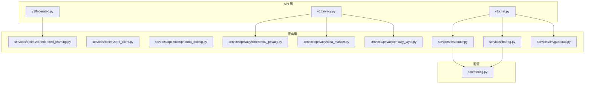
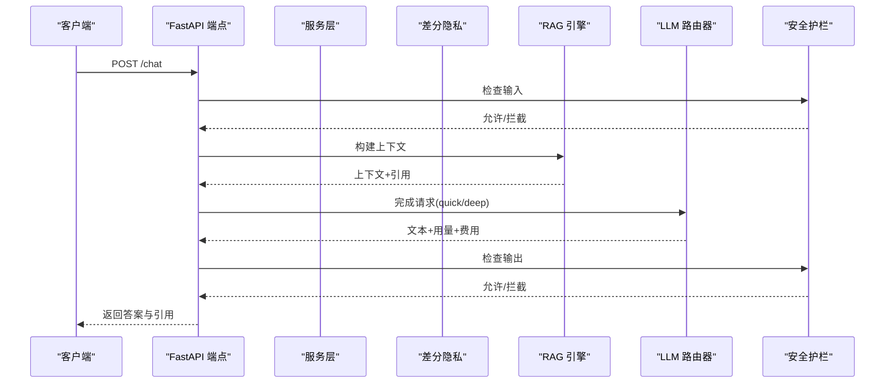
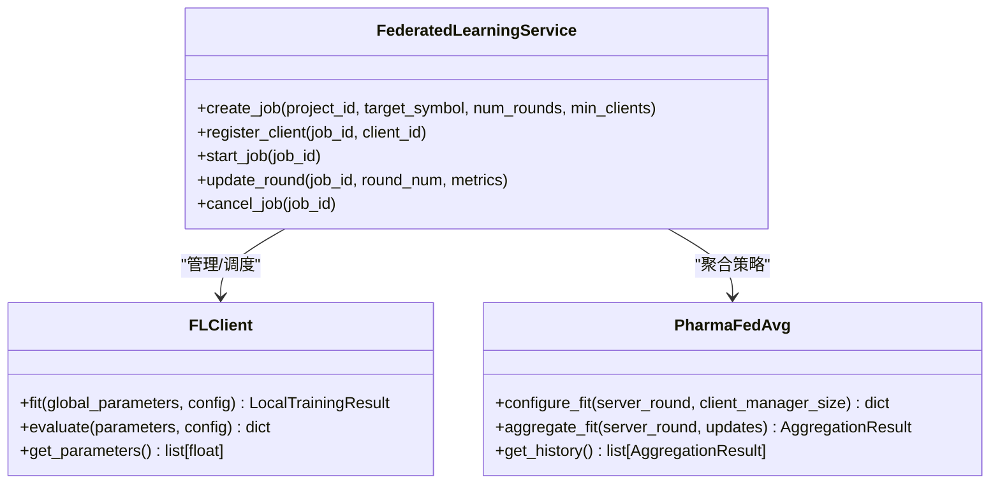
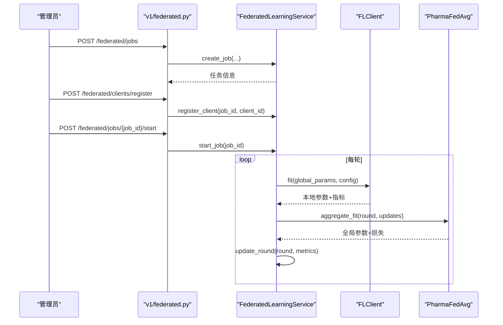
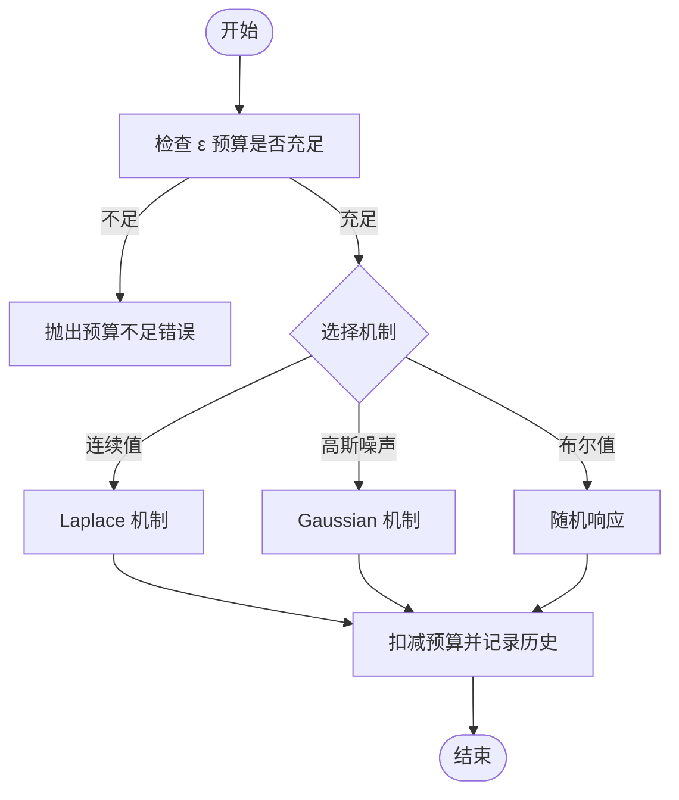
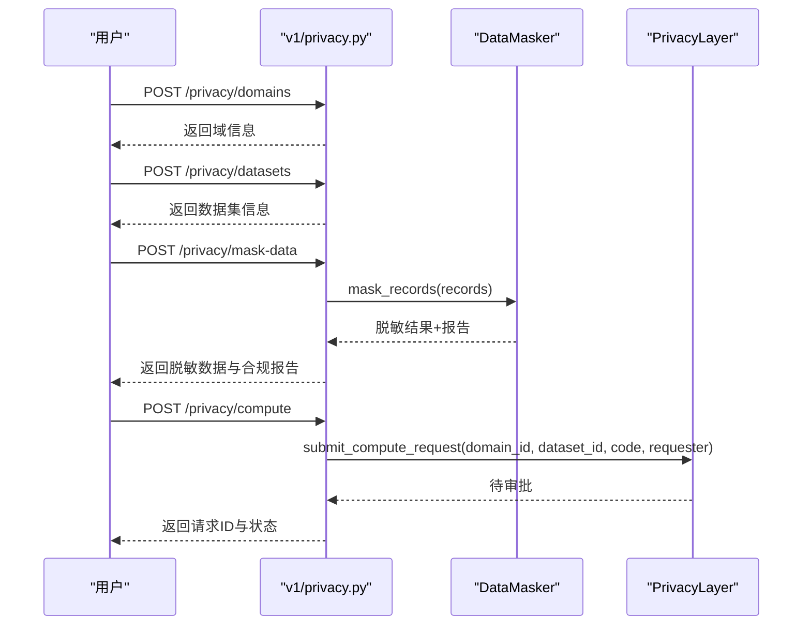
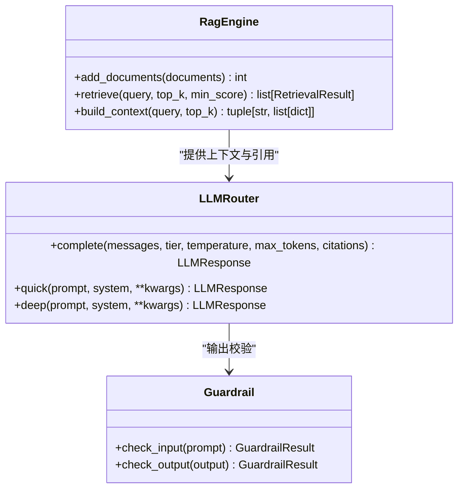
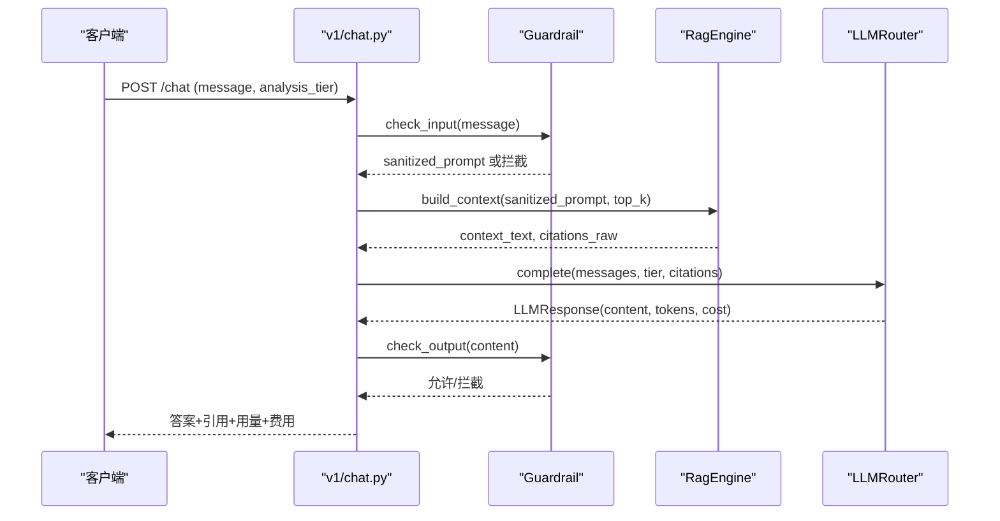
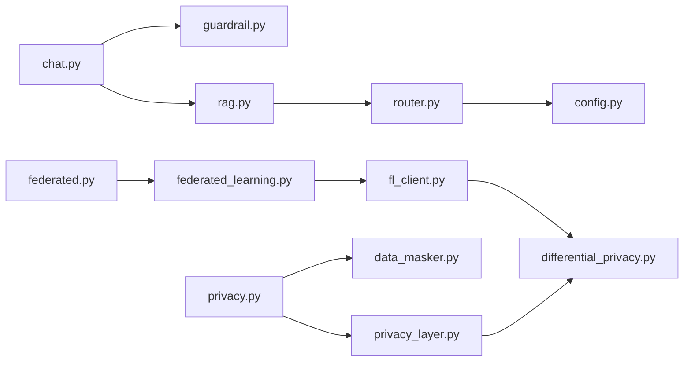

# 高级特性

<cite>
**本文引用的文件**   
- [federated_learning.py](file://backend/app/services/optimizer/federated_learning.py)
- [fl_client.py](file://backend/app/services/optimizer/fl_client.py)
- [pharma_fedavg.py](file://backend/app/services/optimizer/pharma_fedavg.py)
- [federated.py](file://backend/app/api/v1/federated.py)
- [differential_privacy.py](file://backend/app/services/privacy/differential_privacy.py)
- [data_masker.py](file://backend/app/services/privacy/data_masker.py)
- [privacy_layer.py](file://backend/app/services/privacy/privacy_layer.py)
- [privacy.py](file://backend/app/api/v1/privacy.py)
- [rag.py](file://backend/app/services/llm/rag.py)
- [router.py](file://backend/app/services/llm/router.py)
- [guardrail.py](file://backend/app/services/llm/guardrail.py)
- [chat.py](file://backend/app/api/v1/chat.py)
- [config.py](file://backend/app/core/config.py)
</cite>

## 目录
1. [引言](#引言)
2. [项目结构](#项目结构)
3. [核心组件](#核心组件)
4. [架构总览](#架构总览)
5. [详细组件分析](#详细组件分析)
6. [依赖关系分析](#依赖关系分析)
7. [性能与扩展建议](#性能与扩展建议)
8. [故障排查指南](#故障排查指南)
9. [结论](#结论)
10. [附录：API 参考与部署要点](#附录api-参考与部署要点)

## 引言
本章节面向高级用户与企业级使用者，系统阐述 AI 药物设计系统中的三大高级特性：联邦学习、隐私保护计算、AI 智能问答（RAG）。文档覆盖分布式机器学习架构、差分隐私实现、安全多方计算、检索增强生成等关键技术，并提供节点管理、模型聚合算法、隐私参数配置、对话管理系统的设计说明、API 调用示例、部署配置与性能监控方案。

## 项目结构
后端采用 FastAPI 作为 API 层，服务层按功能域划分：优化器（联邦学习与聚合策略）、隐私（差分隐私、脱敏、隐私计算层）、LLM（RAG、路由与安全护栏），并通过统一配置中心加载环境变量。

图表来源
- [federated.py:1-133](file://backend/app/api/v1/federated.py#L1-L133)
- [privacy.py:1-177](file://backend/app/api/v1/privacy.py#L1-L177)
- [chat.py:1-177](file://backend/app/api/v1/chat.py#L1-L177)
- [federated_learning.py:1-199](file://backend/app/services/optimizer/federated_learning.py#L1-L199)
- [fl_client.py:1-254](file://backend/app/services/optimizer/fl_client.py#L1-L254)
- [pharma_fedavg.py:1-246](file://backend/app/services/optimizer/pharma_fedavg.py#L1-L246)
- [differential_privacy.py:1-151](file://backend/app/services/privacy/differential_privacy.py#L1-L151)
- [data_masker.py:1-294](file://backend/app/services/privacy/data_masker.py#L1-L294)
- [privacy_layer.py:1-199](file://backend/app/services/privacy/privacy_layer.py#L1-L199)
- [rag.py:1-238](file://backend/app/services/llm/rag.py#L1-L238)
- [router.py:1-198](file://backend/app/services/llm/router.py#L1-L198)
- [guardrail.py:1-168](file://backend/app/services/llm/guardrail.py#L1-L168)
- [config.py:1-144](file://backend/app/core/config.py#L1-L144)

章节来源
- [federated.py:1-133](file://backend/app/api/v1/federated.py#L1-L133)
- [privacy.py:1-177](file://backend/app/api/v1/privacy.py#L1-L177)
- [chat.py:1-177](file://backend/app/api/v1/chat.py#L1-L177)
- [config.py:1-144](file://backend/app/core/config.py#L1-L144)

## 核心组件
- 联邦学习服务：提供任务创建、客户端注册、训练轮次更新与状态管理；配合客户端模拟与聚合策略，形成完整的联邦训练闭环。
- 隐私保护计算：包含差分隐私预算管理与噪声机制、数据脱敏（HIPAA Safe Harbor）与 k-匿名评估、隐私计算层（域/数据集/审批执行）。
- AI 智能问答：RAG 引擎（向量库或内存降级）、LLM 路由器（多模型、成本追踪、自动降级）、安全护栏（输入输出校验与 PII 脱敏）。

章节来源
- [federated_learning.py:1-199](file://backend/app/services/optimizer/federated_learning.py#L1-L199)
- [fl_client.py:1-254](file://backend/app/services/optimizer/fl_client.py#L1-L254)
- [pharma_fedavg.py:1-246](file://backend/app/services/optimizer/pharma_fedavg.py#L1-L246)
- [differential_privacy.py:1-151](file://backend/app/services/privacy/differential_privacy.py#L1-L151)
- [data_masker.py:1-294](file://backend/app/services/privacy/data_masker.py#L1-L294)
- [privacy_layer.py:1-199](file://backend/app/services/privacy/privacy_layer.py#L1-L199)
- [rag.py:1-238](file://backend/app/services/llm/rag.py#L1-L238)
- [router.py:1-198](file://backend/app/services/llm/router.py#L1-L198)
- [guardrail.py:1-168](file://backend/app/services/llm/guardrail.py#L1-L168)

## 架构总览
整体架构以 API 为入口，服务层承载业务逻辑，外部依赖通过惰性加载与降级策略保障可用性。

图表来源
- [chat.py:1-177](file://backend/app/api/v1/chat.py#L1-L177)
- [rag.py:1-238](file://backend/app/services/llm/rag.py#L1-L238)
- [router.py:1-198](file://backend/app/services/llm/router.py#L1-L198)
- [guardrail.py:1-168](file://backend/app/services/llm/guardrail.py#L1-L168)

## 详细组件分析

### 联邦学习子系统
- 任务与服务：FederatedLearningService 负责任务生命周期管理（创建、注册、启动、轮次更新、取消），使用内存存储，生产环境应替换为数据库并对接 Flower 服务端。
- 客户端模拟：FLClient 模拟本地训练、梯度裁剪与差分隐私加噪，支持拜占庭异常注入用于测试服务端剔除逻辑。
- 聚合策略：PharmaFedAvg 实现样本量加权 FedAvg、基于 MAD 的拜占庭剔除、学习率衰减与异步聚合触发。

图表来源
- [federated_learning.py:1-199](file://backend/app/services/optimizer/federated_learning.py#L1-L199)
- [fl_client.py:1-254](file://backend/app/services/optimizer/fl_client.py#L1-L254)
- [pharma_fedavg.py:1-246](file://backend/app/services/optimizer/pharma_fedavg.py#L1-L246)

#### 联邦学习序列流程

图表来源
- [federated.py:1-133](file://backend/app/api/v1/federated.py#L1-L133)
- [federated_learning.py:1-199](file://backend/app/services/optimizer/federated_learning.py#L1-L199)
- [fl_client.py:1-254](file://backend/app/services/optimizer/fl_client.py#L1-L254)
- [pharma_fedavg.py:1-246](file://backend/app/services/optimizer/pharma_fedavg.py#L1-L246)

章节来源
- [federated.py:1-133](file://backend/app/api/v1/federated.py#L1-L133)
- [federated_learning.py:1-199](file://backend/app/services/optimizer/federated_learning.py#L1-L199)
- [fl_client.py:1-254](file://backend/app/services/optimizer/fl_client.py#L1-L254)
- [pharma_fedavg.py:1-246](file://backend/app/services/optimizer/pharma_fedavg.py#L1-L246)

### 隐私保护计算子系统
- 差分隐私：PrivacyBudget 跟踪 ε 预算，DifferentialPrivacy 提供 Laplace/Gaussian/随机响应机制，并在每次查询时扣减预算。
- 数据脱敏：DataMasker 实现直接标识符哈希、准标识符泛化、敏感值抑制，并进行 k-匿名性评估与违规报告。
- 隐私计算层：PrivacyLayer 模拟 PySyft 域，支持域创建、数据集注册、计算请求提交与审批执行。

图表来源
- [differential_privacy.py:1-151](file://backend/app/services/privacy/differential_privacy.py#L1-L151)

#### 隐私计算 API 流程

图表来源
- [privacy.py:1-177](file://backend/app/api/v1/privacy.py#L1-L177)
- [data_masker.py:1-294](file://backend/app/services/privacy/data_masker.py#L1-L294)
- [privacy_layer.py:1-199](file://backend/app/services/privacy/privacy_layer.py#L1-L199)

章节来源
- [differential_privacy.py:1-151](file://backend/app/services/privacy/differential_privacy.py#L1-L151)
- [data_masker.py:1-294](file://backend/app/services/privacy/data_masker.py#L1-L294)
- [privacy_layer.py:1-199](file://backend/app/services/privacy/privacy_layer.py#L1-L199)
- [privacy.py:1-177](file://backend/app/api/v1/privacy.py#L1-L177)

### AI 智能问答（RAG）子系统
- RAG 引擎：优先使用 Chroma 向量库进行相似度检索，不可用时降级为内存关键词检索（Jaccard），并构建 LLM 上下文与引用列表。
- LLM 路由器：基于 LiteLLM 的多模型统一调用，区分 quick/deep 层级，内置成本追踪与预算控制，失败时自动降级。
- 安全护栏：输入/输出双重校验，拦截违规内容、提示词注入与非医学话题，并对 PII 进行脱敏。

图表来源
- [rag.py:1-238](file://backend/app/services/llm/rag.py#L1-L238)
- [router.py:1-198](file://backend/app/services/llm/router.py#L1-L198)
- [guardrail.py:1-168](file://backend/app/services/llm/guardrail.py#L1-L168)

#### 问答处理序列

图表来源
- [chat.py:1-177](file://backend/app/api/v1/chat.py#L1-L177)
- [rag.py:1-238](file://backend/app/services/llm/rag.py#L1-L238)
- [router.py:1-198](file://backend/app/services/llm/router.py#L1-L198)
- [guardrail.py:1-168](file://backend/app/services/llm/guardrail.py#L1-L168)

章节来源
- [chat.py:1-177](file://backend/app/api/v1/chat.py#L1-L177)
- [rag.py:1-238](file://backend/app/services/llm/rag.py#L1-L238)
- [router.py:1-198](file://backend/app/services/llm/router.py#L1-L198)
- [guardrail.py:1-168](file://backend/app/services/llm/guardrail.py#L1-L168)

## 依赖关系分析
- 模块耦合：API 层仅依赖服务层接口；服务层内部通过数据类与函数式组合降低耦合；外部依赖（Chroma、LiteLLM）采用惰性导入与降级策略。
- 关键依赖链：
  - chat.py → guardrail.py → rag.py → router.py → config.py
  - federated.py → federated_learning.py → fl_client.py → differential_privacy.py
  - privacy.py → data_masker.py / privacy_layer.py → differential_privacy.py

图表来源
- [chat.py:1-177](file://backend/app/api/v1/chat.py#L1-L177)
- [guardrail.py:1-168](file://backend/app/services/llm/guardrail.py#L1-L168)
- [rag.py:1-238](file://backend/app/services/llm/rag.py#L1-L238)
- [router.py:1-198](file://backend/app/services/llm/router.py#L1-L198)
- [config.py:1-144](file://backend/app/core/config.py#L1-L144)
- [federated.py:1-133](file://backend/app/api/v1/federated.py#L1-L133)
- [federated_learning.py:1-199](file://backend/app/services/optimizer/federated_learning.py#L1-L199)
- [fl_client.py:1-254](file://backend/app/services/optimizer/fl_client.py#L1-L254)
- [differential_privacy.py:1-151](file://backend/app/services/privacy/differential_privacy.py#L1-L151)
- [privacy.py:1-177](file://backend/app/api/v1/privacy.py#L1-L177)
- [data_masker.py:1-294](file://backend/app/services/privacy/data_masker.py#L1-L294)
- [privacy_layer.py:1-199](file://backend/app/services/privacy/privacy_layer.py#L1-L199)

章节来源
- [chat.py:1-177](file://backend/app/api/v1/chat.py#L1-L177)
- [federated.py:1-133](file://backend/app/api/v1/federated.py#L1-L133)
- [privacy.py:1-177](file://backend/app/api/v1/privacy.py#L1-L177)

## 性能与扩展建议
- 联邦学习
  - 将内存存储替换为持久化存储（PostgreSQL/Redis），结合 Flower 服务端实现真实分布式训练。
  - 在聚合阶段引入自适应权重与鲁棒统计（如 Trimmed Mean、Krum）提升抗攻击能力。
  - 对客户端心跳与健康检测进行异步化与批量处理，减少主循环开销。
- 隐私保护
  - 差分隐私预算分配策略可改为动态分配（按查询复杂度与敏感度调整 ε）。
  - 数据脱敏批处理时采用向量化操作与并行分片，提升吞吐。
  - 隐私计算层对接真实 PySyft 域，启用安全通道与审计日志。
- AI 问答
  - RAG 索引构建阶段采用增量更新与缓存热点片段，降低重复嵌入成本。
  - LLM 路由器增加多提供商冗余与熔断策略，结合重试与退避。
  - 安全护栏规则可配置化，支持热更新与灰度发布。

[本节为通用指导，不直接分析具体文件]

## 故障排查指南
- 联邦学习
  - 客户端数不足导致无法聚合：检查最小参与阈值与已注册客户端数量。
  - 拜占庭剔除误判：调低 MAD 阈值或放宽最小参与人数。
- 隐私保护
  - 差分隐私预算不足：检查 total_epsilon 与已消耗 epsilon，合理拆分查询批次。
  - k-匿名未满足：扩大分组字段或提高 k 值，审查准标识符分布。
- AI 问答
  - LLM 不可用：确认 API Key 与网络连通性，查看降级路径是否返回 RAG 摘要。
  - 安全护栏拦截：检查输入/输出匹配的规则模式，必要时调整白名单或提示词。

章节来源
- [pharma_fedavg.py:1-246](file://backend/app/services/optimizer/pharma_fedavg.py#L1-L246)
- [differential_privacy.py:1-151](file://backend/app/services/privacy/differential_privacy.py#L1-L151)
- [data_masker.py:1-294](file://backend/app/services/privacy/data_masker.py#L1-L294)
- [chat.py:1-177](file://backend/app/api/v1/chat.py#L1-L177)
- [guardrail.py:1-168](file://backend/app/services/llm/guardrail.py#L1-L168)

## 结论
本系统通过联邦学习、隐私保护与 RAG 智能问答三大高级特性，构建了兼顾协作、合规与智能化的药物研发平台。服务层模块化设计与外部依赖的惰性加载/降级策略提升了系统的可用性与可扩展性。企业级部署建议以持久化存储、真实分布式框架与多提供商冗余为核心，辅以完善的监控与审计体系。

[本节为总结性内容，不直接分析具体文件]

## 附录：API 参考与部署要点

### 联邦学习 API
- 创建任务
  - 方法：POST
  - 路径：/federated/jobs
  - 请求体关键字段：name、model_arch、num_rounds、min_clients、config
  - 响应关键字段：id、status、current_round、connected_clients、aggregation_loss、created_at、updated_at
- 列出任务
  - 方法：GET
  - 路径：/federated/jobs
  - 查询参数：status
- 获取任务详情
  - 方法：GET
  - 路径：/federated/jobs/{job_id}
- 停止任务
  - 方法：POST
  - 路径：/federated/jobs/{job_id}/stop
- 注册客户端
  - 方法：POST
  - 路径：/federated/clients/register
  - 请求体关键字段：job_id、client_name、client_url、data_size
  - 响应关键字段：client_id、job_id、status

章节来源
- [federated.py:1-133](file://backend/app/api/v1/federated.py#L1-L133)
- [federated.py:1-133](file://backend/app/api/v1/federated.py#L1-L133)

### 隐私计算 API
- 创建隐私域
  - 方法：POST
  - 路径：/privacy/domains
  - 请求体关键字段：name、description、owner_id、budget_epsilon
- 注册数据集
  - 方法：POST
  - 路径：/privacy/datasets
  - 请求体关键字段：domain_id、name、data_schema、mock_data
- 提交计算请求
  - 方法：POST
  - 路径：/privacy/compute
  - 请求体关键字段：domain_id、dataset_id、epsilon、code
- 获取计算结果
  - 方法：GET
  - 路径：/privacy/results/{request_id}
- 数据脱敏
  - 方法：POST
  - 路径：/privacy/mask-data
  - 请求体关键字段：records、k_anonymity
  - 响应关键字段：masked_records、total_records、direct_identifiers_masked、quasi_identifiers_generalized、sensitive_fields_redacted、k_anonymity_satisfied、min_group_size、violations

章节来源
- [privacy.py:1-177](file://backend/app/api/v1/privacy.py#L1-L177)

### AI 智能问答 API
- 自然语言问答
  - 方法：POST
  - 路径：/chat
  - 请求体关键字段：project_id、message、analysis_tier、context_dataset_ids
  - 响应关键字段：answer、citations、evidence_level、cost_usd、tokens_in、tokens_out、guardrail_triggered、guardrail_rule
- 历史对话
  - 方法：GET
  - 路径：/chat/history
  - 查询参数：project_id

章节来源
- [chat.py:1-177](file://backend/app/api/v1/chat.py#L1-L177)

### 部署与配置要点
- 环境变量与默认值
  - 应用：app_name、app_version、app_env、app_debug、app_host、app_port、app_log_level
  - 数据库：database_url、database_echo
  - Redis：redis_url
  - 对象存储：s3_endpoint、s3_access_key、s3_secret_key、s3_bucket、s3_region
  - 向量库：chroma_persist_dir
  - LLM：openai_api_key、anthropic_api_key、llm_default_model、llm_deep_model、llm_max_budget_usd、llm_quick_budget_usd
  - NVIDIA NIM：nim_api_key、nim_diffdock_url
  - 外部知识库：mygene_base_url、myvariant_base_url、chembl_base_url、pubmed_base_url、clinical_trials_url
  - NCBI：ncbi_email
  - 认证：jwt_secret_key、jwt_algorithm、jwt_access_token_expire_minutes、jwt_refresh_token_expire_days
  - CORS：cors_origins
  - 联邦学习：flower_server_address、flower_num_rounds
  - PySyft：pysyft_domain_port、pysyft_domain_name
  - CDISC：cdisc_sdtm_output_dir、pinnacle21_jar_path
  - 干湿闭环：lims_api_url、lims_api_token
  - 数据处理：scanpy_n_jobs、scanpy_use_dask、dask_dashboard_address
  - 数据目录：data_raw_dir、data_processed_dir
- 外部依赖
  - Chroma：可选，若未安装则 RAG 降级为内存关键词检索。
  - LiteLLM：可选，若未安装则 LLM 调用失败并触发降级路径。

章节来源
- [config.py:1-144](file://backend/app/core/config.py#L1-L144)
- [rag.py:1-238](file://backend/app/services/llm/rag.py#L1-L238)
- [router.py:1-198](file://backend/app/services/llm/router.py#L1-L198)