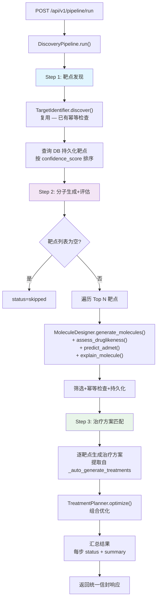

# 端到端自动化流水线实现计划

## Context

精准药物设计系统的三个核心模块（靶点发现、分子库、治疗方案）目前是分散的、被动触发的——只有当用户访问空列表时才会自动触发单个模块。用户希望实现**主动的、端到端的自动化流水线**：数据 → 靶点发现 → 分子匹配+评估 → 治疗方案匹配，一键串联三个步骤。

**现状**：
- 三个模块各自的"被动自动触发"逻辑分散在 `endpoints/targets.py::_auto_discover_targets`、`endpoints/molecules.py::_auto_generate_molecules`、`endpoints/treatments.py::_auto_generate_treatments`
- 数据模型外键链完整：Dataset → Target → Molecule → Treatment
- 缺少全局 Orchestrator 服务来封装跨模块流水线

**目标**：新建 Orchestrator 服务和端点，复用现有三个模块的服务层（TargetIdentifier、MoleculeDesigner、TreatmentPlanner），实现一键端到端流水线。

---

## 架构设计



**核心原则**：
- 复用现有服务，不重写业务逻辑
- 幂等：重复运行不产生重复数据
- 容错：单步失败不中断整个流水线
- 可观测：返回每步状态、耗时、结果摘要

---

## 文件清单

### 新建文件（5 个）

| 文件路径 | 说明 |
|---------|------|
| `backend/app/services/orchestrator/__init__.py` | Orchestrator 包初始化 |
| `backend/app/services/orchestrator/discovery_pipeline.py` | 核心编排服务 |
| `backend/app/api/v1/endpoints/pipeline.py` | 流水线端点 |
| `backend/tests/test_discovery_pipeline.py` | 单元测试 + 集成测试 |
| `frontend/lib/api/pipeline.ts` | 前端 API 封装 |

### 修改文件（3 个）

| 文件路径 | 修改内容 |
|---------|---------|
| `backend/app/api/v1/router.py` | 注册 pipeline 路由 |
| `frontend/lib/api/index.ts` | 导出 pipeline 模块 |
| `frontend/app/workbench/page.tsx` | 添加"一键流水线"按钮 |

---

## 关键实现

### 1. `backend/app/services/orchestrator/discovery_pipeline.py`（核心）

**类**：`DiscoveryPipeline`

**方法签名**：
```python
class DiscoveryPipeline:
    def __init__(self, db: AsyncSession): ...

    async def run(
        self,
        project_id: UUID,
        dataset_id: Optional[UUID] = None,
        tier: str = "fast_screen",
        max_targets: int = 5,
        molecules_per_target: int = 15,
        molecule_strategy: str = "fragment",
        skip_existing: bool = True,
        current_user=None,
    ) -> Dict[str, Any]:
        """返回 {project_id, duration_sec, steps: {...}, summary: {...}}"""

    async def _step1_discover_targets(...) -> Dict:
        """复用 TargetIdentifier.discover() — 靶点发现"""

    async def _step2_generate_molecules(...) -> Dict:
        """复用 MoleculeDesigner + assess/predict/explain — 分子生成+评估"""

    async def _step3_match_treatments(...) -> Dict:
        """复用 TreatmentPlanner.optimize() + 逐靶点方案生成 — 治疗方案匹配"""
```

**Step 1 逻辑**：调用 `TargetIdentifier.discover(project_id, dataset_id, tier)`，该服务内部已有 `project_id + gene_symbol` 幂等检查（[target_identifier.py:217-221](file:///g:/软件开发/AI药物/backend/app/services/analyzer/target_identifier.py#L217-L221)）。执行后从 DB 查询持久化的靶点（按 confidence_score 降序）。

**Step 2 逻辑**（提取自 [molecules.py:77-178](file:///g:/软件开发/AI药物/backend/app/api/v1/endpoints/molecules.py#L77-L178) 的 `_auto_generate_molecules`，扩展增加 ADMET + 可解释性）：
1. 遍历 Top N 靶点
2. 幂等检查：`select(Molecule).where(target_id=...).limit(1)` — 已有则跳过
3. 调用 `MoleculeDesigner.generate_molecules(target_id, strategy, n)`
4. 对每个 SMILES 调用：
   - `assess_druglikeness(smiles)` — Lipinski/Veber/QED
   - `predict_admet(smiles)` — ADMET 8 项指标
   - `explain_molecule(smiles)` — 功能团识别
5. 筛选：`passes_ro5 and score >= 60`，降级：无通过时取评分最高
6. 幂等检查：`select(Molecule).where(target_id=...).where(smiles=...)` — 已有则跳过
7. 持久化 Top 10 到 Molecule 表

**Step 3 逻辑**（提取自 [treatments.py:75-165](file:///g:/软件开发/AI药物/backend/app/api/v1/endpoints/treatments.py#L75-L165) 的 `_auto_generate_treatments`）：
1. 逐靶点生成治疗方案：
   - 有获批药物 → 靶向治疗（获批药物）
   - 有候选分子 → 候选分子治疗
   - 无 → 探索性治疗
2. 幂等检查：`select(Treatment).where(project_id=...).where(name.like("{gene}%"))` — 已有则跳过
3. 调用 `TreatmentPlanner.optimize(project_id)` 进行组合优化
4. 持久化 Treatment 记录

**步骤状态**：`success` / `partial` / `failed` / `skipped`

### 2. `backend/app/api/v1/endpoints/pipeline.py`

**端点**：
- `POST /api/v1/pipeline/run` — 运行流水线，接收 `PipelineRunRequest`（project_id + 可选参数），返回 `StandardResponse`
- `GET /api/v1/pipeline/status/{project_id}` — 查询项目数据完整性状态（datasets/targets/molecules/treatments 计数 + pipeline_ready/pipeline_complete 标志）

**请求体**：
```json
{
  "project_id": "uuid",
  "dataset_id": null,
  "tier": "fast_screen",
  "max_targets": 5,
  "molecules_per_target": 15,
  "molecule_strategy": "fragment",
  "skip_existing": true
}
```

### 3. `backend/app/api/v1/router.py`（修改）

添加 import 和路由注册：
```python
from app.api.v1.endpoints import (..., pipeline)
api_router.include_router(pipeline.router, prefix="/pipeline", tags=["端到端流水线"])
```

### 4. 前端改动（最小：工作台一键按钮）

- `frontend/lib/api/pipeline.ts`：`runPipeline(payload)` + `getPipelineStatus(projectId)`
- `frontend/lib/api/index.ts`：`export * from './pipeline'`
- `frontend/app/workbench/page.tsx`：在快速操作卡片添加"一键流水线"按钮，使用 `useMutation` 调用 `runPipeline`，成功后显示结果摘要并 invalidate targets/molecules/treatments 的 react-query 缓存

---

## 幂等性策略

| 层级 | 幂等机制 | 来源 |
|------|---------|------|
| 靶点 | `project_id + gene_symbol` 唯一检查 | TargetIdentifier.discover() 已有 |
| 分子 | `target_id + smiles` 唯一检查 | orchestrator 新增 |
| 治疗方案 | `project_id + name` 前缀匹配 | orchestrator 新增 |

---

## 错误处理策略

- 每步 `try/except` 包裹，单步失败不中断后续步骤
- 步骤内单靶点失败不中断同步骤其他靶点
- 错误信息收集到步骤结果的 `errors` 列表
- `logger.warning` 记录可恢复错误，`logger.error(exc_info=True)` 记录步骤级失败

---

## 测试方案

**文件**：`backend/tests/test_discovery_pipeline.py`

**测试矩阵**（遵循 `test_target_identifier.py` 的 Mock 模式）：

| 测试用例 | 说明 |
|---------|------|
| `test_run_full_pipeline_success` | 完整流水线正常流程 |
| `test_run_pipeline_no_datasets` | 项目无数据集 → Step 2/3 skipped |
| `test_run_pipeline_step1_fails` | TargetIdentifier 异常 → Step 1 failed，后续继续 |
| `test_run_pipeline_step2_partial` | 部分靶点分子生成失败 → status=partial |
| `test_idempotent_run_twice` | 连续运行两次，第二次不产生重复数据 |
| `test_skip_existing_molecules` | 靶点已有分子 → 跳过 |
| `test_run_pipeline_endpoint` | POST /pipeline/run 端点集成测试 |
| `test_get_pipeline_status` | GET /pipeline/status 端点测试 |
| `test_run_pipeline_unauthorized` | 无 token → 401 |

**覆盖率目标**：`discovery_pipeline.py` ≥ 85%（满足项目 80% 硬约束）

---

## 验证方式

1. **单元测试**：`cd backend && python -m pytest tests/test_discovery_pipeline.py -v --cov=app.services.orchestrator`
2. **全量回归**：`cd backend && python -m pytest --cov=app --cov-report=term-missing`（确保无回归，覆盖率 ≥ 80%）
3. **ruff 检查**：`cd backend && ruff check app/services/orchestrator/ app/api/v1/endpoints/pipeline.py`
4. **端点验证**：启动后端，通过 `/docs` Swagger UI 测试 `POST /pipeline/run`
5. **前端验证**：启动前端，工作台点击"一键流水线"按钮，验证靶点/分子/治疗方案列表自动刷新
